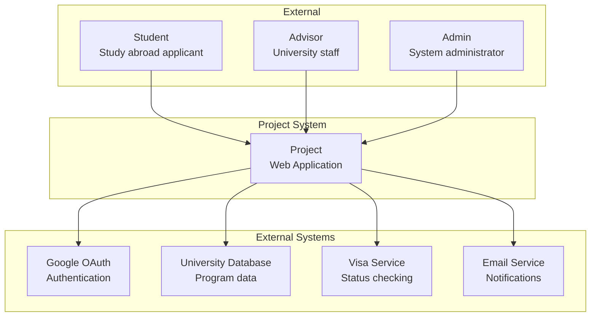
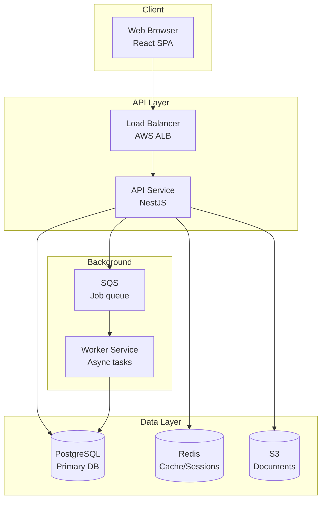
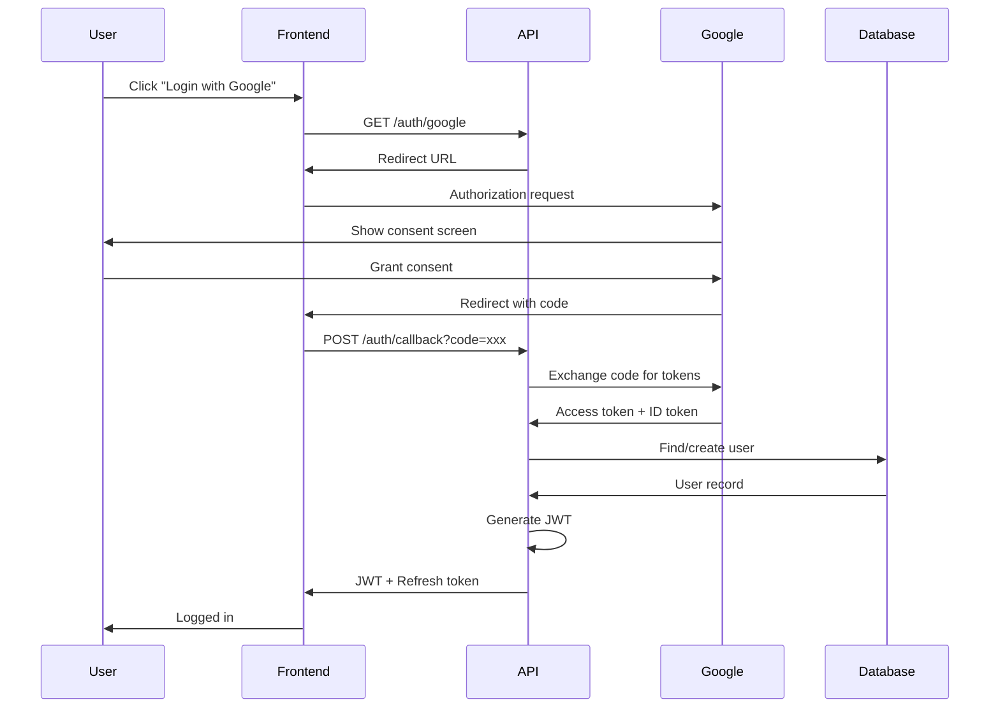

# Diagram Generation

## Purpose
Create clear, consistent architectural diagrams (C4 model, sequence diagrams, ER diagrams) to communicate system design to technical and non-technical stakeholders.

## When to Use
- Architecture documentation
- Design reviews
- Stakeholder communication
- Onboarding materials
- Change impact visualization

## Prerequisites
- Architecture defined
- Diagram type selected
- Audience identified
- Tool selected (Mermaid, PlantUML)

## Process

### Step 1: Select Diagram Type
```
Diagram types:
- C4 Context: System and external actors
- C4 Container: Major components
- C4 Component: Internal structure
- Sequence: Interaction flows
- ER Diagram: Data model
- Deployment: Infrastructure
```

### Step 2: Identify Scope
```
For each diagram:
- What level of detail?
- Which components included?
- What story does it tell?
- Who is the audience?
```

### Step 3: Create Diagram
```
Using Mermaid syntax:
- Use consistent naming
- Group related elements
- Add clear labels
- Include legend if needed
```

### Step 4: Add Documentation
```
With each diagram:
- Title and purpose
- Key for any abbreviations
- Version/date
- Related diagrams
```

### Step 5: Review and Iterate
```
Quality checks:
- Accurate representation
- Appropriate detail level
- Consistent styling
- Clear legend/labels
```

## Inputs
| Input | Type | Required | Description |
|-------|------|----------|-------------|
| architecture | Markdown | Yes | Architecture docs |
| diagram_type | String | Yes | Type requested |
| audience | String | Optional | Technical/business |

## Outputs
| Output | Type | Description |
|--------|------|-------------|
| diagrams/*.mermaid | Mermaid | Source files |
| diagrams/*.png | Image | Rendered diagrams |

## Project-Specific Considerations
- Show external university API clearly
- Highlight GDPR data flows
- Include OAuth2 providers
- Show document storage path

## Integration Points
- **Documentation Agent**: Diagram maintenance
- **All Agents**: Reference diagrams

## Examples
```
C4 Context Diagram - SDLC Framework



C4 Container Diagram:



Sequence Diagram - OAuth Login:


```

## Validation
- Diagrams match architecture
- Appropriate detail level
- Consistent naming
- Legend provided
- Version tracked