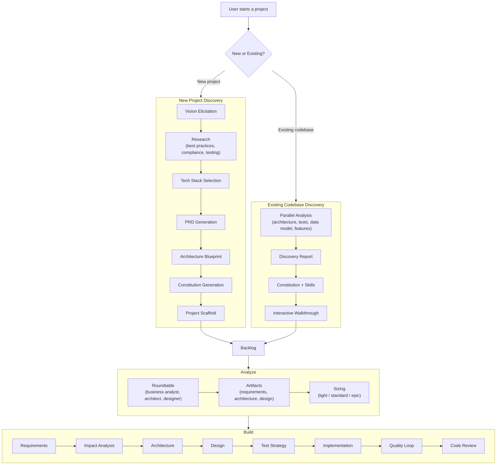

<div align="center">

# iSDLC Framework

<h3><em>An AI development harness — opinionated defaults you can override, deterministic enforcement you can tune, and extension points at every layer.</em></h3>

[](LICENSE)
[](docs/AGENTS.md)
[](docs/DETAILED-SKILL-ALLOCATION.md)
[](docs/ARCHITECTURE.md#quality-gates)
[](ANTIGRAVITY.md)

</div>

---

## The Problem

AI coding assistants are powerful but structurally unreliable. They skip tests, drift from requirements, lose context across sessions, declare work "done" prematurely, and scope-creep every task. Prompt-based instructions help but can't guarantee behavior — the same prompt produces different results, and rules get forgotten as conversations grow long.

You need constraints that run **outside** the LLM — deterministic enforcement that the AI can't ignore, reinterpret, or forget.

## The Harness

iSDLC is that enforcement layer. It wraps AI coding assistants in structured workflows, quality gates, and a project constitution — 28 hooks running as separate Node.js processes that intercept tool calls and block non-compliant behavior. The AI doesn't get to decide when it's done. The harness does.

But a harness that only constrains is a cage. iSDLC ships with opinionated defaults — then gives you control over every one of them:

| What the harness enforces | What you control |
|--------------------------|-----------------|
| Phase sequences — the AI can't skip requirements and jump to code | Which phases run: light workflows skip architecture/design |
| Quality gates — tests must pass, coverage must meet thresholds | Gate profiles: `rapid` (60%), `standard` (80%), `strict` (95%) |
| Requirements elicitation — the AI must ask before assuming | Analysis depth: `brief`, `standard`, or `deep` probing |
| Constitutional compliance — artifacts must meet your standards | The constitution itself — your rules, your thresholds |
| Roundtable analysis — multiple perspectives review every feature | Which personas participate, how they behave, or skip them entirely |
| Iteration limits — circuit breakers stop infinite loops | Max iterations, escalation rules, retry/rollback recovery |

**Every constraint has a named override. Every layer is hackable.**

---

## What You Experience

Despite all this structure, interaction is conversational. The harness detects intent and runs the right workflow:

```
You:     "The login page crashes when the password field is empty"
Claude:  Kicks off a bug fix workflow — traces the root cause, writes a failing test,
         implements the fix, validates through quality gates, and produces a reviewed PR.

You:     "Add dark mode support"
Claude:  Runs a feature workflow — captures requirements interactively, designs the
         architecture, implements with test coverage, and validates quality.

You:     "Upgrade React to v19"
Claude:  Starts an upgrade workflow — analyzes breaking changes, plans migration steps,
         applies changes, and validates everything still works.
```

### Three-verb backlog

Manage work naturally with **add**, **analyze**, and **build**:

```
You:     "Add the payment processing feature from JIRA-1234"
Claude:  Pulls the ticket, creates a backlog draft. Links GitHub Issues automatically.

You:     "Analyze the payment processing feature"
Claude:  Runs a roundtable — a business analyst captures requirements, a solutions
         architect scans the codebase, a system designer produces specifications.

         ... days later, different machine ...

You:     "Build the payment processing feature"
Claude:  Detects analysis is complete, picks up where it left off, starts from
         the right phase.
```

Each verb is a natural escalation: **add** captures the idea, **analyze** deepens understanding, **build** executes the work.

### Slash commands

For users who prefer explicit control:

| Command | Description |
|---------|-------------|
| `/discover` | Analyze an existing project or set up a new one |
| `/isdlc feature "description"` | Feature development through 9 phases |
| `/isdlc fix "description"` | Bug fix — root cause tracing, test-first fix, quality validation |
| `/isdlc upgrade "name"` | Upgrade a dependency with impact analysis and test validation |
| `/isdlc test generate` | Generate tests for existing code |
| `/isdlc test run` | Execute test suite and report coverage |
| `/isdlc add "description"` | Add an item to the backlog |
| `/isdlc analyze "description"` | Roundtable analysis with 3 personas |
| `/isdlc build "item"` | Build from analysis artifacts |

---

## What You Control

### Gate profiles

Control how rigorous quality gates are. Set per-project or override per-workflow.

| Profile | Coverage | Constitutional Validation | Elicitation | Use Case |
|---------|----------|--------------------------|-------------|----------|
| **rapid** | 60% | Off | 1 interaction | Spikes, simple changes, trusted developers |
| **standard** | 80% | On | 3 interactions | Default — balanced rigor |
| **strict** | 95% | On + mutation testing | Full | Critical/regulated code |

Trigger naturally — "quick build" selects rapid, "this is critical" selects strict — or set a default in your constitution.

### Analysis depth

The roundtable adjusts how deeply it probes:

- **Brief** — accept user framing, 1-2 exchanges per topic
- **Standard** — probe edge cases, challenge assumptions, 3-5 exchanges
- **Deep** — exhaustive exploration, challenge everything, 6+ exchanges

Adapts automatically from signal words, or override with `--light` / `--deep`.

### Personas

The roundtable ships with three built-in personas (business analyst, solutions architect, system designer). Customize the roster:

**Add a domain expert** — drop a markdown file in `.isdlc/personas/`:
```
.isdlc/personas/
  persona-security-reviewer.md    ← joins the roundtable automatically
  persona-compliance-officer.md   ← triggered by keyword matches
```

**Override a built-in** — copy to `.isdlc/personas/`, edit, and the framework uses yours:
```bash
cp src/claude/agents/persona-business-analyst.md .isdlc/personas/persona-business-analyst.md
# Edit to match your needs — "skip MoSCoW, use P0-P3 priorities"
```

**Disable a persona** — exclude via `.isdlc/roundtable.yaml`:
```yaml
disabled_personas:
  - ux-reviewer
```

**Choose analysis mode** — conversational, bulleted, silent, or no-persona straight analysis. Set a default or choose per analysis.

> [Persona Authoring Guide](docs/isdlc/persona-authoring-guide.md)

### Workflow recovery

Made a mistake? No need to restart from scratch.

- **Retry** — re-run the current phase with fresh state ("try again")
- **Redo** — reset the current phase completely ("redo this phase")
- **Rollback** — go back to an earlier phase ("go back to requirements")

Artifacts on disk are preserved so agents read and revise rather than starting blind.

### Constitution

The project constitution (`docs/isdlc/constitution.md`) codifies your governance rules: test coverage thresholds, security requirements, module system constraints, platform compatibility. Generated during `/discover`, enforced by hooks at every phase boundary. Edit it to match your team's standards — it's your document.

### Coming next

| Extension point | What you'll be able to do |
|----------------|--------------------------|
| **Custom workflows** | Define `spike`, `hotfix`, `ui-feature` — your own phase sequences |
| **User-space hooks** | Drop scripts in `.isdlc/hooks/` for domain-specific validation |
| **Templates** | Project-local file templates agents use during implementation |
| **Skill authoring** | Capture team best practices as reusable skills |
| **Constitution composition** | Base + project merge for team-wide standards |

> [Full Hackability Roadmap](docs/isdlc/hackability-roadmap.md)

---

## How the Harness Works

Three layers enforce quality independently — each runs outside the LLM conversation.

### Enforcement layer: 28 hooks

Hooks are Node.js processes that intercept tool calls via Claude Code's `PreToolUse` and `PostToolUse` events. They are not part of the conversation — the AI cannot argue with, reinterpret, or ignore them.

| Hook | What it enforces |
|------|-----------------|
| `gate-blocker.cjs` | 5 checks before phase advancement: iteration requirements, workflow state, phase sequencing, agent delegation, artifact presence |
| `iteration-corridor.cjs` | When tests are failing, confines the agent to fix-and-retest — no delegation, no gate advancement |
| `test-watcher.cjs` | Tracks test executions, enforces coverage minimums, circuit-breaks after 3 identical failures |
| `constitution-validator.cjs` | Blocks phase completion until artifacts comply with constitutional articles |
| `phase-sequence-guard.cjs` | Blocks out-of-order phase execution — no skipping ahead |
| `delegation-gate.cjs` | Validates the correct agent is delegated for each phase |

All hooks fail open — if a hook crashes, it allows the operation rather than blocking all work.

### Workflow layer: structured phase sequences

Each workflow type defines a fixed phase sequence. The AI cannot invent extra steps or skip phases.

| Workflow | Phases | Use case |
|----------|--------|----------|
| **Feature** | Requirements → Impact Analysis → Architecture → Design → Test Strategy → Implementation → Quality Loop → Code Review | New functionality |
| **Fix** | Requirements → Root Cause Tracing → Test Strategy → Implementation → Quality Loop → Code Review | Bug fixes (TDD: failing test first) |
| **Upgrade** | Analysis & Planning → Execute & Test → Code Review | Dependency/runtime upgrades |
| **Test** | Test Strategy → Implementation → Quality Loop → Code Review | Generate tests for existing code |

Adaptive sizing scales workflows — light features skip architecture and design phases; simple changes get rapid gates.

### Knowledge layer: discovery and constitution

`/discover` runs 23 specialized agents that map your codebase before any changes: architecture patterns, test coverage, dependencies, feature inventory, data models. Results persist as structured artifacts and a project constitution — governance rules verified against your actual codebase, not hallucinated.

Each phase reads predecessor artifacts as input. The architect reads the requirements spec. The designer reads the architecture doc. The developer reads the design. Context is structured and traceable, not conversational and ephemeral.

<details>
<summary><strong>Agent breakdown (64 total)</strong></summary>

- **26 SDLC agents** — 1 orchestrator + 15 phase agents + 10 multi-agent team members (Creator/Critic/Refiner debates for requirements, architecture, design, test strategy; Writer/Reviewer/Updater for implementation)
- **23 Discover agents** — 1 orchestrator + 22 sub-agents that analyze existing projects or elicit vision for new ones
- **6 Exploration agents** — 1 quick scan + 1 orchestrator + 3 impact analysis sub-agents + 1 cross-validation verifier
- **4 Tracing agents** — 1 orchestrator + 3 sub-agents that trace bug root causes
- **4 Roundtable agents** — 1 lead analyst + 3 personas (business analyst, solutions architect, system designer) for concurrent analysis
- **1 Skill manager** — manages external skill registration and wiring

</details>

### Lifecycle: Discovery → Analyze → Build



---

## Getting Started

### Prerequisites

| Requirement | Version | Notes |
|-------------|---------|-------|
| **Node.js** | 20+ | Required for hooks, tools, and CLI |
| **Claude Code** | Latest | [Optional] [Install guide](https://docs.anthropic.com/en/docs/claude-code/overview) |
| **Antigravity** | Latest | [Optional] |

### Install

**Via npm (recommended):**
```bash
cd /path/to/your-project
npx isdlc
```

**From source (macOS / Linux):**
```bash
cd /path/to/your-project
git clone <repo-url> isdlc-framework
./isdlc-framework/install.sh
```

**From source (Windows PowerShell):**
```powershell
cd C:\path\to\your-project
git clone <repo-url> isdlc-framework
.\isdlc-framework\install.ps1
```

The installer sets up 64 agents, 273 skills, 28 hooks, and the `.isdlc/` state directory. See [Installation Flow](docs/ARCHITECTURE.md#installation-flow) for details.

### First steps

```bash
claude
```

**Existing projects** — start with `/discover` to map your architecture, tests, dependencies, and conventions. Then describe what you want naturally — "fix the login bug", "add user authentication", "upgrade to Node 22".

**New projects** — run `/discover` to define your project vision and generate a constitution, then describe features naturally.

---

## Documentation

| Document | Description |
|----------|-------------|
| [ARCHITECTURE.md](docs/ARCHITECTURE.md) | System architecture, hooks, agents, state management, end-to-end flow |
| [HOOKS.md](docs/HOOKS.md) | All 28 hooks — what they block, warn, and track |
| [AGENTS.md](docs/AGENTS.md) | All 64 agents with responsibilities and artifacts |
| [DETAILED-SKILL-ALLOCATION.md](docs/DETAILED-SKILL-ALLOCATION.md) | 273 skills organized by category |
| [CONSTITUTION-GUIDE.md](docs/CONSTITUTION-GUIDE.md) | Project governance principles |
| [Hackability Roadmap](docs/isdlc/hackability-roadmap.md) | Extension architecture and what's coming |
| [Persona Authoring Guide](docs/isdlc/persona-authoring-guide.md) | Create, override, and configure roundtable personas |
| [MONOREPO-GUIDE.md](docs/MONOREPO-GUIDE.md) | Multi-project setup |
| [AUTONOMOUS-ITERATION.md](docs/AUTONOMOUS-ITERATION.md) | Self-correcting agent behavior |
| [SKILL-ENFORCEMENT.md](docs/SKILL-ENFORCEMENT.md) | Runtime skill observability |

---

## System Requirements

- **Node.js 20+** (required)
- **Claude Code** (CLI tool from Anthropic)
- **macOS, Linux, or Windows** (all platforms supported)

---

## Contributing

This framework is under active development. Contributions, feedback, and suggestions are welcome.

**Licensing**: Free and open source (MIT License). You provide your own LLM access via a Claude Code subscription.

---

<div align="center">

**iSDLC Framework** v0.1.0-alpha — an AI development harness you control

</div>
