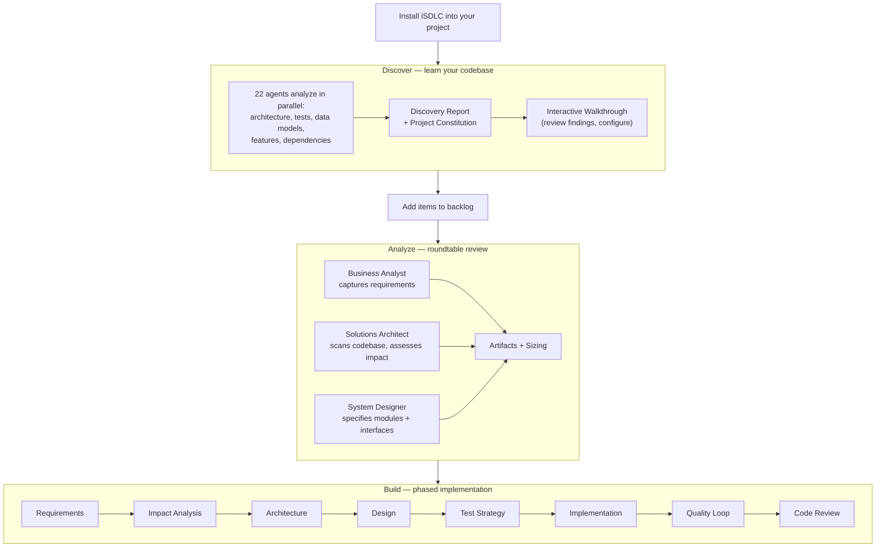

<div align="center">

# iSDLC Framework

<h3><em>Intelligent Software Development Lifecycle Harness — adds structure, control, and traceability on top of Claude Code.</em></h3>

### [Click for Walkthrough](https://isdlc.github.io/isdlc-framework/) — see how iSDLC works end-to-end

[](https://github.com/isdlc/isdlc-framework/issues/260)

[](LICENSE)
[](docs/AGENTS.md)
[](docs/DETAILED-SKILL-ALLOCATION.md)
[](docs/HOOKS.md)
[](docs/ARCHITECTURE.md#quality-gates)
[](ANTIGRAVITY.md)

</div>

---

## Claude Code is the engine. iSDLC adds structure.

Claude Code already spawns agents, edits files, runs tests, retries on failure, and reviews its own work. These are powerful capabilities. iSDLC does not replace any of them — it adds a **structured layer on top** that gives teams control over how those capabilities are applied.

### Think — Planning Before Action

Claude Code's **Plan Mode** thinks tactically: "before I touch these 6 files, here's my approach." iSDLC's **Analyse** thinks strategically: three perspectives (business analysis, architecture, design) examine the whole feature through 8-10 interactive exchanges, producing durable specs that survive after the session ends.

### Execute — Turning Plans Into Code

Claude Code executes well — parallel agents, test retries, self-review. iSDLC adds **defined phases** (test strategy → implementation → quality loop → code review), **user-defined guardrails** (37 runtime hooks, all configurable), and **dependency-ordered task dispatch** with per-task traceability.

### Persist — What Survives After the Session

With Claude Code alone: modified files and git commits. With iSDLC: requirements spec, architecture decisions, design specification, task plan, test strategy, code review record, visual diagrams, and **bidirectional traceability** from requirement to code change to review.

---

## Feature Guide

| Area | What it does | Why it matters |
|------|-------------|----------------|
| **[Discovery](#knowledge-your-codebase-as-ground-truth)** | 22 agents analyze your architecture, tests, dependencies, data models, and features in parallel | Agents understand your codebase before changing a single line |
| **[Roundtable](#what-you-experience)** | Business analyst, architect, and designer analyze requirements through structured debate | Three perspectives catch gaps a single prompt never will |
| **[Workflows](#workflows-fixed-phase-sequences)** | Feature, fix, upgrade, and test workflows with fixed phases and adaptive sizing | AI can't skip steps, scope-creep, or declare "done" prematurely |
| **[Quality Gates](#enforcement-37-hooks)** | 37 hooks enforce coverage, compliance, and sequencing — running outside the LLM | Deterministic enforcement the AI can't argue with or ignore |
| **[Constitution](#what-you-control)** | Governance rules generated from your actual codebase during discovery | Thresholds verified against real code, not hallucinated from training data |
| **[Project Knowledge](docs/PROJECT-KNOWLEDGE.md)** | Codebase scanned, chunked, and embedded for semantic search | Agents find relevant patterns and conventions instead of guessing |
| **[Impact Analysis](#workflows-fixed-phase-sequences)** | Parallel sub-agents map blast radius, entry points, and risk zones before implementation | Changes are scoped precisely — no surprise side effects |
| **[Tracing](#workflows-fixed-phase-sequences)** | 4 agents trace bugs from symptoms through execution paths to root cause | Fixes address causes, not symptoms |
| **[Backlog](#three-verb-backlog)** | Add → Analyze → Build pipeline with GitHub Issues integration | Work progresses from idea to analysis to implementation with full traceability |
| **[Recovery](#workflow-recovery)** | Retry, redo, or rollback any phase — interrupt workflows to fix blockers mid-flight | Mistakes and blockers don't mean starting over |
| **[ATDD](#workflows-fixed-phase-sequences)** | Given/When/Then acceptance criteria mapped to `test.skip()` scaffolds | Red → Green → Refactor with requirement traceability |
| **[Extensibility](#what-you-control)** | Custom personas, skills, gate profiles, multi-provider routing, monorepo isolation | Every layer ships with defaults you can override |

---

## What You Experience

Despite all this structure, interaction is conversational. The harness detects your intent and runs the right workflow:

```
You:     "The login page crashes when the password field is empty"
Claude:  Kicks off a bug fix workflow — traces the root cause, writes a failing test,
         implements the fix, validates through quality gates, and produces a reviewed PR.

You:     "Add dark mode support"
Claude:  Runs a feature workflow — captures requirements interactively, designs the
         architecture, implements with test coverage, and validates quality.

You:     "Upgrade React to v19"
Claude:  Starts an upgrade workflow — analyzes breaking changes, plans migration steps,
         applies changes, and validates everything still works.
```

### Three-verb backlog

Manage work naturally with **add**, **analyze**, and **build**:

```
You:     "Add the payment processing feature from JIRA-1234"
Claude:  Pulls the ticket, creates a backlog draft. Links GitHub Issues automatically.

You:     "Analyze the payment processing feature"
Claude:  Runs a roundtable — a business analyst captures requirements, a solutions
         architect scans the codebase, a system designer produces specifications.

         ... days later, different machine ...

You:     "Build the payment processing feature"
Claude:  Detects analysis is complete, picks up where it left off, starts from
         the right phase.
```

Each verb is a natural escalation: **add** captures the idea, **analyze** deepens understanding, **build** executes the work.

<details>
<summary><strong>Slash commands</strong> — for users who prefer explicit control</summary>

| Command | Description |
|---------|-------------|
| `/discover` | Analyze an existing project or set up a new one |
| `/add "description"` | Add an item to the backlog |
| `/analyze "item"` | Roundtable analysis with 3 personas (bugs and features) |
| `/build "item"` | Implement an analyzed item (test strategy → code → quality → review) |
| `/isdlc upgrade "name"` | Upgrade a dependency with impact analysis and test validation |
| `/isdlc test generate` | Generate tests for existing code |
| `/isdlc test run` | Execute test suite and report coverage |
| `/isdlc skill add <path>` | Register a custom skill from a SKILL.md file |
| `/isdlc skill wire <name>` | Rebind a skill to different phases/agents |
| `/isdlc skill list` | Show registered external skills |
| `/isdlc skill remove <name>` | Unregister a skill |

</details>

---

## What You Control

**iSDLC is a hackable harness.** It ships strict — but every layer is yours to change.

| Layer | What ships | Make it yours |
|-------|-----------|---------------|
| **Quality gates** | 37 hooks enforce coverage, constitutional compliance, and phase sequencing — [details](docs/HOOKS.md) | Set thresholds per profile (`rapid` / `standard` / `strict`), drop domain-specific validators, write your own gate logic — [guide](docs/isdlc/quality-gates-guide.md) |
| **Workflows** | Feature, fix, upgrade, and test workflows with adaptive sizing — [details](docs/ARCHITECTURE.md) | Choose light/standard/epic sizing, define custom workflows with your own phase sequences — [guide](docs/isdlc/workflow-customization-guide.md) |
| **Analysis** | 3-persona roundtable (business analyst, solutions architect, system designer) — [details](docs/AGENTS.md) | Set depth (`brief` / `standard` / `deep`), author new personas, override or disable built-in ones — [guide](docs/isdlc/persona-authoring-guide.md) |
| **Project knowledge** | Code scanned, chunked, and embedded during `/discover` — agents search it semantically | Choose embedding provider, inject your own documents — [guide](docs/PROJECT-KNOWLEDGE.md) |
| **Constitution** | Generated from your actual codebase during `/discover` — [details](docs/CONSTITUTION-GUIDE.md) | Edit thresholds and rules, add domain-specific articles, compose base + project constitutions — [guide](docs/CONSTITUTION-GUIDE.md) |
| **Recovery** | Retry, redo, or rollback any phase | [Hackability roadmap](docs/isdlc/hackability-roadmap.md) |

### Gate profiles

Control how rigorous quality gates are — per-project or per-workflow:

| Profile | Coverage | Constitutional Validation | Elicitation | Use case |
|---------|----------|--------------------------|-------------|----------|
| **rapid** | 60% | Off | 1 interaction | Spikes, simple changes, trusted developers |
| **standard** | 80% | On | 3 interactions | Default — balanced rigor |
| **strict** | 95% | On + mutation testing | Full | Critical/regulated code |

Trigger naturally — "quick build" selects rapid, "this is critical" selects strict — or set a default in your constitution.

### Analysis depth

The roundtable adjusts how deeply it probes:

- **Brief** — accept user framing, 1-2 exchanges per topic
- **Standard** — probe edge cases, challenge assumptions, 3-5 exchanges
- **Deep** — exhaustive exploration, challenge everything, 6+ exchanges

Adapts automatically from signal words, or override with `--light` / `--deep`.

### Custom personas

The roundtable ships with three built-in personas. Customize the roster:

**Add a domain expert** — drop a markdown file in `.isdlc/personas/`:
```
.isdlc/personas/
  persona-security-reviewer.md    ← joins the roundtable automatically
  persona-compliance-officer.md   ← triggered by keyword matches
```

**Override a built-in** — copy to `.isdlc/personas/`, edit, and the framework uses yours:
```bash
cp src/claude/agents/persona-business-analyst.md .isdlc/personas/persona-business-analyst.md
# Edit to match your needs — "skip MoSCoW, use P0-P3 priorities"
```

**Disable a persona** — exclude via `.isdlc/roundtable.yaml`:
```yaml
disabled_personas:
  - ux-reviewer
```

> [Persona Authoring Guide](docs/isdlc/persona-authoring-guide.md)

### Custom skills

Capture team best practices as reusable, agent-consumable knowledge:

- **Add** — point to a SKILL.md file or create one interactively
- **Wire** — bind a skill to specific phases and agents
- **List/Remove** — manage registered skills

Skills are injected into agent context during workflow execution. Use them for coding conventions, API patterns, domain rules — anything agents should know when working in your codebase.

### Configuration

User-configurable files live in `.isdlc/config/`:

| File | What it controls |
|------|-----------------|
| `workflows.json` | Workflow definitions, phase sequences, and sizing rules |
| `finalize-steps.md` | Ordered checklist of post-workflow finalization steps — add, remove, or reorder steps to customize cleanup behavior |
| `iteration-requirements.json` | Max iterations, circuit-breaker thresholds, and coverage targets per gate profile |

### Workflow recovery

Made a mistake? No need to restart from scratch.

- **Retry** — re-run the current phase with fresh state ("try again")
- **Redo** — reset the current phase completely ("redo this phase")
- **Rollback** — go back to an earlier phase ("go back to requirements")
- **Interrupt** — suspend the current workflow to fix a blocking bug, then resume where you left off

Artifacts on disk are preserved so agents read and revise rather than starting blind.

### Roadmap

| Extension point | What you'll be able to do |
|----------------|--------------------------|
| **Product MCPs** | Distribute iSDLC capabilities as standalone MCP servers — plug discovery, analysis, or quality enforcement into any AI tool |
| **Custom workflows** | Define `spike`, `hotfix`, `ui-feature` — your own phase sequences |
| **User-space hooks** | Drop scripts in `.isdlc/hooks/` for domain-specific validation |
| **Templates** | Project-local file templates agents use during implementation |
| **Constitution composition** | Base + project merge for team-wide standards |

> [Full Hackability Roadmap](docs/isdlc/hackability-roadmap.md)

---

## Under the Hood

Three layers enforce quality independently — each runs outside the LLM conversation.

### Enforcement: 37 hooks

Hooks are Node.js processes that intercept tool calls via Claude Code's `PreToolUse` and `PostToolUse` events. They are not part of the conversation — the AI cannot argue with, reinterpret, or ignore them. All hooks fail open — if a hook crashes, it allows the operation rather than blocking work.

<details>
<summary><strong>Key hooks</strong></summary>

| Hook | What it enforces |
|------|-----------------|
| `gate-blocker.cjs` | 5 checks before phase advancement: iteration requirements, workflow state, phase sequencing, agent delegation, artifact presence |
| `iteration-corridor.cjs` | When tests are failing, confines the agent to fix-and-retest — no delegation, no gate advancement |
| `test-watcher.cjs` | Tracks test executions, enforces coverage minimums, circuit-breaks after 3 identical failures |
| `constitution-validator.cjs` | Blocks phase completion until artifacts comply with constitutional articles |
| `phase-sequence-guard.cjs` | Blocks out-of-order phase execution — no skipping ahead |
| `delegation-gate.cjs` | Validates the correct agent is delegated for each phase |

</details>

### Workflows: fixed phase sequences

Each workflow type defines a fixed, non-skippable phase sequence. The AI cannot invent extra steps or skip phases.

| Workflow | Phases | Use case |
|----------|--------|----------|
| **Feature** | Requirements → Impact Analysis → Architecture → Design → Test Strategy → Implementation → Quality Loop → Code Review | New functionality |
| **Feature (light)** | Requirements → Impact Analysis → Test Strategy → Implementation → Quality Loop → Code Review | Small changes — architecture and design skipped |
| **Fix** | Requirements → Root Cause Tracing → Test Strategy → Implementation → Quality Loop → Code Review | Bug fixes (TDD: failing test first) |
| **Upgrade** | Analysis & Planning → Execute & Test → Code Review | Dependency/runtime upgrades |
| **Test** | Test Strategy → Implementation → Quality Loop → Code Review | Generate tests for existing code |

Adaptive sizing scales automatically — light features skip phases, simple changes get rapid gates, complex epics get full rigor with debate rounds.

### Knowledge: your codebase as ground truth

Before changing anything, `/discover` runs 22 agents that build a structured model of your project:

| What it maps | How it's used |
|-------------|---------------|
| **Architecture** — module boundaries, naming conventions, dependency chains | Agents extend existing patterns instead of inventing new ones |
| **Test coverage** — framework detection, coverage by module, gap identification | Quality gates calibrated to your actual baseline |
| **Dependencies** — versions, vulnerability scan, compatibility matrix | Upgrade workflows know what's safe to change |
| **Features & behavior** — API endpoints, UI pages, business rules as acceptance criteria | Reverse-engineered AC become characterization tests |
| **Data models** — schemas, entity relationships, migration history | Implementation respects your data layer |

Results persist as a **project constitution** — governance rules verified against your actual code. The constitution is enforced at every phase boundary, not suggested and forgotten.

Each phase reads predecessor artifacts as input. The architect reads the requirements spec. The designer reads the architecture doc. The developer reads the design. Context is structured and traceable, not conversational and ephemeral.

<details>
<summary><strong>Agent breakdown (64 total)</strong></summary>

- **26 SDLC agents** — 1 orchestrator + 15 phase agents + 10 multi-agent team members (Creator/Critic/Refiner debates for requirements, architecture, design, test strategy; Writer/Reviewer/Updater for implementation)
- **23 Discover agents** — 1 orchestrator + 22 sub-agents that analyze existing projects or elicit vision for new ones
- **6 Exploration agents** — 1 quick scan + 1 orchestrator + 3 impact analysis sub-agents + 1 cross-validation verifier
- **4 Tracing agents** — 1 orchestrator + 3 sub-agents that trace bug root causes
- **4 Roundtable agents** — 1 lead analyst + 3 personas (business analyst, solutions architect, system designer) for concurrent analysis
- **1 Skill manager** — manages external skill registration and wiring

</details>

<details>
<summary><strong>Lifecycle: Discover → Analyze → Build</strong></summary>



</details>

---

## Getting Started

### Prerequisites

| Requirement | Version | Notes |
|-------------|---------|-------|
| **Node.js** | 20+ | Required for hooks, tools, and CLI |
| **Claude Code** | Latest | [Install guide](https://docs.anthropic.com/en/docs/claude-code/overview) |

Supported on macOS, Linux, and Windows.

### Install

**Via npm (recommended):**
```bash
cd /path/to/your-project
npx isdlc
```

**From source (macOS / Linux):**
```bash
cd /path/to/your-project
git clone https://github.com/isdlc/isdlc-framework.git isdlc-framework
./isdlc-framework/install.sh
```

**From source (Windows PowerShell):**
```powershell
cd C:\path\to\your-project
git clone https://github.com/isdlc/isdlc-framework.git isdlc-framework
.\isdlc-framework\install.ps1
```

The installer sets up 40 agents, 245 skills, 37 hooks, and the `.isdlc/` state directory. See [Installation Flow](docs/ARCHITECTURE.md#installation-flow) for details.

### First steps

```bash
claude                              # start Claude Code in your project
> /discover                         # maps architecture, tests, dependencies, conventions
```

Discovery maps your architecture, test coverage, dependencies, and conventions. It generates a constitution from your actual codebase — your patterns, your thresholds, your constraints. Every subsequent workflow is grounded in that knowledge.

### Establish your test baseline

After discovery, the harness knows your test coverage gaps. Before building new features, close them:

```
> "generate tests for the auth module"    # targets uncovered code identified during discovery
> "generate tests for the data layer"     # builds characterization tests from existing behavior
> "run tests"                             # validates the full suite
```

Getting to 95-100% coverage across unit, integration, and system layers gives the harness its teeth — quality gates can enforce high thresholds because the baseline supports them. Without strong coverage, gate enforcement has to be lenient, and the AI has more room to cut corners.

This is the highest-leverage step you can take after discovery.

### Start building

Then just talk naturally:

```
> "fix the login bug"               # traces root cause, writes failing test, fixes, validates
> "add user authentication"          # full lifecycle: requirements → design → implement → review
> "upgrade to Node 22"              # impact analysis, migration plan, test validation
> "add dark mode to the backlog"    # captures the idea for later analysis
> "analyze the dark mode feature"   # roundtable: requirements + architecture + design
> "build dark mode"                 # picks up analysis artifacts, starts implementation
```

New projects are also supported — `/discover` switches to vision elicitation, tech stack selection, and project scaffolding.

---

## Documentation

| Document | Description |
|----------|-------------|
| [ARCHITECTURE.md](docs/ARCHITECTURE.md) | System architecture, hooks, agents, state management, end-to-end flow |
| [HOOKS.md](docs/HOOKS.md) | All 37 hooks — what they block, warn, and track |
| [AGENTS.md](docs/AGENTS.md) | All 40 agents with responsibilities and artifacts |
| [DETAILED-SKILL-ALLOCATION.md](docs/DETAILED-SKILL-ALLOCATION.md) | 245 skills organized by category |
| [CONSTITUTION-GUIDE.md](docs/CONSTITUTION-GUIDE.md) | Project governance principles |
| [PROJECT-KNOWLEDGE.md](docs/PROJECT-KNOWLEDGE.md) | Semantic search over your codebase |
| [Hackability Roadmap](docs/isdlc/hackability-roadmap.md) | Extension architecture and what's coming |
| [Persona Authoring Guide](docs/isdlc/persona-authoring-guide.md) | Create, override, and configure roundtable personas |
| [Quality Gates Guide](docs/isdlc/quality-gates-guide.md) | Configure profiles, extend validators, write custom gate logic |
| [Workflow Customization Guide](docs/isdlc/workflow-customization-guide.md) | Sizing, custom workflows, and phase sequence replacement |
| [Plan Mode vs `/isdlc analyze`](docs/isdlc/plan-mode-vs-analyze.md) | When to use Claude Code's built-in plan mode vs the analyze workflow |
| [Native Execute vs `/isdlc build`](docs/isdlc/native-execute-vs-build.md) | When to use direct Claude Code execution vs the build workflow |
| [MONOREPO-GUIDE.md](docs/MONOREPO-GUIDE.md) | Multi-project setup |
| [AUTONOMOUS-ITERATION.md](docs/AUTONOMOUS-ITERATION.md) | Self-correcting agent behavior |
| [SKILL-ENFORCEMENT.md](docs/SKILL-ENFORCEMENT.md) | Runtime skill observability |

---

## Contributing

This framework is under active development. Contributions, feedback, and suggestions are welcome.

**Licensing**: Free and open source (MIT License). You provide your own LLM access via a Claude Code subscription.

---

## Complementary Frameworks

Projects that operate at different layers of the AI agent stack and can complement iSDLC:

| Project | Layer | Description |
|---------|-------|-------------|
| [desiAgent](https://github.com/ugmurthy/desiAgent) | Task execution | Library-first TypeScript SDK that decomposes natural language goals into DAGs, executes them autonomously with cost tracking and event streaming |

---

<div align="center">

**iSDLC Framework** v0.1.0-alpha — an AI development harness you control

</div>
