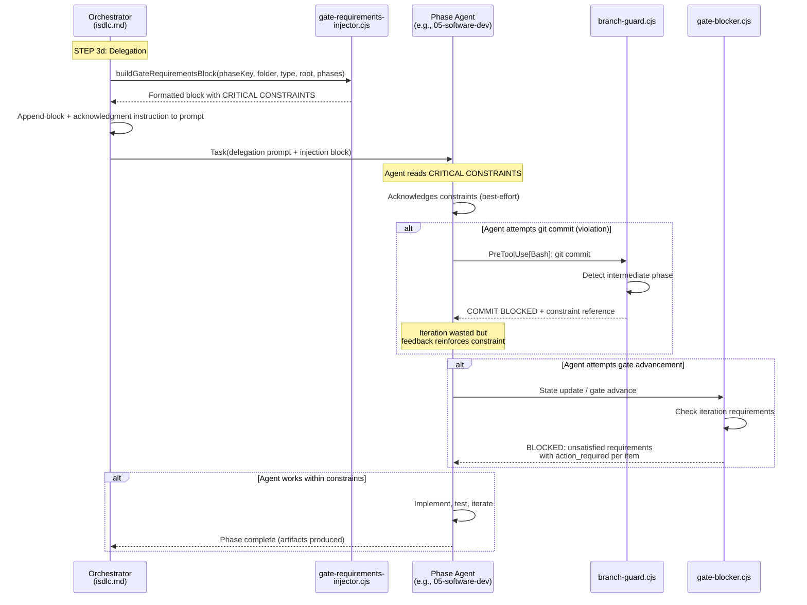

# Architecture Overview: BUG-0028 -- Agents Ignore Injected Gate Requirements

**Bug ID**: BUG-0028 / GH-64
**Phase**: 03-architecture
**Scope**: Bug fix (medium complexity, 8-10 files)
**Analysis Mode**: ANALYSIS (no state.json writes, no branch creation)
**Traces to**: REQ-0024 (gate requirements pre-injection), REQ-0025 (performance budget)

---

## 1. Current Architecture: Constraint Delivery Pipeline

The gate-constraint system has four layers that form a pipeline. The bug manifests because two layers are weak: the injection format (Layer 1) and the agent instruction layer (Layer 3).

```
Layer 1: INJECTION (gate-requirements-injector.cjs)
  |  formatBlock() produces a text block summarizing gate requirements
  |  for the target phase. Output is plain text, fail-open.
  v
Layer 2: DELEGATION (isdlc.md STEP 3d)
  |  The orchestrator appends the injection block to the delegation
  |  prompt sent to the phase agent via the Task tool.
  v
Layer 3: AGENT INSTRUCTIONS (agent .md files)
  |  Each agent has a system prompt loaded from src/claude/agents/*.md.
  |  Some agents reference "Git Commit Prohibition in CLAUDE.md" -- a
  |  section that DOES NOT EXIST (dead cross-reference).
  v
Layer 4: ENFORCEMENT (branch-guard.cjs, gate-blocker.cjs)
  |  Hooks intercept tool calls (PreToolUse[Bash]) and block prohibited
  |  actions. This is the safety net -- it works, but wastes iterations.
  v
[Agent sees block message, must recover]
```

### Current formatBlock() Output (Layer 1)

```
GATE REQUIREMENTS FOR PHASE 06 (Implementation):

Iteration Requirements:
  - test_iteration: enabled (max 10 iterations, coverage >= 80%)
  - constitutional_validation: enabled (Articles: I, II, III, ..., max 5 iterations)
  - interactive_elicitation: disabled
  - agent_delegation: enabled
  - artifact_validation: disabled

Required Artifacts:
  - docs/requirements/{folder}/coverage-report.html

Constitutional Articles to Validate:
  - Article I: Specification Primacy
  - Article III: Security by Design
  ...

DO NOT attempt to advance the gate until ALL enabled requirements are satisfied.
```

**Problem**: This format is informational. It reads like a status dashboard, not a set of hard constraints. The header "GATE REQUIREMENTS" is descriptive. The only imperative line is the footer, and it only addresses gate advancement -- not specific prohibited actions like `git commit`.

### Current Agent Instructions (Layer 3)

**05-software-developer.md, line 29**:
```
> See **Git Commit Prohibition** in CLAUDE.md.
```

**16-quality-loop-engineer.md, line 33**:
```
> See **Git Commit Prohibition** in CLAUDE.md.
```

**CLAUDE.md**: Contains NO section called "Git Commit Prohibition". This is a dead cross-reference. When the agent follows the instruction, it finds nothing and proceeds without constraint.

**07-qa-engineer.md, line 159**: Has a working inline prohibition:
```
Do NOT run git add, git commit, git push, or any git write operations
```

**06-integration-tester.md**: Contains no commit references at all.

### Current Block Message (Layer 4)

```
COMMIT BLOCKED (Phase: 06-implementation): Commits are not allowed
on the workflow branch during intermediate phases.

The current phase '06-implementation' has not yet passed quality-loop
and code-review validation. Committing now would create unvalidated
snapshots in version control.

What to do instead:
- Leave changes on the working tree (they will be committed by the orchestrator at workflow finalize)
- If you need to save work temporarily, use: git stash
- The orchestrator handles git add, commit, and merge at the appropriate time

Current phase:  06-implementation
Current branch: fix/BUG-0029
Final phase:    08-code-review
```

**Problem**: The message is actionable but does not reference the injected constraint. It explains what happened but does not reinforce the constraint origin for the agent's mental model.

---

## 2. Architecture Decisions

### ADR-001: Strengthen Injection Format with CRITICAL CONSTRAINTS Prefix

**Status**: Proposed
**Traces to**: FR-001, FR-002 (RC-1 root cause)

#### Context

The current `formatBlock()` output uses an informational header ("GATE REQUIREMENTS FOR PHASE NN") and lists enabled/disabled flags as a status summary. LLM agents treat this as background context rather than hard constraints because:
1. The header is descriptive, not imperative
2. The content reads like a dashboard (enabled/disabled toggles)
3. The only imperative line is at the bottom (recency bias helps, but primacy bias is stronger for constraint recognition)

#### Decision

Add a `CRITICAL CONSTRAINTS` section at the TOP of the injection block (before "Iteration Requirements:"). This section will contain short, imperative prohibition statements derived from the phase configuration. Add a constraint reminder line at the BOTTOM of the block that restates the key prohibitions.

**New format structure**:

```
========================================
CRITICAL CONSTRAINTS FOR PHASE 06 (Implementation):
- Do NOT run git commit -- the orchestrator manages all commits at workflow finalize.
- Do NOT advance the gate until test_iteration passes (all tests passing, >= 80% coverage).
- Constitutional validation MUST complete before gate advancement.
========================================

Iteration Requirements:
  - test_iteration: enabled (max 10 iterations, coverage >= 80%)
  - constitutional_validation: enabled (Articles: I, II, ..., max 5 iterations)
  - interactive_elicitation: disabled
  - agent_delegation: enabled
  - artifact_validation: disabled

Required Artifacts:
  - docs/requirements/{folder}/coverage-report.html

Constitutional Articles to Validate:
  - Article I: Specification Primacy
  ...

Workflow Modifiers:
  {"require_failing_test_first": true}

REMINDER: Do NOT run git commit. Do NOT advance the gate until ALL requirements above are satisfied.
```

#### Implementation

Introduce a new internal function `buildCriticalConstraints(phaseKey, phaseReq, workflowModifiers, phases)` inside `gate-requirements-injector.cjs`:

```
function buildCriticalConstraints(phaseKey, phaseReq, workflowModifiers, phases) {
    // Returns an array of imperative constraint strings.
    // Derives constraints from:
    //   1. Phase position: if not the last phase in `phases`, add git commit prohibition
    //   2. phaseReq.constitutional_validation.enabled -> constitutional reminder
    //   3. phaseReq.test_iteration.enabled -> test passing/coverage reminder
    //   4. workflowModifiers keys (e.g., require_failing_test_first)
    //   5. phaseReq.artifact_validation.enabled -> required artifacts reminder
}
```

And a companion `buildConstraintReminder(constraints)` that produces the footer:

```
function buildConstraintReminder(constraints) {
    // Returns "REMINDER: {constraint1}. {constraint2}. ..."
    // or '' if no constraints.
}
```

Both functions are wrapped in try/catch returning `[]` / `''` respectively (fail-open).

#### Signature Change to formatBlock()

The current signature is:

```javascript
function formatBlock(phaseKey, phaseReq, resolvedPaths, articleMap, workflowModifiers)
```

A new parameter `phases` (the workflow phases array from state.json, or null) is needed to determine whether the current phase is intermediate (git commit prohibited) or final (git commit allowed). Two options:

**Option A: Add `phases` parameter to `formatBlock()`**
```javascript
function formatBlock(phaseKey, phaseReq, resolvedPaths, articleMap, workflowModifiers, phases)
```

**Option B: Add `isIntermediatePhase` boolean derived by `buildGateRequirementsBlock()`**
```javascript
function formatBlock(phaseKey, phaseReq, resolvedPaths, articleMap, workflowModifiers, isIntermediatePhase)
```

**Selected**: Option B. It keeps `formatBlock()` decoupled from the state.json schema. The caller (`buildGateRequirementsBlock()`) reads state.json, determines whether the phase is intermediate, and passes a boolean. If the phases array is unavailable, `isIntermediatePhase` defaults to `true` (fail-safe: assume intermediate, which means "prohibit commits" -- the safer default per Article X).

`buildGateRequirementsBlock()` gains an optional `phases` parameter (or reads it from state.json). Since the function already has access to `projectRoot`, it can read state.json directly to extract the phases array. However, to avoid coupling the injector to state.json structure (which would increase blast radius), the caller in `isdlc.md` (STEP 3d) should pass the phases array as a parameter.

**Final decision on phase data source**: The `isdlc.md` STEP 3d instructions already have access to the active_workflow.phases array (they read state.json extensively). The injection instruction block will be updated to pass `phases` to `buildGateRequirementsBlock()` so it can compute `isIntermediatePhase`. Since `buildGateRequirementsBlock` is also called programmatically from hooks, the parameter will be optional with a default of `null` (triggering fail-safe: `isIntermediatePhase = true`).

#### Updated buildGateRequirementsBlock Signature

```javascript
function buildGateRequirementsBlock(phaseKey, artifactFolder, workflowType, projectRoot, phases)
//                                                                                      ^^^^^^ NEW (optional)
```

When `phases` is provided and is a non-empty array, `isIntermediatePhase` is computed as:
```javascript
const lastPhase = phases[phases.length - 1];
const isIntermediatePhase = (phaseKey !== lastPhase);
```

When `phases` is null/undefined/empty, `isIntermediatePhase` defaults to `true` (fail-safe).

#### Consequences

**Positive**:
- Imperative language at top of block exploits primacy bias
- Constraint reminder at bottom exploits recency bias
- Visual separators (`========`) increase scanning salience
- Phase-specific prohibitions replace generic flags with actionable statements

**Negative**:
- Injection block grows (mitigated by 40% growth cap, NFR-001)
- Additional parameter to `buildGateRequirementsBlock()` (mitigated by making it optional)

**Backward Compatibility**:
- The `phases` parameter is optional. Existing callers passing 4 args continue to work (5th arg defaults to `null`, triggering fail-safe).
- Existing tests use `includes()` assertions on output strings. The new CRITICAL CONSTRAINTS section is additive -- existing sections ("Iteration Requirements:", "Required Artifacts:", etc.) remain unchanged in position and content.
- The module export list does not change. New internal functions (`buildCriticalConstraints`, `buildConstraintReminder`) are not exported (they are internal helpers).

#### Size Budget Analysis

Current `formatBlock()` output for `06-implementation` (with constitution, no workflow modifiers): approximately 650-750 characters.

New output estimate:
- CRITICAL CONSTRAINTS header + separators: ~100 chars
- 3-4 constraint lines: ~250 chars
- Existing sections: ~650 chars (unchanged)
- REMINDER footer: ~100 chars
- **Total**: ~1100 chars (approximately 50-70% growth)

This exceeds the 40% growth cap (NFR-001). To stay within budget:
- Shorten constraint lines to minimum viable length
- Use abbreviated header: `CRITICAL CONSTRAINTS:` without phase name repetition (phase is already in the "GATE REQUIREMENTS" header which becomes the second section)
- Remove the "GATE REQUIREMENTS FOR PHASE NN" header entirely -- replace it with the CRITICAL CONSTRAINTS header, which serves the same purpose but with imperative framing
- Keep the visual separator to one line (`========`) not two

**Revised estimate with optimization**:
- `CRITICAL CONSTRAINTS FOR PHASE 06 (Implementation):` header + separator: ~80 chars
- 3-4 constraint lines (short): ~200 chars
- Existing body (iteration requirements, artifacts, constitution): ~500 chars
- REMINDER footer: ~80 chars
- **Total**: ~860 chars (~15-30% growth over ~700 char baseline)

This fits within the 40% budget.

---

### ADR-002: Phase-Specific Prohibition Derivation

**Status**: Proposed
**Traces to**: FR-002 (RC-1 root cause)

#### Context

The current injection block lists enabled/disabled flags but does not translate them into actionable prohibitions. An agent reading "test_iteration: enabled (max 10 iterations, coverage >= 80%)" must infer that it should not advance the gate until tests pass. This inference step is where compliance breaks down.

#### Decision

The `buildCriticalConstraints()` function derives imperative prohibition statements from the phase configuration using a static mapping table:

| Condition | Constraint Line |
|-----------|----------------|
| Phase is intermediate (not last in workflow) | `Do NOT run git commit -- the orchestrator manages all commits.` |
| `test_iteration.enabled == true` | `Do NOT advance the gate until all tests pass with >= {min_coverage}% coverage.` |
| `constitutional_validation.enabled == true` | `Constitutional validation MUST complete before gate advancement.` |
| `artifact_validation.enabled == true` | `Required artifacts MUST exist: {path1}, {path2}, ...` |
| `workflowModifiers.require_failing_test_first == true` | `You MUST write a failing test before implementing the fix.` |

The mapping is hardcoded in the function (not externalized to config). This is intentional per Article V (Simplicity First) -- the mapping is small, stable, and directly tied to the code that evaluates it.

#### Consequences

**Positive**:
- Each enabled gate requirement produces a corresponding imperative statement
- Agents receive concrete "do/do not" instructions, not status flags
- New constraint types can be added by extending the mapping table

**Negative**:
- Hardcoded mapping must be updated when new gate requirement types are added
- Mitigated: the mapping table is co-located with `formatBlock()` in the same file, making updates discoverable

---

### ADR-003: Constraint Acknowledgment Instruction in Delegation Prompt

**Status**: Proposed
**Traces to**: FR-003 (RC-3 root cause)

#### Context

The delegation prompt in `isdlc.md` STEP 3d appends the gate requirements block but includes no instruction for the agent to actively parse or acknowledge it. The block is passive context -- the agent may or may not read it before starting work.

#### Decision

Add a single instruction line to the STEP 3d gate requirements injection template, placed AFTER the injection block:

```
After step 5 (format and append block), add step 5a:

5a. Append to the delegation prompt immediately after the gate requirements block:
    "Read the CRITICAL CONSTRAINTS block above and confirm you will comply before starting work."
```

This is a prompt-engineering measure (not deterministic enforcement). Its purpose is to prime the agent to actively process the constraints rather than skimming past them.

#### Implementation Location

The change is in `src/claude/commands/isdlc.md`, lines 1632-1652 (the STEP 3d injection block). The instruction is added as step 5a after the existing step 5 ("Format and append the following block").

No code changes are needed -- this is a markdown template modification.

#### Consequences

**Positive**:
- Creates an active processing step for the agent
- Low-cost change (2 lines added to a prompt template)
- Compatible with all phase types (the instruction references "CRITICAL CONSTRAINTS block" which exists for all phases after ADR-001)

**Negative**:
- Not deterministic -- agents may still ignore the instruction
- Mitigated: Layer 4 (hook enforcement) remains the safety net

---

### ADR-004: Inline Commit Prohibitions in Agent Files (Dead Cross-Reference Fix)

**Status**: Proposed
**Traces to**: FR-004 (RC-2 root cause -- CONFIRMED)

#### Context

Two agent files reference a "Git Commit Prohibition" section in CLAUDE.md that does not exist:
- `src/claude/agents/05-software-developer.md` line 29
- `src/claude/agents/16-quality-loop-engineer.md` line 33

This is the single most impactful finding of the analysis. It is a confirmed dead cross-reference, not a hypothesis. When an agent encounters `> See **Git Commit Prohibition** in CLAUDE.md.` and finds no such section, it has zero constraint information and falls back on default behavior (which includes training-data habits like "save your work" via git commit).

By contrast, `07-qa-engineer.md` line 159 has a working inline prohibition: `Do NOT run git add, git commit, git push, or any git write operations`. This agent does not exhibit the constraint-violation bug.

#### Decision

Replace the dead cross-reference in each affected agent file with an inline prohibition block:

**Before** (05-software-developer.md, line 29):
```
> See **Git Commit Prohibition** in CLAUDE.md.
```

**After**:
```
> **Git Commit Prohibition**: Do NOT run `git commit`, `git add`, or `git push` during this phase.
> The orchestrator manages all git operations at workflow finalize. Attempting to commit will be
> blocked by the branch-guard hook and waste an iteration.
```

Apply the same replacement to `16-quality-loop-engineer.md` line 33.

For `06-integration-tester.md`, which has no commit references, add the same inline prohibition block after the existing `> Follow the **Mandatory Iteration Enforcement Protocol** in CLAUDE.md.` line. This agent has implementation responsibilities (runs tests, may modify test files) and should have the same constraint.

#### Dual Reinforcement Strategy

After this fix, agents receive commit prohibition from TWO independent sources:
1. **Static**: The inline prohibition in the agent `.md` file (always present)
2. **Dynamic**: The `CRITICAL CONSTRAINTS` section in the injected gate requirements block (present for intermediate phases)

This is intentional redundancy. If either source fails (injection silently errors, or agent skips the blockquote), the other source still provides the constraint.

#### Consequences

**Positive**:
- Eliminates the confirmed dead cross-reference
- Inline prohibition is self-contained -- no dependency on CLAUDE.md section existence
- Matches the pattern already working in `07-qa-engineer.md`

**Negative**:
- Duplication: the same prohibition text appears in multiple agent files
- Mitigated: the text is short (3 lines) and stable (commit prohibition is a fundamental workflow rule, not likely to change)

---

### ADR-005: Actionable Block Messages in branch-guard.cjs

**Status**: Proposed
**Traces to**: FR-005 (RC-4 root cause)

#### Context

When `branch-guard.cjs` blocks a commit during an intermediate phase, the `stopReason` message explains what happened and what to do instead, but it does not reference the injected constraint. This means the agent does not get a feedback loop connecting the block to the constraint it should have followed.

#### Decision

Modify the intermediate-phase block message in `branch-guard.cjs` (lines 203-216) to add a constraint-reference line:

**Current first line**:
```
COMMIT BLOCKED (Phase: ${currentPhase}): Commits are not allowed on the workflow branch during intermediate phases.
```

**New first line** (adds constraint reference):
```
COMMIT BLOCKED (Phase: ${currentPhase}): Commits are not allowed during intermediate phases. This was stated in the CRITICAL CONSTRAINTS block injected into your delegation prompt.
```

Additionally, add a remediation directive that is more specific:

**Current "What to do instead" section** remains, with one line added:
```
- Do NOT retry the commit -- it will be blocked again.
```

#### Implementation

The change is isolated to the `outputBlockResponse()` call at lines 203-216 of `branch-guard.cjs`. The `outputBlockResponse` function signature (`stopReason: string`) does not change. Only the string content passed to it changes.

#### Consequences

**Positive**:
- Agent receives feedback connecting the block to the injected constraint
- Reinforces the constraint for subsequent iterations
- No code structure changes (string content change only)

**Negative**:
- Block message grows slightly (approximately 60 characters longer)
- Mitigated: the message is consumed by the agent (not parsed programmatically), so length is not a concern

---

### ADR-006: Regression Test Suite for Injection Salience

**Status**: Proposed
**Traces to**: FR-006

#### Context

The existing test file `gate-requirements-injector.test.cjs` has 62 assertions across 11 suites. Tests use `includes()` checks (not exact-match), which means format changes are low-risk for existing tests. However, there are no tests verifying the new CRITICAL CONSTRAINTS section structure.

#### Decision

Add a new `describe('Injection salience')` suite to the existing test file with these test cases:

| Test | Assertion |
|------|-----------|
| `formatBlock() output includes CRITICAL CONSTRAINTS before Iteration Requirements` | `output.indexOf('CRITICAL CONSTRAINTS') < output.indexOf('Iteration Requirements:')` |
| `formatBlock() output ends with constraint reminder` | `output.endsWith(...)` or `output.includes('REMINDER:')` at a position after the last section |
| `Constitutional validation reminder appears in CRITICAL CONSTRAINTS` | For a phase with `constitutional_validation.enabled = true`, `output` between `CRITICAL CONSTRAINTS` and `Iteration Requirements:` includes "Constitutional validation" |
| `Git commit prohibition appears for intermediate phases` | For `formatBlock()` called with `isIntermediatePhase = true`, output includes "Do NOT run git commit" |
| `Git commit prohibition absent for final phase` | For `formatBlock()` called with `isIntermediatePhase = false`, output does NOT include "Do NOT run git commit" |
| `Character count within 40% growth budget` | Measure baseline output length, measure new output length, assert `newLen <= baselineLen * 1.4` |

The test suite reuses the existing fixture setup (`FIXTURE_ITERATION_REQ`, `FIXTURE_ARTIFACT_PATHS`, etc.) and follows the project's `node:test` + `node:assert/strict` pattern.

#### Consequences

**Positive**:
- Prevents regression of injection format
- Validates the 40% growth budget programmatically
- Tests the new `isIntermediatePhase` parameter behavior

**Negative**:
- Tests are coupled to specific output strings ("CRITICAL CONSTRAINTS", "REMINDER:")
- Mitigated: these strings are design decisions, not implementation details -- they should break tests if changed

---

## 3. Component Interaction Diagram



---

## 4. Changes to Existing Interfaces

### 4.1 gate-requirements-injector.cjs

| Interface | Change | Backward Compatible |
|-----------|--------|-------------------|
| `buildGateRequirementsBlock(phaseKey, artifactFolder, workflowType, projectRoot, phases)` | New optional 5th parameter `phases` (Array or null). Defaults to null (fail-safe: treats phase as intermediate). | YES -- existing 4-arg callers are unaffected |
| `formatBlock(phaseKey, phaseReq, resolvedPaths, articleMap, workflowModifiers, isIntermediatePhase)` | New optional 6th parameter `isIntermediatePhase` (boolean). Defaults to true (fail-safe). | YES -- existing 5-arg callers are unaffected |
| Output format of `formatBlock()` | Adds CRITICAL CONSTRAINTS section at top, REMINDER footer at bottom. Existing sections unchanged. | YES -- callers consuming the string via `includes()` are unaffected. The string is always consumed as opaque text appended to a prompt. |
| New internal function `buildCriticalConstraints()` | Not exported. Internal helper only. | N/A |
| New internal function `buildConstraintReminder()` | Not exported. Internal helper only. | N/A |
| Module exports | Unchanged: same 8 functions exported | YES |

### 4.2 branch-guard.cjs

| Interface | Change | Backward Compatible |
|-----------|--------|-------------------|
| `outputBlockResponse()` call at lines 203-216 | String content of `stopReason` argument modified. No signature change. | YES -- `outputBlockResponse` accepts any string |
| Output JSON format | Unchanged: `{ "continue": false, "stopReason": "..." }` | YES |

### 4.3 isdlc.md (STEP 3d)

| Interface | Change | Backward Compatible |
|-----------|--------|-------------------|
| Gate requirements injection template | Step 5a added after step 5. Template gains acknowledgment instruction line. | YES -- additive change to prompt template |
| Phase array passing | Instruction updated to pass `phases` array from state.json to `buildGateRequirementsBlock()`. | YES -- the orchestrator already has this data available |

### 4.4 Agent .md Files

| File | Change | Backward Compatible |
|------|--------|-------------------|
| `05-software-developer.md` | Line 29: dead cross-reference replaced with 3-line inline prohibition | YES -- behavioral improvement, no interface change |
| `16-quality-loop-engineer.md` | Line 33: dead cross-reference replaced with 3-line inline prohibition | YES -- behavioral improvement, no interface change |
| `06-integration-tester.md` | New prohibition block added after Mandatory Iteration Enforcement reference | YES -- additive, no existing behavior removed |
| `07-qa-engineer.md` | No change (existing inline prohibition is sufficient) | N/A |

---

## 5. Backward Compatibility Analysis

### Risk: Existing Tests

**Assessment**: LOW risk.

The existing 62 assertions in `gate-requirements-injector.test.cjs` use `includes()` checks against the output of `formatBlock()`. The new CRITICAL CONSTRAINTS section is prepended to the output, and the existing sections (Iteration Requirements, Required Artifacts, Constitutional Articles, Workflow Modifiers, footer) remain in the same relative order with the same content. No existing assertion will break.

The one exception to monitor: any test that asserts the output STARTS WITH a specific string (e.g., `output.startsWith('GATE REQUIREMENTS')`. A search of the test file shows no `startsWith` assertions -- all use `includes()`.

### Risk: Callers of buildGateRequirementsBlock()

**Assessment**: NONE.

The function is called from:
1. `isdlc.md` STEP 3d (prompt template, not programmatic) -- will be updated to pass `phases`
2. No other callers found in the codebase (verified via grep)

The new `phases` parameter is optional. Callers passing 4 args continue to work.

### Risk: Callers of formatBlock()

**Assessment**: NONE.

The function is called only from `buildGateRequirementsBlock()` within the same file (line 349). No external callers. The new `isIntermediatePhase` parameter is optional.

### Risk: branch-guard.cjs block message consumers

**Assessment**: NONE.

The `stopReason` string is consumed by the LLM agent (Claude) as natural language. It is not parsed programmatically. The content change is additive (new sentences added, no existing sentences removed).

### Risk: Agent .md file changes

**Assessment**: NONE.

Agent `.md` files are static prompts loaded by Claude Code. Replacing a dead cross-reference with inline text is purely beneficial. No code depends on the specific content of these files.

---

## 6. Data Flow: Before and After

### Before (Current State)

```
isdlc.md STEP 3d
  reads iteration-requirements.json
  reads artifact-paths.json
  reads constitution.md
  calls formatBlock(phaseKey, phaseReq, resolvedPaths, articleMap, workflowModifiers)
  receives: informational block (no prohibitions, no constraint emphasis)
  appends to delegation prompt (no acknowledgment instruction)

Agent receives prompt
  sees "GATE REQUIREMENTS FOR PHASE 06" (informational)
  sees "test_iteration: enabled" (status flag)
  sees "DO NOT attempt to advance the gate" (only prohibition, about gate, not about git)
  sees "> See Git Commit Prohibition in CLAUDE.md" (dead cross-reference)
  finds nothing in CLAUDE.md
  proceeds with default behavior -> attempts git commit -> blocked by hook -> iteration wasted
```

### After (Proposed State)

```
isdlc.md STEP 3d
  reads iteration-requirements.json
  reads artifact-paths.json
  reads constitution.md
  reads active_workflow.phases from state.json (for intermediate phase detection)
  calls buildGateRequirementsBlock(phaseKey, folder, type, root, phases)
    computes isIntermediatePhase = (phaseKey !== phases[phases.length - 1])
    calls formatBlock(phaseKey, phaseReq, resolvedPaths, articleMap, workflowModifiers, isIntermediatePhase)
      calls buildCriticalConstraints(phaseKey, phaseReq, workflowModifiers, isIntermediatePhase)
      returns: constraint block with "Do NOT run git commit", "Do NOT advance gate", etc.
      calls buildConstraintReminder(constraints)
      returns: "REMINDER: Do NOT run git commit. Do NOT advance gate until ..."
  receives: block with CRITICAL CONSTRAINTS at top, REMINDER at bottom
  appends block + "Read the CRITICAL CONSTRAINTS block and confirm compliance" to prompt

Agent receives prompt
  sees "CRITICAL CONSTRAINTS FOR PHASE 06" (imperative)
  sees "Do NOT run git commit" (explicit prohibition)
  sees "> Git Commit Prohibition: Do NOT run git commit..." (inline in agent .md)
  sees "REMINDER: Do NOT run git commit" (reinforcement at end)
  dual reinforcement (static inline + dynamic injection) -> complies with constraint

If agent still attempts commit (edge case):
  branch-guard blocks with message referencing CRITICAL CONSTRAINTS
  agent receives clear feedback connecting block to constraint -> does not retry
```

---

## 7. Implementation Order and Dependencies

```
                    +------------------+
                    |  FR-001          |
                    |  formatBlock()   |
                    |  CRITICAL        |
                    |  CONSTRAINTS     |
                    +--------+---------+
                             |
                    +--------v---------+
                    |  FR-002          |
                    |  Phase-specific  |
                    |  prohibitions    |
                    +--------+---------+
                             |
                    +--------v---------+
                    |  FR-006          |
                    |  Regression      |
                    |  tests           |
                    +------------------+

    +------------------+  +------------------+  +------------------+
    |  FR-004          |  |  FR-003          |  |  FR-005          |
    |  Agent file      |  |  isdlc.md        |  |  branch-guard    |
    |  audit           |  |  acknowledgment  |  |  messages         |
    +------------------+  +------------------+  +------------------+
         (independent)        (independent)        (independent)
```

**Critical path**: FR-001 -> FR-002 -> FR-006 (must be sequential; FR-002 depends on FR-001 structure, FR-006 tests both)

**Parallel track**: FR-004, FR-003, FR-005 are fully independent of each other and of the critical path. They can be implemented in any order or in parallel.

**Recommended implementation order**:
1. FR-004 (agent file audit) -- highest-impact fix, eliminates confirmed root cause, zero risk
2. FR-001 + FR-002 (injection format) -- core logic change
3. FR-006 (regression tests) -- validates FR-001 + FR-002
4. FR-003 (acknowledgment instruction) -- low-effort prompt template change
5. FR-005 (branch-guard messages) -- low-effort string change

---

## 8. Files Modified Summary

| # | File | FRs | Change Description | Lines Changed (est.) |
|---|------|-----|-------------------|---------------------|
| 1 | `src/claude/hooks/lib/gate-requirements-injector.cjs` | FR-001, FR-002 | Add `buildCriticalConstraints()`, `buildConstraintReminder()`. Modify `formatBlock()` and `buildGateRequirementsBlock()` signatures and logic. | ~50-70 new/modified |
| 2 | `src/claude/hooks/tests/gate-requirements-injector.test.cjs` | FR-006 | Add "Injection salience" test suite with 6 test cases. | ~80-100 new |
| 3 | `src/claude/commands/isdlc.md` | FR-003 | Add step 5a (acknowledgment instruction) and update step 5 to pass phases. | ~5-8 modified |
| 4 | `src/claude/agents/05-software-developer.md` | FR-004 | Replace dead cross-reference with inline prohibition. | ~3 lines replaced |
| 5 | `src/claude/agents/16-quality-loop-engineer.md` | FR-004 | Replace dead cross-reference with inline prohibition. | ~3 lines replaced |
| 6 | `src/claude/agents/06-integration-tester.md` | FR-004 | Add inline prohibition block. | ~3 lines added |
| 7 | `src/claude/hooks/branch-guard.cjs` | FR-005 | Modify block message string at lines 203-216. | ~5 lines modified |

**Total**: 7 files, ~150-190 lines changed/added.

---

## 9. Constraints and Non-Functional Requirements Compliance

| Constraint/NFR | How Addressed |
|---------------|---------------|
| CON-001: CJS module, no new dependencies | No new imports. New functions use only string operations. |
| CON-002: Plain text output (no markdown) | CRITICAL CONSTRAINTS section uses plain text with `========` separators (not markdown `#` or `---`). |
| CON-003: No behavior change for unconstrained phases | `buildCriticalConstraints()` returns empty array when no constraints apply. `formatBlock()` omits the CRITICAL CONSTRAINTS section entirely when the array is empty. |
| CON-004: No iteration-requirements.json schema changes | No schema changes. Constraints are derived from existing fields. |
| NFR-001: formatBlock() p95 < 5ms | No I/O added. New functions are pure string operations (array push, join). |
| NFR-001: buildGateRequirementsBlock() p95 < 50ms | One additional state.json read if `phases` is not passed. When passed from isdlc.md, no additional I/O. |
| NFR-001: <= 40% injection block growth | Optimized format keeps total under 40% growth (see ADR-001 size analysis). Test enforces this. |
| NFR-002: Fail-open preserved | All new functions wrapped in try/catch returning defaults. No new throws. |
| NFR-003: Total block < 2000 chars | Optimized format estimate: ~860 chars for a typical phase. Well within budget. |

---

## 10. Open Questions

1. **Should `buildCriticalConstraints()` be exported for direct testing?** The function is internal, but exporting it would allow more targeted unit tests. Recommendation: export it (following the existing pattern -- `formatBlock`, `deepMerge`, and other helpers are already exported for testing).

2. **Should the CRITICAL CONSTRAINTS section be omitted entirely for phases with no constraints (e.g., quick-scan)?** Recommendation: yes -- if `buildCriticalConstraints()` returns an empty array, skip the section and the separators. This avoids confusing agents on unconstrained phases.

3. **Should `06-integration-tester.md` get the commit prohibition even though it has never been observed to violate it?** Recommendation: yes -- preventive. The agent has implementation-adjacent responsibilities (running tests, potentially modifying test files). The cost is 3 lines of text.
