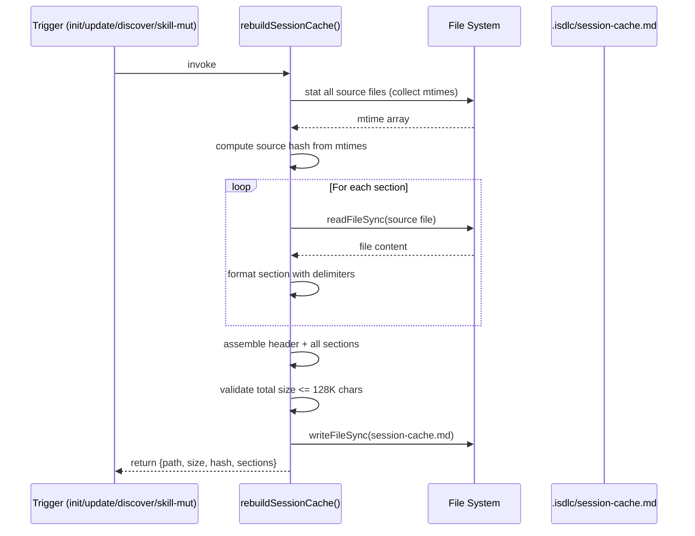
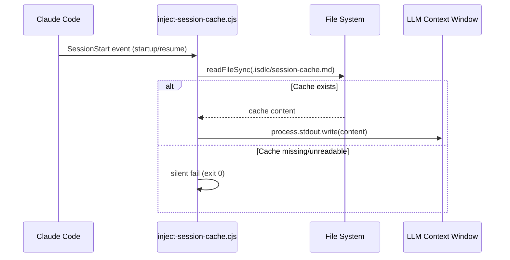
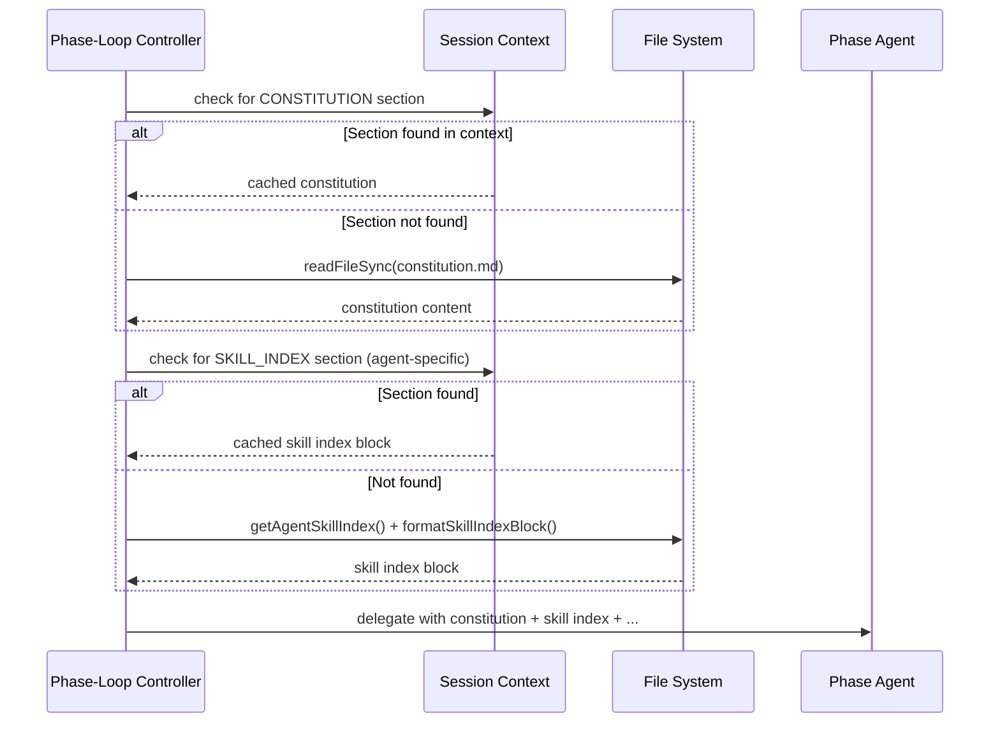

# Architecture Overview: Unified SessionStart Cache

**Requirement ID**: REQ-0001
**Feature**: Unified SessionStart cache -- eliminate ~200+ static file reads per workflow (GH #91)
**Phase**: 03-architecture
**Created**: 2026-02-23

---

## 1. System Context

The SessionStart cache is an optimization layer that pre-loads all static framework content into the LLM context window at session startup. It sits between the static source files on disk and the Claude Code runtime, eliminating 200-340 redundant file reads per 9-phase workflow.

```mermaid
graph LR
    subgraph "Static Source Files (Disk)"
        CONST[constitution.md]
        WF[workflows.json]
        IR[iteration-requirements.json]
        AP[artifact-paths.json]
        SM[skills-manifest.json]
        SK[242 SKILL.md files]
        EM[external-skills-manifest.json]
        PA[3 persona agent files]
        TA[6 topic files]
    end

    subgraph "Cache Layer (.isdlc/)"
        RC[rebuildSessionCache]
        CF[session-cache.md]
    end

    subgraph "Claude Code Runtime"
        SH[inject-session-cache.cjs<br/>SessionStart Hook]
        CTX[LLM Context Window]
        PLC[Phase-Loop Controller<br/>isdlc.md STEP 3d]
        RT[Roundtable Dispatch<br/>isdlc.md analyze]
    end

    subgraph "Trigger Points"
        INIT[isdlc init]
        UPD[isdlc update]
        DISC[/discover]
        SKM[/isdlc skill add/remove/wire]
        CLI[bin/rebuild-cache.js]
    end

    CONST --> RC
    WF --> RC
    IR --> RC
    AP --> RC
    SM --> RC
    SK --> RC
    EM --> RC
    PA --> RC
    TA --> RC

    RC --> CF

    CF --> SH
    SH -->|stdout| CTX

    CTX -.->|session context| PLC
    CTX -.->|session context| RT

    INIT --> RC
    UPD --> RC
    DISC --> RC
    SKM --> RC
    CLI --> RC
```

### Key Architectural Properties

1. **Cache-aside pattern**: The cache is rebuilt explicitly at known mutation points (init, update, discover, skill mutations). It is never rebuilt implicitly during normal workflow execution.

2. **Fail-open everywhere**: Every consumer has a fallback path to disk reads. If the cache is missing, corrupt, or stale, the system operates identically to its current behavior -- just slower.

3. **Single-file cache**: All static content is assembled into one Markdown file (`.isdlc/session-cache.md`) with delimited sections. This allows the SessionStart hook to do a single `readFileSync` + `stdout.write` operation.

4. **Metadata-only skill indexing**: The cache contains pre-built `formatSkillIndexBlock()` output per agent (skill ID, name, description, path) -- NOT full SKILL.md file content. This keeps the cache within the 128K character budget.

---

## 2. Architecture Pattern

**Pattern**: Cache-Aside with Explicit Invalidation

This is the simplest pattern that satisfies the requirements. The cache is:
- **Built** by `rebuildSessionCache()` -- called at trigger points
- **Read** by `inject-session-cache.cjs` -- a stateless SessionStart hook
- **Consumed** by phase-loop controller and roundtable dispatch -- which check session context first, then fall back to disk

There is no cache invalidation daemon, no TTL, no background refresh. The cache is rebuilt when the source data changes (at known mutation points), and its freshness is verifiable via a source hash in the cache header.

**Rationale** (traces to Article V -- Simplicity First):
- No background processes or file watchers needed
- No distributed cache coordination
- No cache consistency protocol
- The trigger points are finite and enumerable (init, update, discover, skill add/remove/wire)
- Staleness is tolerable (fail-open to disk) and detectable (source hash)

---

## 3. Component Architecture

### 3.1 Cache Builder: `rebuildSessionCache()`

**Location**: `src/claude/hooks/lib/common.cjs` (new export)
**Responsibility**: Assemble all static framework content into `.isdlc/session-cache.md`

```
rebuildSessionCache(options?)
  |
  +-- getProjectRoot()                    // resolve .isdlc/ location
  +-- collectSourceMtimes(projectRoot)    // stat all source files, compute hash
  |
  +-- Section: CONSTITUTION
  |     readFileSync(constitution.md)
  |
  +-- Section: WORKFLOW CONFIG
  |     readFileSync(workflows.json)
  |
  +-- Section: ITERATION REQUIREMENTS
  |     readFileSync(iteration-requirements.json)
  |
  +-- Section: ARTIFACT PATHS
  |     readFileSync(artifact-paths.json)
  |
  +-- Section: SKILLS MANIFEST (metadata only)
  |     readFileSync(skills-manifest.json)
  |     Strip path_lookup and skill_paths (large, will be removed in FR-008)
  |
  +-- Section: SKILL INDEX BY AGENT
  |     for each agent in manifest.ownership:
  |       getAgentSkillIndex(agentName) -> formatSkillIndexBlock()
  |       Write pre-built block with agent heading
  |
  +-- Section: EXTERNAL SKILLS
  |     loadExternalManifest() -> format all-phase and phase-specific blocks
  |
  +-- Section: ROUNDTABLE CONTEXT
  |     readFileSync(persona-*.md) x3
  |     readFileSync(analysis-topics/*/*.md) x6
  |
  +-- Assemble header (timestamp, source count, source hash)
  +-- Validate total size <= 128K chars (warn if exceeded)
  +-- writeFileSync(.isdlc/session-cache.md)
```

**Design decisions**:

1. **Content inclusion strategy**: Raw file content for configuration files (constitution, workflows.json, etc.) because these are consumed as-is by the phase-loop controller. Pre-built formatted blocks for skill indices because these go through `formatSkillIndexBlock()` which extracts metadata from SKILL.md files.

2. **Skills manifest handling**: Include the `ownership` and `skill_lookup` sections (needed for validation), but exclude `path_lookup` and `skill_paths` from the cached copy. The cache already contains the pre-built per-agent skill index blocks, so path_lookup is not needed at consumption time.

3. **Size budget management**: The largest contributors are:
   - 242 SKILL.md files (full content: ~500KB-1.2MB) -- NOT included
   - Per-agent skill index blocks (ID + name + description + path): ~25-30KB estimated
   - Constitution: ~15KB
   - Workflows.json: ~11KB
   - Iteration requirements: ~18KB
   - Persona files (3): ~23KB
   - Topic files (6): ~24KB
   - Other config: ~5KB
   - **Estimated total: ~130K chars** -- tight but within budget

4. **Error handling**: Each section is wrapped in try-catch. If a source file is missing or unreadable, the section is skipped with a `<!-- SECTION: {NAME} SKIPPED: {reason} -->` marker. The cache file is always produced (possibly with fewer sections).

### 3.2 SessionStart Hook: `inject-session-cache.cjs`

**Location**: `src/claude/hooks/inject-session-cache.cjs` (new file)
**Responsibility**: Read cache file, output to stdout at session startup

```javascript
// Pseudocode
const fs = require('fs');
const path = require('path');

try {
  const projectDir = process.env.CLAUDE_PROJECT_DIR || process.cwd();
  const cachePath = path.join(projectDir, '.isdlc', 'session-cache.md');
  const content = fs.readFileSync(cachePath, 'utf8');
  process.stdout.write(content);
} catch (_) {
  // Fail-open: no output, no error, exit 0
}
```

**Design decisions**:

1. **Self-contained**: Does NOT require `common.cjs`. Minimal dependencies (only `fs` and `path`). This keeps the hook fast and avoids loading the 3,909-line common.cjs file at session start.

2. **No staleness check at read time**: The hook outputs whatever is in the cache file. Staleness detection is the consumer's responsibility (source hash in header). This keeps the hook simple and fast.

3. **Fail-open**: Any exception (file not found, permissions, corrupt) results in no output and exit code 0. The session continues normally without cached context.

4. **Matcher configuration**: Uses `startup` and `resume` event matchers (NOT `compact`) to avoid Claude Code bug #15174.

### 3.3 Hook Registration

**Location**: `src/claude/settings.json` (modified)
**Change**: Add new `SessionStart` hook section

```json
{
  "hooks": {
    "SessionStart": [
      {
        "matcher": {
          "type": "event",
          "event": "startup"
        },
        "hooks": [
          {
            "type": "command",
            "command": "node $CLAUDE_PROJECT_DIR/.claude/hooks/inject-session-cache.cjs",
            "timeout": 5000
          }
        ]
      },
      {
        "matcher": {
          "type": "event",
          "event": "resume"
        },
        "hooks": [
          {
            "type": "command",
            "command": "node $CLAUDE_PROJECT_DIR/.claude/hooks/inject-session-cache.cjs",
            "timeout": 5000
          }
        ]
      }
    ]
  }
}
```

**Design decisions**:

1. **Separate startup and resume entries**: Two explicit matcher entries instead of a single compact matcher. This avoids bug #15174 and matches the documented workaround pattern.

2. **5000ms timeout**: Generous timeout for reading a single file (~128KB). The hook should complete in <100ms on any modern system, but the timeout accounts for cold-start disk I/O on slow volumes.

### 3.4 CLI Escape Hatch: `bin/rebuild-cache.js`

**Location**: `bin/rebuild-cache.js` (new file)
**Responsibility**: Manual cache rebuild from the command line

```
node bin/rebuild-cache.js [--verbose]
```

**Design decisions**:

1. **ESM/CJS boundary handling**: Since `bin/` files are ESM (package.json `"type": "module"`) but `common.cjs` is CommonJS, the script uses `import { createRequire } from 'module'` to load common.cjs via `createRequire(import.meta.url)`.

2. **Output**: Prints cache file path and size on success. Prints error and exits with code 1 on failure.

3. **No dependency on active workflow**: Can be run at any time, regardless of workflow state.

### 3.5 Consumer Changes: Phase-Loop Controller

**Location**: `src/claude/commands/isdlc.md` STEP 3d (modified)
**Change**: Check session context for cached sections before reading from disk

The phase-loop controller currently reads these files at every phase delegation:
- `constitution.md` (1 read per phase)
- `workflows.json` (via `loadWorkflowDefinitions()`)
- `iteration-requirements.json` (via `loadIterationRequirements()`)
- Skill index (via `getAgentSkillIndex()` + `formatSkillIndexBlock()`)
- External skills manifest

**New behavior**: Before each disk read, check if the corresponding section exists in the session context (which was injected by the SessionStart hook). If found, use the cached content. If not found, fall back to the disk read (identical to current behavior).

The fail-open pattern for each section:

```
IF session context contains <!-- SECTION: CONSTITUTION -->
  THEN use constitution from session context
  ELSE read constitution.md from disk (current behavior)
```

**Design decisions**:

1. **No code changes in common.cjs consumers**: The session context is consumed by `isdlc.md` (the Markdown command file), not by JavaScript hook code. The phase-loop controller is a Markdown-based prompt that gets expanded by Claude Code. The "check session context" logic is an instruction to the LLM, not a programmatic if-else.

2. **Section extraction**: Each cached section has clear delimiters (`<!-- SECTION: {NAME} -->` ... `<!-- /SECTION: {NAME} -->`). The LLM can extract the relevant section by searching for these markers in its context window.

3. **Fail-open instructions**: The isdlc.md prompt includes explicit instructions: "If the section is not found in session context, read the file from disk."

### 3.6 Consumer Changes: Roundtable Dispatch

**Location**: `src/claude/commands/isdlc.md` analyze handler (modified)
**Change**: Check session context for persona and topic content before reading from disk

Same fail-open pattern as phase-loop controller. Persona files and topic files are included in the ROUNDTABLE CONTEXT section of the cache.

### 3.7 Trigger Integration

Cache rebuild is triggered at these mutation points:

| Trigger | Location | Mechanism |
|---------|----------|-----------|
| `isdlc init` | `lib/installer.js` | Call `rebuildSessionCache()` after installation completes |
| `isdlc update` | `lib/updater.js` | Call `rebuildSessionCache()` after update completes |
| `/discover` | `src/claude/commands/discover.md` | Instruct LLM to call `rebuildSessionCache()` via CLI after discovery |
| `/isdlc skill add` | `src/claude/commands/isdlc.md` | Call `rebuildSessionCache()` after skill registration |
| `/isdlc skill remove` | `src/claude/commands/isdlc.md` | Call `rebuildSessionCache()` after skill removal |
| `/isdlc skill wire` | `src/claude/commands/isdlc.md` | Call `rebuildSessionCache()` after binding update |
| Manual | `bin/rebuild-cache.js` | Developer runs CLI directly |

**Design decisions**:

1. **Sync rebuild for JS callers**: `installer.js` and `updater.js` call `rebuildSessionCache()` synchronously (it returns after the cache file is written). No background jobs.

2. **CLI-mediated rebuild for Markdown callers**: `discover.md` and `isdlc.md` (skill management) instruct the LLM to invoke `node bin/rebuild-cache.js` via a Bash tool call after the mutation completes. This avoids needing to load common.cjs from a Markdown context.

---

## 4. Cache File Format

The cache file (`.isdlc/session-cache.md`) uses a section-delimited Markdown format:

```markdown
<!-- SESSION CACHE: Generated 2026-02-23T20:30:00Z | Sources: 263 | Hash: a1b2c3d4 -->

<!-- SECTION: CONSTITUTION -->
{raw content of constitution.md}
<!-- /SECTION: CONSTITUTION -->

<!-- SECTION: WORKFLOW_CONFIG -->
{raw content of workflows.json}
<!-- /SECTION: WORKFLOW_CONFIG -->

<!-- SECTION: ITERATION_REQUIREMENTS -->
{raw content of iteration-requirements.json}
<!-- /SECTION: ITERATION_REQUIREMENTS -->

<!-- SECTION: ARTIFACT_PATHS -->
{raw content of artifact-paths.json}
<!-- /SECTION: ARTIFACT_PATHS -->

<!-- SECTION: SKILL_INDEX -->
## Agent: sdlc-orchestrator
AVAILABLE SKILLS (consult when relevant using Read tool):
  ORCH-001: workflow-management -- Manage SDLC workflow phases and transitions
    -> src/claude/skills/orchestration/workflow-management/SKILL.md
  ...

## Agent: requirements-analyst
AVAILABLE SKILLS (consult when relevant using Read tool):
  REQ-001: elicitation -- Elicit and capture requirements from stakeholders
    -> src/claude/skills/requirements/elicitation/SKILL.md
  ...

{... repeat for all agents with skills ...}
<!-- /SECTION: SKILL_INDEX -->

<!-- SECTION: EXTERNAL_SKILLS -->
{formatted external skills blocks -- all-phase and phase-specific}
<!-- /SECTION: EXTERNAL_SKILLS -->

<!-- SECTION: ROUNDTABLE_CONTEXT -->
### Persona: Business Analyst
{raw content of persona-business-analyst.md}

### Persona: Solutions Architect
{raw content of persona-solutions-architect.md}

### Persona: System Designer
{raw content of persona-system-designer.md}

### Topic: Architecture
{raw content of analysis-topics/architecture/*.md}

### Topic: Problem Discovery
{raw content of analysis-topics/problem-discovery/*.md}

{... repeat for all topics ...}
<!-- /SECTION: ROUNDTABLE_CONTEXT -->
```

### Format Design Decisions

1. **HTML comment delimiters**: `<!-- SECTION: NAME -->` / `<!-- /SECTION: NAME -->` are invisible in rendered Markdown and uniquely identifiable by regex. They do not conflict with any content in the source files.

2. **Section names use UPPER_SNAKE_CASE**: Clear, unambiguous, no collision with Markdown headers in content.

3. **Header line**: Single-line HTML comment with generation timestamp, source file count, and source hash. Parseable by regex: `<!-- SESSION CACHE: Generated (.+) \| Sources: (\d+) \| Hash: (\w+) -->`.

4. **Source hash**: Concatenate all source file mtimes (sorted by path), then compute a CRC32 or simple checksum. This is fast to compute and sufficient for staleness detection. Not a cryptographic hash -- collision resistance is not required.

---

## 5. `getAgentSkillIndex()` Refactoring for FR-008

### Current Implementation (path_lookup dependent)

The v5+ production schema branch of `getAgentSkillIndex()` currently:
1. Reads `manifest.path_lookup` (path -> agent mapping)
2. Filters paths where agent matches the queried agent
3. For each path, reads the SKILL.md file and extracts `skill_id` from frontmatter
4. Matches extracted skill_ids against the agent's skill ID list

### New Implementation (path_lookup independent)

Replace the path_lookup reverse-index approach with a `skill_lookup` reverse-index approach:

1. Read `manifest.skill_lookup` (skillID -> agent mapping) -- already exists in manifest
2. Read `manifest.ownership[agentName].skills` -- the agent's skill ID list
3. For each skill ID in the agent's list, need to resolve to a file path
4. **New resolution strategy**: Scan `src/claude/skills/` (or `.claude/skills/`) directory tree for SKILL.md files, extract `skill_id` from frontmatter, build a `skillID -> path` index
5. Use the built index to resolve each of the agent's skill IDs to a file path

### Optimization: Build Index Once Per Process

The directory scan is expensive (~242 files). Use the existing `_configCache` pattern to cache the `skillID -> path` index per process:

```
_skillPathIndex: Map<skillID, relativePath>
  Built by: _buildSkillPathIndex()
  Cached: per-process in _configCache with mtime-based invalidation
  Invalidation key: mtime of the skills directory itself
```

This index replaces `path_lookup` entirely. The `getAgentSkillIndex()` function becomes:

```
getAgentSkillIndex(agentName):
  1. loadManifest() -> get ownership[agentName].skills (array of IDs)
  2. _getSkillPathIndex() -> get cached skillID-to-path map
  3. For each skillID in agent's skills:
     a. Look up path from index
     b. Read SKILL.md at that path
     c. Extract description
     d. Push {id, name, description, path} to result
  4. Return result array
```

### Migration Safety

1. **Test first**: Write tests for `getAgentSkillIndex()` BEFORE refactoring. Capture current behavior as baseline.
2. **Dual-mode transition**: During implementation, the refactored function can optionally fall back to `path_lookup` if the skill path index build fails. Remove fallback after tests pass.
3. **Remove `path_lookup` last**: Only remove the field from `skills-manifest.json` after `getAgentSkillIndex()` is proven to work without it.

---

## 6. Data Flow Diagrams

### 6.1 Cache Build Flow



### 6.2 Cache Consumption Flow (Session Start)



### 6.3 Phase Delegation with Cache (STEP 3d)



---

## 7. Deployment Architecture

### File Locations

```
project-root/
  .isdlc/
    session-cache.md          # Generated cache file (gitignored)
    state.json                # Workflow state (gitignored)
  src/claude/
    hooks/
      inject-session-cache.cjs  # NEW: SessionStart hook
      lib/
        common.cjs              # MODIFIED: +rebuildSessionCache(), refactored getAgentSkillIndex()
      config/
        skills-manifest.json    # MODIFIED: -path_lookup, -skill_paths
    settings.json               # MODIFIED: +SessionStart hook registration
    commands/
      isdlc.md                  # MODIFIED: session context consumption + trigger calls
      discover.md               # MODIFIED: post-discover rebuild trigger
  bin/
    rebuild-cache.js            # NEW: CLI escape hatch
  lib/
    installer.js                # MODIFIED: post-init rebuild trigger
    updater.js                  # MODIFIED: post-update rebuild trigger
```

### Sync Requirement

After modifying `src/claude/settings.json` and adding `src/claude/hooks/inject-session-cache.cjs`, the dogfooding rsync must copy these to `.claude/` for runtime activation. This is existing operational procedure.

---

## 8. Implementation Order

Based on the impact analysis recommendations, refined with architectural insights:

### Phase A: Core Cache Builder (FR-001)

1. Implement `rebuildSessionCache()` in `common.cjs`
2. Add export to `module.exports`
3. Write comprehensive tests for the builder function

### Phase B: CLI Escape Hatch (FR-004)

4. Implement `bin/rebuild-cache.js`
5. Handle ESM/CJS boundary with `createRequire()`
6. Test CLI invocation

### Phase C: Hook and Registration (FR-002, FR-003)

7. Implement `inject-session-cache.cjs` (self-contained, no common.cjs dependency)
8. Add SessionStart entries to `src/claude/settings.json`
9. Test hook with cache present, missing, and unreadable

### Phase D: getAgentSkillIndex() Refactoring (prerequisite for FR-008)

10. Write behavioral tests for `getAgentSkillIndex()` (capture current behavior)
11. Implement `_buildSkillPathIndex()` with per-process caching
12. Refactor `getAgentSkillIndex()` to use skill path index instead of `path_lookup`
13. Verify all behavioral tests still pass

### Phase E: Consumer Changes (FR-005, FR-006)

14. Update `isdlc.md` STEP 3d: session context lookup with fail-open fallback
15. Update `isdlc.md` analyze handler: session context lookup with fail-open fallback

### Phase F: Trigger Integration (FR-007)

16. Add `rebuildSessionCache()` call to `installer.js` (post-init)
17. Add `rebuildSessionCache()` call to `updater.js` (post-update)
18. Add rebuild instruction to `discover.md` (post-discover)
19. Add rebuild instruction to `isdlc.md` skill management (post-add/remove/wire)

### Phase G: Manifest Cleanup (FR-008, FR-009)

20. Add `source` field to external manifest entries (FR-009)
21. Remove `path_lookup` from `skills-manifest.json` (now safe -- getAgentSkillIndex refactored)
22. Remove `skill_paths` from `skills-manifest.json`
23. Verify all hooks and validators still function

---

## 9. Risk Mitigation

### R1: Context Window Budget Breach (MEDIUM)

**Risk**: Cache exceeds 128K characters due to skill index size growth.
**Mitigation**:
- `rebuildSessionCache()` includes a size check and emits a warning (stderr) if the cache exceeds the budget threshold
- Skill index uses metadata only (ID, name, description, path) -- approximately 120 chars per skill entry
- 246 skills x 2 lines x ~60 chars = ~30K chars for skill index -- well within budget
- The builder can optionally truncate low-priority sections if the budget is exceeded

### R2: getAgentSkillIndex() Regression (HIGH)

**Risk**: Refactoring away from `path_lookup` breaks skill injection.
**Mitigation**:
- Write behavioral tests BEFORE refactoring (capture current input/output pairs)
- Implement new `_buildSkillPathIndex()` as a separate function (testable in isolation)
- Dual-mode fallback during transition: if new index fails, try path_lookup
- Remove fallback only after all tests pass

### R3: Missing Trigger Points (MEDIUM)

**Risk**: A mutation path does not call `rebuildSessionCache()`, leaving a stale cache.
**Mitigation**:
- All consumers fail-open to disk reads -- stale cache is a performance issue, not a correctness issue
- The cache header contains a source hash for explicit staleness detection
- `bin/rebuild-cache.js` provides a manual recovery path
- Integration tests verify each trigger point calls the rebuild

### R4: SessionStart Hook Performance (LOW)

**Risk**: Hook takes too long, delaying session startup.
**Mitigation**:
- Hook is a single `readFileSync` + `stdout.write` -- expected <100ms for ~128KB
- 5000ms timeout provides generous headroom
- Fail-open ensures a slow hook does not block the session

---

## 10. NFR Coverage

| NFR | Architectural Approach | Traces To |
|-----|----------------------|-----------|
| NFR-001 (File Read Reduction) | Cache-aside pattern replaces 200-340 reads with 1 read at session start | FR-001, FR-002, FR-005, FR-006 |
| NFR-002 (Roundtable Cold-Start) | Persona and topic files cached in ROUNDTABLE_CONTEXT section | FR-006 |
| NFR-003 (Hook Execution Time) | Self-contained hook, single readFileSync, no common.cjs dependency | FR-002 |
| NFR-004 (Cache Build Time) | Sequential file reads with per-agent skill index pre-building | FR-001 |
| NFR-005 (Fail-Open Behavior) | Every consumer has explicit fallback to disk reads | FR-005, FR-006 |
| NFR-006 (Staleness Detection) | Source hash in cache header from input file mtimes | FR-001 |
| NFR-007 (Section Delimiters) | HTML comment delimiters: `<!-- SECTION: NAME -->` | FR-001 |
| NFR-008 (CommonJS Convention) | Hook file uses `.cjs` extension with `require()`/`module.exports` | FR-002 |
| NFR-009 (Context Window Budget) | Size validation in rebuildSessionCache(), metadata-only skill index | FR-001 |
| NFR-010 (Backwards Compatibility) | Fail-open design ensures identical behavior without cache | FR-005, FR-006 |

---

## 11. Traceability Matrix

| Architectural Component | Functional Requirements | Non-Functional Requirements |
|------------------------|------------------------|---------------------------|
| `rebuildSessionCache()` | FR-001 (AC-001-01 through AC-001-05) | NFR-004, NFR-006, NFR-007, NFR-009 |
| `inject-session-cache.cjs` | FR-002 (AC-002-01 through AC-002-05) | NFR-003, NFR-005, NFR-008 |
| `settings.json` registration | FR-003 (AC-003-01 through AC-003-03) | NFR-008 |
| `bin/rebuild-cache.js` | FR-004 (AC-004-01 through AC-004-03) | -- |
| Phase-loop controller changes | FR-005 (AC-005-01 through AC-005-06) | NFR-001, NFR-005, NFR-010 |
| Roundtable dispatch changes | FR-006 (AC-006-01 through AC-006-04) | NFR-002, NFR-005, NFR-010 |
| Trigger integration | FR-007 (AC-007-01 through AC-007-06) | -- |
| `getAgentSkillIndex()` refactor + manifest cleanup | FR-008 (AC-008-01 through AC-008-03) | -- |
| External manifest source field | FR-009 (AC-009-01 through AC-009-04) | -- |
