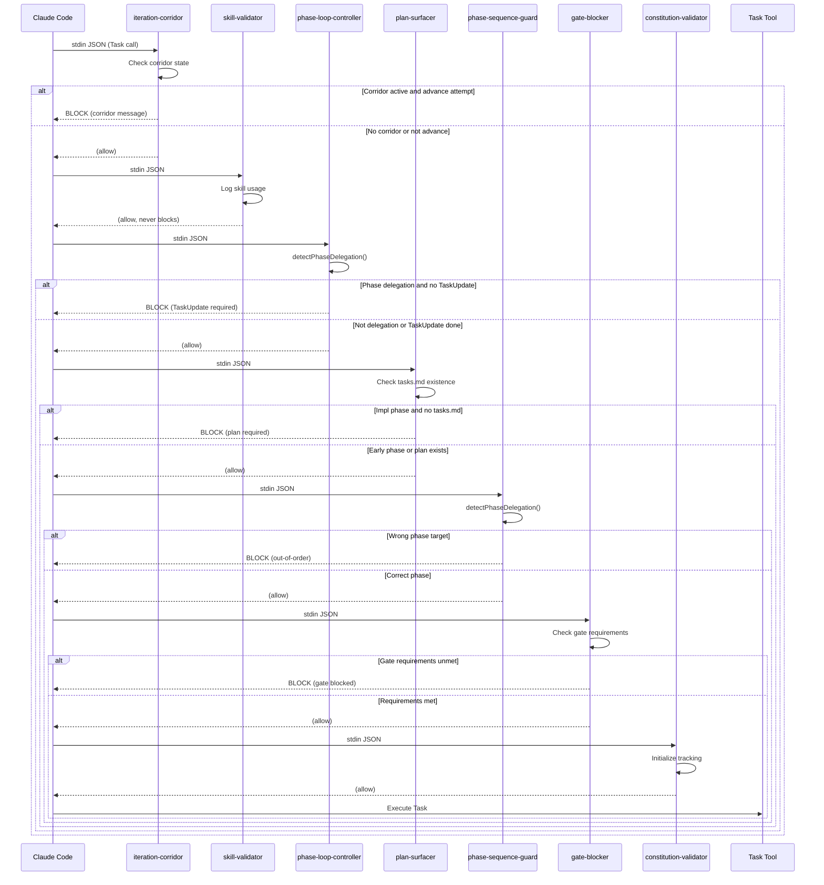
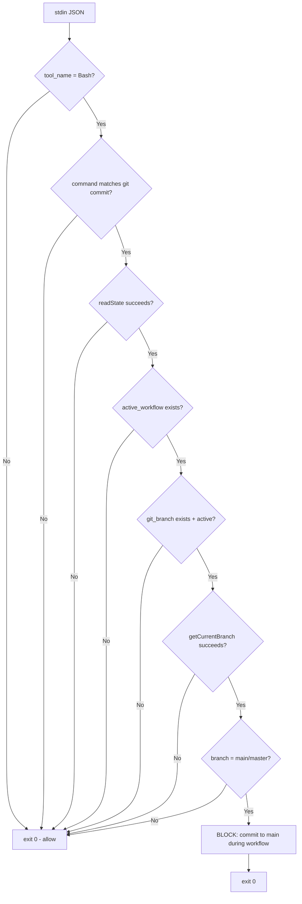
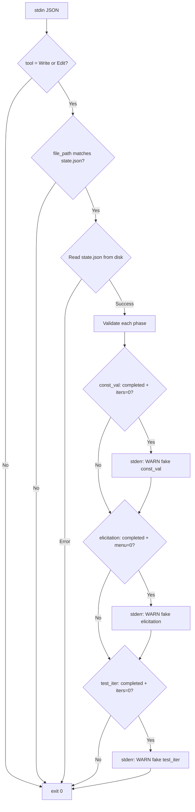

# Architecture: REQ-0004 Advisory Behavior Hooks

**Version:** 1.0
**Date:** 2026-02-08
**Status:** Proposed
**Phase:** 03-architecture
**Traces to:** requirements-spec.md (FR-01 through FR-07), nfr-matrix.md, impact-analysis.md

---

## 1. Executive Summary

This document defines the architecture for adding 7 new CJS hooks to the iSDLC framework. The hooks convert 7 advisory-only LLM prompt behaviors into deterministic, hook-enforced guarantees. The design extends the existing hook infrastructure without modifying any existing hook behavior, adding one shared utility function to `common.cjs`, three new settings.json matcher sections, and 7 new hook files with co-located tests.

The architecture follows three guiding principles:
1. **Extend, never redesign** -- the existing hook pattern (stdin JSON, stdout JSON, fail-open, CJS) is preserved exactly.
2. **Fail-open universally** -- per Article X, every error path produces no output and exits 0.
3. **Shared detection, independent execution** -- phase delegation detection is extracted into `common.cjs`; each hook is otherwise self-contained.

---

## 2. System Context

### 2.1 Hook Lifecycle in Claude Code

```
User types prompt
    |
    v
Claude Code selects a tool (Task, Bash, Skill, Write, Edit, ...)
    |
    v
[PreToolUse hooks fire sequentially]  <-- Hooks can BLOCK the tool call
    |
    v (if all allow)
Tool executes (e.g., Task spawns sub-agent, Bash runs command)
    |
    v
[PostToolUse hooks fire sequentially]  <-- Hooks can WARN but not undo
    |
    v
Claude Code receives result
    |
    v
[Stop hooks fire when Claude finishes responding]  <-- Can block response
```

### 2.2 Current Hook Registry (11 hooks)

| # | Hook | Type | Matcher | Can Block? |
|---|------|------|---------|------------|
| 1 | iteration-corridor.cjs | PreToolUse | Task, Skill | Yes |
| 2 | skill-validator.cjs | PreToolUse | Task | No (observe) |
| 3 | gate-blocker.cjs | PreToolUse | Task, Skill | Yes |
| 4 | constitution-validator.cjs | PreToolUse | Task | No (init) |
| 5 | log-skill-usage.cjs | PostToolUse | Task | No |
| 6 | menu-tracker.cjs | PostToolUse | Task | No |
| 7 | skill-delegation-enforcer.cjs | PostToolUse | Skill | No |
| 8 | test-watcher.cjs | PostToolUse | Bash | No |
| 9 | review-reminder.cjs | PostToolUse | Bash | No |
| 10 | model-provider-router.cjs | PreToolUse | Task | No (model) |
| 11 | delegation-gate.cjs | Stop | (all) | Yes |

### 2.3 New Hooks (7 hooks)

| # | Hook | Type | Matcher | Can Block? |
|---|------|------|---------|------------|
| 12 | phase-loop-controller.cjs | PreToolUse | Task | Yes |
| 13 | plan-surfacer.cjs | PreToolUse | Task | Yes |
| 14 | phase-sequence-guard.cjs | PreToolUse | Task | Yes |
| 15 | branch-guard.cjs | PreToolUse | Bash | Yes |
| 16 | state-write-validator.cjs | PostToolUse | Write, Edit | No (warn) |
| 17 | walkthrough-tracker.cjs | PostToolUse | Task | No (warn) |
| 18 | discover-menu-guard.cjs | PostToolUse | Task | No (warn) |

---

## 3. Architecture Decisions

### ADR-001: Shared Phase Delegation Detection in common.cjs

**Context:** FR-01 (phase-loop-controller) and FR-03 (phase-sequence-guard) both need to determine whether a Task tool call is a "phase delegation" -- i.e., the orchestrator delegating work to a phase agent. If each hook implements its own detection logic, the heuristics will diverge over time.

**Decision:** Extract a single `detectPhaseDelegation(parsedInput)` function into `common.cjs` that both hooks import.

**Function signature:**
```javascript
/**
 * Detect if a Task tool call is a phase delegation.
 * Examines tool_input.prompt, tool_input.description, and tool_input.subagent_type
 * for known agent names (from skills-manifest) and phase keywords.
 *
 * @param {object} parsedInput - The parsed stdin JSON (tool_name, tool_input)
 * @returns {{ isDelegation: boolean, targetPhase: string|null, agentName: string|null }}
 */
function detectPhaseDelegation(parsedInput)
```

**Detection algorithm:**
1. If `tool_name !== 'Task'`, return `{ isDelegation: false }`.
2. Extract `subagent_type` from `tool_input`. If it matches a known agent name (via `normalizeAgentName()` and `getAgentPhase()`), return the detected phase.
3. If `subagent_type` does not match, scan `prompt` and `description` for known agent names and phase keywords (e.g., `"01-requirements"`, `"requirements-analyst"`, `"phase 01"`).
4. Whitelist setup commands: if the combined text contains any `SETUP_COMMAND_KEYWORDS` (discover, constitution, init, setup, configure, status), return `{ isDelegation: false }`.
5. If no match found, return `{ isDelegation: false }`.

**Why this approach:**
- `normalizeAgentName()` already handles 30+ agent name variations (line 725 of common.cjs).
- `getAgentPhase()` already resolves agent names to phase strings.
- `loadManifest()` already loads the skills-manifest for agent lookups.
- The `SETUP_COMMAND_KEYWORDS` whitelist pattern is already used by `gate-blocker.cjs` (line 98) and `iteration-corridor.cjs` (line 37). We extract this into a shared constant.

**Consequences:**
- Positive: Single source of truth for phase delegation detection, tested once, used by multiple hooks.
- Positive: Future hooks that need phase detection can reuse the same function.
- Negative: Adds ~50 lines to common.cjs (already 1163 lines -- flagged for future split).

**Alternatives considered:**
- Inline detection in each hook: rejected -- duplication risk, inconsistency risk.
- Separate shared module (`lib/phase-detection.cjs`): rejected -- adds a new file dependency chain; common.cjs is the established shared location.

### ADR-002: Shared Setup Command Whitelist

**Context:** Three existing hooks (gate-blocker, iteration-corridor, this feature's phase-loop-controller and phase-sequence-guard) all maintain independent copies of the `SETUP_COMMAND_KEYWORDS` array. If the list changes (e.g., adding "walkthrough"), all copies must be updated independently -- a maintenance risk.

**Decision:** Extract `SETUP_COMMAND_KEYWORDS` into `common.cjs` as an exported constant.

```javascript
/**
 * Setup commands that should NEVER be blocked by enforcement hooks.
 * These run BEFORE workflows start or are configuration/status commands.
 * @type {string[]}
 */
const SETUP_COMMAND_KEYWORDS = [
    'discover', 'constitution', 'init', 'setup', 'configure',
    'configure-cloud', 'new project', 'project setup', 'install', 'status'
];
```

**Consequences:**
- Positive: Single source of truth for setup command whitelist.
- Negative: Existing hooks (gate-blocker, iteration-corridor) must be updated to import the shared constant. This is a low-risk change: replace `const SETUP_COMMAND_KEYWORDS = [...]` with `const { SETUP_COMMAND_KEYWORDS } = require('./lib/common.cjs')`. Behavior is identical.

**Implementation note:** Updating existing hooks to use the shared constant is a quality improvement but NOT a functional requirement of REQ-0004. The new hooks will use the shared constant from the start. Existing hooks can be updated in a follow-up refactoring task to avoid risk of regression in this feature scope.

### ADR-003: New Matcher Types (PreToolUse[Bash], PostToolUse[Write], PostToolUse[Edit])

**Context:** The framework currently has no PreToolUse hooks for the Bash matcher, and no PostToolUse hooks for Write or Edit matchers. FR-04 requires PreToolUse[Bash] and FR-05 requires PostToolUse[Write,Edit].

**Decision:** Add three new matcher sections to `settings.json`:
1. `PreToolUse` array: add a new entry with `"matcher": "Bash"` for `branch-guard.cjs`
2. `PostToolUse` array: add a new entry with `"matcher": "Write"` for `state-write-validator.cjs`
3. `PostToolUse` array: add a new entry with `"matcher": "Edit"` for `state-write-validator.cjs`

**Claude Code matcher behavior (verified from documentation):**
- `"matcher": "Bash"` fires the hook on every Bash tool invocation. The stdin JSON contains `tool_input.command` (the bash command string).
- `"matcher": "Write"` fires on every Write tool invocation. The stdin JSON contains `tool_input.file_path` and `tool_input.content`.
- `"matcher": "Edit"` fires on every Edit tool invocation. The stdin JSON contains `tool_input.file_path`, `tool_input.old_string`, `tool_input.new_string`.

**Stdin format for new matchers:**

For PreToolUse[Bash]:
```json
{
  "tool_name": "Bash",
  "tool_input": {
    "command": "git commit -m \"feat: add auth\""
  }
}
```

For PostToolUse[Write]:
```json
{
  "tool_name": "Write",
  "tool_input": {
    "file_path": "/path/to/.isdlc/state.json",
    "content": "{ ... }"
  },
  "tool_result": "File written successfully"
}
```

For PostToolUse[Edit]:
```json
{
  "tool_name": "Edit",
  "tool_input": {
    "file_path": "/path/to/.isdlc/state.json",
    "old_string": "...",
    "new_string": "..."
  },
  "tool_result": "Edit applied successfully"
}
```

**Risk:** If Claude Code does not support these matchers, the hooks will simply never fire (fail-open at the platform level). The feature degrades gracefully -- no crash, no blocking.

**Verification plan:** Test with a minimal hook that logs to stderr when triggered. If the hook fires, the matcher is supported.

### ADR-004: Hook Execution Order

**Context:** Claude Code executes hooks within a matcher sequentially, in the order they appear in the `settings.json` hooks array. If any PreToolUse hook blocks, subsequent hooks in that matcher do not fire. The order determines which check the user sees first when multiple violations exist.

**Decision:** The PreToolUse[Task] hooks will execute in the following order (reflecting logical priority):

```
1. iteration-corridor.cjs     (EXISTING - highest priority: active test/const iteration)
2. skill-validator.cjs         (EXISTING - observability only, never blocks)
3. phase-loop-controller.cjs   (NEW - blocks if TaskUpdate not called)
4. plan-surfacer.cjs           (NEW - blocks if tasks.md missing for impl phases)
5. phase-sequence-guard.cjs    (NEW - blocks if out-of-order phase)
6. gate-blocker.cjs            (EXISTING - blocks gate advancement)
7. constitution-validator.cjs  (EXISTING - initializes tracking, never blocks)
```

**Note:** `model-provider-router.cjs` is NOT registered in the source `settings.json`. It exists as a hook file but is not active in the default installation. If a user has registered it locally, it runs wherever they placed it -- this architecture does not modify it.

**Rationale for ordering:**
1. `iteration-corridor` first: if tests are failing, nothing else matters -- stay in the fix loop.
2. `skill-validator` next: observational hook that should always run (it never blocks).
3. `phase-loop-controller` before `plan-surfacer` before `phase-sequence-guard`: check preconditions in order of specificity (TaskUpdate called? Plan exists? Correct phase?).
4. `gate-blocker` near the end: gate checks are the final guard before phase advancement.
5. `constitution-validator` last: initialization-only hook that sets up tracking for the delegated phase.

**For PreToolUse[Bash]:**
```
1. branch-guard.cjs  (NEW - only hook in this matcher)
```

**For PostToolUse[Task]:**
```
1. log-skill-usage.cjs     (EXISTING - audit logging)
2. menu-tracker.cjs         (EXISTING - elicitation tracking)
3. walkthrough-tracker.cjs  (NEW - discover walkthrough check)
4. discover-menu-guard.cjs  (NEW - discover menu validation)
```

**For PostToolUse[Write] and PostToolUse[Edit]:**
```
1. state-write-validator.cjs  (NEW - only hook in each matcher)
```

**Consequences:**
- Positive: Clear, documented order. New blocking hooks fire before gate-blocker, giving the user specific remediation instructions.
- Negative: 7 PreToolUse[Task] hooks means up to 7 sequential executions per Task call. At 10s timeout each, worst case is 70s. Practical case: each hook runs in <50ms (file reads only), so total is <350ms.

### ADR-005: branch-guard.cjs Git Subprocess Strategy

**Context:** FR-04 requires checking the current git branch when `git commit` is detected. This requires running `git rev-parse --abbrev-ref HEAD` inside the PreToolUse hook.

**Decision:** Use `child_process.execSync()` with a 3-second timeout and `stdio: 'pipe'` to capture output. Wrap in try/catch for fail-open behavior.

```javascript
function getCurrentBranch() {
    try {
        return require('child_process')
            .execSync('git rev-parse --abbrev-ref HEAD', {
                encoding: 'utf8',
                timeout: 3000,
                stdio: ['pipe', 'pipe', 'pipe']
            })
            .trim();
    } catch (e) {
        return null; // fail-open: unknown branch means allow
    }
}
```

**Performance:** `git rev-parse --abbrev-ref HEAD` typically completes in 2-10ms. The 3-second timeout is a safety net for edge cases (e.g., network-mounted git repos).

**Alternatives considered:**
- Read `.git/HEAD` file directly: faster but does not handle detached HEAD or worktrees correctly.
- Cache the branch name: rejected -- branch can change between hook calls (user may switch branches).

### ADR-006: state-write-validator.cjs Detection Strategy

**Context:** FR-05 needs to detect when a Write or Edit tool targets `state.json`. The PostToolUse stdin includes `tool_input.file_path` for both Write and Edit tools.

**Decision:** Check `tool_input.file_path` against patterns:
1. Ends with `state.json` AND path contains `.isdlc/` or `.isdlc/projects/` -- matches both single-project and monorepo layouts.
2. If the path matches, read the file from disk and validate structural integrity.
3. Output warnings to stderr via `console.error()`, never to stdout.

**Validation rules:**
| State Subsystem | Rule | Trace |
|----------------|------|-------|
| `phases[*].constitutional_validation` | If `completed === true`, then `iterations_used >= 1` | AC-05a |
| `phases[*].iteration_requirements.interactive_elicitation` | If `completed === true`, then `menu_interactions >= 1` | AC-05b |
| `phases[*].iteration_requirements.test_iteration` | If `completed === true`, then `current_iteration >= 1` | AC-05c |

**Warning output format (stderr):**
```
[state-write-validator] WARNING: Suspicious state.json write detected.
  Phase: 01-requirements
  Issue: constitutional_validation.completed is true but iterations_used is 0
  Path: /path/to/.isdlc/state.json
```

**Why stderr, not stdout:** PostToolUse hooks that output to stdout inject text into the conversation. Validation warnings are for the developer/audit trail, not for the agent to act on. Using stderr keeps the conversation clean while logging is preserved for debugging.

---

## 4. Component Architecture

### 4.1 New Files

```
src/claude/hooks/
    phase-loop-controller.cjs      (NEW - FR-01)
    plan-surfacer.cjs              (NEW - FR-02)
    phase-sequence-guard.cjs       (NEW - FR-03)
    branch-guard.cjs               (NEW - FR-04)
    state-write-validator.cjs      (NEW - FR-05)
    walkthrough-tracker.cjs        (NEW - FR-06)
    discover-menu-guard.cjs        (NEW - FR-07)
    lib/
        common.cjs                 (MODIFIED - add detectPhaseDelegation, SETUP_COMMAND_KEYWORDS)
    tests/
        phase-loop-controller.test.cjs  (NEW)
        plan-surfacer.test.cjs          (NEW)
        phase-sequence-guard.test.cjs   (NEW)
        branch-guard.test.cjs           (NEW)
        state-write-validator.test.cjs  (NEW)
        walkthrough-tracker.test.cjs    (NEW)
        discover-menu-guard.test.cjs    (NEW)
```

### 4.2 Modified Files

```
src/claude/settings.json           (MODIFIED - register 7 new hooks, 3 new matchers)
uninstall.sh                       (MODIFIED - add 7 entries to FRAMEWORK_PATTERNS)
src/claude/hooks/lib/common.cjs    (MODIFIED - add 2 exports)
```

### 4.3 Hook Component Template

Every hook follows the same structural template (established by existing hooks):

```javascript
#!/usr/bin/env node
/**
 * iSDLC {Hook Name} - {HookType}[{Matcher}] Hook
 * {underline}
 * {Brief description}
 *
 * Performance budget: < {N}ms
 * Fail-open: any error results in silent exit (exit 0, no output)
 *
 * Version: 1.0.0
 */

const {
    readStdin,
    readState,
    outputBlockResponse,  // only for PreToolUse blocking hooks
    debugLog
} = require('./lib/common.cjs');

async function main() {
    try {
        const inputStr = await readStdin();
        if (!inputStr || !inputStr.trim()) {
            process.exit(0);  // no input -> allow
        }

        let input;
        try {
            input = JSON.parse(inputStr);
        } catch (e) {
            process.exit(0);  // bad JSON -> fail-open
        }

        // Tool name guard
        if (input.tool_name !== '{ExpectedTool}') {
            process.exit(0);
        }

        // Hook-specific logic here
        // ...

        process.exit(0);  // default: allow

    } catch (error) {
        debugLog('Error in {hook-name}:', error.message);
        process.exit(0);  // fail-open
    }
}

main();
```

---

## 5. Hook Detailed Design

### 5.1 phase-loop-controller.cjs (FR-01)

**Type:** PreToolUse[Task]
**Can block:** Yes
**Traces to:** FR-01, AC-01, AC-01a, AC-01b, AC-01c

**Flow:**

```
stdin JSON
    |
    v
Parse JSON (fail-open on error)
    |
    v
tool_name === 'Task'? -- No --> exit 0 (allow)
    |
    Yes
    v
detectPhaseDelegation(input) --> { isDelegation, targetPhase, agentName }
    |
    v
isDelegation === false? -- Yes --> exit 0 (allow non-phase Task calls)
    |
    No (it IS a phase delegation)
    v
readState() --> null? -- Yes --> exit 0 (fail-open, no state)
    |
    No
    v
state.active_workflow exists? -- No --> exit 0 (no workflow active)
    |
    Yes
    v
Check state.phases[currentPhase].status === 'in_progress'
    |
    v
status === 'in_progress'? -- Yes --> exit 0 (allow, TaskUpdate was called)
    |
    No
    v
outputBlockResponse("Phase delegation without TaskUpdate...")
exit 0
```

**State reads:**
- `active_workflow.current_phase` -- the phase we expect work on
- `phases[currentPhase].status` -- must be `"in_progress"` before delegation

**Design rationale:** The orchestrator sets `phases[currentPhase].status = "in_progress"` when it calls TaskUpdate. If this field is not set or is `"pending"`, the orchestrator skipped the TaskUpdate step. The hook blocks with a clear remediation message.

**Why check `status` instead of tracking TaskUpdate calls directly:** The existing orchestrator agent writes `phases[phase].status = "in_progress"` as part of its workflow management. This is the observable effect of TaskUpdate having been called. Tracking the Task tool call directly would require correlating PreToolUse events across invocations, which is not possible with the current hook architecture.

### 5.2 plan-surfacer.cjs (FR-02)

**Type:** PreToolUse[Task]
**Can block:** Yes
**Traces to:** FR-02, AC-02, AC-02a, AC-02b, AC-02c

**Flow:**

```
stdin JSON
    |
    v
Parse JSON (fail-open on error)
    |
    v
tool_name === 'Task'? -- No --> exit 0
    |
    Yes
    v
readState() --> null? -- Yes --> exit 0 (fail-open)
    |
    No
    v
state.active_workflow exists? -- No --> exit 0
    |
    Yes
    v
Determine current phase index in workflow phases array
    |
    v
Phase index < IMPLEMENTATION_PHASE_THRESHOLD? -- Yes --> exit 0 (early phase, plan not required)
    |
    No (implementation or later)
    v
resolveTasksPath() --> tasks.md path
    |
    v
fs.existsSync(tasksPath)? -- Yes --> exit 0 (plan exists)
    |
    No
    v
outputBlockResponse("Task plan not generated. Run generate-plan skill...")
exit 0
```

**Implementation phase threshold:**

The workflow phases array from `active_workflow.phases` defines the sequence. The "implementation phase" is identified by its phase name containing `"implementation"` or `"05-"` or by comparing the phase index against a configurable threshold.

**Design decision:** Rather than hardcoding phase names, use the workflow's `current_phase_index` compared against a threshold. The threshold is the index of the first phase that requires a plan. For the standard feature workflow, this is phase `06-implementation` (index 5 in a 0-indexed array of phases: 01-requirements, 02-impact-analysis, 03-architecture, 04-design, 05-test-strategy, 06-implementation, ...).

**However**, the simpler approach is: check if the current phase is one of the "early" phases that do NOT require a plan. The known early phases are:
- `00-quick-scan`
- `01-requirements`
- `02-impact-analysis`, `02-tracing`
- `03-architecture`
- `04-design`
- `05-test-strategy`

Any phase NOT in this list requires the plan to exist. This is more robust than index-based comparison because different workflow types may have different phase sequences.

```javascript
const EARLY_PHASES = new Set([
    '00-quick-scan',
    '01-requirements',
    '02-impact-analysis',
    '02-tracing',
    '03-architecture',
    '04-design',
    '05-test-strategy'
]);

function isEarlyPhase(phaseName) {
    return EARLY_PHASES.has(phaseName);
}
```

### 5.3 phase-sequence-guard.cjs (FR-03)

**Type:** PreToolUse[Task]
**Can block:** Yes
**Traces to:** FR-03, AC-03, AC-03a, AC-03b, AC-03c, AC-03d

**Flow:**

```
stdin JSON
    |
    v
Parse JSON (fail-open on error)
    |
    v
tool_name === 'Task'? -- No --> exit 0
    |
    Yes
    v
detectPhaseDelegation(input) --> { isDelegation, targetPhase, agentName }
    |
    v
isDelegation === false? -- Yes --> exit 0 (not a phase delegation)
    |
    No
    v
readState() --> null? -- Yes --> exit 0 (fail-open)
    |
    No
    v
state.active_workflow exists? -- No --> exit 0 (no workflow)
    |
    Yes
    v
currentPhase = active_workflow.current_phase
    |
    v
targetPhase === currentPhase? -- Yes --> exit 0 (correct phase)
    |
    No
    v
outputBlockResponse("Out-of-order phase delegation. Current: {X}, Target: {Y}")
exit 0
```

**Relationship to gate-blocker.cjs:** The gate-blocker validates workflow state at gate advancement time (when the orchestrator says "advance to next phase"). The phase-sequence-guard validates at delegation time (when the orchestrator tries to delegate work to an agent). These are complementary checks at different lifecycle points:

- `phase-sequence-guard`: "You are trying to delegate to the wrong phase agent."
- `gate-blocker`: "You are trying to advance the gate, but requirements are not met."

There is no duplication. The gate-blocker's existing line 457-469 validation checks for state mismatches between `current_phase_index` and the phases array, which is a different concern (internal consistency) than out-of-order delegation (orchestrator trying to skip ahead).

### 5.4 branch-guard.cjs (FR-04)

**Type:** PreToolUse[Bash]
**Can block:** Yes
**Traces to:** FR-04, AC-04, AC-04a, AC-04b, AC-04c, AC-04d, AC-04e

**Flow:**

```
stdin JSON
    |
    v
Parse JSON (fail-open on error)
    |
    v
tool_name === 'Bash'? -- No --> exit 0
    |
    Yes
    v
command contains /\bgit\s+commit\b/? -- No --> exit 0 (not a commit)
    |
    Yes
    v
readState() --> null? -- Yes --> exit 0 (fail-open)
    |
    No
    v
state.active_workflow exists? -- No --> exit 0 (no workflow)
    |
    Yes
    v
state.active_workflow.git_branch exists?
    AND git_branch.status === 'active'? -- No --> exit 0 (no branch tracking)
    |
    Yes
    v
getCurrentBranch() --> branch name (via git rev-parse)
    |
    v
branch === null? -- Yes --> exit 0 (fail-open, git error)
    |
    No
    v
branch === 'main' OR branch === 'master'?
    |
    Yes --> outputBlockResponse("Cannot commit to main during active workflow...")
    No  --> exit 0 (allow, on feature branch or other)
```

**Git command detection:** Reuses the same pattern as `review-reminder.cjs` (line 57): `/\bgit\s+commit\b/`. This matches `git commit`, `git commit -m`, `git commit --amend`, etc. It does NOT match `git commit-tree` (different git command).

**Additional consideration for chained commands:** The bash command may contain `&&` or `;` chains. The regex `/\bgit\s+commit\b/` will match anywhere in the command string, which is the correct behavior -- we want to block any bash invocation that includes a git commit.

### 5.5 state-write-validator.cjs (FR-05)

**Type:** PostToolUse[Write, Edit]
**Can block:** No (observational only)
**Traces to:** FR-05, AC-05, AC-05a, AC-05b, AC-05c, AC-05d, AC-05e

**Flow:**

```
stdin JSON
    |
    v
Parse JSON (fail-open on error)
    |
    v
tool_name === 'Write' OR 'Edit'? -- No --> exit 0
    |
    Yes
    v
Extract file_path from tool_input.file_path
    |
    v
file_path matches state.json pattern? -- No --> exit 0
    Pattern: /\.isdlc[\/\\](?:projects[\/\\][^\/\\]+[\/\\])?state\.json$/
    |
    Yes
    v
Read state.json from disk (the file that was just written)
    |
    v
For each phase in state.phases:
    |
    v
    Check constitutional_validation:
        completed === true AND iterations_used < 1? --> WARN
    |
    v
    Check interactive_elicitation:
        completed === true AND menu_interactions < 1? --> WARN
    |
    v
    Check test_iteration:
        completed === true AND current_iteration < 1? --> WARN
    |
    v
exit 0 (always, regardless of warnings)
```

**File path matching:**

The regex `/\.isdlc[\/\\](?:projects[\/\\][^\/\\]+[\/\\])?state\.json$/` matches:
- `.isdlc/state.json` (single-project)
- `.isdlc/projects/my-project/state.json` (monorepo)
- `.isdlc\state.json` (Windows)
- `.isdlc\projects\my-project\state.json` (Windows)

**Why read from disk instead of parsing tool_input.content:** For Write tools, `tool_input.content` contains the file content and we could parse it directly. But for Edit tools, `tool_input` contains only the old/new strings, not the full file. Reading from disk after the write is consistent for both matchers and always reflects the actual state.

**Warning output:** All warnings go to `console.error()` (stderr). The hook produces NO stdout output, so it never injects text into the Claude Code conversation. Warnings are visible only when `SKILL_VALIDATOR_DEBUG=true` is set or in hook execution logs.

### 5.6 walkthrough-tracker.cjs (FR-06)

**Type:** PostToolUse[Task]
**Can block:** No (observational only)
**Traces to:** FR-06, AC-06, AC-06a, AC-06b, AC-06c

**Flow:**

```
stdin JSON
    |
    v
Parse JSON (fail-open on error)
    |
    v
tool_name === 'Task'? -- No --> exit 0
    |
    Yes
    v
Is this a discover orchestrator completion?
    Check: tool_input.subagent_type matches 'discover-orchestrator'
    AND tool_result indicates completion (not just delegation start)
    |
    No --> exit 0
    |
    Yes
    v
readState() --> null? -- Yes --> exit 0 (fail-open)
    |
    No
    v
state.discovery_context.walkthrough_completed === true? -- Yes --> exit 0 (silent)
    |
    No
    v
console.error("[walkthrough-tracker] WARNING: Discovery completed without constitution walkthrough")
exit 0
```

**Discover completion detection:** The hook fires on every PostToolUse[Task]. To determine if this specific task was a discover orchestrator completion, check:
1. `tool_input.subagent_type` contains "discover" (using normalizeAgentName if needed)
2. `tool_result` is not empty/null (indicating the task completed, not just started)

This is intentionally a broad match. False positives (warning when discover is still in progress) are acceptable because the warning is observational only.

### 5.7 discover-menu-guard.cjs (FR-07)

**Type:** PostToolUse[Task]
**Can block:** No (observational only)
**Traces to:** FR-07, AC-07, AC-07a, AC-07b, AC-07c

**Flow:**

```
stdin JSON
    |
    v
Parse JSON (fail-open on error)
    |
    v
tool_name === 'Task'? -- No --> exit 0
    |
    Yes
    v
Is this a discover delegation?
    Check: tool_input or tool_result contains discover-related content
    |
    No --> exit 0
    |
    Yes
    v
Extract text from tool_result (string or JSON.stringify)
    |
    v
Check for correct menu markers:
    REQUIRED (all 3): "New Project", "Existing Project", "Chat" or "Explore"
    FORBIDDEN: "Scoped Analysis", "Auto-detect" (as standalone option)
    |
    v
Correct menu detected? -- Yes --> exit 0 (silent)
    |
    No (wrong menu)
    v
console.error("[discover-menu-guard] WARNING: Incorrect discover menu detected")
exit 0
```

**Menu detection patterns:**

```javascript
const REQUIRED_OPTIONS = [
    /new\s+project/i,
    /existing\s+project/i,
    /chat|explore/i
];

const FORBIDDEN_OPTIONS = [
    /scoped\s+analysis/i,
    /auto[- ]?detect/i  // only when presented as a standalone menu option
];
```

A correct menu must match ALL required patterns and NONE of the forbidden patterns. If the text is too short (<50 characters) or does not appear to be a menu (no numbered options detected), skip validation entirely -- the task may not be a menu presentation.

---

## 6. common.cjs Additions

### 6.1 New Exports

```javascript
// New exports to add to common.cjs module.exports:
module.exports = {
    // ... existing exports ...

    // Phase delegation detection (REQ-0004)
    detectPhaseDelegation,
    SETUP_COMMAND_KEYWORDS,

    // Utility: check if text contains any setup keywords
    isSetupCommand
};
```

### 6.2 detectPhaseDelegation Implementation

```javascript
/**
 * Detect if a Task tool call is a phase delegation.
 *
 * @param {object} parsedInput - Parsed stdin JSON { tool_name, tool_input }
 * @returns {{ isDelegation: boolean, targetPhase: string|null, agentName: string|null }}
 */
function detectPhaseDelegation(parsedInput) {
    if (!parsedInput || parsedInput.tool_name !== 'Task') {
        return { isDelegation: false, targetPhase: null, agentName: null };
    }

    const toolInput = parsedInput.tool_input || {};
    const subagentType = (toolInput.subagent_type || '').trim();
    const prompt = (toolInput.prompt || '');
    const description = (toolInput.description || '');
    const combined = (prompt + ' ' + description).toLowerCase();

    // Check setup command whitelist first
    if (isSetupCommand(combined)) {
        return { isDelegation: false, targetPhase: null, agentName: null };
    }

    // Try 1: Match subagent_type against known agent names
    if (subagentType) {
        const normalized = normalizeAgentName(subagentType);
        const phase = getAgentPhase(normalized);
        if (phase && phase !== 'all' && phase !== 'setup') {
            return { isDelegation: true, targetPhase: phase, agentName: normalized };
        }
    }

    // Try 2: Scan prompt/description for agent names or phase patterns
    const manifest = loadManifest();
    if (manifest && manifest.ownership) {
        for (const [agentName, info] of Object.entries(manifest.ownership)) {
            if (info.phase === 'all' || info.phase === 'setup') continue;
            if (combined.includes(agentName.toLowerCase())) {
                return { isDelegation: true, targetPhase: info.phase, agentName: agentName };
            }
        }
    }

    // Try 3: Match phase name patterns in text
    const phasePattern = /(?:phase\s+)?(\d{2})-([a-z-]+)/i;
    const phaseMatch = combined.match(phasePattern);
    if (phaseMatch) {
        const phaseName = `${phaseMatch[1]}-${phaseMatch[2]}`;
        return { isDelegation: true, targetPhase: phaseName, agentName: null };
    }

    return { isDelegation: false, targetPhase: null, agentName: null };
}

/**
 * Check if text contains setup command keywords (should never be blocked).
 * @param {string} text - Text to check (should be lowercase)
 * @returns {boolean} True if the text contains a setup command keyword
 */
function isSetupCommand(text) {
    if (!text) return false;
    const lower = text.toLowerCase();
    return SETUP_COMMAND_KEYWORDS.some(keyword => lower.includes(keyword));
}
```

### 6.3 Estimated Impact on common.cjs

| Change | Lines |
|--------|-------|
| `SETUP_COMMAND_KEYWORDS` constant | 5 |
| `detectPhaseDelegation()` function | 40 |
| `isSetupCommand()` function | 8 |
| JSDoc comments | 12 |
| Module.exports additions | 3 |
| **Total additions** | **~68 lines** |

common.cjs will grow from ~1163 to ~1231 lines. This is within acceptable bounds but reinforces the existing backlog item to split common.cjs when natural seams emerge.

---

## 7. settings.json Registration Plan

### 7.1 Current Structure (simplified)

```json
{
  "hooks": {
    "PreToolUse": [
      { "matcher": "Task", "hooks": [...4 hooks...] },
      { "matcher": "Skill", "hooks": [...2 hooks...] }
    ],
    "PostToolUse": [
      { "matcher": "Task", "hooks": [...2 hooks...] },
      { "matcher": "Skill", "hooks": [...1 hook...] },
      { "matcher": "Bash", "hooks": [...2 hooks...] }
    ],
    "Stop": [
      { "hooks": [...1 hook...] }
    ]
  }
}
```

### 7.2 Target Structure (after REQ-0004)

```json
{
  "hooks": {
    "PreToolUse": [
      {
        "matcher": "Task",
        "hooks": [
          { "command": "node .../iteration-corridor.cjs", "timeout": 10000 },
          { "command": "node .../skill-validator.cjs", "timeout": 10000 },
          { "command": "node .../phase-loop-controller.cjs", "timeout": 10000 },
          { "command": "node .../plan-surfacer.cjs", "timeout": 10000 },
          { "command": "node .../phase-sequence-guard.cjs", "timeout": 10000 },
          { "command": "node .../gate-blocker.cjs", "timeout": 10000 },
          { "command": "node .../constitution-validator.cjs", "timeout": 10000 }
        ]
      },
      {
        "matcher": "Skill",
        "hooks": [
          { "command": "node .../iteration-corridor.cjs", "timeout": 10000 },
          { "command": "node .../gate-blocker.cjs", "timeout": 10000 }
        ]
      },
      {
        "matcher": "Bash",
        "hooks": [
          { "command": "node .../branch-guard.cjs", "timeout": 10000 }
        ]
      }
    ],
    "PostToolUse": [
      {
        "matcher": "Task",
        "hooks": [
          { "command": "node .../log-skill-usage.cjs", "timeout": 5000 },
          { "command": "node .../menu-tracker.cjs", "timeout": 5000 },
          { "command": "node .../walkthrough-tracker.cjs", "timeout": 5000 },
          { "command": "node .../discover-menu-guard.cjs", "timeout": 5000 }
        ]
      },
      {
        "matcher": "Skill",
        "hooks": [
          { "command": "node .../skill-delegation-enforcer.cjs", "timeout": 5000 }
        ]
      },
      {
        "matcher": "Bash",
        "hooks": [
          { "command": "node .../test-watcher.cjs", "timeout": 10000 },
          { "command": "node .../review-reminder.cjs", "timeout": 5000 }
        ]
      },
      {
        "matcher": "Write",
        "hooks": [
          { "command": "node .../state-write-validator.cjs", "timeout": 5000 }
        ]
      },
      {
        "matcher": "Edit",
        "hooks": [
          { "command": "node .../state-write-validator.cjs", "timeout": 5000 }
        ]
      }
    ],
    "Stop": [
      {
        "hooks": [
          { "command": "node .../delegation-gate.cjs", "timeout": 5000 }
        ]
      }
    ]
  }
}
```

### 7.3 Change Summary

| Section | Before | After | Change |
|---------|--------|-------|--------|
| PreToolUse[Task] | 4 hooks | 7 hooks | +3 (phase-loop-controller, plan-surfacer, phase-sequence-guard) |
| PreToolUse[Skill] | 2 hooks | 2 hooks | No change |
| PreToolUse[Bash] | Not present | 1 hook | NEW section (branch-guard) |
| PostToolUse[Task] | 2 hooks | 4 hooks | +2 (walkthrough-tracker, discover-menu-guard) |
| PostToolUse[Skill] | 1 hook | 1 hook | No change |
| PostToolUse[Bash] | 2 hooks | 2 hooks | No change |
| PostToolUse[Write] | Not present | 1 hook | NEW section (state-write-validator) |
| PostToolUse[Edit] | Not present | 1 hook | NEW section (state-write-validator) |
| Stop | 1 hook | 1 hook | No change |
| **Total registrations** | **12** | **20** | **+8** |
| **Unique hook files** | **11** | **18** | **+7** |

Note: `model-provider-router.cjs` exists as a hook file but is NOT registered in `src/claude/settings.json`. It may be registered in user-level settings. This architecture does not register it -- it is excluded from the ordering and count above.

---

## 8. Hook Interaction Matrix

This matrix shows which hooks can potentially interact (fire on the same tool call) and how they relate.

### 8.1 PreToolUse[Task] Interactions

All 7 PreToolUse[Task] hooks fire on every Task tool call. The first hook to block stops execution of subsequent hooks.

| Hook | Blocks? | Reads State? | Writes State? | Interaction Notes |
|------|---------|-------------|---------------|-------------------|
| iteration-corridor | Yes | Yes | No | Blocks if in TEST/CONST corridor |
| skill-validator | No | Yes | Yes (log) | Observe-only, never conflicts |
| phase-loop-controller | Yes | Yes | No | Blocks if phase status not in_progress |
| plan-surfacer | Yes | Yes | No | Blocks if tasks.md missing for impl+ |
| phase-sequence-guard | Yes | Yes | No | Blocks if target phase != current |
| gate-blocker | Yes | Yes | Yes | Blocks gate advancement if requirements unmet |
| constitution-validator | No | Yes | Yes | Initializes tracking, never blocks |

**Critical ordering constraint:** `iteration-corridor` must fire first. If tests are failing (TEST_CORRIDOR active), the agent must fix tests -- not be told about missing TaskUpdate or wrong phase. The corridor message is more actionable.

**No write conflicts:** Only `skill-validator` and `constitution-validator` write to state, and they write to different subsystems (`skill_usage_log` vs `phases[*].constitutional_validation`). No race condition risk because hooks execute sequentially.

**Performance estimate:** 7 PreToolUse[Task] hooks means up to 7 sequential executions per Task call. At 10s timeout each, worst case is 70s. Practical case: each hook runs in <50ms (file reads only), so total is <350ms.

### 8.2 PreToolUse[Bash] Interactions

Only `branch-guard` in this matcher. No interaction concerns.

### 8.3 PostToolUse[Task] Interactions

| Hook | Writes State? | Reads State? | Interaction Notes |
|------|---------------|-------------|-------------------|
| log-skill-usage | Yes (log) | Yes | Appends to skill_usage_log |
| menu-tracker | Yes | Yes | Updates interactive_elicitation |
| walkthrough-tracker | No | Yes | Reads discovery_context only |
| discover-menu-guard | No | No | Reads stdin only |

**Ordering consideration:** `log-skill-usage` should fire first to ensure the skill usage is logged before other hooks run. This preserves the existing behavior (it is currently the first PostToolUse[Task] hook).

### 8.4 PostToolUse[Write/Edit] Interactions

Only `state-write-validator` in these matchers. No interaction concerns.

### 8.5 Cross-Matcher Interactions

| Scenario | Hooks Involved | Concern |
|----------|---------------|---------|
| `git commit` on main during workflow | PreToolUse[Bash]: branch-guard blocks. PostToolUse[Bash]: review-reminder and test-watcher do NOT fire (blocked pre-tool). | No conflict: if branch-guard blocks, the Bash tool never executes, so PostToolUse never fires. |
| Task delegation to wrong phase | PreToolUse[Task]: phase-sequence-guard blocks. | Other PreToolUse[Task] hooks may have already allowed. No issue: earlier hooks checked their own concerns. |
| Write to state.json with fake data | PostToolUse[Write]: state-write-validator warns to stderr. | The write already happened. Warning is logged. Gate-blocker will catch the fake data at gate time. Defense in depth. |

---

## 9. State.json Extensions

### 9.1 No New Top-Level Fields Required

The 7 new hooks read existing state.json fields. No new top-level fields are needed.

**Fields read by new hooks:**

| Hook | State Path | Purpose |
|------|-----------|---------|
| phase-loop-controller | `active_workflow.current_phase` | Determine current phase |
| phase-loop-controller | `phases[phase].status` | Check if TaskUpdate was called |
| plan-surfacer | `active_workflow.current_phase` | Determine current phase |
| plan-surfacer | `active_workflow.phases` | Determine phase sequence |
| phase-sequence-guard | `active_workflow.current_phase` | Compare against target |
| phase-sequence-guard | `active_workflow.phases` | Validate phase exists |
| branch-guard | `active_workflow.git_branch` | Check branch tracking |
| state-write-validator | `phases[*].*` | Validate structural integrity |
| walkthrough-tracker | `discovery_context.walkthrough_completed` | Check walkthrough done |
| discover-menu-guard | (none - reads stdin only) | -- |

### 9.2 Expected active_workflow.git_branch Structure

The `branch-guard.cjs` hook reads `active_workflow.git_branch`. This field is written by the orchestrator when it creates a feature branch. Expected structure:

```json
{
  "active_workflow": {
    "git_branch": {
      "name": "feature/REQ-0004-advisory-behavior-hooks",
      "status": "active",
      "created_at": "2026-02-08T20:00:00Z"
    }
  }
}
```

**If this field does not exist** (older workflows or workflows without branch management), the hook allows the commit (fail-open). This ensures backward compatibility with existing workflows.

---

## 10. Test Architecture

### 10.1 Test Pattern

All tests follow the established pattern from `review-reminder.test.cjs`:

1. **Test runner:** `node:test` (Article II requirement)
2. **File format:** CJS (`.test.cjs`)
3. **Location:** `src/claude/hooks/tests/`
4. **Isolation:** Each test creates a temporary directory with `.isdlc/state.json` and cleans up after
5. **Execution:** Run hooks as subprocess via `child_process.execSync` with piped stdin
6. **Assertions:** `node:assert/strict`

### 10.2 Test Helper Pattern

```javascript
const { describe, it, beforeEach, afterEach } = require('node:test');
const assert = require('node:assert/strict');
const fs = require('fs');
const path = require('path');
const { execSync } = require('child_process');

const HOOK_PATH = path.join(__dirname, '..', '{hook-name}.cjs');

function setupTestEnv() {
    const tmpDir = fs.mkdtempSync(path.join(require('os').tmpdir(), '{hook}-test-'));
    const isdlcDir = path.join(tmpDir, '.isdlc');
    fs.mkdirSync(isdlcDir, { recursive: true });
    return tmpDir;
}

function writeState(tmpDir, state) {
    fs.writeFileSync(
        path.join(tmpDir, '.isdlc', 'state.json'),
        JSON.stringify(state, null, 2)
    );
}

function runHook(tmpDir, stdinJson) {
    const stdinStr = typeof stdinJson === 'string' ? stdinJson : JSON.stringify(stdinJson);
    try {
        const result = execSync(
            `echo '${stdinStr.replace(/'/g, "\\'")}' | node "${HOOK_PATH}"`,
            {
                cwd: tmpDir,
                env: { ...process.env, CLAUDE_PROJECT_DIR: tmpDir },
                encoding: 'utf8',
                timeout: 5000
            }
        );
        return { stdout: result.trim(), exitCode: 0 };
    } catch (e) {
        return { stdout: (e.stdout || '').trim(), exitCode: e.status || 1 };
    }
}
```

### 10.3 Test Cases by Hook

#### phase-loop-controller.test.cjs (12 tests)

| # | Test | AC | Assertion |
|---|------|-----|-----------|
| T01 | Blocks phase delegation when phase status is "pending" | AC-01 | stdout contains block response |
| T02 | Blocks phase delegation when phases section is empty | AC-01 | stdout contains block response |
| T03 | Allows phase delegation when phase status is "in_progress" | AC-01 | stdout is empty |
| T04 | Allows non-phase-delegation Task calls | AC-01a | stdout is empty |
| T05 | Allows when active_workflow is null | AC-01b | stdout is empty |
| T06 | Allows when state.json is missing (fail-open) | AC-01c | stdout is empty, exit 0 |
| T07 | Allows when state.json is malformed JSON | AC-01c | stdout is empty, exit 0 |
| T08 | Allows when stdin is empty | AC-01c | stdout is empty, exit 0 |
| T09 | Allows setup commands (discover) | AC-01a | stdout is empty |
| T10 | Correctly detects agent name variations | AC-01 | stdout varies by correctness |
| T11 | Allows when no manifest exists (fail-open) | AC-01c | stdout is empty |
| T12 | Exit code is always 0 | AC-01c | exitCode === 0 |

#### plan-surfacer.test.cjs (10 tests)

| # | Test | AC | Assertion |
|---|------|-----|-----------|
| T01 | Blocks impl phase delegation when tasks.md missing | AC-02 | stdout contains block |
| T02 | Allows early phase delegation without tasks.md | AC-02a | stdout is empty |
| T03 | Allows all delegations when tasks.md exists | AC-02b | stdout is empty |
| T04 | Allows when state.json missing (fail-open) | AC-02c | stdout is empty |
| T05 | Allows when active_workflow is null | AC-02c | stdout is empty |
| T06 | Allows non-Task tool calls | AC-02c | stdout is empty |
| T07 | Blocks phase 06-implementation without tasks.md | AC-02 | stdout contains block |
| T08 | Allows phase 05-test-strategy without tasks.md | AC-02a | stdout is empty |
| T09 | Handles monorepo tasks.md path | AC-02 | correct path resolution |
| T10 | Exit code is always 0 | AC-02c | exitCode === 0 |

#### phase-sequence-guard.test.cjs (12 tests)

| # | Test | AC | Assertion |
|---|------|-----|-----------|
| T01 | Blocks delegation to wrong phase | AC-03 | stdout contains block |
| T02 | Allows delegation to correct current_phase | AC-03a | stdout is empty |
| T03 | Allows non-phase-delegation Task calls | AC-03b | stdout is empty |
| T04 | Allows when no active workflow | AC-03c | stdout is empty |
| T05 | Allows when state.json missing (fail-open) | AC-03d | stdout is empty |
| T06 | Allows when state.json malformed | AC-03d | stdout is empty |
| T07 | Allows setup commands (whitelist) | AC-03b | stdout is empty |
| T08 | Detects agent name from subagent_type | AC-03 | correct phase detection |
| T09 | Detects phase from prompt text | AC-03 | correct phase detection |
| T10 | Allows when manifest is missing (fail-open) | AC-03d | stdout is empty |
| T11 | Block message contains both current and target phase | AC-03 | message validation |
| T12 | Exit code is always 0 | AC-03d | exitCode === 0 |

#### branch-guard.test.cjs (14 tests)

| # | Test | AC | Assertion |
|---|------|-----|-----------|
| T01 | Blocks git commit on main with active branch | AC-04 | stdout contains block |
| T02 | Blocks git commit on master with active branch | AC-04 | stdout contains block |
| T03 | Allows git commit on feature branch | AC-04a | stdout is empty |
| T04 | Allows git commit when no active workflow | AC-04b | stdout is empty |
| T05 | Allows git commit when no git_branch in workflow | AC-04c | stdout is empty |
| T06 | Allows git commit when git_branch.status is not "active" | AC-04c | stdout is empty |
| T07 | Allows non-git-commit bash commands | AC-04d | stdout is empty |
| T08 | Allows git push (not commit) | AC-04d | stdout is empty |
| T09 | Allows when state.json missing (fail-open) | AC-04e | stdout is empty |
| T10 | Allows when git rev-parse fails (fail-open) | AC-04e | stdout is empty |
| T11 | Detects git commit --amend | AC-04 | correct detection |
| T12 | Detects git commit in chained commands | AC-04 | correct detection |
| T13 | Block message contains branch name | AC-04 | message includes branch |
| T14 | Exit code is always 0 | AC-04e | exitCode === 0 |

**Note:** Tests T01, T02, T03 require a real git repository in the temp directory. The test setup must run `git init` in the temp directory and configure the branch name. For T10, create a temp directory WITHOUT `git init` so `git rev-parse` fails.

#### state-write-validator.test.cjs (14 tests)

| # | Test | AC | Assertion |
|---|------|-----|-----------|
| T01 | Detects state.json write (single-project path) | AC-05 | hook runs without error |
| T02 | Detects state.json write (monorepo path) | AC-05 | hook runs without error |
| T03 | Warns on fake constitutional_validation | AC-05a | stderr contains warning |
| T04 | Warns on fake interactive_elicitation | AC-05b | stderr contains warning |
| T05 | Warns on fake test_iteration | AC-05c | stderr contains warning |
| T06 | Silent on valid constitutional_validation | AC-05a | no stderr warning |
| T07 | Silent on valid interactive_elicitation | AC-05b | no stderr warning |
| T08 | Silent on valid test_iteration | AC-05c | no stderr warning |
| T09 | Never blocks (no stdout output) | AC-05d | stdout is always empty |
| T10 | Silent on non-state.json writes | AC-05 | no output |
| T11 | Fail-open on state.json read error | AC-05e | no output, exit 0 |
| T12 | Fail-open on malformed stdin | AC-05e | no output, exit 0 |
| T13 | Handles Windows-style paths | AC-05 | correct path matching |
| T14 | Exit code is always 0 | AC-05e | exitCode === 0 |

**Note:** To capture stderr in tests, use `execSync` with `stdio: ['pipe', 'pipe', 'pipe']` and check `e.stderr` in the catch block.

#### walkthrough-tracker.test.cjs (10 tests)

| # | Test | AC | Assertion |
|---|------|-----|-----------|
| T01 | Detects discover orchestrator completion | AC-06 | hook processes task |
| T02 | Warns when walkthrough_completed is false | AC-06a | stderr contains warning |
| T03 | Warns when walkthrough_completed is missing | AC-06a | stderr contains warning |
| T04 | Silent when walkthrough_completed is true | AC-06b | no stderr warning |
| T05 | Silent on non-discover Task calls | AC-06 | no output |
| T06 | Fail-open on state.json read error | AC-06c | no output, exit 0 |
| T07 | Fail-open on malformed stdin | AC-06c | no output, exit 0 |
| T08 | Fail-open on empty stdin | AC-06c | no output, exit 0 |
| T09 | Silent when no discovery_context exists | AC-06c | no output |
| T10 | Exit code is always 0 | AC-06c | exitCode === 0 |

#### discover-menu-guard.test.cjs (10 tests)

| # | Test | AC | Assertion |
|---|------|-----|-----------|
| T01 | Detects discover Task delegation | AC-07 | hook processes task |
| T02 | Warns when old 4-option menu detected | AC-07a | stderr contains warning |
| T03 | Warns when "Scoped Analysis" option present | AC-07a | stderr contains warning |
| T04 | Silent when correct 3-option menu detected | AC-07b | no stderr warning |
| T05 | Silent on non-discover Task calls | AC-07 | no output |
| T06 | Fail-open on malformed stdin | AC-07c | no output, exit 0 |
| T07 | Fail-open on empty stdin | AC-07c | no output, exit 0 |
| T08 | Silent when output is too short for menu | AC-07b | no output |
| T09 | Handles menu text in tool_result vs tool_input | AC-07 | both locations checked |
| T10 | Exit code is always 0 | AC-07c | exitCode === 0 |

### 10.4 Test Budget Summary

| Hook | Test Count | AC Coverage | Error Paths |
|------|-----------|-------------|-------------|
| phase-loop-controller | 12 | 4/4 | 5 |
| plan-surfacer | 10 | 4/4 | 4 |
| phase-sequence-guard | 12 | 5/5 | 5 |
| branch-guard | 14 | 6/6 | 4 |
| state-write-validator | 14 | 6/6 | 4 |
| walkthrough-tracker | 10 | 4/4 | 4 |
| discover-menu-guard | 10 | 4/4 | 4 |
| **Total** | **82** | **33/33** | **30** |

All 82 tests meet NFR-04c (minimum 10 per hook). Combined with existing 41 CJS tests, the total CJS test count will be 123.

### 10.5 common.cjs Test Additions

The `detectPhaseDelegation()` and `isSetupCommand()` functions should be tested in a new or existing test file. Recommended: add to existing `common-code-review.test.cjs` or create `common-phase-detection.test.cjs`.

**Estimated tests:** 8-10 additional tests for:
- detectPhaseDelegation with known agent name in subagent_type
- detectPhaseDelegation with agent name in prompt text
- detectPhaseDelegation with phase pattern in text
- detectPhaseDelegation returns false for non-delegation
- detectPhaseDelegation returns false for setup commands
- isSetupCommand recognizes all keywords
- isSetupCommand returns false for normal text
- detectPhaseDelegation with missing manifest (fail-open)

---

## 11. Deployment and Installation

### 11.1 Installer Behavior

The existing installer (`lib/installer.js`) copies the entire `src/claude/hooks/` directory to `.claude/hooks/`. No installer changes are needed -- new `.cjs` files in the source directory are automatically deployed.

### 11.2 Uninstaller Changes

Add 7 entries to the `FRAMEWORK_PATTERNS` array in `uninstall.sh`:

```bash
FRAMEWORK_PATTERNS=(
    # ... existing patterns ...
    # Advisory behavior hooks (REQ-0004)
    "phase-loop-controller.cjs"
    "plan-surfacer.cjs"
    "phase-sequence-guard.cjs"
    "branch-guard.cjs"
    "state-write-validator.cjs"
    "walkthrough-tracker.cjs"
    "discover-menu-guard.cjs"
)
```

### 11.3 Settings.json Deployment

`settings.json` is copied from source to `.claude/settings.json` at install time. The source file (`src/claude/settings.json`) is the single source of truth for hook registration. The installer does not need to merge -- it overwrites.

---

## 12. Risk Mitigations

### 12.1 False Positive Phase Detection

**Risk:** `detectPhaseDelegation()` may incorrectly identify a non-delegation Task call as a phase delegation, blocking legitimate work.

**Mitigation:**
1. Setup command whitelist checked first -- if the task mentions "discover", "init", "setup", etc., it is never treated as a phase delegation.
2. `subagent_type` is the primary signal -- it is explicitly set by the orchestrator agent and is reliable.
3. Text scanning of `prompt`/`description` is the secondary signal -- it uses exact agent name matching from the manifest, not fuzzy keywords.
4. If in doubt, `detectPhaseDelegation` returns `{ isDelegation: false }` -- conservative, fail-open.

### 12.2 Hook Performance Cascade

**Risk:** 7 PreToolUse[Task] hooks fire sequentially. If all are slow, total latency is high.

**Mitigation:**
1. Each hook reads state.json at most once (NFR-02c).
2. No network calls in any hook.
3. `loadManifest()` in common.cjs already caches the parsed manifest (the function reads the file each time but parsing is fast for <1000 lines of YAML/JSON).
4. Measured baseline: existing 4-hook PreToolUse[Task] execution takes <200ms total. Adding 3 more hooks (each doing 1 file read) should add <150ms, for a total of <350ms.

### 12.3 PreToolUse[Bash] Matcher Compatibility

**Risk:** Claude Code may not support `PreToolUse` hooks with `"matcher": "Bash"`.

**Mitigation:**
1. The Claude Code documentation lists Bash as a valid matcher for both PreToolUse and PostToolUse.
2. The existing PostToolUse[Bash] hooks (test-watcher, review-reminder) confirm Bash matcher support at the PostToolUse level.
3. If PreToolUse[Bash] is not supported, `branch-guard.cjs` simply never fires -- fail-open at the platform level.

### 12.4 PostToolUse[Write/Edit] Stdin Format

**Risk:** The PostToolUse stdin format for Write and Edit tools may differ from the expected format.

**Mitigation:**
1. The hook checks `tool_input.file_path` which is a required parameter for both Write and Edit tools. Claude Code should include it in the PostToolUse stdin.
2. If `tool_input.file_path` is not present, the hook falls back to checking `tool_input.filePath` (camelCase variant) and then silently exits (fail-open).
3. The state-write-validator is PostToolUse and observational only -- even if detection fails, no user work is blocked.

---

## 13. Implementation Order

Based on the dependency analysis from the impact assessment:

| Step | Item | Dependencies | Estimated Effort |
|------|------|-------------|------------------|
| 1 | common.cjs: `detectPhaseDelegation()`, `SETUP_COMMAND_KEYWORDS`, `isSetupCommand()` | None | Small |
| 2 | common-phase-detection.test.cjs | Step 1 | Small |
| 3 | branch-guard.cjs + tests | common.cjs (existing) | Medium |
| 4 | plan-surfacer.cjs + tests | common.cjs (existing) | Medium |
| 5 | phase-loop-controller.cjs + tests | Step 1 (detectPhaseDelegation) | Medium |
| 6 | phase-sequence-guard.cjs + tests | Step 1 (detectPhaseDelegation) | Medium |
| 7 | state-write-validator.cjs + tests | common.cjs (existing) | Medium |
| 8 | walkthrough-tracker.cjs + tests | common.cjs (existing) | Small |
| 9 | discover-menu-guard.cjs + tests | None (reads stdin only) | Small |
| 10 | settings.json registration | Steps 3-9 (all hooks exist) | Small |
| 11 | uninstall.sh update | Step 10 | Trivial |

**Rationale:** Steps 3 and 4 (branch-guard, plan-surfacer) are independent and simple. Steps 5 and 6 (phase-loop-controller, phase-sequence-guard) depend on the shared utility from step 1. Steps 7-9 are PostToolUse observational hooks with no blocking behavior. Step 10 (settings.json) should be done last to avoid registering hooks that do not exist yet.

---

## 14. Traceability Matrix

| Requirement | Architecture Section | Hook File | Test File |
|-------------|---------------------|-----------|-----------|
| FR-01 (Phase-Loop Controller) | 5.1 | phase-loop-controller.cjs | phase-loop-controller.test.cjs |
| FR-02 (Plan Surfacer) | 5.2 | plan-surfacer.cjs | plan-surfacer.test.cjs |
| FR-03 (Phase Sequence Guard) | 5.3 | phase-sequence-guard.cjs | phase-sequence-guard.test.cjs |
| FR-04 (Branch Guard) | 5.4, ADR-005 | branch-guard.cjs | branch-guard.test.cjs |
| FR-05 (State Write Validator) | 5.5, ADR-006 | state-write-validator.cjs | state-write-validator.test.cjs |
| FR-06 (Walkthrough Tracker) | 5.6 | walkthrough-tracker.cjs | walkthrough-tracker.test.cjs |
| FR-07 (Discover Menu Guard) | 5.7 | discover-menu-guard.cjs | discover-menu-guard.test.cjs |
| NFR-01 (Fail-open) | All flow diagrams | All hooks | All test exit code assertions |
| NFR-02 (Performance) | 12.2 | All hooks | T*: timing assertions |
| NFR-03 (CJS/Node/OS) | 4.3 template | All .cjs files | CI matrix |
| NFR-04 (Testability) | 10.1-10.5 | -- | All test files |
| NFR-05 (No regressions) | 7.3, 8.1 | settings.json | Full test suite run |
| ADR-001 (Shared detection) | 6.1-6.2 | common.cjs | common-phase-detection.test.cjs |
| ADR-002 (Shared whitelist) | 6.1 | common.cjs | common-phase-detection.test.cjs |
| ADR-003 (New matchers) | 7.2 | settings.json | Matcher compatibility test |
| ADR-004 (Hook ordering) | 7.2, 8.1 | settings.json | Integration ordering test |
| ADR-005 (Git subprocess) | 5.4 | branch-guard.cjs | branch-guard.test.cjs T10 |
| ADR-006 (State detection) | 5.5 | state-write-validator.cjs | state-write-validator.test.cjs T01-T02 |

---

## 15. Open Questions

| # | Question | Status | Impact |
|---|----------|--------|--------|
| Q1 | Is `model-provider-router.cjs` registered in the source settings.json? | [RESOLVED: NO] | Not registered in source. Excluded from ordering. |
| Q2 | Does Claude Code support PreToolUse[Bash] matcher? | [ASSUMED YES] | If no, FR-04 degrades gracefully (never fires) |
| Q3 | Does PostToolUse[Write/Edit] stdin include `tool_input.file_path`? | [ASSUMED YES] | If no, FR-05 degrades gracefully (never detects) |

---

## Appendix A: Mermaid Diagrams

### A.1 Hook Execution Flow (PreToolUse[Task])



### A.2 branch-guard Flow (PreToolUse[Bash])



### A.3 state-write-validator Flow (PostToolUse[Write/Edit])


