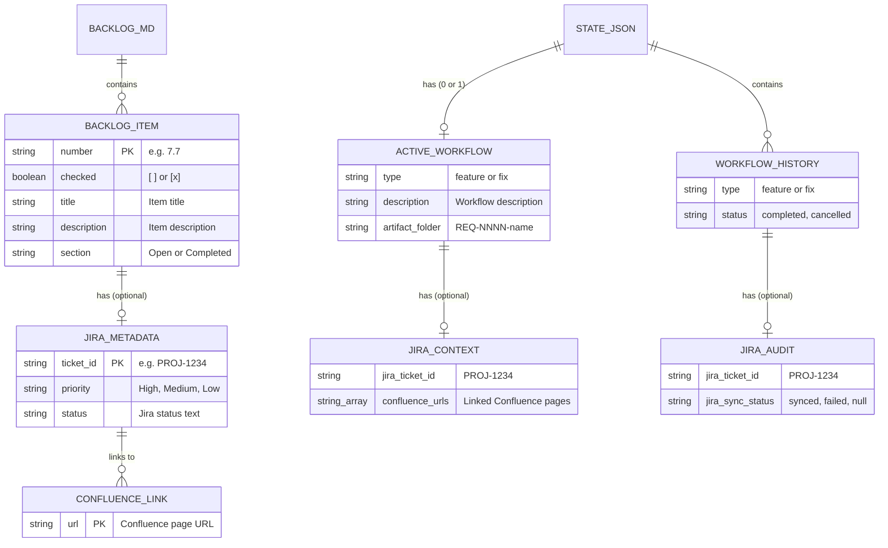

# Data Schema Design: Backlog Management Integration

**Feature:** REQ-0008-backlog-management-integration
**Phase:** 03-architecture
**Created:** 2026-02-14

---

## 1. Overview

This feature uses **file-based data storage** (no database). Data is stored across two files:

1. **BACKLOG.md** -- The curated backlog (Markdown with structured metadata)
2. **.isdlc/state.json** -- Workflow state (extended with Jira fields)

No new files are created. No database engine is used. This follows the existing iSDLC pattern (Article V).

---

## 2. BACKLOG.md Schema

### 2.1 Document Structure

```markdown
# {Project Name} - Backlog

> {Optional description}

## Open

### {Section Name}

- {N.N} [ ] {Title} -- {Description}
  - **Jira:** {TICKET-ID}           (optional)
  - **Priority:** {High|Medium|Low}  (optional)
  - **Confluence:** {URL}            (optional, repeatable)
  - **Status:** {Jira status text}   (optional)

- {N.N} [ ] {Local-only item title}

## Completed

- {N.N} [x] {Title} -- {Description}
  - **Jira:** {TICKET-ID}
  - **Completed:** {ISO date}
```

### 2.2 Item Schema

Each backlog item has the following fields:

| Field | Type | Required | Source | Example |
|-------|------|----------|--------|---------|
| `number` | string (N.N format) | Yes | Local | `7.7` |
| `checked` | boolean | Yes | Local | `false` ([ ]) / `true` ([x]) |
| `title` | string | Yes | Local or Jira | `Backlog management integration` |
| `description` | string | No | Local or Jira (truncated 200 chars) | `curated local BACKLOG.md backed by Jira` |
| `jira_ticket_id` | string | No | Jira via MCP | `PROJ-1234` |
| `priority` | enum | No | Jira via MCP | `High`, `Medium`, `Low` |
| `confluence_urls` | string[] | No | Jira linked pages via MCP | `["https://wiki.example.com/pages/spec-123"]` |
| `status` | string | No | Jira via MCP | `In Progress`, `To Do`, `Done` |
| `completed_date` | ISO date string | No | Framework (on completion) | `2026-02-14` |

### 2.3 Parsing Rules

**Item identification:** Lines matching the regex pattern:
```
/^- (\d+\.\d+) \[([ x])\] (.+)$/
```

Group captures:
- Group 1: Item number (e.g., `7.7`)
- Group 2: Check status (space = open, `x` = completed)
- Group 3: Title and description (split on ` -- ` for title/description separation)

**Metadata sub-bullets:** Indented lines (2+ spaces) matching:
```
/^\s+- \*\*(\w+):\*\* (.+)$/
```

Group captures:
- Group 1: Key (e.g., `Jira`, `Priority`, `Confluence`, `Status`)
- Group 2: Value (e.g., `PROJ-1234`, `High`, URL)

**Jira-backed detection:** An item is Jira-backed if and only if it has a `**Jira:**` sub-bullet.

### 2.4 Section Structure

| Section | Purpose | Items |
|---------|---------|-------|
| `## Open` | Active, unfinished work | `[ ]` items |
| `## Completed` | Finished work | `[x]` items |

Items within `## Open` can be further grouped by `### Subsection` headers. On completion, items are moved from their current section to `## Completed`.

---

## 3. state.json Schema Extension

### 3.1 active_workflow Extension

Two new optional fields are added to `active_workflow`:

```json
{
  "active_workflow": {
    "type": "feature",
    "description": "Backlog management integration...",
    "started_at": "2026-02-14T15:04:00Z",
    "phases": ["01-requirements", "..."],
    "current_phase": "01-requirements",
    "current_phase_index": 0,
    "phase_status": {},
    "gate_mode": "strict",
    "git_branch": {},
    "artifact_prefix": "REQ",
    "artifact_folder": "REQ-0008-backlog-management-integration",
    "counter_used": 8,

    "jira_ticket_id": "PROJ-1234",
    "confluence_urls": [
      "https://wiki.example.com/pages/spec-123"
    ]
  }
}
```

| Field | Type | Required | Default | Description |
|-------|------|----------|---------|-------------|
| `jira_ticket_id` | string or null | No | `null` (absent) | Jira ticket ID if workflow started from Jira-backed item |
| `confluence_urls` | string[] or null | No | `null` (absent) | Confluence page URLs linked to the Jira ticket |

**Absence Semantics:**
- If `jira_ticket_id` is absent or null: workflow is local-only, skip all Jira operations
- If `confluence_urls` is absent, null, or empty array: no Confluence context injection
- These fields are never present for workflows started from local-only backlog items or via direct description

### 3.2 workflow_history Extension

When a Jira-backed workflow completes and is moved to `workflow_history`, the `jira_ticket_id` is preserved for audit trail:

```json
{
  "workflow_history": [
    {
      "type": "feature",
      "description": "...",
      "status": "completed",
      "jira_ticket_id": "PROJ-1234",
      "jira_sync_status": "synced"
    }
  ]
}
```

| Field | Type | Description |
|-------|------|-------------|
| `jira_ticket_id` | string or null | Preserved from active_workflow |
| `jira_sync_status` | string or null | `"synced"`, `"failed"`, or null (local-only) |

---

## 4. Entity Relationship Diagram



---

## 5. Data Migration Strategy

**No migration required.** All changes are additive:

1. **BACKLOG.md:** Existing entries continue to work. New Jira metadata sub-bullets are parsed only when present. Absence of metadata means local-only item.

2. **state.json:** New `jira_ticket_id` and `confluence_urls` fields are optional. Existing workflows without these fields are treated as local-only. No existing field is renamed or removed.

3. **Forward compatibility:** Future adapters (Linear, GitHub Issues) would add analogous fields (e.g., `linear_issue_id`, `github_issue_url`) following the same optional-field pattern.

---

## 6. Backup and Recovery Strategy

**BACKLOG.md:**
- Tracked in git -- standard `git revert` or `git checkout -- BACKLOG.md` for recovery
- Framework never deletes items; only marks as `[x]` and moves to Completed section
- Refresh operation preserves local ordering (safe to re-run)

**state.json:**
- Not tracked in git (.gitignored) per existing convention
- `jira_ticket_id` and `confluence_urls` can be re-populated by refreshing from Jira
- `jira_sync_status` in workflow_history is informational only -- loss is not critical

---

## 7. Indexing Strategy

Not applicable -- BACKLOG.md is a small file (typically <100 items) read sequentially. No indexing needed.

state.json is a single JSON file read into memory. No indexing needed.

---

## 8. Scalability Plan

**BACKLOG.md:** Designed for a curated working set of 10-50 items. Not designed for full Jira board management (out of scope). If a user has 200+ items, they should use Jira's UI for board management and import only relevant items.

**MCP calls:** Each Jira operation is a single MCP call. Refresh operation makes N calls (one per Jira-backed item). For a typical backlog of 5-20 Jira-backed items, this is 5-20 sequential MCP calls (~2-10 seconds).

**state.json:** Adding 2 optional fields per workflow is negligible impact.
