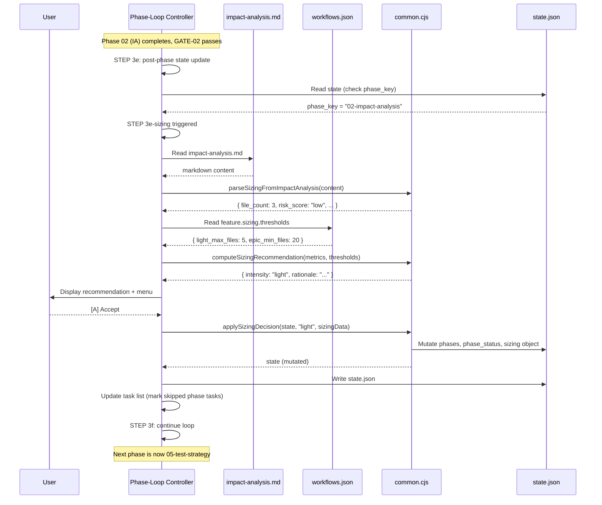
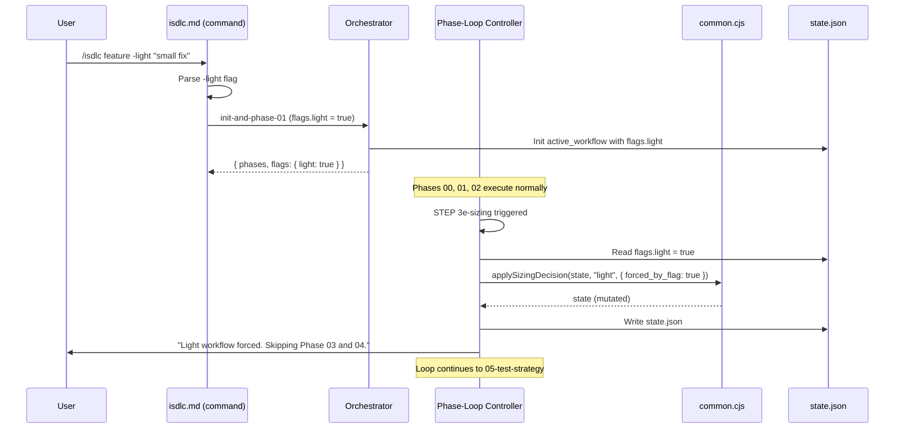

# Architecture Overview -- REQ-0011: Adaptive Workflow Sizing

**Version**: 1.0.0
**Created**: 2026-02-12
**Phase**: 03-architecture
**Status**: Approved
**Traces to**: FR-01, FR-02, FR-03, FR-04, FR-05, FR-07

---

## 1. Architecture Pattern: Plugin Insertion into Phase-Loop Controller

### Pattern Selection Rationale

The iSDLC framework uses a **Markdown-Specification Architecture** -- the Phase-Loop Controller in `isdlc.md` is a structured set of numbered steps interpreted by the LLM agent, not executable code. All existing control flow follows this pattern. Adaptive Workflow Sizing follows the same pattern for consistency (Article V: Simplicity First).

The sizing subsystem is designed as a **conditional insertion point** -- a new step (STEP 3e-sizing) spliced into the existing Phase-Loop Controller between STEP 3e (post-phase state update for Phase 02) and STEP 3f (task completion). This is analogous to how the existing STEP 3e-refine was added after Phase 04 completion.

**Why not a hook?** Hooks are Node.js CommonJS modules that run on PreToolUse/PostToolUse events. Sizing requires interactive UX (user accept/override menu) which hooks cannot do -- hooks produce JSON protocol output on stdout and cannot present menus or await user input. The Phase-Loop Controller is the correct insertion point because it runs in the LLM conversation context where user interaction is possible.

**Why not a standalone agent?** Sizing is a lightweight decision (read one file, apply thresholds, present menu). It does not warrant a full agent with its own phase. Adding it as a micro-step within the existing Phase-Loop Controller keeps complexity proportional to scope (Article V).

### Architecture Decision

- **Pattern**: Conditional micro-step insertion into Phase-Loop Controller
- **Insertion point**: STEP 3e-sizing, triggered only when `phase_key === '02-impact-analysis'` AND `workflow_type === 'feature'`
- **Pure logic extraction**: Deterministic functions (`parseSizingFromImpactAnalysis`, `computeSizingRecommendation`, `applySizingDecision`) live in `common.cjs` (executable, testable Node.js)
- **Orchestration**: Sizing UX menu and flow control live in `isdlc.md` (markdown specification)
- **Recorded in**: ADR-0001-sizing-insertion-point.md

---

## 2. Component Architecture

### 2.1 Component Diagram

```
+----------------------------------------------------------------------+
|                    Phase-Loop Controller (isdlc.md)                   |
|                                                                       |
|  STEP 3e: Post-phase state update                                    |
|       |                                                               |
|       v                                                               |
|  STEP 3e-sizing: [NEW] Sizing Decision Point                        |
|       |  (only for feature workflow, only after 02-impact-analysis)   |
|       |                                                               |
|       |---> IF -light flag set:                                      |
|       |       Call applySizingDecision(state, 'light', {forced:true}) |
|       |       Skip UX menu                                           |
|       |                                                               |
|       |---> ELSE:                                                    |
|       |       Read impact-analysis.md                                |
|       |       Call parseSizingFromImpactAnalysis(content)             |
|       |       Read thresholds from workflows.json                    |
|       |       Call computeSizingRecommendation(metrics, thresholds)   |
|       |       Present sizing UX menu                                 |
|       |       User: [A] Accept / [O] Override / [S] Show analysis    |
|       |       Call applySizingDecision(state, chosen_intensity, data) |
|       |                                                               |
|       v                                                               |
|  STEP 3f: Mark task completed, continue loop                        |
+----------------------------------------------------------------------+
         |                           |
         v                           v
+-------------------+    +---------------------------+
| common.cjs        |    | workflows.json            |
| (Utility Layer)   |    | (Configuration Layer)     |
|                   |    |                           |
| parseSizingFrom   |    | feature.sizing:           |
|  ImpactAnalysis() |    |   thresholds:             |
| computeSizing     |    |     light_max_files: 5    |
|  Recommendation() |    |     epic_min_files: 20    |
| applySizing       |    |   light_skip_phases:      |
|  Decision()       |    |     ["03-architecture",   |
+-------------------+    |      "04-design"]         |
                         | feature.options:           |
                         |   light:                   |
                         |     flag: "-light"         |
                         +---------------------------+
```

### 2.2 Component Responsibilities

| Component | Responsibility | Change Type |
|-----------|---------------|-------------|
| `isdlc.md` (Phase-Loop Controller) | Orchestrates sizing flow, presents UX menu, reads user choice, invokes utility functions, writes state | MODIFY -- add STEP 3e-sizing |
| `isdlc.md` (feature command section) | Parses `-light` flag from command arguments | MODIFY -- add flag parsing |
| `common.cjs` | Houses three pure utility functions for sizing logic | MODIFY -- add functions |
| `workflows.json` | Stores sizing thresholds and light_skip_phases config | MODIFY -- add sizing block |
| `00-sdlc-orchestrator.md` | Passes `-light` flag through init-and-phase-01 response | MODIFY -- flag propagation |
| `state-write-validator.cjs` | Allows `active_workflow.sizing` field in state validation | MODIFY -- allowlist |
| `gate-blocker.cjs` | Guards against blocking on removed phases | MODIFY -- guard clause |
| `workflow-completion-enforcer.cjs` | Handles variable-length phase arrays in snapshots | MODIFY -- defensive guard |
| `impact-analysis-orchestrator.md` | Ensures stable output format with JSON metadata block | MODIFY -- format stabilization |

---

## 3. Data Flow

### 3.1 Sizing Decision Flow (Standard Path)

```
impact-analysis.md (artifact)
       |
       | [read file content]
       v
parseSizingFromImpactAnalysis(content) --> { file_count, module_count,
       |                                      risk_score, coupling,
       |                                      coverage_gaps }
       v
workflows.json -> feature.sizing.thresholds
       |           { light_max_files: 5,
       |             epic_min_files: 20 }
       v
computeSizingRecommendation(metrics, thresholds)
       |   --> { intensity: "light"|"standard"|"epic",
       |         rationale: "...", metrics: {...} }
       v
[UX Menu: Accept / Override / Show Analysis]
       |
       v
applySizingDecision(state, intensity, sizingData)
       |   --> Mutates: active_workflow.phases
       |              active_workflow.phase_status
       |              active_workflow.sizing
       |              active_workflow.current_phase_index
       |              phases (top-level object)
       v
state.json (updated)
```

### 3.2 -light Flag Flow

```
User: /isdlc feature -light "small change"
       |
       v
isdlc.md: parse "-light" from args --> flags.light = true
       |
       v
Orchestrator: init-and-phase-01
       |  stores flags.light in active_workflow.flags
       |  returns { ..., flags: { light: true } }
       v
Phase Loop: Phases 00, 01, 02 execute normally
       |
       v
STEP 3e-sizing: detects flags.light === true
       |  --> applySizingDecision(state, 'light', { forced: true })
       |  --> Skip UX menu entirely
       v
Phase Loop continues with modified phases array
```

---

## 4. Module Design

### 4.1 New Functions in common.cjs

All three sizing functions are added to the existing `common.cjs` shared library. Rationale: these are pure utility functions with no side effects beyond state mutation, they follow the exact same pattern as existing `collectPhaseSnapshots()` and `resetPhasesForWorkflow()`, and they share common imports (`fs`, `path`). Creating a separate `sizing-utils.cjs` would be premature abstraction for 3 functions totaling ~120 lines (Article V).

**Recorded in**: ADR-0002-sizing-functions-in-common-cjs.md

#### parseSizingFromImpactAnalysis(content: string): SizingMetrics

Extracts structured sizing metrics from impact-analysis.md content.

**Strategy**: Parse the JSON metadata block at the bottom of impact-analysis.md (the ```` ```json ```` block inside the `## Impact Analysis Metadata` section). This is more reliable than parsing markdown tables. The IA agent already outputs this block with `files_directly_affected`, `modules_affected`, `risk_level`, and `blast_radius`.

**Fallback**: If no JSON metadata block is found, fall back to parsing the Executive Summary section for key values using simple regex patterns. If both fail, return null (caller handles gracefully).

```
Input:  content (string) - raw markdown content of impact-analysis.md
Output: {
  file_count: number,       // from files_directly_affected
  module_count: number,     // from modules_affected
  risk_score: string,       // "low" | "medium" | "high"
  coupling: string,         // "low" | "medium" | "high" (from blast_radius)
  coverage_gaps: number     // count of files with no test coverage
} | null
```

#### computeSizingRecommendation(metrics: SizingMetrics, thresholds: Thresholds): SizingRecommendation

Pure, deterministic function. No I/O, no side effects.

**Algorithm**:
1. If `metrics.file_count <= thresholds.light_max_files` AND `metrics.risk_score !== 'high'`: recommend `light`
2. If `metrics.file_count >= thresholds.epic_min_files` OR `metrics.risk_score === 'high'`: recommend `epic`
3. Otherwise: recommend `standard`

Note: `epic` is a recommendation only -- no execution logic exists yet (FR-06 deferred). When recommended, the sizing UX informs the user but proceeds with `standard` intensity.

```
Input:  metrics (SizingMetrics), thresholds ({ light_max_files, epic_min_files })
Output: {
  intensity: "light" | "standard" | "epic",
  rationale: string,   // human-readable explanation
  metrics: SizingMetrics  // echo back for state recording
}
```

#### applySizingDecision(state: object, intensity: string, sizingData: object): object

Mutates the state object in place (same pattern as `resetPhasesForWorkflow`, `pruneCompletedPhases`).

**Mutations** (for `intensity === 'light'`):
1. Remove `light_skip_phases` entries from `state.active_workflow.phases` array
2. Remove corresponding entries from `state.active_workflow.phase_status`
3. Remove corresponding entries from `state.phases`
4. Recalculate `state.active_workflow.current_phase_index` to point to the next phase after `02-impact-analysis` in the modified array
5. Write `state.active_workflow.sizing` = `{ intensity, file_count, module_count, risk_score, coupling, coverage_gaps, recommended_by: 'framework'|'user', overridden: boolean, overridden_to: string|null, decided_at: ISO-8601 }`

**Mutations** (for `intensity === 'standard'`):
1. No phase array changes
2. Write `state.active_workflow.sizing` (same shape as above)

**Mutations** (for `intensity === 'epic'`):
1. No phase array changes (epic execution is deferred)
2. Write `state.active_workflow.sizing` with `intensity: 'epic'` but `effective_intensity: 'standard'`
3. Add `sizing.epic_deferred: true` flag

```
Input:  state (object), intensity (string), sizingData (object)
Output: state (mutated in place, returned for chaining)
```

### 4.2 workflows.json Changes

Add a `sizing` configuration block to the `feature` workflow definition, and add a `light` option:

```json
{
  "feature": {
    "sizing": {
      "enabled": true,
      "thresholds": {
        "light_max_files": 5,
        "epic_min_files": 20
      },
      "light_skip_phases": ["03-architecture", "04-design"],
      "risk_override": {
        "high_risk_forces_standard_minimum": true
      }
    },
    "options": {
      "light": {
        "description": "Force lightweight workflow (skip architecture and design phases)",
        "default": false,
        "flag": "-light"
      }
    }
  }
}
```

### 4.3 State Schema Extension

New field: `active_workflow.sizing`

```json
{
  "active_workflow": {
    "sizing": {
      "intensity": "light",
      "effective_intensity": "light",
      "file_count": 3,
      "module_count": 1,
      "risk_score": "low",
      "coupling": "low",
      "coverage_gaps": 0,
      "recommended_by": "framework",
      "overridden": false,
      "overridden_to": null,
      "decided_at": "2026-02-12T15:30:00Z",
      "forced_by_flag": false,
      "epic_deferred": false
    }
  }
}
```

### 4.4 isdlc.md Changes

#### Feature Command Section

Add `-light` flag documentation:

```
/isdlc feature -light "description"     (force lightweight workflow)
```

Parsing: extract `-light` from args, set `flags.light = true`, pass to orchestrator.

#### STEP 3e-sizing (New Step)

Conditional step inserted after STEP 3e and before STEP 3e-refine:

```
**3e-sizing.** SIZING DECISION POINT (conditional) -- After the post-phase
state update, check if sizing should run:

**Trigger check**:
1. Read the phase key that was just completed from the state update in 3e
2. If `phase_key === '02-impact-analysis'` AND `active_workflow.type === 'feature'`:
   a. Check if `active_workflow.sizing` is NOT already set (prevent double-sizing)
   b. If not set: execute sizing (below)
   c. If already set: skip to 3e-refine

**Sizing execution**:
1. Read `active_workflow.flags.light` from state.json
2. IF `-light` flag is set:
   a. Read sizing config from workflows.json -> feature.sizing
   b. Call applySizingDecision(state, 'light', { forced_by_flag: true })
   c. Display: "Light workflow forced via -light flag. Skipping Phase 03
      (Architecture) and Phase 04 (Design)."
   d. Write state.json
   e. Skip to 3e-refine
3. ELSE (standard sizing flow):
   a. Read impact-analysis.md from docs/requirements/{artifact_folder}/
   b. Call parseSizingFromImpactAnalysis(content)
   c. If parsing fails: default to standard, log warning
   d. Read thresholds from workflows.json -> feature.sizing.thresholds
   e. Call computeSizingRecommendation(metrics, thresholds)
   f. Display sizing recommendation banner
   g. Present menu: [A] Accept / [O] Override / [S] Show full analysis
   h. Handle user choice
   i. Call applySizingDecision(state, chosen_intensity, sizingData)
   j. Write state.json
   k. If phases were removed, update task list:
      - Find removed phase tasks in the task list
      - Mark them as completed with note "(Skipped -- light workflow)"
```

---

## 5. Phase Array Modification Strategy

This is the highest-risk component (Risk Zone 1 from Impact Analysis). The strategy uses **atomic multi-field mutation** within a single state write.

### 5.1 Algorithm for Phase Removal

When `intensity === 'light'`:

```
Given:
  state.active_workflow.phases = ["00-quick-scan", "01-requirements",
    "02-impact-analysis", "03-architecture", "04-design",
    "05-test-strategy", "06-implementation", "16-quality-loop",
    "08-code-review"]
  skip_phases = ["03-architecture", "04-design"]
  current completed phase = "02-impact-analysis"

Step 1: Filter phases array
  new_phases = phases.filter(p => !skip_phases.includes(p))
  Result: ["00-quick-scan", "01-requirements", "02-impact-analysis",
           "05-test-strategy", "06-implementation", "16-quality-loop",
           "08-code-review"]

Step 2: Remove from phase_status
  for each skip_phase: delete phase_status[skip_phase]

Step 3: Remove from top-level phases object
  for each skip_phase: delete state.phases[skip_phase]

Step 4: Recalculate current_phase_index
  Find index of "02-impact-analysis" in new_phases array
  current_phase_index = that index + 1
  (Points to "05-test-strategy" which is now at index 3)

Step 5: Single state.json write
  (All mutations applied to in-memory state, then one write)
```

### 5.2 Invariant Checks

After phase array modification, the following invariants must hold:

1. `active_workflow.phases.length >= 3` (minimum viable workflow: requirements, implementation, review)
2. `active_workflow.current_phase_index < active_workflow.phases.length`
3. Every key in `active_workflow.phase_status` exists in `active_workflow.phases`
4. Every key in `state.phases` that belongs to this workflow exists in `active_workflow.phases`
5. The phase at `phases[current_phase_index]` is `pending` (not yet started)

If any invariant fails, `applySizingDecision` should log a warning and fall back to `standard` (no modification). This is the fail-safe default (Article X).

### 5.3 Task List Synchronization

When phases are removed from the workflow, the corresponding TaskCreate entries in the Phase-Loop Controller's task list become stale. STEP 3e-sizing must:

1. Use TaskList to find tasks matching the removed phases
2. Mark them as `completed` with subject updated to `~~[N] {subject} (Skipped)~~`

This keeps the user's terminal task list accurate.

---

## 6. Impact Analysis Output Format Stabilization

### 6.1 Current Format

The impact-analysis-orchestrator already outputs a JSON metadata block at the bottom of impact-analysis.md:

```json
{
  "files_directly_affected": 10,
  "modules_affected": 5,
  "blast_radius": "medium",
  "risk_level": "medium"
}
```

### 6.2 Required Format Extension

The JSON metadata block must also include `coverage_gaps` (count of files with no test coverage). This field is derived from the Risk Assessment section's Test Coverage Analysis table. If the IA agent cannot determine coverage gaps, it should default to `0`.

### 6.3 Parsing Strategy

`parseSizingFromImpactAnalysis` uses this priority order:
1. **Primary**: Parse JSON metadata block (regex: ` ```json\n{...}\n``` ` at end of file)
2. **Fallback**: Parse Executive Summary bullet points (regex for `**Affected Files**: N`)
3. **Default**: Return null -- caller defaults to `standard` intensity

**Recorded in**: ADR-0003-impact-analysis-json-metadata-parsing.md

---

## 7. Backward Compatibility

### 7.1 Existing Workflows Unaffected

- **fix**: No sizing block in fix workflow definition. STEP 3e-sizing trigger check fails (`workflow_type !== 'feature'`). Zero impact.
- **test-run, test-generate, upgrade**: Same -- no sizing block, trigger check fails.
- **feature without -light**: Sizing runs, recommends intensity, user accepts/overrides. If IA has no metadata block, defaults to `standard`. Identical behavior to current workflow.

### 7.2 `no_phase_skipping` Rule Clarification

The `rules.no_phase_skipping: true` in workflows.json means **agents cannot skip phases at runtime**. The framework itself can modify the phase array before runtime based on sizing. This semantic is clarified by:

1. Renaming the rule to `no_agent_phase_skipping` in workflows.json
2. Adding a comment: "Framework-level sizing modifications to the phase array are permitted"
3. The gate-blocker hook validates against `active_workflow.phases` (the modified array), so removed phases are never checked

**Recorded in**: ADR-0004-no-phase-skipping-semantic.md

---

## 8. Epic Intensity Handling (Deferred Execution)

When `computeSizingRecommendation` returns `intensity: 'epic'`:

1. Display recommendation: "This feature is large scope (N files, M modules, high risk). Epic decomposition is recommended but not yet implemented."
2. UX menu still shows [A] Accept / [O] Override
3. If user accepts epic: record `intensity: 'epic'`, `effective_intensity: 'standard'`, `epic_deferred: true`
4. Workflow proceeds with standard phases (no modification)
5. This preserves the architecture for future FR-06 implementation

---

## 9. Error Handling and Fail-Safe Defaults (Article X)

| Scenario | Behavior | Rationale |
|----------|----------|-----------|
| impact-analysis.md missing | Default to `standard`, log warning | Cannot size without data |
| JSON metadata block missing | Try fallback parsing, then default to `standard` | Graceful degradation |
| JSON metadata block malformed | Default to `standard`, log warning | Fail-safe |
| `parseSizingFromImpactAnalysis` returns null | Default to `standard` | Explicit default |
| `applySizingDecision` invariant check fails | Abort modification, keep `standard` | No corrupt state |
| workflows.json missing `sizing` block | Default to `standard` (no sizing prompt) | Backward compat |
| User cancels sizing menu (Ctrl+C) | Default to `standard`, proceed | Fail-safe |
| `-light` flag on non-feature workflow | Ignore flag, log warning | Only features have sizing |
| `sizing` already set in state (re-entry) | Skip sizing entirely | Prevent double-modification |

---

## 10. Sequence Diagrams

### 10.1 Standard Sizing Flow



### 10.2 -light Flag Flow



---

## 11. Testing Strategy Overview

| Function | Test Type | Location | Priority |
|----------|-----------|----------|----------|
| `parseSizingFromImpactAnalysis()` | Unit (CJS) | `common.test.cjs` | P0 |
| `computeSizingRecommendation()` | Unit (CJS) | `common.test.cjs` | P0 |
| `applySizingDecision()` | Unit (CJS) | `common.test.cjs` | P0 |
| Gate-blocker with removed phases | Unit (CJS) | `gate-blocker-ext.test.cjs` | P1 |
| Workflow-completion with short phases | Unit (CJS) | `workflow-completion-enforcer.test.cjs` | P1 |
| Full light workflow end-to-end | Manual integration | N/A | P1 |
| `-light` flag propagation | Manual integration | N/A | P1 |
| Sizing UX menu interaction | Manual integration | N/A | P1 |

Estimated new test count: 15-20 unit tests across common.cjs, gate-blocker, and workflow-completion-enforcer.

---

## 12. Traceability Matrix

| Requirement | Component(s) | ADR |
|-------------|-------------|-----|
| FR-01 (Sizing decision point) | isdlc.md STEP 3e-sizing, common.cjs parse/compute | ADR-0001 |
| FR-02 (Three intensities) | common.cjs computeSizingRecommendation, workflows.json | ADR-0002 |
| FR-03 (Sizing UX) | isdlc.md STEP 3e-sizing (UX menu section) | ADR-0001 |
| FR-04 (-light flag) | isdlc.md (command section), orchestrator, isdlc.md STEP 3e-sizing | ADR-0001 |
| FR-05 (Phase array modification) | common.cjs applySizingDecision | ADR-0002, ADR-0004 |
| FR-07 (State tracking) | common.cjs applySizingDecision, state.json schema | ADR-0002 |
| NFR-01 (Performance) | All sizing functions are synchronous file reads + pure logic | -- |
| NFR-02 (Backward compat) | Trigger check guards, workflows.json schema | ADR-0004 |
| NFR-03 (No new deps) | All implementations use Node.js built-ins only | -- |
| NFR-04 (Constitutional) | All articles validated in self-validation | -- |
