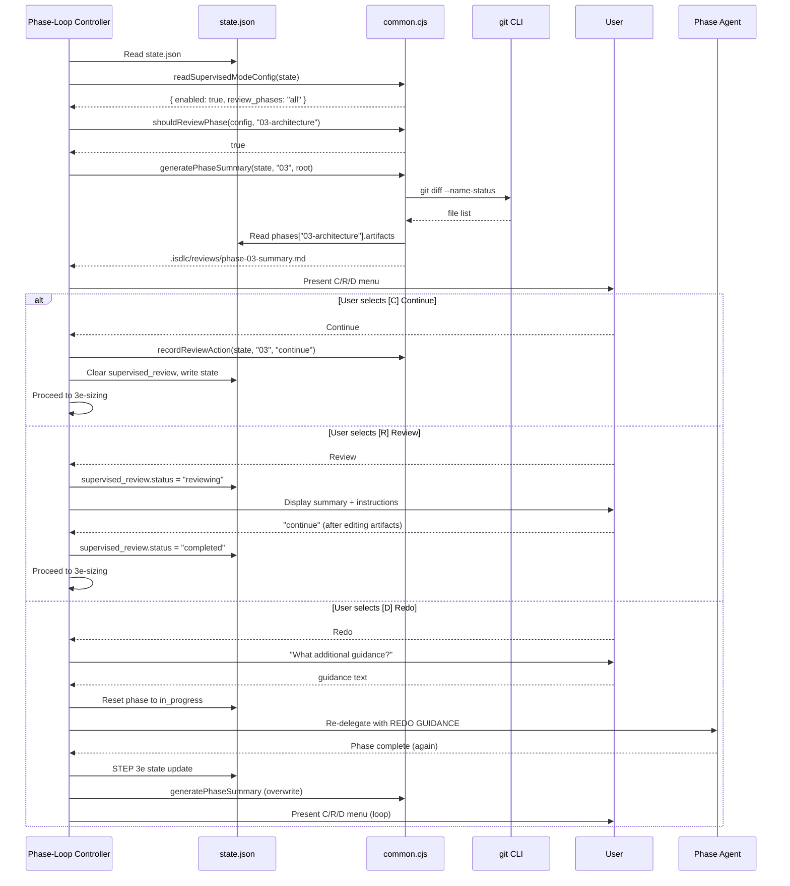

# Architecture Overview: REQ-0013 Supervised Mode

**Phase**: 03-architecture
**Version**: 1.0.0
**Created**: 2026-02-14
**Status**: Accepted
**Traces To**: REQ-013-FR-01 through FR-08, NFR-013-01 through NFR-06

---

## 1. Executive Summary

Supervised mode is a **configuration-driven gate enhancement** to the existing phase-loop controller. It inserts a conditional review checkpoint (STEP 3e-review) between phase completion and the next phase start, allowing users to review, edit, or redo phase output. The architecture follows three guiding principles:

1. **Extend, do not redesign**: All changes modify existing files (isdlc.md, gate-blocker.cjs, common.cjs, workflows.json, sdlc-orchestrator.md). No new agents, hooks, phases, or npm dependencies.
2. **Fail-open by default**: Missing or corrupt `supervised_mode` config silently falls back to autonomous mode. (Article X, NFR-013-02)
3. **State-driven behavior**: The `supervised_mode` config block in state.json drives all behavior, following the established `code_review.enabled` pattern. (Article IV, CON-013-04)

**Blast Radius**: MEDIUM (8-10 files, 4 modules)
**Architectural Risk**: MEDIUM (isdlc.md complexity, session recovery)
**New Dependencies**: None (NFR-013-06)

---

## 2. Architecture Pattern

### 2.1 Pattern: Interceptor at Phase Boundary

This feature uses the **Interceptor pattern** -- a conditional logic block inserted at a well-defined boundary point in the existing phase-loop controller. It is NOT a new phase, hook, or agent. It is a conditional step within the existing STEP 3 loop.

**Why this pattern**:
- The review gate is a phase boundary behavior, not a standalone concern (CON-013-02)
- The phase-loop controller already manages the phase sequence, state updates, and user interaction (AskUserQuestion for blockers)
- Adding a new hook would create coupling between hook execution order and review timing
- Adding a new phase would break workflow definitions and phase-sequence guards

**Alternative considered**: Hook-based approach (a new PreToolUse hook that intercepts phase delegation). Rejected because hooks cannot present interactive menus or wait for user input -- they return allow/block decisions only.

### 2.2 Integration Point Selection

**Decision**: Insert STEP 3e-review AFTER STEP 3e (post-phase state update) and BEFORE STEP 3e-sizing.

```
Current Flow:
  3d. DIRECT PHASE DELEGATION
  3e. POST-PHASE STATE UPDATE
  3e-sizing. SIZING DECISION POINT (conditional, Phase 02 only)
  3e-refine. TASK REFINEMENT (conditional, Phase 04 only)
  3f. Check result status

New Flow:
  3d. DIRECT PHASE DELEGATION
  3e. POST-PHASE STATE UPDATE
  3e-review. SUPERVISED REVIEW GATE (conditional)    <-- NEW
  3e-sizing. SIZING DECISION POINT (conditional)
  3e-refine. TASK REFINEMENT (conditional)
  3f. Check result status
```

**Rationale** (traces to AC-07a):
1. After 3e ensures phase state is committed -- summary generation reads accurate `phases[key].artifacts`, `phases[key].started`, and `phases[key].completed` timestamps.
2. Before 3e-sizing ensures the user can review Phase 02's impact analysis BEFORE the sizing recommendation is presented. This preserves user control: they see the raw analysis, can redo if needed, and THEN see the sizing recommendation. (Risk Zone 1 from impact analysis)
3. Before 3e-refine ensures the user can review Phase 04's design output BEFORE task refinement occurs. This prevents refined tasks from being generated against unreviewed design artifacts.
4. The redo mechanism naturally re-enters at STEP 3d (re-delegation), flows through 3e (state update), and re-enters 3e-review (re-present menu) -- no special loop construct needed.

### 2.3 Redo Re-delegation Mechanism

When the user selects [D] Redo, the controller must re-run the same phase agent. The mechanism:

1. Reset `phases[phase_key].status` = `"in_progress"` (AC-05e)
2. Reset `active_workflow.phase_status[phase_key]` = `"in_progress"`
3. Construct the delegation prompt: original prompt + `REDO GUIDANCE: {user text}` (AC-05b)
4. Re-delegate to the same agent via Task tool (same as STEP 3d)
5. On return, re-execute STEP 3e (post-phase state update) -- this sets status back to `"completed"`
6. Increment `redo_count` in `supervised_review`
7. Regenerate summary (overwrites previous, AC-05c)
8. Re-present the Continue/Review/Redo menu (or Continue/Review if redo_count >= 3, AC-05d)

This means the redo is essentially "re-entering the STEP 3d-3e-3e-review sequence" with the phase already activated. No special redo step is needed -- the existing delegation and state update machinery handles it.

**Circuit breaker**: Maximum 3 redo attempts per phase (NFR-013-05). Tracked in `active_workflow.supervised_review.redo_count`. After 3, the [D] option is removed from the menu.

---

## 3. Component Architecture

### 3.1 Component Diagram (C4 Level 2)

```
+------------------------------------------------------------------+
|  Phase-Loop Controller (isdlc.md)                                 |
|                                                                    |
|  STEP 3d: Phase Delegation                                        |
|      |                                                             |
|      v                                                             |
|  STEP 3e: Post-Phase State Update                                 |
|      |                                                             |
|      v                                                             |
|  STEP 3e-review: Supervised Review Gate (NEW)                     |
|      |--- reads --> supervised_mode config (state.json)            |
|      |--- calls --> shouldReviewPhase(config, phaseKey)            |
|      |--- calls --> generatePhaseSummary(state, phaseKey, root)    |
|      |--- uses ---> AskUserQuestion (C/R/D menu)                  |
|      |--- calls --> recordReviewAction(state, phaseKey, action)    |
|      |--- [D] redo loops back to STEP 3d                          |
|      |                                                             |
|      v                                                             |
|  STEP 3e-sizing: Sizing Decision Point                            |
|  STEP 3e-refine: Task Refinement                                  |
|  STEP 3f: Result Check                                            |
+------------------------------------------------------------------+
         |                          |
         v                          v
+-------------------+    +-------------------+
| common.cjs        |    | gate-blocker.cjs  |
| (4 new functions) |    | (supervised check)|
+-------------------+    +-------------------+
| readSupervisedModeConfig()  | check() -- modified to
| shouldReviewPhase()         | defer auto-advance when
| generatePhaseSummary()      | supervised_mode.enabled
| recordReviewAction()        | and phase in review_phases
+-------------------+    +-------------------+
         |                          |
         v                          v
+---------------------------------------------------+
| state.json                                         |
|                                                     |
| supervised_mode: { enabled, review_phases,          |
|                    parallel_summary,                |
|                    auto_advance_timeout }           |
| active_workflow.supervised_review: { phase, status, |
|                    paused_at, resumed_at,           |
|                    redo_count }                     |
| active_workflow.review_history: [...]              |
+---------------------------------------------------+
         |
         v
+---------------------------------------------------+
| .isdlc/reviews/phase-{NN}-summary.md (ephemeral)  |
+---------------------------------------------------+
```

### 3.2 Component Responsibilities

| Component | Responsibility | Traces To |
|-----------|---------------|-----------|
| **isdlc.md STEP 3e-review** | Orchestrates the review gate: reads config, conditionally generates summary, presents menu, handles C/R/D, manages redo loop | FR-03, FR-04, FR-05, FR-07 |
| **common.cjs: readSupervisedModeConfig()** | Reads and validates `supervised_mode` from state.json. Returns normalized config with fail-open defaults. | FR-01, NFR-02 |
| **common.cjs: shouldReviewPhase()** | Determines if a given phase key should trigger a review gate based on config | FR-01 (AC-01d, AC-01e, AC-01f) |
| **common.cjs: generatePhaseSummary()** | Generates `.isdlc/reviews/phase-{NN}-summary.md` with phase metadata, artifacts, decisions, diffs | FR-02 |
| **common.cjs: recordReviewAction()** | Appends a review action entry to `active_workflow.review_history` | FR-08 |
| **gate-blocker.cjs (modified)** | When supervised_mode is active and phase is in review_phases, ensures gate-blocker does not auto-advance past the review gate | FR-06 |
| **sdlc-orchestrator.md (modified)** | Parses `--supervised` flag during init; preserves `review_history` during finalize | FR-01, FR-08 |
| **workflows.json (modified)** | Adds `supervised` option to feature and fix workflow definitions | FR-01 |

---

## 4. Data Architecture

### 4.1 State Schema: supervised_mode Config Block

Added as a top-level key in `.isdlc/state.json`, following the `code_review` pattern:

```json
{
  "supervised_mode": {
    "enabled": false,
    "review_phases": "all",
    "parallel_summary": true,
    "auto_advance_timeout": null
  }
}
```

**Field Specifications**:

| Field | Type | Default | Description | Traces To |
|-------|------|---------|-------------|-----------|
| `enabled` | boolean | `false` | Master toggle. `false` or missing = autonomous mode. | AC-01a, AC-01b, AC-01c |
| `review_phases` | `"all"` or `string[]` | `"all"` | Which phases trigger review gates. Array entries are phase number prefixes (e.g., `"03"`, `"04"`, `"06"`). | AC-01d, AC-01e |
| `parallel_summary` | boolean | `true` | Whether to generate full summary (true) or minimal summary (false). | AC-01g, AC-01h |
| `auto_advance_timeout` | number or null | `null` | Reserved for future use (CON-013-05). NOT implemented in v1. | -- |

**Validation Rules** (in `readSupervisedModeConfig()`):
- If `supervised_mode` key is missing: return `{ enabled: false }` (fail-open, AC-01c)
- If `supervised_mode` is not an object: return `{ enabled: false }` (fail-open, NFR-02)
- If `enabled` is not a boolean: treat as `false`
- If `review_phases` is not `"all"` and not an array: treat as `"all"`
- If `review_phases` is an array: filter to valid phase number strings, silently ignore invalid entries (AC-01f)
- If `parallel_summary` is not a boolean: treat as `true`

### 4.2 State Schema: supervised_review (Active Review State)

Added to `active_workflow` during an active review gate:

```json
{
  "active_workflow": {
    "supervised_review": {
      "phase": "03-architecture",
      "status": "reviewing",
      "paused_at": "2026-02-14T10:45:00Z",
      "resumed_at": null,
      "redo_count": 0,
      "redo_guidance_history": []
    }
  }
}
```

**Field Specifications**:

| Field | Type | Description | Traces To |
|-------|------|-------------|-----------|
| `phase` | string | Phase key being reviewed | AC-04b |
| `status` | `"reviewing"` or `"completed"` or `"redo_pending"` | Current review state | AC-04b, AC-04e |
| `paused_at` | ISO-8601 string | When review pause started | AC-04b |
| `resumed_at` | ISO-8601 string or null | When review was resumed | AC-04e |
| `redo_count` | number | Number of redo attempts for this phase (max 3) | AC-05d, AC-05f |
| `redo_guidance_history` | string[] | Array of redo guidance text entries (for auditability) | AC-05b |

**Lifecycle**:
1. Created when review gate fires (after summary generation)
2. Set to `status: "reviewing"` when user selects [R] Review
3. Set to `status: "completed"` when user says "continue" after review
4. Set to `status: "redo_pending"` when user selects [D] Redo (before re-delegation)
5. Cleared (deleted) when user selects [C] Continue
6. Persisted to review_history before clearing

**Session Recovery** (NFR-013-04):
If a session ends while `supervised_review.status === "reviewing"`, the next session detects this via SCENARIO 4 in isdlc.md. The existing "workflow in progress" detection sees `active_workflow` with a `supervised_review` block. On resume:
- Display: "A review was in progress for Phase {NN}. Continue to the next phase, or review the summary again."
- Options: [C] Continue to next phase / [R] Show summary and review again

### 4.3 State Schema: review_history

Added to `active_workflow` as an append-only array:

```json
{
  "active_workflow": {
    "review_history": [
      {
        "phase": "03-architecture",
        "action": "continue",
        "timestamp": "2026-02-14T10:30:00Z"
      },
      {
        "phase": "04-design",
        "action": "review",
        "paused_at": "2026-02-14T10:45:00Z",
        "resumed_at": "2026-02-14T11:00:00Z"
      },
      {
        "phase": "06-implementation",
        "action": "redo",
        "redo_count": 1,
        "guidance": "Focus on error handling in the hook integration",
        "timestamp": "2026-02-14T11:30:00Z"
      }
    ]
  }
}
```

**Write Pattern**:
- `recordReviewAction(state, phaseKey, action, details)` in common.cjs
- Initializes `review_history` as `[]` if missing
- Appends one entry per review gate interaction
- Preserved during finalize by the orchestrator (already copies `active_workflow` fields to `workflow_history`)

---

## 5. Summary Generation Architecture

### 5.1 generatePhaseSummary() Design

**Function Signature**:
```javascript
function generatePhaseSummary(state, phaseKey, projectRoot, options = {})
```

**Parameters**:
- `state`: Current state.json content (read by caller)
- `phaseKey`: The phase that just completed (e.g., `"03-architecture"`)
- `projectRoot`: Absolute path to project root
- `options.minimal`: If `true`, generate minimal summary (no diffs, no decision extraction)

**Output**: Writes `.isdlc/reviews/phase-{NN}-summary.md` and returns the file path.

**Summary Template**:

```markdown
# Phase {NN} Summary: {Phase Name}

**Status**: Completed
**Duration**: {minutes}m ({started} to {completed})
**Artifacts**: {count} files

## Key Decisions
- {decision 1}
- {decision 2}
- ...

## Artifacts Created/Modified
| File | Status |
|------|--------|
| docs/requirements/REQ-0013-supervised-mode/architecture-overview.md | Created |
| ... | ... |

## File Changes (git diff)
{output of git diff --name-status from phase start commit}

## Links
- [Artifact 1](relative/path/to/file)
- [Artifact 2](relative/path/to/file)
```

**Minimal summary** (when `parallel_summary: false`):

```markdown
# Phase {NN} Summary: {Phase Name}

**Status**: Completed
**Artifacts**: {count} files

## Artifacts Created/Modified
| File | Status |
|------|--------|
| ... | ... |
```

### 5.2 Implementation Details

**Phase number extraction**: Extract the 2-digit prefix from the phase key (e.g., `"03"` from `"03-architecture"`). Used for the file name `phase-03-summary.md`.

**Phase name resolution**: Map phase key to human-readable name using the same lookup table as STEP 2 in isdlc.md.

**Duration calculation**: `phases[phaseKey].completed - phases[phaseKey].started`. If either timestamp is missing, display "N/A".

**Artifact list**: Read from `phases[phaseKey].artifacts` array in state.json. If empty, check for files created/modified during the phase via git.

**Key decisions** (full summary only): Extract from the phase agent's result summary stored in `phases[phaseKey].summary`. Parse bullet points or sentence boundaries, take up to 5.

**Git diff** (full summary only): Run `git diff --name-status HEAD~1` (or against the commit at phase start if tracked). If git is unavailable, log a warning and skip the diff section (ASM-013-03). Wrapped in try/catch for fail-safe.

**Directory creation**: `fs.mkdirSync(path.join(projectRoot, '.isdlc', 'reviews'), { recursive: true })` ensures the directory exists (AC-02c).

**Overwrite behavior**: Always write to the same file path. Previous summaries are overwritten on redo (AC-02d).

**Performance**: For typical phases producing up to 50 file changes, generation completes well under 10 seconds (NFR-013-03). The bottleneck is `git diff` which is O(n) on file count.

---

## 6. Review Gate Flow (STEP 3e-review)

### 6.1 Pseudocode

```
STEP 3e-review. SUPERVISED REVIEW GATE (conditional)

1. Read state.json
2. Let config = readSupervisedModeConfig(state)
3. If config.enabled === false: SKIP to 3e-sizing
4. If NOT shouldReviewPhase(config, phaseKey): SKIP to 3e-sizing
5. Generate summary:
   a. Let summaryPath = generatePhaseSummary(state, phaseKey, projectRoot,
        { minimal: !config.parallel_summary })
6. Initialize supervised_review in state (if not already set for this phase):
   a. state.active_workflow.supervised_review = {
        phase: phaseKey,
        status: "gate_presented",
        paused_at: null,
        resumed_at: null,
        redo_count: 0,
        redo_guidance_history: []
      }
   b. Write state.json

REVIEW_LOOP:
7. Determine menu options:
   a. If supervised_review.redo_count >= 3:
      options = [C] Continue, [R] Review
   b. Else:
      options = [C] Continue, [R] Review, [D] Redo

8. Present review gate banner + AskUserQuestion with options

9. Handle user response:

   CASE [C] Continue:
     a. recordReviewAction(state, phaseKey, 'continue', { timestamp: now })
     b. Clear supervised_review from active_workflow
     c. Write state.json
     d. PROCEED to 3e-sizing

   CASE [R] Review:
     a. Display summary content inline (or reference file path)
     b. Display: "Review the artifacts listed above. Edit any files as needed.
        When ready, say 'continue' to advance to the next phase."
     c. Set supervised_review.status = "reviewing"
     d. Set supervised_review.paused_at = now
     e. Write state.json
     f. WAIT for user input ("continue" or confirmation)
     g. On resume:
        i.  Set supervised_review.status = "completed"
        ii. Set supervised_review.resumed_at = now
        iii. recordReviewAction(state, phaseKey, 'review',
              { paused_at, resumed_at })
        iv. Clear supervised_review from active_workflow
        v.  Write state.json
        vi. PROCEED to 3e-sizing

   CASE [D] Redo:
     a. Prompt: "What additional guidance should this phase consider?"
     b. Capture guidance text
     c. Increment supervised_review.redo_count
     d. Append guidance to supervised_review.redo_guidance_history
     e. Set supervised_review.status = "redo_pending"
     f. Write state.json
     g. Reset phase state:
        i.  phases[phaseKey].status = "in_progress"
        ii. active_workflow.phase_status[phaseKey] = "in_progress"
     h. Re-delegate to phase agent (STEP 3d pattern):
        Original prompt + "\nREDO GUIDANCE: {guidance text}"
     i. On return, re-execute STEP 3e (post-phase state update)
     j. recordReviewAction(state, phaseKey, 'redo',
          { redo_count, guidance, timestamp: now })
     k. Re-generate summary (overwrites previous)
     l. GOTO REVIEW_LOOP (step 7)
```

### 6.2 Sequence Diagram



---

## 7. Gate-Blocker Integration

### 7.1 Modification Scope

The gate-blocker hook needs a small addition to its `check()` function. Currently, gate-blocker evaluates iteration requirements (tests, constitutional validation, elicitation, delegation, artifacts) and returns allow/block.

The modification adds supervised-mode awareness: when supervised mode is active and the completed phase is in `review_phases`, the gate-blocker should recognize that the review gate in the phase-loop controller will handle the pause. The gate-blocker does NOT need to block -- it needs to ensure it does NOT interfere with the review gate flow.

### 7.2 Design

The gate-blocker already defers to the phase-loop controller for phase advancement (it only blocks gate advancement attempts, not regular phase delegation). The primary concern is:

**Scenario**: Phase completes, phase-loop controller's STEP 3e-review is about to present the menu. Meanwhile, a gate advancement attempt is detected by the gate-blocker. Should the gate-blocker allow or block?

**Answer**: The gate-blocker should ALLOW, because:
1. The phase-loop controller manages the review gate. The gate-blocker's job is to validate iteration requirements, not manage review flow.
2. If the phase passed its gate requirements (tests, validation, etc.), it should be allowed to pass the gate. The review is a user-initiated pause, not a gate failure.
3. The gate-blocker only fires on explicit "advance" or "gate" keyword attempts. The phase-loop controller's internal state updates do not trigger it.

**Minimal change needed**: Add a comment documenting the interaction. If a supervised_review is in "reviewing" status and a gate advancement is attempted, the gate-blocker should still evaluate requirements normally. The supervised_review state does not affect gate requirements.

**Why this is LOW risk**: The gate-blocker and the review gate operate at different levels. Gate-blocker is a hook that fires on tool calls. The review gate is in-line logic in the phase-loop controller. They do not compete for control -- the review gate runs AFTER the gate has already been passed (after STEP 3e completes successfully).

However, per AC-06a, we document that the gate-blocker "defers to the review gate" by not independently preventing advancement when supervised mode is active. This is already the natural behavior.

### 7.3 Fail-Open Behavior

If `supervised_mode` config is corrupt or malformed (AC-06c, NFR-02):
- `readSupervisedModeConfig()` returns `{ enabled: false }`
- Gate-blocker behaves identically to current (no supervised awareness needed)
- Review gate in isdlc.md skips because `config.enabled === false`

---

## 8. Orchestrator Integration

### 8.1 Init Mode Modifications

The `sdlc-orchestrator.md` init mode needs to support the `--supervised` flag:

1. Parse `--supervised` from the command arguments (same pattern as `-light`)
2. If `--supervised` flag is present:
   - Set `supervised_mode.enabled = true` in state.json
   - Set `supervised_mode.review_phases = "all"` (default; user can configure later)
   - Set `supervised_mode.parallel_summary = true`
3. If no `--supervised` flag: do not create or modify `supervised_mode` block (fail-open, backward compatible)

### 8.2 Finalize Mode Modifications

The orchestrator's finalize mode already copies `active_workflow` fields to `workflow_history`. The only addition:
- Ensure `review_history` array (if present) is preserved in the `workflow_history` entry (AC-08b)
- This requires no code change if the finalize already copies the full `active_workflow` object. Verify during implementation.

### 8.3 Workflows.json Modification

Add `supervised` option to feature and fix workflow definitions:

```json
{
  "supervised": {
    "description": "Enable supervised mode with review gates between phases",
    "default": false,
    "flag": "--supervised"
  }
}
```

---

## 9. Security and Fail-Safe Architecture

### 9.1 Fail-Open Defaults (Article X, NFR-013-02)

| Failure Mode | Behavior | Traces To |
|-------------|----------|-----------|
| `supervised_mode` block missing from state.json | Autonomous mode (no review gates) | AC-01c, NFR-02 |
| `supervised_mode` is not a valid object | Autonomous mode | NFR-02 |
| `enabled` is not a boolean | Treated as `false` | NFR-02 |
| `review_phases` is invalid | Treated as `"all"` | NFR-02 |
| `review_phases` array contains invalid entries | Invalid entries silently ignored | AC-01f |
| `git diff` fails during summary generation | Summary created without diff section | ASM-013-03 |
| `.isdlc/reviews/` directory missing | Created automatically | AC-02c |
| Session ends during review pause | Next session detects `supervised_review` and offers resume | NFR-04 |
| Redo count exceeds 3 | [D] option removed from menu | NFR-05 |

### 9.2 Circuit Breaker (NFR-013-05)

- **Threshold**: 3 redo attempts per phase per workflow
- **Tracking**: `active_workflow.supervised_review.redo_count`
- **Enforcement**: In STEP 3e-review, check redo_count before constructing menu options
- **Fail-safe**: If redo_count is somehow > 3 (e.g., state corruption), still remove [D] option

### 9.3 State Integrity (NFR-013-04)

- `supervised_review` is written to state.json BEFORE presenting the menu
- Status transitions are atomic (read -> modify -> write) within the phase-loop controller
- If session ends mid-write, the BUG-0009 optimistic locking (state_version auto-increment in writeState) detects stale writes on the next session
- Recovery path: SCENARIO 4 in isdlc.md already detects "workflow in progress" and offers Continue/Cancel

### 9.4 Backward Compatibility (NFR-013-01)

- When `supervised_mode.enabled` is `false` or the block is absent, STEP 3e-review is a no-op (single conditional check, early return)
- No changes to existing hook contracts (`check()` function signature unchanged)
- No changes to existing state.json fields (all new fields are additive)
- No changes to workflow phase sequences
- Existing test suite passes without modification

---

## 10. Data Flow Diagrams

### 10.1 Configuration Flow

```
User runs: /isdlc feature "description" --supervised
  |
  v
sdlc-orchestrator.md: init-and-phase-01 mode
  |-- Parse --supervised flag
  |-- state.json.supervised_mode = { enabled: true, review_phases: "all", parallel_summary: true }
  |-- Initialize active_workflow as normal
  |
  v
Phase-Loop Controller starts executing phases
  |
  v (after each phase completes)
STEP 3e-review: readSupervisedModeConfig(state)
  |-- config.enabled === true? YES
  |-- shouldReviewPhase(config, phaseKey)? YES
  |-- generatePhaseSummary(...)
  |-- Present C/R/D menu
  |-- Record action in review_history
```

### 10.2 Session Recovery Flow

```
Session ends while supervised_review.status === "reviewing"
  |
  v
New session starts, user runs /isdlc (no args) or /isdlc feature
  |
  v
SCENARIO 4 detected: active_workflow exists
  |-- Reads active_workflow.supervised_review
  |-- supervised_review.status === "reviewing"
  |
  v
Display: "A review was in progress for Phase {NN} ({Phase Name}).
          Summary: .isdlc/reviews/phase-{NN}-summary.md"
  |
  [C] Continue to next phase
  [R] Show summary and review again
  |
  v (user selects)
  [C]: Clear supervised_review, advance to next phase
  [R]: Display summary, wait for "continue"
```

---

## 11. Implementation Order

Based on the impact analysis and architectural dependencies:

| Order | Component | Files | Dependencies | Risk |
|-------|-----------|-------|-------------|------|
| 1 | common.cjs helper functions | `src/claude/hooks/lib/common.cjs` | None | MEDIUM |
| 2 | Unit tests for helpers | `src/claude/hooks/tests/test-supervised-mode.test.cjs` | Step 1 | LOW |
| 3 | workflows.json config | `.isdlc/config/workflows.json`, `src/claude/hooks/config/workflows.json` | None | LOW |
| 4 | gate-blocker.cjs modification | `src/claude/hooks/gate-blocker.cjs` | Step 1 | MEDIUM |
| 5 | gate-blocker tests | `src/claude/hooks/tests/test-gate-blocker-extended.test.cjs` | Step 4 | LOW |
| 6 | isdlc.md STEP 3e-review | `src/claude/commands/isdlc.md` | Step 1 | HIGH |
| 7 | sdlc-orchestrator.md | `src/claude/agents/00-sdlc-orchestrator.md` | Step 3 | LOW |
| 8 | Integration testing | Manual workflow run | Steps 1-7 | -- |

---

## 12. Architecture Decision Records

### ADR-0001: Insert Review Gate as STEP 3e-review in Phase-Loop Controller

**Status**: Accepted
**Context**: Need to insert a review gate between phases. Options: (A) new step in phase-loop controller, (B) new hook, (C) new phase.
**Decision**: Option A -- insert as STEP 3e-review in isdlc.md between STEP 3e and STEP 3e-sizing.
**Rationale**: The review gate requires user interaction (AskUserQuestion), which hooks cannot do. A new phase would break workflow definitions. In-line logic follows the existing STEP 3 pattern for conditional steps (sizing, refinement).
**Consequences**: Increases isdlc.md complexity (+80-120 lines). Redo mechanism reuses existing delegation machinery.
**Traces To**: REQ-013-FR-07, CON-013-02

### ADR-0002: Inline Summary Generation (Not Background Agent)

**Status**: Accepted
**Context**: Summary generation could be (A) inline in the phase-loop controller calling common.cjs, or (B) a background Task agent.
**Decision**: Option A -- inline via `generatePhaseSummary()` in common.cjs.
**Rationale**: Summary generation is simple (read state, run git diff, write markdown). A background agent would add unnecessary complexity and latency for a <1 second operation. The function is called synchronously before the menu is presented, ensuring the summary is ready when the user sees the menu.
**Consequences**: common.cjs grows by ~60-80 lines. Summary generation blocks briefly before menu presentation. Performance is well within 10s target (NFR-013-03).
**Traces To**: REQ-013-FR-02, NFR-013-03, NFR-013-06

### ADR-0003: State-Driven Configuration via supervised_mode Block

**Status**: Accepted
**Context**: Configuration could be stored in (A) state.json as a new block, (B) a separate config file, (C) workflows.json.
**Decision**: Option A -- `supervised_mode` block in state.json following the `code_review.enabled` pattern.
**Rationale**: Consistency with existing configuration patterns (CON-013-04). State.json is already read/written by the phase-loop controller. A separate file would require a new file read and fail-safe handling. Workflows.json defines workflow structure, not per-run behavior.
**Consequences**: State.json grows by ~4 fields. `--supervised` flag sets the config during init.
**Traces To**: REQ-013-FR-01, CON-013-04

### ADR-0004: Redo via Re-entering STEP 3d-3e-3e-review Sequence

**Status**: Accepted
**Context**: Redo could be implemented as (A) re-entering the existing delegation sequence, (B) a special redo step, (C) a separate redo command.
**Decision**: Option A -- redo re-enters STEP 3d (delegation) with guidance appended, flows through 3e (state update), and re-enters 3e-review (menu).
**Rationale**: Reuses existing delegation and state update machinery. No new steps or commands. The phase agent does not need redo-specific logic -- it just receives additional guidance in the prompt. State transitions (completed -> in_progress -> completed) are natural.
**Consequences**: The STEP 3e-review logic contains a loop (REVIEW_LOOP). Circuit breaker (max 3 redos) prevents infinite loops.
**Traces To**: REQ-013-FR-05, NFR-013-05

### ADR-0005: Session Recovery via Existing SCENARIO 4 Detection

**Status**: Accepted
**Context**: When a session ends during a review pause, the next session needs to recover. Options: (A) leverage existing SCENARIO 4 workflow-in-progress detection, (B) add a new recovery mechanism.
**Decision**: Option A -- extend SCENARIO 4 to detect `supervised_review` in `active_workflow`.
**Rationale**: SCENARIO 4 already detects in-progress workflows and presents Continue/Cancel options. Adding supervised_review detection is a small enhancement. No new recovery infrastructure needed.
**Consequences**: SCENARIO 4 in isdlc.md gets a supervised_review check (~10 lines). The user sees a recovery prompt with options to continue or re-review.
**Traces To**: NFR-013-04

---

## 13. NFR Coverage Matrix

| NFR | Architecture Response | Verification |
|-----|----------------------|--------------|
| NFR-013-01: Backward Compatibility | STEP 3e-review is a no-op when `enabled=false` or missing. All new fields are additive. No existing contracts changed. | Existing test suite passes unchanged. |
| NFR-013-02: Fail-Open on Config Errors | `readSupervisedModeConfig()` returns safe defaults for any invalid input. All new code wrapped in config checks. | Fuzz tests with invalid config shapes. |
| NFR-013-03: Summary Performance < 10s | Inline generation with git diff. O(n) on file count, typical <1s. | Timed integration test with 50-file phase. |
| NFR-013-04: State Integrity During Pause | `supervised_review` persisted to state.json before pause. Recovery via SCENARIO 4. Optimistic locking via state_version. | Kill-session recovery test. |
| NFR-013-05: Redo Circuit Breaker | `redo_count` tracked in supervised_review. Menu excludes [D] when count >= 3. | Unit test with redo counter. |
| NFR-013-06: No New Dependencies | All implementation uses existing Node.js stdlib (fs, path), existing common.cjs utilities, existing git CLI. No new npm packages. | package.json diff check. |

---

## 14. Risks and Mitigations

| Risk | Likelihood | Impact | Mitigation |
|------|-----------|--------|------------|
| isdlc.md complexity increase (1048 -> ~1170 lines) | HIGH | MEDIUM | Clear step numbering, inline comments, isolated from other steps by conditional check |
| Redo loop state corruption | LOW | HIGH | Circuit breaker (max 3), state written before each transition, optimistic locking |
| Session recovery edge cases | MEDIUM | MEDIUM | Leverage existing SCENARIO 4, conservative defaults (offer continue or re-review) |
| Summary generation fails (git unavailable) | LOW | LOW | Graceful degradation: skip diff section, log warning |
| Gate-blocker/review-gate ordering conflict | LOW | HIGH | Review gate runs after gate-blocker passes (different layers). Documented in ADR-001. |
| Phase 02 review + sizing interaction | MEDIUM | MEDIUM | Review fires before sizing (STEP 3e-review before 3e-sizing). User reviews analysis first. |

---

## 15. Validation Gate (GATE-02 equivalent for Phase 03)

### Architecture Checklist

- [x] System context documented (Section 3.1 component diagram)
- [x] Integration point identified and justified (Section 2.2)
- [x] Architecture pattern documented and justified (Section 2.1)
- [x] All major components identified (Section 3.2)
- [x] Component responsibilities defined (Section 3.2 table)
- [x] Data model designed (Section 4)
- [x] State schema specified with field types and defaults (Sections 4.1, 4.2, 4.3)
- [x] Fail-safe defaults documented (Section 9.1)
- [x] Security architecture documented (Section 9)
- [x] NFR coverage verified (Section 13)
- [x] ADRs for all major decisions (Section 12, 5 ADRs)
- [x] Implementation order defined (Section 11)
- [x] Risks identified and mitigated (Section 14)
- [x] Backward compatibility ensured (NFR-013-01, Section 9.4)
- [x] No new dependencies confirmed (NFR-013-06)
- [x] Sequence diagrams for critical flows (Section 6.2, 10.1, 10.2)
- [x] Traceability to requirements (traces noted throughout)

### Constitutional Compliance

- **Article III (Security by Design)**: Fail-open defaults, input validation in readSupervisedModeConfig(), no new attack surface.
- **Article IV (Explicit Over Implicit)**: All decisions documented in ADRs. No "we'll decide later" -- `auto_advance_timeout` is explicitly deferred (CON-013-05).
- **Article V (Simplicity First)**: Simplest possible architecture: one new step in existing controller, four utility functions, no new agents/hooks/phases/dependencies.
- **Article VII (Artifact Traceability)**: All architecture decisions trace to REQ/AC/NFR identifiers.
- **Article IX (Quality Gate Integrity)**: All required artifacts produced and validated.
- **Article X (Fail-Safe Defaults)**: Comprehensive fail-open table in Section 9.1. Deny by default (review gate only fires when explicitly enabled).
