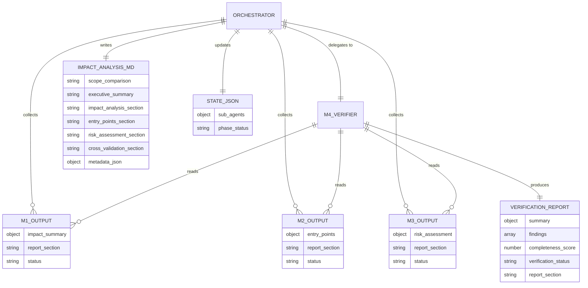

# Data Contract Design: REQ-0015 Cross-Validation Verifier

**Version**: 1.0
**Created**: 2026-02-15
**Phase**: 03-architecture
**Traces to**: FR-01 (AC-01.3), FR-02, FR-03, FR-04, FR-06, FR-05 (AC-05.5)

---

## 1. Overview

This project has no database. All data is structured JSON exchanged between agents via prompts and stored in filesystem artifacts (impact-analysis.md, state.json). This document defines the **data contracts** -- the schemas for M4 input, M4 output, and state.json updates.

---

## 2. Entity-Relationship Diagram



---

## 3. M4 Input Schema

M4 receives the complete outputs of M1, M2, and M3 as structured JSON in its Task prompt.

### 3.1 Input Envelope

```json
{
  "workflow": "feature | upgrade",
  "artifact_folder": "REQ-0015-ia-cross-validation-verifier",
  "m1_output": { /* M1 Impact Analyzer response */ },
  "m2_output": { /* M2 Entry Point Finder response */ },
  "m3_output": { /* M3 Risk Assessor response */ }
}
```

### 3.2 M1 Output Schema (Input to M4)

```json
{
  "status": "success",
  "report_section": "## Impact Analysis\n...",
  "impact_summary": {
    "based_on": "Phase 01 Requirements (finalized)",
    "acceptance_criteria_analyzed": 28,
    "directly_affected": [
      {
        "file": "src/claude/agents/impact-analysis/cross-validation-verifier.md",
        "acceptance_criteria": ["AC-01.1", "AC-01.2"],
        "type": "Agent"
      }
    ],
    "outward_dependencies": [
      {
        "from": "file_a",
        "to": "file_b",
        "type": "imports",
        "reason": "description"
      }
    ],
    "inward_dependencies": [],
    "change_propagation": {
      "level_0": ["file_a"],
      "level_1": ["file_b"],
      "level_2": []
    },
    "blast_radius": "low | medium | high",
    "files_estimated": 5,
    "modules_estimated": 2,
    "breaking_changes": false,
    "database_changes": false
  }
}
```

**Required fields for M4 cross-validation**:
- `impact_summary.directly_affected[].file` -- used in FR-02 (file list comparison)
- `impact_summary.blast_radius` -- used in FR-03 (risk gap detection)
- `impact_summary.change_propagation` -- used in FR-03 (coupling analysis)

### 3.3 M2 Output Schema (Input to M4)

```json
{
  "status": "success",
  "report_section": "## Entry Points\n...",
  "entry_points": {
    "based_on": "Phase 01 Requirements (finalized)",
    "by_acceptance_criterion": {
      "AC-01.1": {
        "existing": [
          {
            "type": "agent",
            "path": "src/claude/agents/impact-analysis/",
            "file": "impact-analysis-orchestrator.md",
            "relevance": "high"
          }
        ],
        "suggested_new": [
          {
            "type": "agent",
            "path": "src/claude/agents/impact-analysis/cross-validation-verifier.md",
            "rationale": "New M4 agent file"
          }
        ]
      }
    },
    "implementation_chains": {},
    "implementation_order": [],
    "integration_points": []
  }
}
```

**Required fields for M4 cross-validation**:
- `entry_points.by_acceptance_criterion` -- used in FR-02 (file list extraction from entry points)
- `entry_points.implementation_chains` -- used in FR-03 (deep call chain detection)

### 3.4 M3 Output Schema (Input to M4)

```json
{
  "status": "success",
  "report_section": "## Risk Assessment\n...",
  "risk_assessment": {
    "based_on": "Phase 01 Requirements (finalized)",
    "overall_risk": "low | medium | high",
    "risk_score": 35,
    "by_acceptance_criterion": {
      "AC-01.1": {
        "risk_level": "low",
        "risk_score": 2,
        "risk_areas": [
          {
            "module": "src/claude/agents/impact-analysis/",
            "coverage": 0,
            "complexity": "low",
            "debt_markers": 0,
            "risk": "low"
          }
        ],
        "recommendations": []
      }
    },
    "coverage_gaps": [],
    "complexity_hotspots": [],
    "technical_debt": [],
    "risk_zones": [],
    "recommendations": []
  }
}
```

**Required fields for M4 cross-validation**:
- `risk_assessment.by_acceptance_criterion` -- used in FR-04 (completeness check)
- `risk_assessment.risk_zones` -- used in FR-03 (risk scoring gap detection)
- `risk_assessment.coverage_gaps` -- used in FR-03 (undertested critical path detection)

---

## 4. M4 Output Schema (Verification Report)

### 4.1 Full Response Schema

```json
{
  "status": "success",
  "report_section": "## Cross-Validation\n...",
  "verification_report": {
    "summary": {
      "total_findings": 3,
      "by_severity": {
        "CRITICAL": 0,
        "WARNING": 2,
        "INFO": 1
      },
      "completeness_score": 85,
      "verification_status": "WARN"
    },
    "findings": [
      {
        "id": "CV-001",
        "severity": "WARNING",
        "category": "file_list",
        "description": "File X found in M2 entry points but missing from M1 blast radius",
        "affected_agents": ["M1", "M2"],
        "recommendation": "Review M1 blast radius for missing file X"
      },
      {
        "id": "CV-002",
        "severity": "WARNING",
        "category": "risk_scoring",
        "description": "Module Y has high coupling (M1) but low risk score (M3)",
        "affected_agents": ["M1", "M3"],
        "recommendation": "Increase risk assessment for module Y"
      },
      {
        "id": "CV-003",
        "severity": "INFO",
        "category": "completeness",
        "description": "All M2 entry points map to M1 affected files",
        "affected_agents": ["M1", "M2"],
        "recommendation": "No action needed"
      }
    ],
    "file_list_analysis": {
      "m1_files": ["file_a", "file_b"],
      "m2_files": ["file_a", "file_c"],
      "symmetric_difference": ["file_b", "file_c"],
      "missing_from_blast_radius": ["file_c"],
      "orphan_impact": ["file_b"]
    },
    "risk_scoring_gaps": [],
    "completeness_checks": {
      "m2_to_m1_coverage": 90,
      "m1_to_m3_coverage": 100,
      "overall": 95
    }
  }
}
```

### 4.2 Field Definitions

| Field | Type | Required | Description | Traces to |
|-------|------|----------|-------------|-----------|
| `summary.total_findings` | integer | Yes | Count of all findings | AC-06.1 |
| `summary.by_severity.CRITICAL` | integer | Yes | Count of CRITICAL findings | AC-06.1 |
| `summary.by_severity.WARNING` | integer | Yes | Count of WARNING findings | AC-06.1 |
| `summary.by_severity.INFO` | integer | Yes | Count of INFO findings | AC-06.1 |
| `summary.completeness_score` | integer (0-100) | Yes | Percentage of valid cross-references | AC-06.3 |
| `summary.verification_status` | enum | Yes | PASS / WARN / FAIL | AC-06.4 |
| `findings[].id` | string | Yes | Finding identifier (CV-NNN) | AC-06.2 |
| `findings[].severity` | enum | Yes | CRITICAL / WARNING / INFO | AC-06.2 |
| `findings[].category` | enum | Yes | file_list / risk_scoring / completeness | AC-06.2 |
| `findings[].description` | string | Yes | Human-readable description | AC-06.2 |
| `findings[].affected_agents` | string[] | Yes | Which agents are involved | AC-06.2, AC-02.4 |
| `findings[].recommendation` | string | Yes | Suggested action | AC-06.2, AC-03.4 |

### 4.3 Verification Status Rules

```
verification_status = "PASS"  if summary.by_severity.CRITICAL == 0 AND summary.by_severity.WARNING == 0
verification_status = "WARN"  if summary.by_severity.CRITICAL == 0 AND summary.by_severity.WARNING > 0
verification_status = "FAIL"  if summary.by_severity.CRITICAL > 0
```

Traces to: AC-06.4

### 4.4 Finding Categories

| Category | Finding Types | Traces to |
|----------|--------------|-----------|
| `file_list` | MISSING_FROM_BLAST_RADIUS, ORPHAN_IMPACT | FR-02 (AC-02.1, AC-02.2) |
| `risk_scoring` | RISK_SCORING_GAP, UNDERTESTED_CRITICAL_PATH | FR-03 (AC-03.1, AC-03.2, AC-03.3) |
| `completeness` | INCOMPLETE_ANALYSIS | FR-04 (AC-04.1, AC-04.2, AC-04.3) |

---

## 5. State.json Updates

### 5.1 Sub-Agent Entry for M4

Added under `phases["02-impact-analysis"].sub_agents`:

```json
{
  "M4-cross-validation-verifier": {
    "status": "completed | failed | skipped",
    "duration_ms": 8500,
    "verification_status": "PASS | WARN | FAIL | incomplete",
    "findings_count": 3,
    "critical_count": 0,
    "completeness_score": 85
  }
}
```

Traces to: AC-05.5

### 5.2 M4 Failure State

```json
{
  "M4-cross-validation-verifier": {
    "status": "skipped",
    "reason": "M4 execution failed: timeout",
    "verification_status": "incomplete"
  }
}
```

---

## 6. Impact Analysis Report Updates

### 6.1 New Cross-Validation Section

Inserted between "Risk Assessment" and "Implementation Recommendations":

```markdown
---

## Cross-Validation

{M4 report_section content}

### Verification Summary

| Metric | Value |
|--------|-------|
| Verification Status | PASS / WARN / FAIL |
| Completeness Score | 85% |
| Total Findings | 3 |
| Critical | 0 |
| Warnings | 2 |
| Info | 1 |

### Findings

| ID | Severity | Category | Description | Recommendation |
|----|----------|----------|-------------|----------------|
| CV-001 | WARNING | file_list | ... | ... |
| CV-002 | WARNING | risk_scoring | ... | ... |
| CV-003 | INFO | completeness | ... | ... |

---
```

### 6.2 Updated Metadata JSON

The metadata JSON block at the end of impact-analysis.md includes M4:

```json
{
  "sub_agents": ["M1", "M2", "M3", "M4"],
  "verification_status": "PASS | WARN | FAIL | incomplete",
  "completeness_score": 85
}
```

---

## 7. Migration Strategy

**Not applicable.** No database schema changes. All changes are additive:
- New fields in state.json (sub_agents.M4) are ignored by existing code
- New section in impact-analysis.md is ignored by existing parsers (parseSizingFromImpactAnalysis reads only the metadata JSON block)
- The metadata JSON block adds optional fields that default gracefully

---

## 8. Backup and Recovery Strategy

**Not applicable.** State.json and impact-analysis.md are transient workflow artifacts. If corrupted, the workflow can be re-run from Phase 02. No persistent data storage requires backup.

---

## 9. Scalability Plan

**Not applicable.** Data volumes are bounded by the number of files in a project and the number of acceptance criteria. M4's output is O(files) in the worst case, which is well within LLM context limits for any reasonable project size.
