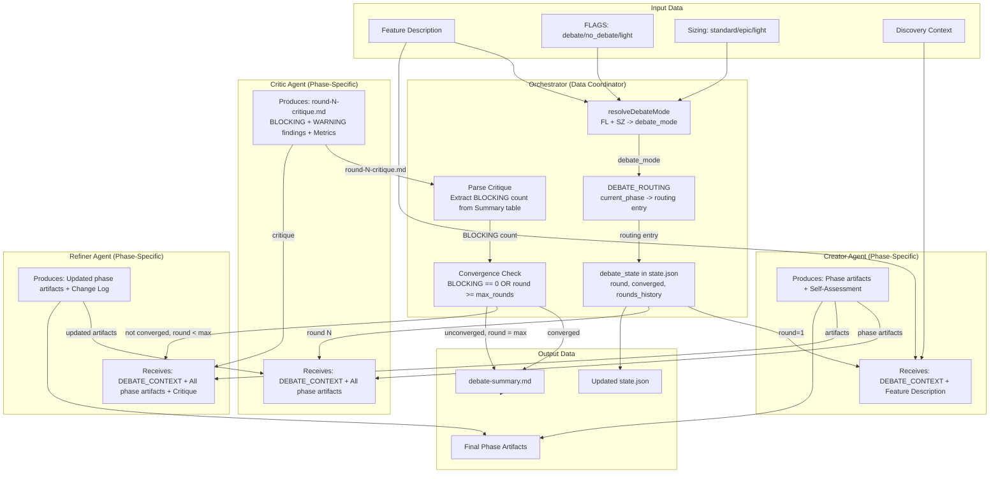
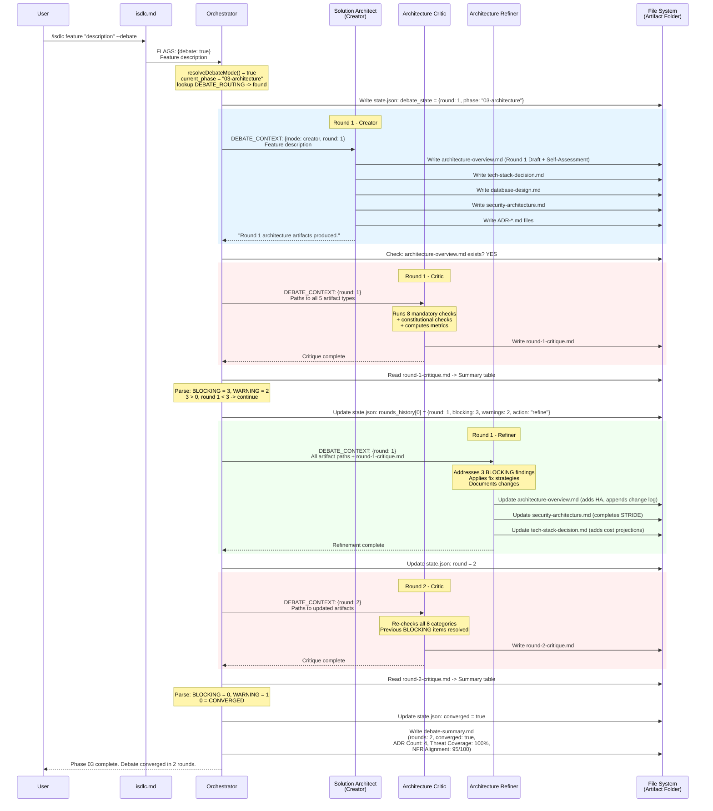
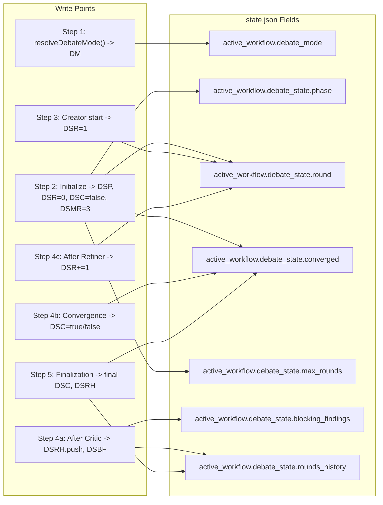
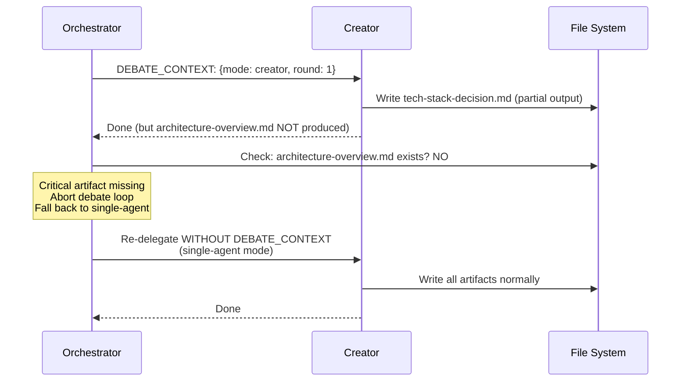
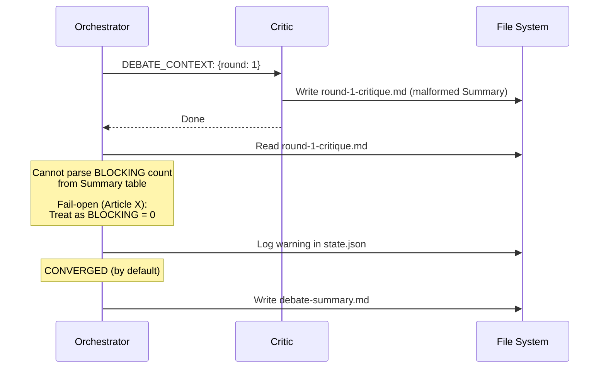
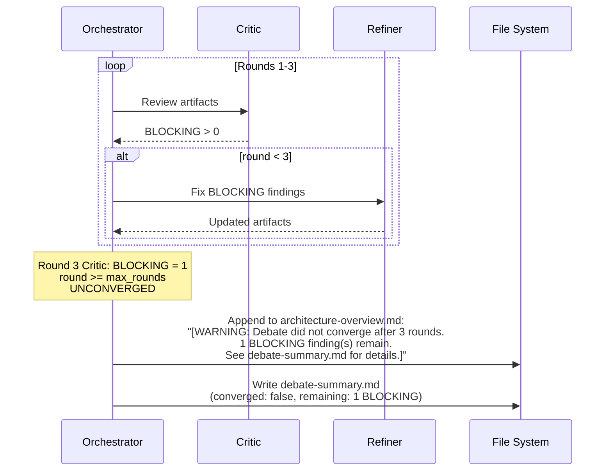

# Data Flow Design: Multi-Agent Architecture Team

**Feature:** REQ-0015-multi-agent-architecture-team
**Phase:** 04-design
**Created:** 2026-02-14
**Traces:** FR-001..FR-007, NFR-001..NFR-004

---

## 1. Generalized Debate Loop Data Flow (Phase-Agnostic)

This diagram shows how data (artifacts, critique reports, state) flows through
the debate loop regardless of which phase is active. The routing table
determines which agents receive delegations, but the data flow pattern is
identical.



---

## 2. Phase 03 Architecture Debate Data Flow (Concrete Instance)

This shows the specific data items that flow through the debate loop when
`current_phase = "03-architecture"`.



---

## 3. Data Transformation Map

This table documents every data transformation that occurs during the debate
loop, mapping input data to output data for each agent.

### 3.1 Creator (Solution Architect) Transformations

| Input | Transformation | Output |
|-------|---------------|--------|
| Feature description | Analyze requirements, select architecture pattern | architecture-overview.md |
| Feature description | Evaluate technologies, select stack | tech-stack-decision.md |
| Feature description | Design data model, define schema | database-design.md |
| Feature description | STRIDE analysis, security controls | security-architecture.md |
| Feature description | Document key decisions | ADR-*.md files |
| DEBATE_CONTEXT.round | Label artifacts with round number | "Round {N} Draft" in metadata |
| DEBATE_CONTEXT.mode=creator | Generate self-assessment | Self-Assessment section in architecture-overview.md |

### 3.2 Critic (Architecture Critic) Transformations

| Input | Transformation | Output |
|-------|---------------|--------|
| architecture-overview.md | Check NFR alignment, SPOF, coupling, observability | B-NNN/W-NNN findings for AC-01, AC-05, AC-07, AC-06 |
| tech-stack-decision.md | Check justification quality, cost analysis | B-NNN/W-NNN findings for AC-04, AC-08 |
| database-design.md | Check indexes, migration, backup, normalization | B-NNN/W-NNN findings for AC-03 |
| security-architecture.md | Check STRIDE completeness, mitigations | B-NNN/W-NNN findings for AC-02 |
| ADR-*.md files | Check completeness, traceability | B-NNN/W-NNN findings for Article VII |
| requirements-spec.md (NFRs) | Cross-reference NFR targets with architecture | NFR Alignment Score metric |
| All artifacts | Count decision records | ADR Count metric |
| security-architecture.md | Count STRIDE categories covered | Threat Coverage metric |
| All findings | Aggregate counts | Summary table (Total, BLOCKING, WARNING) |

### 3.3 Refiner (Architecture Refiner) Transformations

| Input | Transformation | Output |
|-------|---------------|--------|
| B-NNN (AC-01: NFR misalign) | Add infrastructure to meet NFR targets | Updated architecture-overview.md |
| B-NNN (AC-02: STRIDE gaps) | Add missing threat mitigations | Updated security-architecture.md |
| B-NNN (AC-03: DB flaws) | Add indexes, migration, backup plan | Updated database-design.md |
| B-NNN (AC-04: Weak justification) | Add evaluation criteria, alternatives, cost | Updated tech-stack-decision.md |
| B-NNN (AC-05: SPOF) | Add redundancy, failover | Updated architecture-overview.md |
| B-NNN (AC-06: No observability) | Add monitoring, logging, alerting, tracing | Updated architecture-overview.md |
| B-NNN (AC-07: Coupling) | Resolve inconsistency or restate honestly | Updated architecture-overview.md |
| B-NNN (AC-08: No cost) | Add cost projections | Updated tech-stack-decision.md |
| W-NNN (any) | Fix if straightforward, else [NEEDS CLARIFICATION] | Updated target artifact |
| All addressed findings | Tabulate changes | Changes section appended to architecture-overview.md |

### 3.4 Orchestrator Transformations

| Input | Transformation | Output |
|-------|---------------|--------|
| FLAGS + sizing | resolveDebateMode() | debate_mode: boolean |
| current_phase | DEBATE_ROUTING lookup | routing: {creator, critic, refiner, artifacts, critical_artifact} |
| round-N-critique.md Summary | Parse BLOCKING integer from table | blocking_count: integer |
| blocking_count + round + max_rounds | Convergence check | converged: boolean |
| All rounds_history | Aggregate round data | debate-summary.md |
| converged == false | Generate warning text | Warning appended to routing.critical_artifact |

---

## 4. State Management Data Flow

The orchestrator manages all state through `.isdlc/state.json`. Sub-agents
(Creator, Critic, Refiner) are stateless -- they receive all context through
the Task prompt and produce output as files.



### State Schema Extension

The `debate_state.phase` field is the only additive change to the state.json
schema. All other fields already exist from REQ-0014. The Phase 01 debate state
is unaffected because the `phase` field is simply added alongside existing fields.

```json
{
  "active_workflow": {
    "debate_mode": true,
    "debate_state": {
      "phase": "03-architecture",
      "round": 2,
      "max_rounds": 3,
      "converged": true,
      "blocking_findings": 0,
      "rounds_history": [
        { "round": 1, "blocking": 3, "warnings": 2, "action": "refine" },
        { "round": 2, "blocking": 0, "warnings": 1, "action": "converge" }
      ]
    }
  }
}
```

---

## 5. Edge Case Data Flows

### 5.1 Missing Critical Artifact (AC-007-01)



### 5.2 Malformed Critique (AC-007-02)



### 5.3 Max Rounds Unconverged (AC-007-03)


