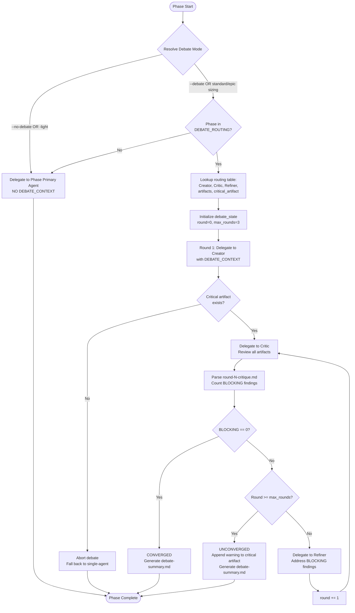
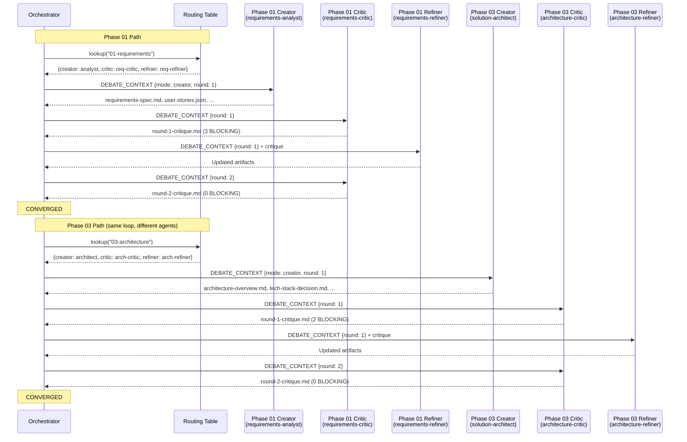
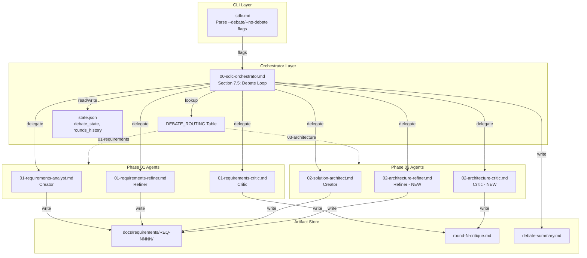
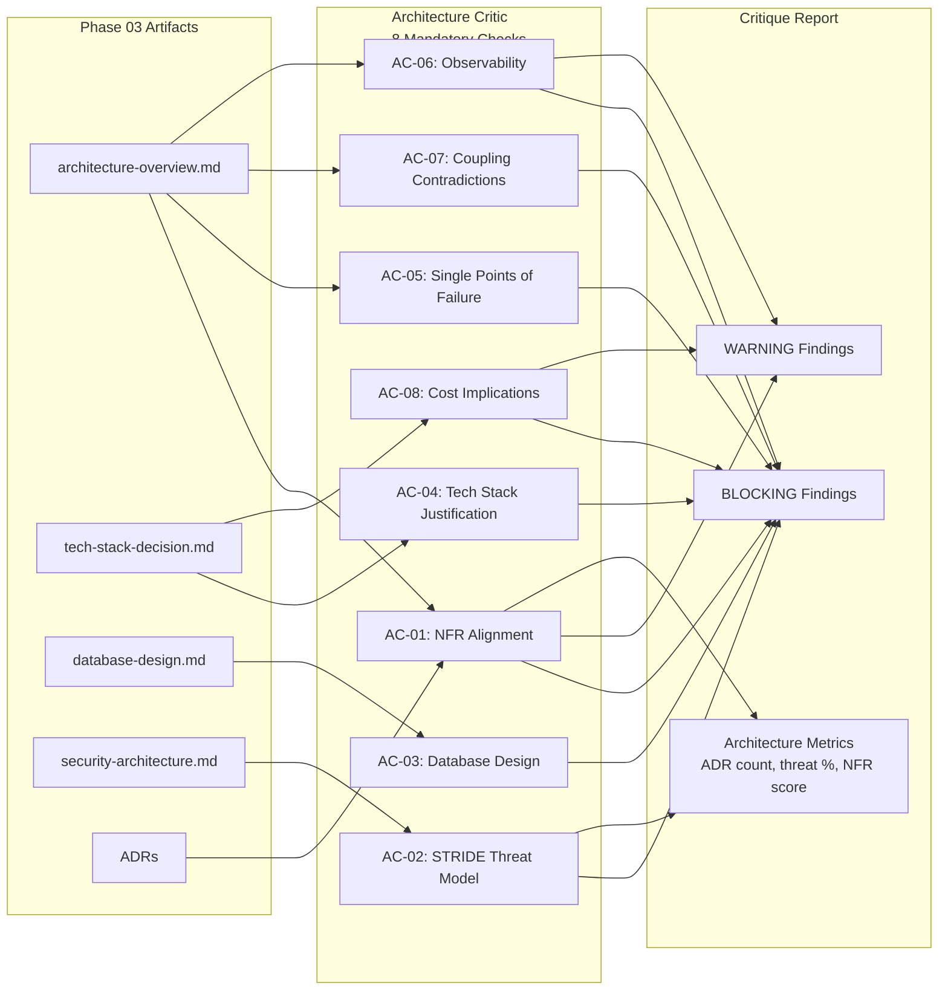
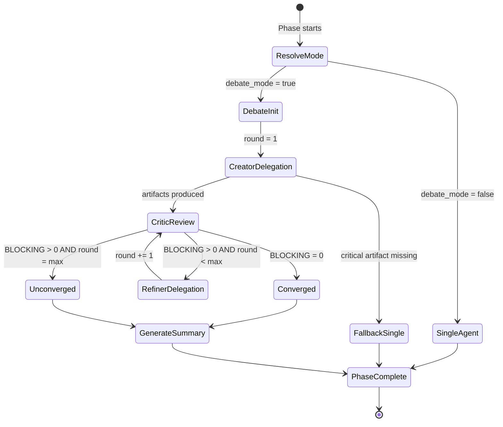

# Architecture Diagrams: Multi-Agent Architecture Team

**Feature:** REQ-0015-multi-agent-architecture-team
**Phase:** 03-architecture
**Created:** 2026-02-14

---

## 1. Generalized Debate Loop Flow (Component Diagram)

---

## 2. Phase-Specific Agent Routing (Sequence Diagram)

---

## 3. Component Interaction Diagram

---

## 4. Architecture Critic Check Categories Diagram

---

## 5. State Transitions During Debate

