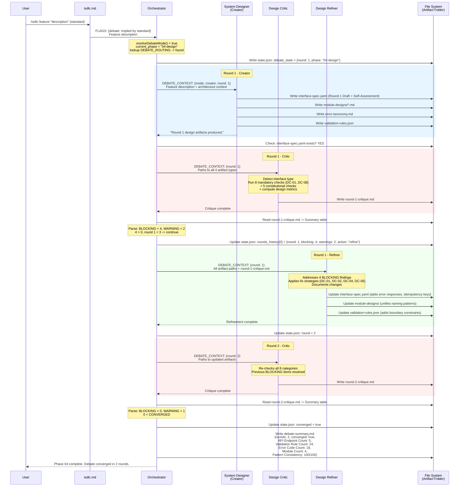
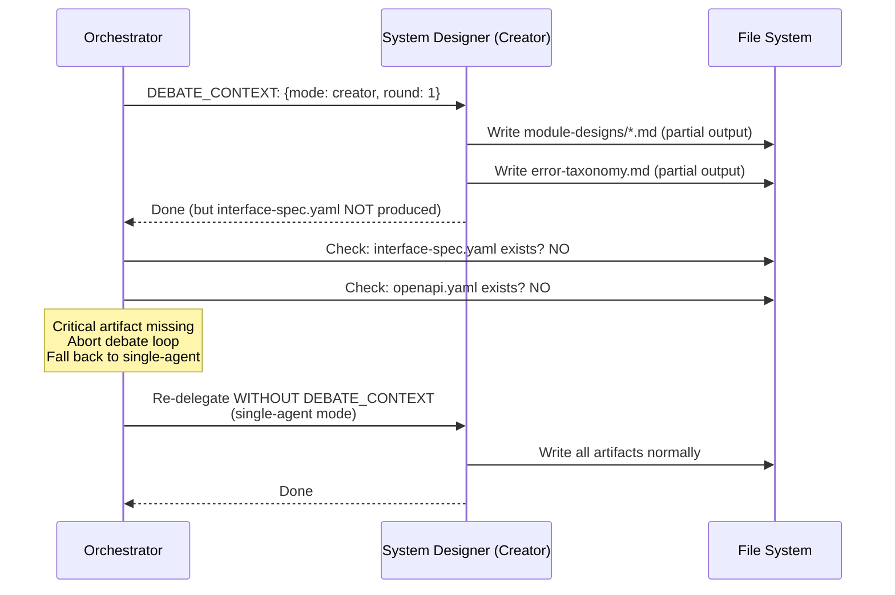
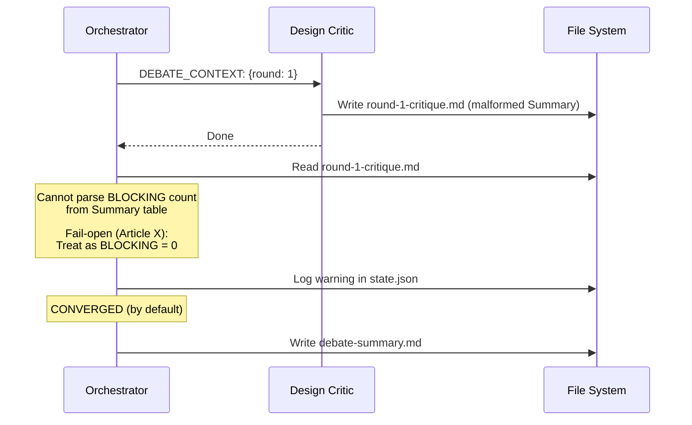
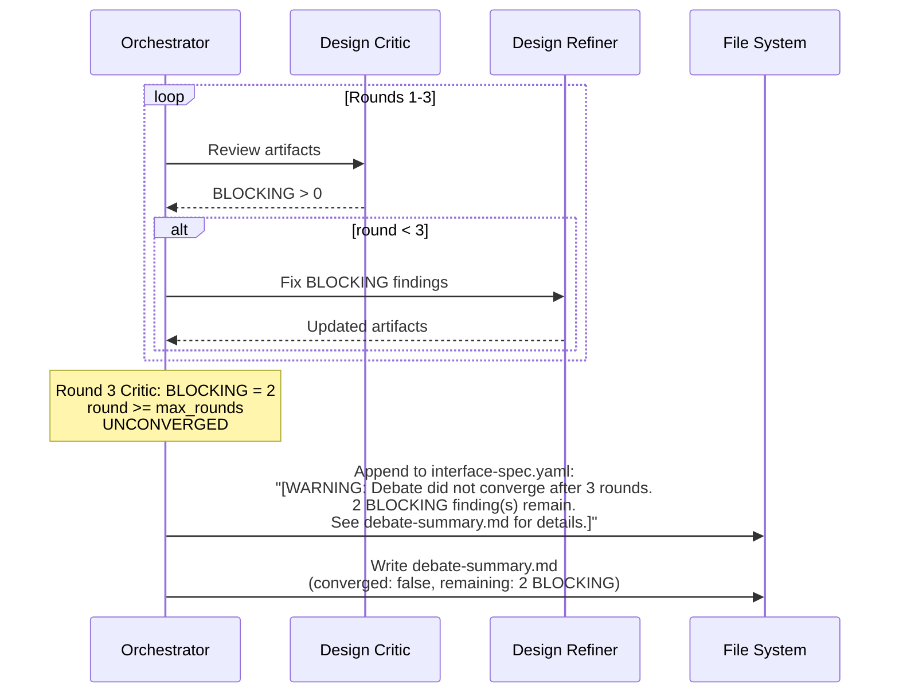
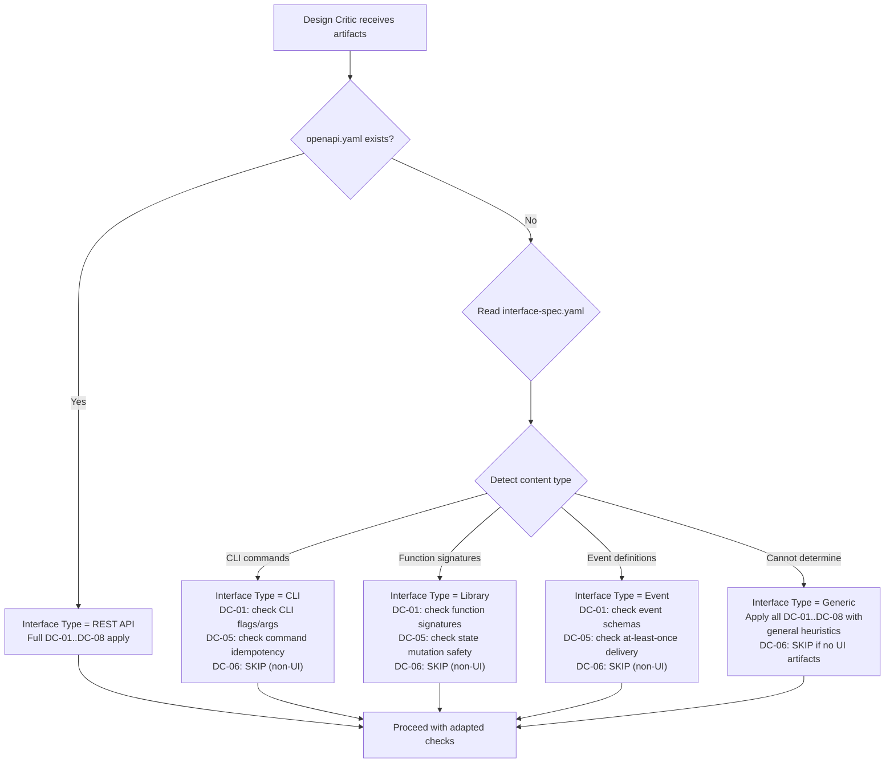
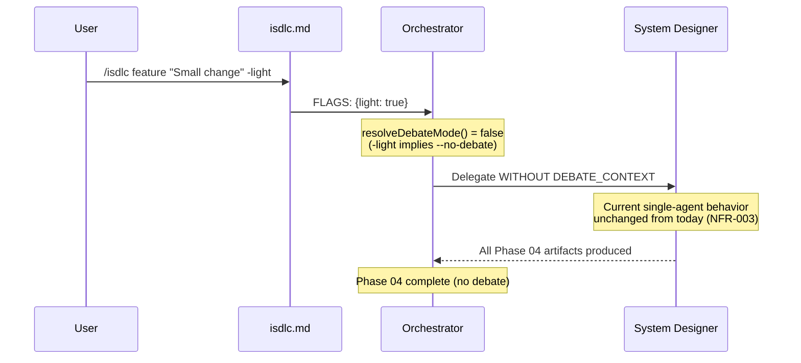
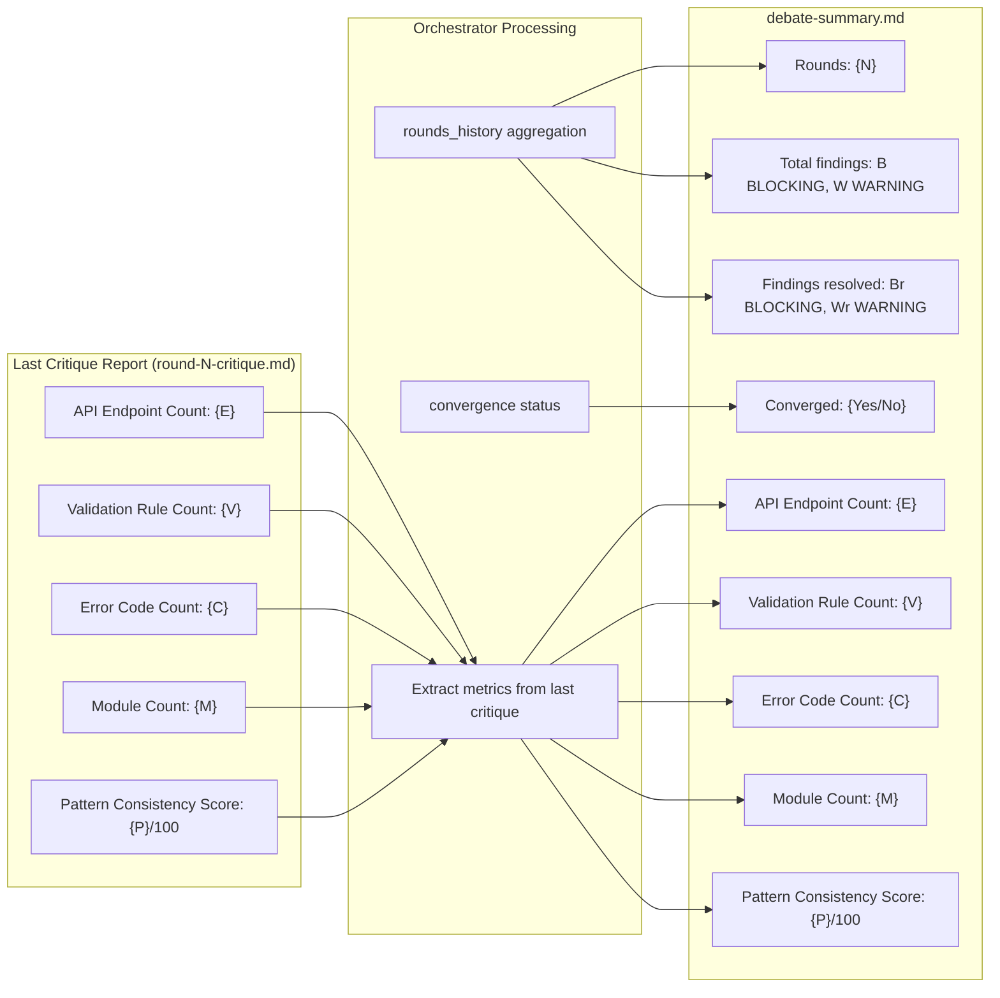

# Data Flow Design: Multi-Agent Design Team

**Feature:** REQ-0016-multi-agent-design-team
**Phase:** 04-design
**Created:** 2026-02-15
**Traces:** FR-001..FR-007, NFR-001..NFR-004

---

## 1. Phase 04 Design Debate Data Flow (Concrete Instance)

This shows the specific data items that flow through the debate loop when
`current_phase = "04-design"`. The generalized phase-agnostic debate loop
data flow was documented in REQ-0015; this diagram instantiates it for
Phase 04's specific artifacts and agents.



---

## 2. Data Transformation Map

This table documents every data transformation that occurs during the Phase 04
debate loop, mapping input data to output data for each agent.

### 2.1 Creator (System Designer) Transformations

| Input | Transformation | Output |
|-------|---------------|--------|
| Feature description + architecture-overview.md | Design interfaces, define contracts | interface-spec.yaml (or openapi.yaml) |
| Feature description + architecture-overview.md | Decompose into modules, define responsibilities | module-designs/*.md |
| Feature description + architecture-overview.md | Define error codes, categories, handling | error-taxonomy.md |
| Feature description + architecture-overview.md | Define input validation rules | validation-rules.json |
| DEBATE_CONTEXT.round | Label artifacts with round number | "Round {N} Draft" in metadata |
| DEBATE_CONTEXT.mode=creator | Generate self-assessment | Self-Assessment section in primary design artifact |

### 2.2 Critic (Design Critic) Transformations

| Input | Transformation | Output |
|-------|---------------|--------|
| interface-spec.yaml / openapi.yaml | Check API completeness, idempotency, data flow | B-NNN/W-NNN findings for DC-01, DC-05, DC-08 |
| module-designs/ | Check consistency, overlap, boundaries | B-NNN/W-NNN findings for DC-02, DC-03 |
| validation-rules.json | Check boundary constraints, completeness | B-NNN/W-NNN findings for DC-04 |
| error-taxonomy.md | Check error code coverage, status mapping | B-NNN/W-NNN findings for DC-07 |
| wireframes (if present) | Check accessibility compliance | B-NNN/W-NNN findings for DC-06 |
| requirements-spec.md | Cross-reference designs to requirements | Findings for Article I, VII |
| All design artifacts | Count endpoints, rules, codes, modules | 5 design metrics in Summary |
| All findings | Aggregate counts | Summary table (Total, BLOCKING, WARNING) |

### 2.3 Refiner (Design Refiner) Transformations

| Input | Transformation | Output |
|-------|---------------|--------|
| B-NNN (DC-01: Incomplete specs) | Add missing schemas, error responses, parameters | Updated interface-spec.yaml |
| B-NNN (DC-02: Inconsistent patterns) | Unify naming, error handling, response shapes | Updated module-designs/ |
| B-NNN (DC-03: Module overlap) | Clarify boundaries, explicit responsibility | Updated module-designs/ |
| B-NNN (DC-04: Validation gaps) | Add min/max, length limits, enum values | Updated validation-rules.json |
| B-NNN (DC-05: Missing idempotency) | Add idempotency keys, retry semantics | Updated interface-spec.yaml |
| B-NNN (DC-06: Accessibility) | Add ARIA labels, contrast, keyboard nav | Updated wireframes/component-specs |
| B-NNN (DC-07: Error taxonomy holes) | Add codes, status mapping, retry guidance | Updated error-taxonomy.md |
| B-NNN (DC-08: Data flow bottlenecks) | Add caching, pagination, async patterns | Updated module-designs/ |
| W-NNN (any) | Fix if straightforward, else [NEEDS CLARIFICATION] | Updated target artifact |
| All addressed findings | Tabulate changes | Changes section appended to primary artifact |

### 2.4 Orchestrator Transformations

| Input | Transformation | Output |
|-------|---------------|--------|
| FLAGS + sizing | resolveDebateMode() | debate_mode: boolean |
| current_phase = "04-design" | DEBATE_ROUTING lookup | routing: {creator: 03-system-designer.md, critic: 03-design-critic.md, refiner: 03-design-refiner.md, artifacts: [...], critical_artifact: interface-spec.yaml} |
| round-N-critique.md Summary | Parse BLOCKING integer from table | blocking_count: integer |
| blocking_count + round + max_rounds | Convergence check | converged: boolean |
| All rounds_history | Aggregate round data + design metrics | debate-summary.md |
| converged == false | Generate warning text | Warning appended to interface-spec.yaml |

---

## 3. State Management Data Flow

The orchestrator manages all state through `.isdlc/state.json`. Sub-agents
(Creator, Critic, Refiner) are stateless -- they receive all context through
the Task prompt and produce output as files.

```mermaid
flowchart LR
    subgraph StateJSON["state.json Fields"]
        DM[active_workflow.debate_mode]
        DSP[active_workflow.debate_state.phase<br/>= "04-design"]
        DSR[active_workflow.debate_state.round]
        DSC[active_workflow.debate_state.converged]
        DSMR[active_workflow.debate_state.max_rounds<br/>= 3]
        DSBF[active_workflow.debate_state.blocking_findings]
        DSRH[active_workflow.debate_state.rounds_history]
    end

    subgraph WritePoints["Write Points"]
        W1["Step 1: resolveDebateMode() -> DM"]
        W2["Step 2: Initialize -> DSP='04-design', DSR=0, DSC=false, DSMR=3"]
        W3["Step 3: Creator start -> DSR=1"]
        W4["Step 4a: After Critic -> DSRH.push, DSBF"]
        W5["Step 4b: Convergence -> DSC=true/false"]
        W6["Step 4c: After Refiner -> DSR+=1"]
        W7["Step 5: Finalization -> final DSC, DSRH"]
    end

    W1 --> DM
    W2 --> DSP
    W2 --> DSR
    W2 --> DSC
    W2 --> DSMR
    W3 --> DSR
    W4 --> DSRH
    W4 --> DSBF
    W5 --> DSC
    W6 --> DSR
    W7 --> DSC
    W7 --> DSRH
```

### State Schema (Phase 04 Instance)

The `debate_state.phase` field is set to `"04-design"` when the Phase 04
debate loop starts. This is the only value that differs from Phase 03
(`"03-architecture"`) or Phase 01 (`"01-requirements"`). All other fields
have the same semantics.

```json
{
  "active_workflow": {
    "debate_mode": true,
    "debate_state": {
      "phase": "04-design",
      "round": 2,
      "max_rounds": 3,
      "converged": true,
      "blocking_findings": 0,
      "rounds_history": [
        { "round": 1, "blocking": 4, "warnings": 2, "action": "refine" },
        { "round": 2, "blocking": 0, "warnings": 1, "action": "converge" }
      ]
    }
  }
}
```

---

## 4. Edge Case Data Flows

### 4.1 Missing Critical Artifact (AC-007-01)



### 4.2 Malformed Critique (AC-007-02)



### 4.3 Max Rounds Unconverged (AC-007-03)



### 4.4 Non-REST Interface Type (AC-007-04)



### 4.5 Debate OFF -- Single Agent Path (NFR-003)



---

## 5. Debate-Summary.md Metrics Flow

The debate-summary.md for Phase 04 includes design-specific metrics
(AC-005-03). These metrics flow from the Critic's last critique report
into the orchestrator's summary generation.


