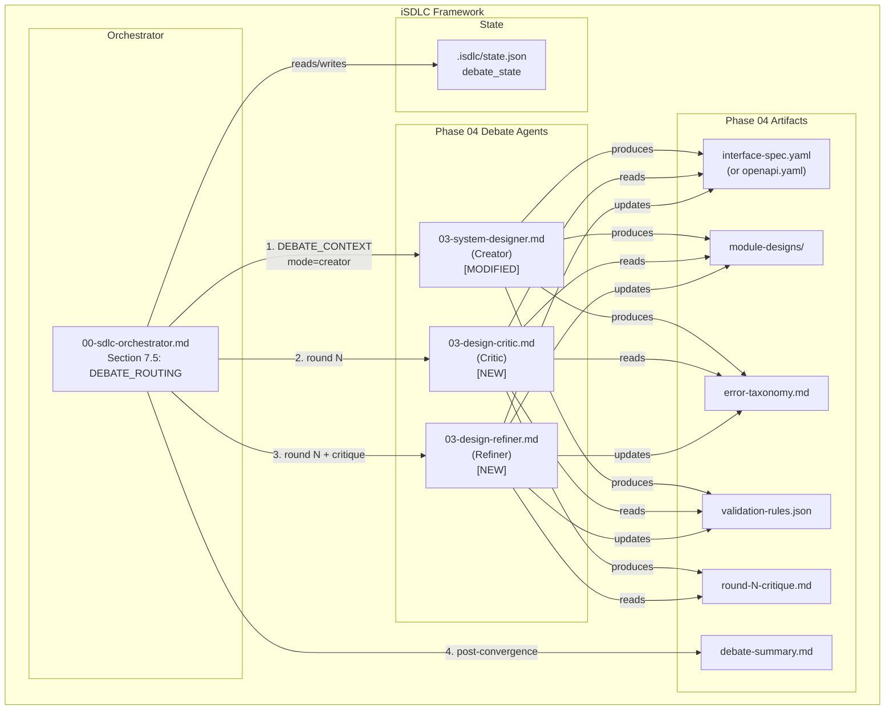
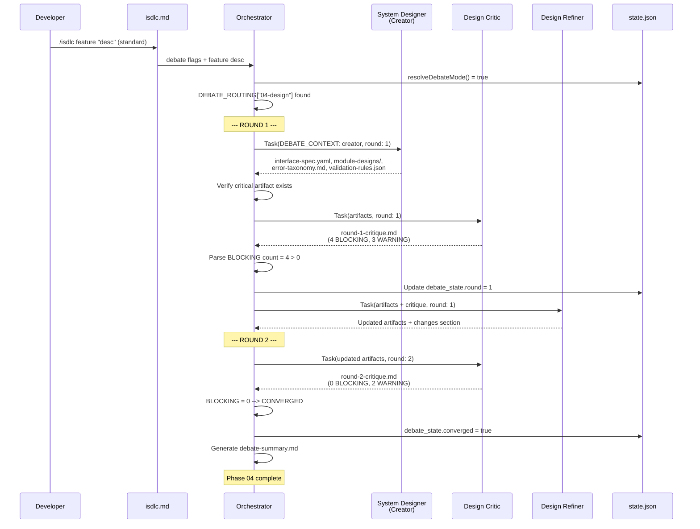
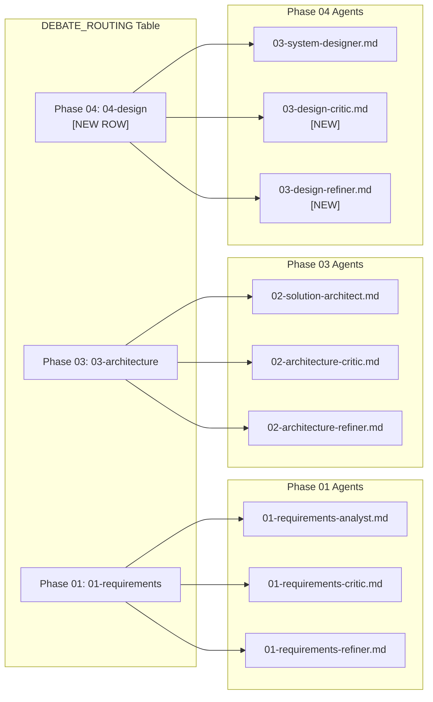
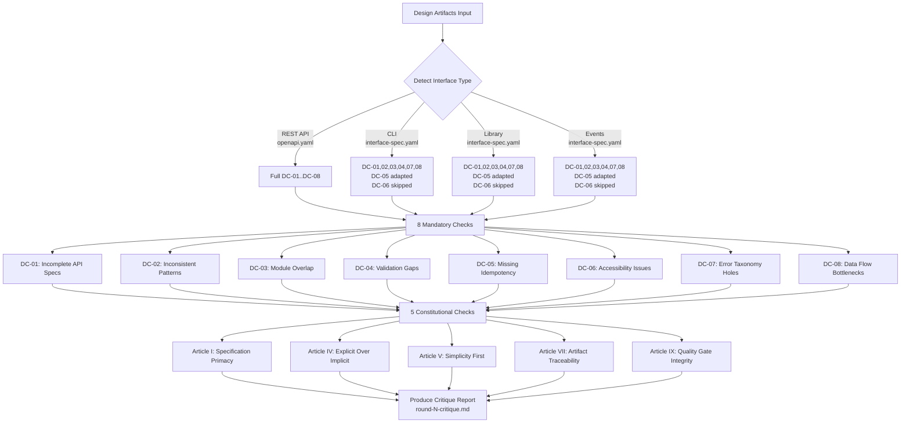
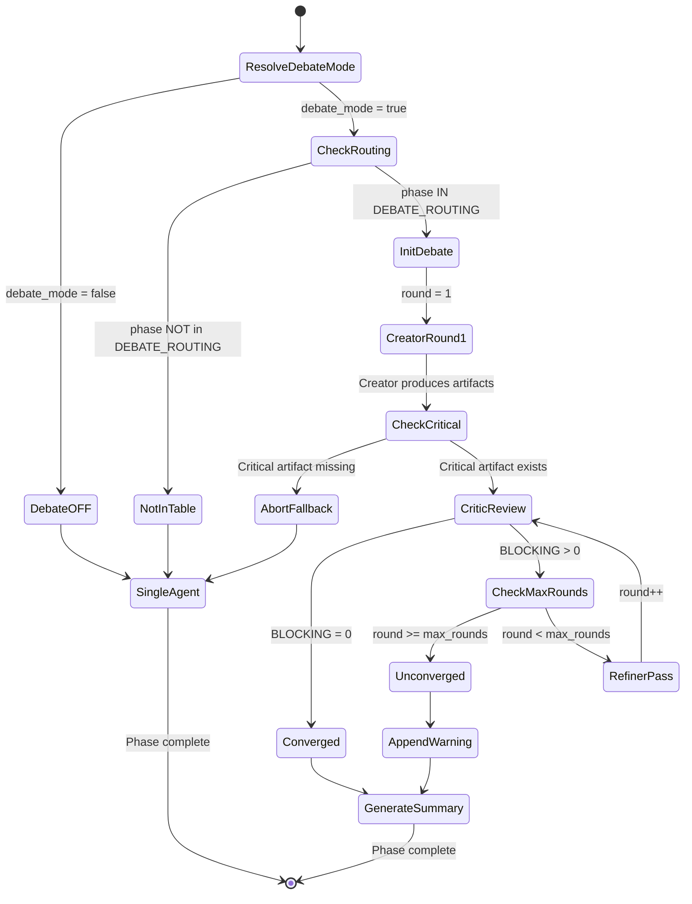

# Architecture Diagrams: Multi-Agent Design Team

**Feature:** REQ-0016-multi-agent-design-team
**Phase:** 03-architecture
**Created:** 2026-02-15

---

## 1. Component Diagram -- Phase 04 Debate Agents

---

## 2. Sequence Diagram -- Phase 04 Debate Loop (2-Round Convergence)

---

## 3. DEBATE_ROUTING Table Diagram (All 3 Phases)

---

## 4. Data Flow Diagram -- Design Critique Check Categories

---

## 5. State Diagram -- Debate Convergence Flow

