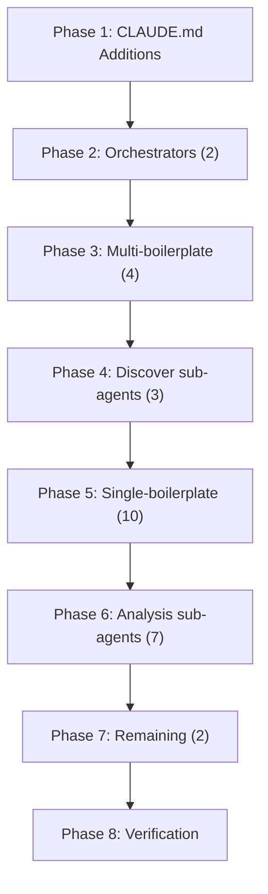

# Architecture: T7 Agent Prompt Boilerplate Extraction

**Requirement ID**: REQ-0021
**Phase**: 03-architecture
**Created**: 2026-02-17
**Status**: Accepted

---

## 1. Architecture Overview

### 1.1 System Context

This feature refactors the iSDLC agent prompt file ecosystem. The "system" is the set of markdown files that Claude Code loads at agent delegation time:

```
+--------------------------------------------------+
|              Claude Code Runtime                  |
|                                                   |
|  On every agent delegation:                       |
|    Context = CLAUDE.md + Agent.md + Task prompt   |
|                                                   |
|  +-----------+     +-------------+                |
|  | CLAUDE.md | --> | Agent File  |  --> Agent     |
|  | (shared)  |     | (specific)  |     Behavior   |
|  +-----------+     +-------------+                |
|       ^                  ^                        |
|       |                  |                        |
|   Shared protocols   Agent-specific               |
|   (inherited by all) instructions                 |
+--------------------------------------------------+
```

The refactoring moves duplicated content from 28 agent files into CLAUDE.md (the shared layer), replacing inline copies with 1-line references. Since Claude Code always loads CLAUDE.md into every agent's context, the effective content available to each agent is unchanged.

### 1.2 Architecture Pattern

**Pattern**: Shared Protocol Inheritance (Content Deduplication)

This is a well-established pattern in the iSDLC framework, first used in T2 (which extracted SKILL OBSERVABILITY, SUGGESTED PROMPTS, and CONSTITUTIONAL PRINCIPLES). This feature extends the same pattern to 4 additional protocol categories.

The pattern has three tiers:

1. **Shared Layer (CLAUDE.md)**: Contains protocol definitions that apply to multiple agents. Loaded automatically by Claude Code into every agent context.
2. **Agent Layer (agent .md files)**: Contains agent-specific instructions. References shared protocols via 1-line pointers. May include agent-specific parameterization (e.g., iteration success criteria).
3. **Runtime Layer (Claude Code)**: Concatenates CLAUDE.md + agent file into the agent's context window at delegation time. No changes needed at this layer.

### 1.3 Architectural Drivers

| Driver | Source | Impact on Architecture |
|--------|--------|----------------------|
| Token reduction per delegation | NFR-001 | Motivates moving content to shared layer |
| Zero behavioral regression | NFR-002 | Content must be semantically identical post-refactor |
| Single source of truth | NFR-003 | Each protocol exists in exactly one location |
| CLAUDE.md size budget (max +120 lines) | NFR-006 | Constrains how much content can move to shared layer |
| Agent-specific iteration criteria | FR-006, Section 3.2 | Requires parameterization pattern for iteration enforcement |
| 3 monorepo blockquote variants | Section 3.1 | Requires variant-aware design in shared section |
| Orchestrator superset merge | Impact R-007 | CLAUDE.md must contain the larger sdlc-orchestrator version |

---

## 2. Content Architecture

### 2.1 CLAUDE.md Section Structure (Post-Refactor)

All new sections are added under the existing `## Agent Framework Context` heading, after the 3 sections already established by T2.

```
## Agent Framework Context                     <-- existing heading

### SKILL OBSERVABILITY Protocol               <-- existing (T2)
### SUGGESTED PROMPTS -- Phase Agent Protocol  <-- existing (T2)
### CONSTITUTIONAL PRINCIPLES Preamble         <-- existing (T2)

### Root Resolution Protocol                   <-- NEW (FR-009)
### Project Context Resolution (Monorepo)      <-- NEW (FR-010)
### Monorepo Mode Protocol                     <-- NEW (FR-001)
### Mandatory Iteration Enforcement Protocol   <-- NEW (FR-005)
### Git Commit Prohibition                     <-- NEW (FR-007)
```

**Section ordering rationale** (traces to FR-012, AC-012-01):

- Existing T2 sections come first (no reordering of existing content).
- Root Resolution and Project Context Resolution are placed next because they are foundational protocols executed before any phase work (orchestrator-level concerns).
- Monorepo Mode Protocol follows because it is the agent-facing simplification of the monorepo context (phase-agent-level concern, downstream of the orchestrator resolution).
- Iteration Enforcement and Git Commit Prohibition are placed last because they are phase-execution-time concerns (narrower scope, fewer affected agents).

### 2.2 Line Budget Allocation

NFR-006 caps CLAUDE.md growth at +120 lines. Current CLAUDE.md is 149 lines.

| Section | Estimated Lines | Content Source |
|---------|----------------|----------------|
| Root Resolution Protocol | 10 | `00-sdlc-orchestrator.md` lines 45-54 |
| Project Context Resolution (Monorepo) | 58 | `00-sdlc-orchestrator.md` lines 55-112 (superset) |
| Monorepo Mode Protocol | 12 | Unified from 3 variants across agents |
| Mandatory Iteration Enforcement Protocol | 18 | Common structure from 7 agents |
| Git Commit Prohibition | 8 | `05-software-developer.md` lines 38-42 |
| **Subtotal new content** | **~106** | |
| Headings, blank lines, formatting | ~7 | Markdown structure overhead |
| **Total addition** | **~113** | Within 120-line budget |

**Post-refactor CLAUDE.md target**: ~262 lines (149 + 113). Within the 280-line ceiling from NFR-006.

### 2.3 Section Content Specifications

#### 2.3.1 Root Resolution Protocol (FR-009)

Contains the 5-step algorithm for finding the project root directory. Sourced from `00-sdlc-orchestrator.md` ROOT RESOLUTION section (lines 45-54), which is identical to `discover-orchestrator.md` ROOT RESOLUTION (lines 62-70) except for the final step:
- sdlc-orchestrator: "report that the framework is not installed"
- discover-orchestrator: "fall through to the error handling in FAST PATH CHECK"

**Design Decision**: The CLAUDE.md version uses the generic wording: "If `.isdlc/` is not found in CWD or any parent, report that the framework is not installed (or fall through to agent-specific error handling)."

This captures both semantics without agent-specific coupling.

#### 2.3.2 Project Context Resolution -- Monorepo (FR-010)

Contains the complete monorepo detection, project resolution, path routing table, delegation context template, and workflow independence rules. Sourced from `00-sdlc-orchestrator.md` SECTION 0 (lines 55-112) as the **superset**.

The discover-orchestrator MONOREPO PREAMBLE (lines 72-104) is a subset of this content. By using the superset, the discover-orchestrator gains informational access to the path routing table details it previously lacked, but this is additive and does not change behavior (the discover-orchestrator already has its own delegation context template that is semantically equivalent).

**Design Decision**: Use the sdlc-orchestrator SECTION 0 as the canonical version. The discover-orchestrator MONOREPO PREAMBLE content is a strict subset and adds no unique information.

#### 2.3.3 Monorepo Mode Protocol (FR-001)

Contains guidance for all agents operating in monorepo mode. Defines two variant descriptions:

- **Full delegation form** (for phase agents and orchestrator sub-agents): "In monorepo mode, all file paths are project-scoped. The orchestrator provides project context (project ID, state file path, docs base path) in the delegation prompt. Read state from the project-specific state.json and write artifacts to the project-scoped docs directory."
- **Short analysis form** (for analysis sub-agents): "In monorepo mode, scope your analysis to the project path provided in the delegation context."

Both variants are documented in the shared section. Agent references specify which variant applies via the reference line.

**Design Decision**: Unify all 3 original variants into a single section with two documented forms. The orchestrator-specific variant (Variant C from requirements) is subsumed by the full delegation form -- the minor wording differences are not semantically significant.

#### 2.3.4 Mandatory Iteration Enforcement Protocol (FR-005)

Contains the common structural protocol:
1. The iterate-fix-retry loop structure (run -> check -> fix -> retry)
2. Reference to the test-watcher hook and its blocking behavior
3. The rule against declaring completion while tests/checks fail
4. Instruction that each agent specifies its own success criteria and max iteration count

Does NOT contain any agent-specific success criteria. Each agent retains a 2-3 line customization block.

#### 2.3.5 Git Commit Prohibition (FR-007)

Contains:
1. The prohibition against `git add`, `git commit`, `git push` during phase work
2. The rationale: commits represent validated work; the orchestrator manages git
3. Statement that the orchestrator handles all git operations at workflow finalize

Sourced from `05-software-developer.md` lines 38-42, with the phase-specific reference ("Phase 16 / Phase 08") generalized.

---

## 3. Reference Convention

### 3.1 Reference Format

Agent files replace inline boilerplate with a standardized 1-line reference. The reference format follows the pattern established by T2.

**Standard reference (monorepo, git commit)**:
```markdown
> See **{Section Name}** in CLAUDE.md.
```

**Parameterized reference (iteration enforcement)**:
```markdown
> Follow the **Mandatory Iteration Enforcement Protocol** in CLAUDE.md.
> **Completion criteria**: {agent-specific criteria}. **Max iterations**: {N}.
```

### 3.2 Reference Examples by Agent Category

**Phase agents with monorepo only** (13 agents, FR-002):
```markdown
> See **Monorepo Mode Protocol** in CLAUDE.md.
```
Replaces the full `> **Monorepo Mode**: In monorepo mode, all file paths are project-scoped...` blockquote.

**Analysis sub-agents with short monorepo** (7 agents, FR-003):
```markdown
> See **Monorepo Mode Protocol** in CLAUDE.md (analysis-scoped).
```
Replaces `> **Monorepo Mode**: In monorepo mode, scope your analysis to the project path...`

**Orchestrator agents (ROOT RESOLUTION + PROJECT CONTEXT)** (2 agents, FR-011):
```markdown
> See **Root Resolution Protocol** and **Project Context Resolution (Monorepo)** in CLAUDE.md.
```
Replaces the full ROOT RESOLUTION section and SECTION 0 / MONOREPO PREAMBLE.

**Iteration enforcement agents** (7 agents, FR-006):
```markdown
> Follow the **Mandatory Iteration Enforcement Protocol** in CLAUDE.md.
> **Completion criteria**: ALL UNIT TESTS PASS WITH >=80% COVERAGE. **Max iterations**: 10.
```
The second line is agent-specific. The full iteration section (8-12 lines) is replaced by these 2 lines.

**Git commit warning agents** (2 agents, FR-008):
```markdown
> See **Git Commit Prohibition** in CLAUDE.md.
```
Replaces the full "CRITICAL: Do NOT Run Git Commits" section (4-6 lines).

### 3.3 Reference Conventions Rationale

| Convention | Rationale | Traces To |
|-----------|-----------|-----------|
| Blockquote (`>`) format | Visual distinction from surrounding content; matches T2 pattern | FR-012 |
| Bold section name (`**Name**`) | Enables quick visual scanning; consistent with T2 references | NFR-004 |
| "in CLAUDE.md" suffix | Explicit pointer to the shared file; no ambiguity | Article IV |
| Agent-specific criteria on second line | Preserves parameterization without duplicating protocol structure | FR-006, AC-006-03 |
| Max iterations on same line as criteria | Concise; keeps reference block to 2 lines max | NFR-004 |

---

## 4. Iteration Enforcement Parameterization

### 4.1 Pattern

The iteration enforcement protocol uses a **base + override** pattern:

- **Base** (CLAUDE.md): Common structural rules (iterate-fix-retry loop, test-watcher hook reference, no-early-completion rule). Uses placeholder language: "until your success criteria are met or max iterations reached."
- **Override** (agent file): 1-2 lines specifying the agent's success criteria and max iteration count.

### 4.2 Agent Parameterization Table

| Agent File | Completion Criteria | Max Iterations | Circuit Breaker |
|-----------|-------------------|----------------|-----------------|
| `05-software-developer.md` | ALL UNIT TESTS PASS WITH >=80% COVERAGE | 10 | default |
| `06-integration-tester.md` | ALL TESTS PASS | 10 | default |
| `14-upgrade-engineer.md` | ALL regression tests pass or iteration limit reached | 10 | 3 |
| `16-quality-loop-engineer.md` | BOTH tracks pass | default | default |
| `discover/characterization-test-generator.md` | ALL CHARACTERIZATION TESTS ARE GENERATED AND VALIDATED | 10 | default |
| `discover/artifact-integration.md` | ALL ARTIFACTS ARE PROPERLY LINKED AND TRACEABLE | 5 | default |
| `discover/atdd-bridge.md` | ATDD ARTIFACTS ARE PROPERLY GENERATED | 5 | default |

**"default"** means the agent does not specify a value and inherits whatever `state.json` or `iteration-requirements.json` provides. The CLAUDE.md base section references the configuration hierarchy without hardcoding a number.

### 4.3 Circuit Breaker Special Case

`14-upgrade-engineer.md` specifies `circuit_breaker_threshold: 3` in addition to `max_iterations: 10`. This is retained in the agent-specific override line:

```markdown
> **Completion criteria**: ALL regression tests pass or iteration limit reached. **Max iterations**: 10. **Circuit breaker**: 3.
```

No other agent overrides the circuit breaker, so this is a single-agent concern.

---

## 5. Monorepo Variant Handling

### 5.1 Variant Unification Decision

The requirements identify 3 monorepo blockquote variants (Section 3.1). The architecture unifies these into a single CLAUDE.md section with two documented forms:

| Original Variant | Agents | CLAUDE.md Mapping |
|-----------------|--------|-------------------|
| A: Full delegation ("orchestrator provides project context...") | 18 agents (17 phase + 1 orchestrator sub) | Full form in section |
| B: Short analysis ("scope your analysis to the project path...") | 7 analysis sub-agents | Short form in section |
| C: Orchestrator-specific ("all file paths are project-scoped. Read state from...") | 2 agents (quick-scan, impact-analysis-orchestrator) | Subsumed by full form (semantically identical) |

**Rationale**: Variant C is a minor rewording of Variant A with orchestrator-specific details omitted. Since the omitted details (project ID, state file path, docs base path) are already covered by the full form, Variant C agents can reference the full form without behavioral change.

### 5.2 Agent Reference Routing

The reference line distinguishes which form applies:

- **Full form agents**: `> See **Monorepo Mode Protocol** in CLAUDE.md.`
- **Short form agents**: `> See **Monorepo Mode Protocol** in CLAUDE.md (analysis-scoped).`

The `(analysis-scoped)` qualifier tells the agent to apply the shorter analysis form rather than the full delegation form. This preserves the semantic distinction without duplicating content.

---

## 6. Implementation Architecture

### 6.1 Implementation Order

The implementation follows a strict dependency chain to ensure agents never lose access to protocols during partial implementation.

```
Phase 1: CLAUDE.md Additions (Foundation)
   All 5 new subsections added.
   Agent files are NOT modified yet.
   Agents temporarily have BOTH inline + CLAUDE.md content (harmless redundancy).
       |
       v
Phase 2: Orchestrator Agents (2 files)
   Largest line savings. Validates extraction pattern for complex content.
       |
       v
Phase 3: Multi-Boilerplate Agents (4 files)
   Agents with 2-3 sections to remove. Validates iteration parameterization pattern.
       |
       v
Phase 4: Discover Sub-Agents (3 files)
   Iteration + monorepo removal. Validates non-default max iteration values (5).
       |
       v
Phase 5: Single-Boilerplate Phase Agents (10 files)
   Simple, repetitive blockquote removal. Batch processing.
       |
       v
Phase 6: Analysis Sub-Agents (7 files)
   Short-form blockquote replacement. Nearly 1:1 substitution.
       |
       v
Phase 7: Remaining Agents (2 files)
   Tracing orchestrator + quick-scan agent.
       |
       v
Phase 8: Verification
   Grep sweep, line count verification, test suite execution.
```

### 6.2 Implementation Safety Properties

1. **Monotonic Safety**: CLAUDE.md receives all new content BEFORE any agent file is modified. This means at every intermediate state during implementation, every agent has access to the full protocol content (either inline or via CLAUDE.md or both).

2. **Atomic Per-File**: Each agent file modification is self-contained. If implementation is interrupted between files, the partial state is consistent: some agents have inline content, others have references, all have CLAUDE.md access.

3. **Rollback**: Since this is markdown-only with no executable code changes, rollback is a simple `git checkout` of affected files.

### 6.3 File Manifest

**Files created**: 0
**Files modified**: 29 (1 CLAUDE.md + 28 agent .md files)
**Files deleted**: 0

| Category | Files | Modification Type |
|----------|-------|-------------------|
| CLAUDE.md | 1 | Add 5 new subsections (~113 lines) |
| Orchestrator agents | 2 | Remove ROOT RESOLUTION + PROJECT CONTEXT sections; add references |
| Multi-boilerplate agents | 4 | Remove monorepo + iteration + git sections; add references + customization |
| Discover sub-agents | 3 | Remove monorepo + iteration sections; add references + customization |
| Single-boilerplate phase agents | 10 | Remove monorepo blockquote; add reference |
| Analysis sub-agents | 7 | Remove short monorepo blockquote; add reference |
| Remaining agents | 2 | Remove monorepo blockquote; add reference |
| **Total** | **29** | |

---

## 7. Verification Architecture

### 7.1 Verification Strategy

Since there are no executable code changes, traditional unit/integration testing does not apply. The verification strategy uses 5 automated checks (from requirements Section 9) executed as shell commands during the quality loop phase.

### 7.2 Verification Checks

**V-001: Line Count Verification**
```
Purpose: Confirm CLAUDE.md stayed within budget and agents shrunk
Method: wc -l on all affected files, compare to pre-refactor baselines
Pass criteria:
  - CLAUDE.md grew by <= 120 lines
  - Each agent file is shorter by expected amount
  - Net line reduction across all files >= 29 lines
Traces to: NFR-001, NFR-006
```

**V-002: No Remaining Duplication (Grep Sweep)**
```
Purpose: Confirm no full copies of extracted content remain in agent files
Method: grep for key phrases of each extracted section in src/claude/agents/
Pass criteria:
  - 0 matches for "all file paths are project-scoped. The orchestrator provides project context (project ID"
  - 0 matches for "scope your analysis to the project path provided in the delegation context"
  - 0 full-section matches for MANDATORY ITERATION ENFORCEMENT (1-line references OK)
  - 0 matches for "Do NOT Run Git Commits" with full explanation paragraph
  - 0 matches for "ROOT RESOLUTION (Before anything else)"
Traces to: NFR-003, SM-003, SM-004
```

**V-003: Content Equivalence**
```
Purpose: Confirm every agent still has access to semantically identical protocol content
Method: For each affected agent, verify the CLAUDE.md section + agent-specific customization
  covers the same content as the original inline version
Pass criteria:
  - 05-software-developer: sees ">=80% COVERAGE"
  - 06-integration-tester: sees "ALL TESTS PASS"
  - discover/artifact-integration: sees "max iterations (5)"
  - 00-sdlc-orchestrator: path routing table accessible via CLAUDE.md
  - discover-orchestrator: delegation context template accessible via CLAUDE.md
Traces to: NFR-002, SM-001
```

**V-004: Hook Test Suite**
```
Purpose: Confirm no unexpected regressions in executable code
Method: npm run test:hooks && npm test
Pass criteria: All tests pass with 0 new failures or skips
Traces to: NFR-005
```

**V-005: Structural Integrity**
```
Purpose: Confirm markdown structure is valid
Method: Verify CLAUDE.md headings are properly nested; verify agent files have valid frontmatter
Pass criteria: No broken heading hierarchy; all YAML frontmatter parses correctly
Traces to: FR-012
```

### 7.3 Pre-Refactor Baseline Capture

Before any modifications, the implementation phase must capture:

1. `wc -l CLAUDE.md` -- baseline line count (expected: 149)
2. `wc -l` on each of the 28 affected agent files
3. `npm run test:hooks` and `npm test` results (baseline pass/fail)

These baselines are compared against post-refactor measurements in V-001 and V-004.

---

## 8. Security Architecture

### 8.1 Threat Model (Adapted for Content Refactoring)

This refactoring has minimal security surface since it modifies only markdown prompt files. However, per Article III (Security by Design) and Article X (Fail-Safe Defaults):

| Threat | STRIDE Category | Likelihood | Mitigation |
|--------|----------------|------------|------------|
| Agent loses access to security-relevant protocol (e.g., git commit prohibition) | Denial of Service | Very Low | V-003 content equivalence check; monotonic safety property |
| Content drift between CLAUDE.md and agent understanding | Information Disclosure | Very Low | Single source of truth (NFR-003); grep verification (V-002) |
| Non-affected agents receive unintended instructions from new CLAUDE.md content | Elevation of Privilege | Very Low | Protocols are clearly scoped; agents follow their own role instructions |

### 8.2 Fail-Safe Design

- **Fail-safe default**: If a reference line is somehow lost from an agent file, the agent still has access to the full protocol via CLAUDE.md (which is always loaded). The reference is an explicit pointer, not a gate. Losing the reference reduces clarity but does not remove functionality.
- **Deny-by-default for git**: The Git Commit Prohibition section in CLAUDE.md applies as a deny-by-default rule. Agents that should commit must be explicitly exempted (currently none are).

---

## 9. Architecture Decision Records

### ADR-0001: Shared Protocol Inheritance via CLAUDE.md

**Status**: Accepted

**Context**: 28 agent files contain duplicated protocol sections totaling ~255 lines. CLAUDE.md is automatically loaded into every agent context by Claude Code, making it the natural location for shared protocols. T2 previously established this pattern for 3 protocols.

**Decision**: Extend the Shared Protocol Inheritance pattern by adding 5 new protocol sections to CLAUDE.md and replacing inline copies in agent files with 1-line references.

**Consequences**:
- Positive: Single source of truth for 4 protocol categories. ~200 lines removed from agent files. Maintenance burden reduced from 28 files to 1 file.
- Positive: Follows proven pattern established by T2.
- Negative: CLAUDE.md grows by ~113 lines, increasing baseline context for all 48 agents (including the ~20 that never had this content). NFR-006 caps this at 120 lines.
- Negative: Agents that previously did not see iteration enforcement or git commit prohibition content now see it in their context. This is informational only and does not change behavior.

**Alternatives Considered**:
- Include files or partials: Claude Code does not support markdown includes. Not possible.
- Separate shared file (not CLAUDE.md): Claude Code does not auto-load arbitrary files. Would require explicit loading in each agent, adding complexity rather than removing it.
- Leave as-is: Acceptable but fails to address maintenance burden and token waste.

**Traces to**: FR-001 through FR-012, NFR-001, NFR-003

---

### ADR-0002: Monorepo Variant Unification

**Status**: Accepted

**Context**: Three monorepo blockquote variants exist across agents: Variant A (full delegation, 18 agents), Variant B (short analysis, 7 agents), Variant C (orchestrator-specific, 2 agents). Variant C is a minor rewording of Variant A.

**Decision**: Unify all 3 variants into a single CLAUDE.md section that documents both the full delegation form and the short analysis form. Variant C is subsumed by the full form.

**Consequences**:
- Positive: 3 variants reduced to 2 documented forms in one section. Eliminates the organically-evolved wording differences.
- Positive: Future agents only need to choose between "full" and "analysis-scoped" forms.
- Negative: Variant C agents now reference the full form, which includes details (project ID, state file path) that were previously omitted in their blockquote. This is additive (more information, not less) and does not change behavior.

**Alternatives Considered**:
- Three separate subsections for three variants: Over-engineers the solution; Variant C is not meaningfully different from Variant A.
- Single variant (ignore analysis-scoped): Would lose the semantic distinction for analysis sub-agents that should scope to project path, not manage full state.

**Traces to**: FR-001, FR-002, FR-003, FR-004

---

### ADR-0003: Iteration Enforcement Base-Override Pattern

**Status**: Accepted

**Context**: 7 agents have iteration enforcement sections with identical structural rules but different success criteria and max iteration counts. Moving the entire section to CLAUDE.md would lose agent-specific criteria. Keeping the entire section inline would not achieve deduplication.

**Decision**: Use a base-override pattern. CLAUDE.md contains the common structural protocol (loop, hook reference, no-early-completion rule). Each agent retains a 2-line parameterization block specifying its success criteria and max iterations.

**Consequences**:
- Positive: Structural changes to the iteration protocol (e.g., adding a new rule) only need to happen in CLAUDE.md. Agent-specific criteria are preserved.
- Positive: ~50 lines removed from agent files (8-12 per agent, replaced by 2-3 lines each).
- Negative: Agents must be read alongside CLAUDE.md to understand the full iteration enforcement behavior. The reference line mitigates this by being explicit.
- Negative: Adding a new iterating agent requires adding 2 lines to the agent file (reference + criteria) rather than copying the full section. This is a net improvement.

**Alternatives Considered**:
- Full extraction (no agent-side criteria): Would lose agent-specific success criteria. Rejected per requirements (FR-006, AC-006-03).
- Template variables in CLAUDE.md: Claude Code does not support variable substitution in markdown. Not possible.
- Leave inline: Fails to address the 70+ lines of structural duplication.

**Traces to**: FR-005, FR-006, AC-006-01 through AC-006-05

---

### ADR-0004: Orchestrator Content Superset Strategy

**Status**: Accepted

**Context**: The `00-sdlc-orchestrator.md` SECTION 0 (58 lines) and `discover-orchestrator.md` MONOREPO PREAMBLE (33 lines) both define monorepo project context resolution but differ in completeness. The sdlc-orchestrator version includes a path routing table, delegation context template, and workflow independence rules that the discover-orchestrator version omits.

**Decision**: Use the sdlc-orchestrator SECTION 0 as the canonical version in CLAUDE.md. The discover-orchestrator MONOREPO PREAMBLE is a strict subset and adds no unique information beyond agent-specific path references (external skills, manifest) that are covered by the full version.

**Consequences**:
- Positive: One canonical version eliminates content drift between the two orchestrators.
- Positive: The discover-orchestrator gains informational access to the path routing table it previously lacked, improving its context awareness.
- Negative: The CLAUDE.md section is 58 lines rather than a hypothetical 33-line minimal version. This accounts for ~25 additional lines of the 120-line budget. Justified because the path routing table is valuable reference material.

**Alternatives Considered**:
- Minimal common subset: Would be ~20 lines but would lose the path routing table and delegation context template, requiring the sdlc-orchestrator to maintain these inline. Defeats the purpose for the largest extraction.
- Two separate sections (one per orchestrator): Over-engineers the solution when the content is a subset relationship.

**Traces to**: FR-009, FR-010, FR-011, Impact Analysis R-007

---

### ADR-0005: Reference Line Format

**Status**: Accepted

**Context**: Agent files need a concise way to point to CLAUDE.md sections. The format must be consistent, scannable, and brief (NFR-004: <= 120 characters per reference line).

**Decision**: Use markdown blockquote format with bold section name: `> See **Section Name** in CLAUDE.md.` For parameterized references, use a second line: `> **Completion criteria**: {criteria}. **Max iterations**: {N}.`

**Consequences**:
- Positive: Consistent with the reference format established by T2 for SKILL OBSERVABILITY, SUGGESTED PROMPTS, and CONSTITUTIONAL PRINCIPLES.
- Positive: Bold section names enable quick visual scanning.
- Positive: Blockquote format (`>`) visually distinguishes references from surrounding content.
- Negative: None significant. The format is established and proven.

**Alternatives Considered**:
- Plain text reference: Less visually distinct; harder to scan.
- HTML comment reference: Would be invisible to the agent.
- Link-style reference: Markdown links do not work for cross-file references in this context.

**Traces to**: NFR-004, FR-012

---

## 10. Diagrams

### 10.1 Content Flow Diagram (Before vs After)

**Before (current state)**:
```
CLAUDE.md (149 lines)
  |
  +-- Skill Observability (T2)
  +-- Suggested Prompts (T2)
  +-- Constitutional Principles (T2)

Agent files (28 affected):
  +-- 18 agents: inline monorepo blockquote (3 lines each)
  +-- 7 agents: inline iteration enforcement (8-12 lines each)
  +-- 2 agents: inline git commit warning (4-6 lines each)
  +-- 2 agents: inline ROOT RESOLUTION + PROJECT CONTEXT (~65 lines each)
  +-- 7 agents: inline short monorepo blockquote (1 line each)
  +-- 2 agents: inline monorepo variant C (1 line each)
  Total duplicated: ~255 lines
```

**After (target state)**:
```
CLAUDE.md (~262 lines, +113)
  |
  +-- Skill Observability (T2)
  +-- Suggested Prompts (T2)
  +-- Constitutional Principles (T2)
  +-- Root Resolution Protocol (NEW, ~10 lines)
  +-- Project Context Resolution (NEW, ~58 lines)
  +-- Monorepo Mode Protocol (NEW, ~12 lines)
  +-- Iteration Enforcement Protocol (NEW, ~18 lines)
  +-- Git Commit Prohibition (NEW, ~8 lines)

Agent files (28 affected):
  +-- 27 agents: 1-line reference to CLAUDE.md section
  +-- 7 agents: 1-line reference + 1-line criteria override
  +-- 2 orchestrators: 1-line reference (replaces ~65 lines each)
  Total references: ~36 lines
```

### 10.2 Dependency Chain



### 10.3 Agent-to-Section Mapping

```
                      Root     Project   Monorepo  Iteration   Git
Agent Category        Resol.   Context   Mode      Enforce.    Commit
-----------------------------------------------------------------
00-sdlc-orchestrator    X         X
discover-orchestrator   X         X
Phase agents (13)                           X
Multi-boilerplate (4)                       X         X         (2 of 4)
Discover sub-agents (3)                     X         X
Analysis sub-agents (7)                     X*
Quick-scan + IA-orch (2)                    X
Tracing orchestrator (1)                    X

X  = agent references this CLAUDE.md section
X* = analysis-scoped variant
```

---

## 11. Risk Mitigation

| Risk ID | Risk | Mitigation Strategy | Verification |
|---------|------|---------------------|-------------|
| R-001 | Content drift between CLAUDE.md and original inline content | Side-by-side diff during implementation | V-003 |
| R-002 | Iteration customization lost | Explicit parameterization table (Section 4.2); agent-side override lines | V-003 |
| R-003 | CLAUDE.md exceeds +120 line budget | Line budget allocation (Section 2.2); measure after Phase 1 | V-001 |
| R-004 | Non-affected agents confused by new content | Protocols clearly labeled with section headings | N/A (informational) |
| R-005 | Wrong monorepo variant referenced | Reference routing table (Section 5.2); 2 forms clearly documented | V-002 |
| R-006 | .claude/agents/ sync forgotten | Add sync to implementation checklist | Manual check |
| R-007 | Orchestrator MONOREPO sections differ | Superset strategy (ADR-0004); documented merge decision | V-003 |

---

## 12. Traceability Matrix

| Architecture Decision | Requirements Traced | NFRs Traced | ADR |
|----------------------|--------------------|-----------| ----|
| Shared Protocol Inheritance | FR-001 through FR-012 | NFR-001, NFR-003 | ADR-0001 |
| Monorepo Variant Unification | FR-001, FR-002, FR-003, FR-004 | NFR-003 | ADR-0002 |
| Iteration Base-Override Pattern | FR-005, FR-006 | NFR-002, NFR-004 | ADR-0003 |
| Orchestrator Content Superset | FR-009, FR-010, FR-011 | NFR-001 | ADR-0004 |
| Reference Line Format | FR-002 through FR-012 | NFR-004 | ADR-0005 |
| CLAUDE.md Section Ordering | FR-012 | NFR-006 | N/A (Section 2.1) |
| Implementation Order | All FRs | NFR-002 | N/A (Section 6.1) |
| Verification Strategy | All FRs | NFR-001 through NFR-006 | N/A (Section 7) |

---

## 13. Handoff to System Designer

### 13.1 Key Decisions for Design Phase

1. **CLAUDE.md section ordering** is fixed (Section 2.1). The designer specifies exact content for each section.
2. **Reference format** is fixed (Section 3.1). The designer applies it to each affected agent file.
3. **Iteration parameterization table** is fixed (Section 4.2). The designer writes the exact override lines.
4. **Implementation order** is fixed (Section 6.1). The designer may batch within phases but must respect inter-phase dependencies.
5. **Monorepo variant routing** is fixed (Section 5.2). The designer maps each agent to its reference form.

### 13.2 Design Phase Deliverables Expected

1. Exact content for each of the 5 new CLAUDE.md sections (line-by-line)
2. Exact replacement text for each of the 28 agent files
3. Pre-refactor baseline measurements (line counts)
4. Implementation script or checklist with file-by-file instructions

### 13.3 Constraints for Design Phase

- CLAUDE.md total addition must be <= 120 lines (NFR-006)
- Each reference line must be <= 120 characters (NFR-004)
- No parameterized reference block may exceed 3 lines (NFR-004)
- Agent YAML frontmatter must not be modified
- No heading hierarchy changes beyond the extracted sections

---

## 14. Constitutional Compliance

| Article | Status | Evidence |
|---------|--------|----------|
| Article III (Security by Design) | Compliant | Threat model in Section 8.1; fail-safe design in Section 8.2 |
| Article IV (Explicit Over Implicit) | Compliant | All decisions documented with rationale; no assumptions left unstated |
| Article V (Simplicity First) | Compliant | Extends proven T2 pattern; no new mechanisms introduced; simplest approach that satisfies all requirements |
| Article VII (Artifact Traceability) | Compliant | Traceability matrix in Section 12; every ADR traces to requirements |
| Article IX (Quality Gate Integrity) | Compliant | Verification strategy in Section 7 covers all FRs and NFRs |
| Article X (Fail-Safe Defaults) | Compliant | Git commit prohibition is deny-by-default; protocol loss is fail-safe (Section 8.2) |

---

## 15. GATE-02 Validation

### Architecture Documentation
- [X] System context diagram exists (Section 1.1)
- [X] Content architecture documented (Section 2)
- [X] Architecture pattern documented and justified (Section 1.2, ADR-0001)
- [X] All major components identified (5 new sections, 28 agent modifications)
- [X] Component responsibilities defined (Section 2.3)

### Technology Stack
- [X] No technology changes (pure markdown refactoring) -- N/A, documented as such
- [X] Evaluation criteria documented: CLAUDE.md auto-inclusion is the enabling technology (Section 1.1)

### Content Design (replaces Database Design for this domain)
- [X] Section structure diagram exists (Section 2.1)
- [X] Content specifications documented (Section 2.3)
- [X] Section relationships defined (Section 10.3 mapping table)
- [X] Line budget allocation documented (Section 2.2)

### Security Architecture
- [X] Threat model defined (Section 8.1)
- [X] Fail-safe design documented (Section 8.2)
- [X] Deny-by-default for git commits (Section 8.2)

### Verification Architecture (replaces Infrastructure for this domain)
- [X] 5 verification checks defined (Section 7.2)
- [X] Pre-refactor baseline capture specified (Section 7.3)
- [X] Verification traces to requirements (Section 7.2)

### Architecture Decision Records
- [X] ADR-0001: Shared Protocol Inheritance (architecture pattern)
- [X] ADR-0002: Monorepo Variant Unification
- [X] ADR-0003: Iteration Base-Override Pattern
- [X] ADR-0004: Orchestrator Content Superset
- [X] ADR-0005: Reference Line Format
- [X] All ADRs have status: Accepted

### NFR Coverage
- [X] NFR-001 (Token reduction): Line budget allocation, net savings analysis
- [X] NFR-002 (Zero regression): Content equivalence verification, monotonic safety
- [X] NFR-003 (Single source of truth): Grep sweep verification
- [X] NFR-004 (Reference brevity): Reference format conventions
- [X] NFR-005 (Backward compatibility): Hook test suite verification
- [X] NFR-006 (CLAUDE.md size budget): Line budget allocation, 113 of 120 lines used
