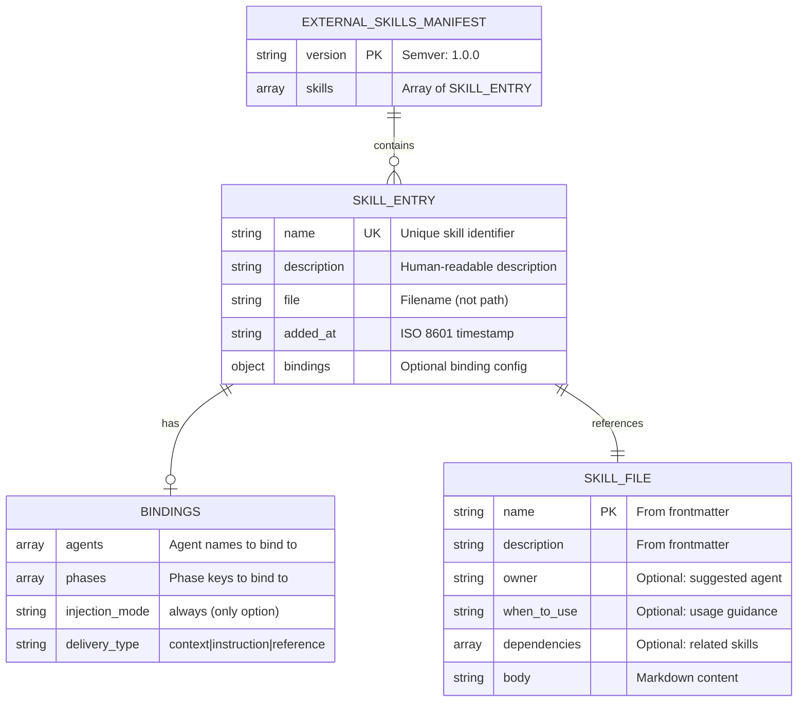

# Database Design: Custom Skill Management (REQ-0022)

**Version**: 1.0
**Created**: 2026-02-18
**Phase**: 03-architecture
**Status**: Accepted

---

## Overview

The iSDLC framework uses no database. All data is stored as JSON files on the local filesystem (see constitution preamble). This document defines the schema for the external skills manifest and the skill file format.

---

## 1. Entity-Relationship Diagram



---

## 2. Schema Definitions

### 2.1 External Skills Manifest (`external-skills-manifest.json`)

**Location**: `docs/isdlc/external-skills-manifest.json` (single-project) or `docs/isdlc/projects/{id}/external-skills-manifest.json` (monorepo)

```json
{
  "$schema": "external-skills-manifest-v1",
  "version": "1.0.0",
  "skills": []
}
```

#### Field Definitions

| Field | Type | Required | Constraints | Description |
|-------|------|----------|-------------|-------------|
| `version` | string | Yes | Semver format | Schema version. Currently "1.0.0". |
| `skills` | array | Yes | Max 50 entries (NFR-002) | Array of registered skill entries |

#### Skill Entry Schema

| Field | Type | Required | Constraints | Description |
|-------|------|----------|-------------|-------------|
| `name` | string | Yes | Unique within manifest, 1-100 chars, alphanumeric + hyphens | Skill identifier used for lookup |
| `description` | string | Yes | 1-500 chars | Human-readable description |
| `file` | string | Yes | Valid filename, `.md` extension | Filename (not path) of skill file in external skills directory |
| `added_at` | string | Yes | ISO 8601 format | Timestamp of initial registration |
| `bindings` | object | No | See Bindings schema | Binding configuration. Optional for backward compatibility (NFR-005). |

#### Bindings Schema

| Field | Type | Required | Constraints | Description |
|-------|------|----------|-------------|-------------|
| `agents` | array | Yes | Array of strings, valid agent names from PHASE_AGENT_MAP | Agent names this skill should be injected into |
| `phases` | array | Yes | Array of strings, valid phase keys | Phase keys this skill should be injected during |
| `injection_mode` | string | Yes | Enum: `"always"` | When to inject. Only `"always"` supported in v1. |
| `delivery_type` | string | Yes | Enum: `"context"`, `"instruction"`, `"reference"` | How content is presented to the agent |

#### Validation Rules

1. `name` must be unique within the `skills` array
2. `file` must end with `.md`
3. `bindings.agents` values must be valid agent names (validated against PHASE_AGENT_MAP)
4. `bindings.phases` values must be valid phase keys (validated against known phase list)
5. `bindings.injection_mode` must be `"always"` (only supported value)
6. `bindings.delivery_type` must be one of: `"context"`, `"instruction"`, `"reference"`

#### Example (Fully Populated)

```json
{
  "version": "1.0.0",
  "skills": [
    {
      "name": "nestjs-conventions",
      "description": "NestJS framework conventions and best practices",
      "file": "nestjs-conventions.md",
      "added_at": "2026-02-18T12:00:00Z",
      "bindings": {
        "agents": ["software-developer", "solution-architect"],
        "phases": ["06-implementation", "03-architecture"],
        "injection_mode": "always",
        "delivery_type": "context"
      }
    },
    {
      "name": "company-coding-standards",
      "description": "Internal coding standards and naming conventions",
      "file": "company-coding-standards.md",
      "added_at": "2026-02-18T12:05:00Z",
      "bindings": {
        "agents": ["software-developer", "qa-engineer"],
        "phases": ["06-implementation", "08-code-review"],
        "injection_mode": "always",
        "delivery_type": "instruction"
      }
    },
    {
      "name": "aws-deployment-guide",
      "description": "AWS deployment patterns and infrastructure conventions",
      "file": "aws-deployment-guide.md",
      "added_at": "2026-02-18T12:10:00Z",
      "bindings": {
        "agents": ["cicd-engineer"],
        "phases": ["10-cicd"],
        "injection_mode": "always",
        "delivery_type": "reference"
      }
    }
  ]
}
```

#### Backward Compatibility (NFR-005)

Entries without a `bindings` object are valid and represent skills registered before the binding feature was added. These entries are silently skipped during runtime injection.

```json
{
  "name": "legacy-skill",
  "description": "A skill registered before bindings were supported",
  "file": "legacy-skill.md",
  "added_at": "2026-01-15T10:00:00Z"
}
```

---

### 2.2 Skill File Format (`.md` with YAML Frontmatter)

**Location**: `.claude/skills/external/{filename}.md` (single-project) or `.isdlc/projects/{id}/skills/external/{filename}.md` (monorepo)

#### Required Frontmatter Fields

| Field | Type | Required | Description |
|-------|------|----------|-------------|
| `name` | string | Yes | Skill identifier (should match manifest entry name) |
| `description` | string | Yes | Brief description of the skill's purpose |

#### Optional Frontmatter Fields

| Field | Type | Required | Description |
|-------|------|----------|-------------|
| `owner` | string | No | Suggested primary agent (used by smart binding suggestion) |
| `when_to_use` | string | No | Guidance for when this skill applies |
| `dependencies` | string/array | No | Related skills or prerequisites |
| `skill_id` | string | No | Custom identifier for the skill |

#### Example Skill File

```markdown
---
name: nestjs-conventions
description: NestJS framework conventions and best practices
owner: software-developer
when_to_use: When implementing NestJS backend services
---

# NestJS Conventions

## Module Structure
- One module per bounded context
- Use barrel exports (index.ts) for module public API
- Controllers handle HTTP, Services handle business logic

## Naming Conventions
- Controllers: `{resource}.controller.ts`
- Services: `{resource}.service.ts`
- DTOs: `create-{resource}.dto.ts`, `update-{resource}.dto.ts`

## Dependency Injection
- Always use constructor injection
- Use custom providers for external dependencies
- Use `@Injectable()` on all service classes
```

---

## 3. Data Relationships

```
external-skills-manifest.json
  |
  +-- skills[] (1:N)
  |     |
  |     +-- name (unique key, matches skill file frontmatter name)
  |     +-- file (foreign key to skill .md file on disk)
  |     +-- bindings (1:1, optional)
  |           |
  |           +-- agents[] (references PHASE_AGENT_MAP agent names)
  |           +-- phases[] (references workflow phase keys)
  |
  +-- version (schema version)

Skill .md files (on disk)
  |
  +-- frontmatter.name (should match manifest skills[].name)
  +-- frontmatter.description (should match manifest skills[].description)
  +-- body (injected content)
```

**Referential integrity**: The manifest's `file` field references a physical `.md` file in the external skills directory. If the file is missing at injection time, the skill is skipped (fail-open per NFR-003). The manifest is the source of truth for bindings; the skill file is the source of truth for content.

---

## 4. Indexing Strategy

No traditional indexes needed (filesystem, not database). However:

- **Skill lookup by name**: Linear scan of `skills[]` array. At max 50 entries (NFR-002), this is O(50) = O(1) in practice.
- **Phase matching at injection time**: For each skill, check if `bindings.phases` includes current phase. With 50 skills and ~3 phases each, this is ~150 string comparisons = negligible.
- **File existence check**: `fs.existsSync()` per matched skill. At 1-3 matched skills per delegation, this is <1ms.

---

## 5. Migration Strategy

### Initial State (Pre-Feature)

Projects have no `external-skills-manifest.json`. The external skills directory (`.claude/skills/external/`) may or may not exist.

### After Feature Implementation

1. **First `skill add`**: Creates `external-skills-manifest.json` with `version: "1.0.0"` and one skill entry. Creates external skills directory if it does not exist.
2. **Existing manifests (if any)**: The `loadExternalManifest()` function already handles missing files and parse errors. Existing manifests without `bindings` on entries are backward-compatible.
3. **No data migration needed**: The feature is purely additive. No existing data is modified.

### Future Schema Changes

If the manifest schema needs to change (e.g., adding `injection_mode: "on_demand"` in a future release):
1. Increment `version` to "1.1.0"
2. New fields must be optional (backward compat)
3. `loadExternalManifest()` reads whatever version is present
4. Migration logic (if needed) runs on first access after upgrade

---

## 6. Backup and Recovery Strategy

- **Manifest backup**: The manifest is a small JSON file (<15KB). It can be recreated by re-adding skills. No automated backup needed.
- **Skill files**: User-authored `.md` files. Users should maintain their own copies (the framework copies files into the external skills directory, so originals should be preserved).
- **Recovery**: If the manifest is corrupted, delete it and re-add skills. `loadExternalManifest()` returns null on parse error (fail-open).
- **Updater preservation**: The iSDLC updater already preserves user artifacts (Article XIV). The external skills directory and manifest should be added to the preservation list.

---

## 7. Scalability Plan

| Metric | Current Design | Scale Limit | Growth Path |
|--------|---------------|-------------|-------------|
| Skill count | Array in JSON | 50 (NFR-002) | If >50 needed, partition by category or use index file |
| Manifest size | Single JSON file | ~15KB at 50 skills | No scaling concern |
| Skill file size | 10,000 char cap | Per-file limit | Large skills use reference delivery |
| Injection latency | Sync file reads | <100ms for 50 skills | If latency concern, cache manifest in memory |

---

## 8. Delivery Type Formatting Rules

The `delivery_type` field determines how skill content appears in the agent's Task prompt.

### Context Delivery (`"context"`)

```
EXTERNAL SKILL CONTEXT: nestjs-conventions
---
# NestJS Conventions
[skill body content]
---
```

**Use case**: Background knowledge the agent should be aware of but does not need to follow prescriptively.

### Instruction Delivery (`"instruction"`)

```
EXTERNAL SKILL INSTRUCTION (company-coding-standards): You MUST follow these guidelines:
# Company Coding Standards
[skill body content]
```

**Use case**: Prescriptive rules the agent must obey (coding standards, naming conventions).

### Reference Delivery (`"reference"`)

```
EXTERNAL SKILL AVAILABLE: aws-deployment-guide -- Read from .claude/skills/external/aws-deployment-guide.md if relevant to your current task
```

**Use case**: Large reference documents the agent should read only when relevant. No content injected into prompt.
