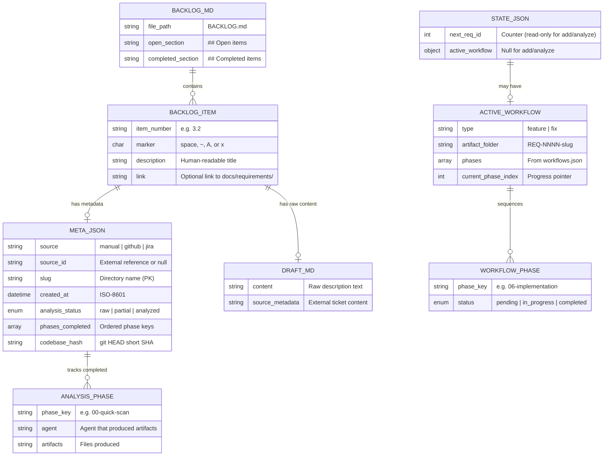

# Database Design: REQ-0023 Three-Verb Backlog Model

**Phase**: 03-architecture
**Created**: 2026-02-18
**Author**: Solution Architect (Agent 03)
**Traces**: FR-001, FR-002, FR-007, FR-009, NFR-002, NFR-003

---

## 1. Overview

The iSDLC framework uses JSON files on the local filesystem instead of a traditional database. This document defines the data schemas, relationships, and migration strategy for the three-verb backlog model.

**Data Stores Affected**:
1. `meta.json` -- per-item analysis tracking (schema v1 -> v2)
2. `BACKLOG.md` -- human-readable item index (new marker system)
3. `state.json` -- workflow state (read-only for add/analyze; write for build, unchanged schema)
4. `draft.md` -- raw item content (new file, created by `add`)

---

## 2. Entity-Relationship Diagram



---

## 3. Schema Definitions

### 3.1 meta.json v2 (New Schema)

**File location**: `docs/requirements/{slug}/meta.json`

```json
{
  "$schema": "meta-json-v2",
  "source": "manual",
  "source_id": null,
  "slug": "payment-processing",
  "created_at": "2026-02-18T15:30:00Z",
  "analysis_status": "raw",
  "phases_completed": [],
  "codebase_hash": "a0c3b41"
}
```

**Field Definitions**:

| Field | Type | Required | Default | Description | Constraints |
|-------|------|----------|---------|-------------|-------------|
| `source` | enum | Yes | `"manual"` | Item origin type | One of: `"manual"`, `"github"`, `"jira"` |
| `source_id` | string/null | Yes | `null` | External reference | Format: `"GH-42"`, `"JIRA-1250"`, or `null` |
| `slug` | string | Yes | -- | Directory name / primary key | Lowercase, hyphens, max 50 chars. Pattern: `^[a-z0-9][a-z0-9-]{0,48}[a-z0-9]$` |
| `created_at` | string | Yes | -- | Creation timestamp | ISO-8601 format |
| `analysis_status` | enum | Yes | `"raw"` | Derived analysis state | One of: `"raw"`, `"partial"`, `"analyzed"` |
| `phases_completed` | array | Yes | `[]` | Ordered list of completed analysis phases | Each element is a valid phase key string |
| `codebase_hash` | string | Yes | -- | Git HEAD short SHA at creation/last analysis | 7-char hex string |

**Valid phase key values for `phases_completed`**:
```
"00-quick-scan"
"01-requirements"
"02-impact-analysis"
"03-architecture"
"04-design"
```

**Derivation rule for `analysis_status`**:
```
count = phases_completed.filter(p => ANALYSIS_PHASES.includes(p)).length
if count == 0: "raw"
if count > 0 && count < 5: "partial"
if count >= 5: "analyzed"
```

### 3.2 meta.json v1 (Legacy Schema -- Read-Only Migration)

**Existing files**: 3 files (REQ-0020, REQ-0021, REQ-0022)

```json
{
  "source": "backlog-migration",
  "source_id": "2.2",
  "slug": "REQ-0020-t6-hook-io-optimization",
  "created_at": "2026-02-16T18:30:00Z",
  "phase_a_completed": true,
  "codebase_hash": "9780bd7"
}
```

**Migration Rules** (applied at read-time, no file rewrite):

| Legacy Field | Legacy Value | Migrated Fields |
|-------------|-------------|-----------------|
| `phase_a_completed` | `true` | `analysis_status: "analyzed"`, `phases_completed: ["00-quick-scan", "01-requirements", "02-impact-analysis", "03-architecture", "04-design"]` |
| `phase_a_completed` | `false` | `analysis_status: "raw"`, `phases_completed: []` |
| `phase_a_completed` | missing | `analysis_status: "raw"`, `phases_completed: []` |

**Schema detection**:
```javascript
function isLegacySchema(meta) {
    return 'phase_a_completed' in meta && !('analysis_status' in meta);
}
```

### 3.3 draft.md (New File)

**File location**: `docs/requirements/{slug}/draft.md`

**Structure**:
```markdown
# {Description}

**Source**: {manual | github | jira}
**Reference**: {source_id or "None"}
**Added**: {ISO-8601 timestamp}

---

## Description

{User-provided description text}

## External Content

{Content pulled from Jira/GitHub via MCP, or "No external content available."}
```

**Created by**: `add` verb only
**Modified by**: Never (immutable after creation -- analysis writes to separate files)

### 3.4 BACKLOG.md Marker Format

**File location**: `BACKLOG.md` (project root)

**Item line format**:
```
- {N.N} [{M}] {description} [-> link]
```

Where:
- `{N.N}` = section number + item number (e.g., "3.2")
- `{M}` = marker character (one of: ` `, `~`, `A`, `x`)
- `{description}` = human-readable title
- `[-> link]` = optional markdown link to docs

**Marker State Machine**:

| Marker | Character | Status | Set By |
|--------|-----------|--------|--------|
| `[ ]` | space | Raw -- item added, no analysis | `add` verb |
| `[~]` | tilde | Partial -- 1-4 analysis phases done | `analyze` verb |
| `[A]` | uppercase A | Analyzed -- all 5 phases complete | `analyze` verb |
| `[x]` | lowercase x | Completed -- workflow finished | Workflow finalize |

**Parsing Regex**:
```javascript
const BACKLOG_ITEM_REGEX = /^(\s*-\s+)(\d+\.\d+)\s+\[([ ~Ax])\]\s+(.+)$/;
// Groups: [1] prefix, [2] item number, [3] marker, [4] description
```

**Update Algorithm**:
```javascript
function updateBacklogMarker(backlogContent, itemNumber, newMarker) {
    const lines = backlogContent.replace(/\r\n/g, '\n').split('\n');
    for (let i = 0; i < lines.length; i++) {
        const match = lines[i].match(BACKLOG_ITEM_REGEX);
        if (match && match[2] === itemNumber) {
            lines[i] = match[1] + match[2] + ' [' + newMarker + '] ' + match[4];
            break;
        }
    }
    return lines.join('\n');
}
```

### 3.5 state.json (No Schema Changes)

The `state.json` schema is unchanged by this feature. Key fields used:

| Field | Used By | Access Mode |
|-------|---------|-------------|
| `counters.next_req_id` | `add` verb | Read-only (peek) |
| `active_workflow` | `build` verb | Read/Write (via orchestrator) |
| `active_workflow` | `analyze` verb | Not accessed |
| `active_workflow` | `add` verb | Not accessed |

**Critical Constraint** (NFR-002): The `add` and `analyze` verbs MUST NOT write to `state.json`. Only the `build` verb (via the orchestrator) modifies `state.json`.

---

## 4. Indexes and Access Patterns

### 4.1 Item Lookup by Slug (Primary)

**Path**: `docs/requirements/{slug}/meta.json`
**Complexity**: O(1) -- direct file path
**Used by**: All three verbs when resolving by exact slug

### 4.2 Item Lookup by BACKLOG Number

**Path**: Parse BACKLOG.md line by line
**Complexity**: O(n) where n = number of lines in BACKLOG.md
**Used by**: `analyze` and `build` verbs when resolving by "3.2" style number

### 4.3 Item Lookup by External Reference

**Path**: Scan `docs/requirements/*/meta.json` for matching `source_id`
**Complexity**: O(m) where m = number of meta.json files (currently 3)
**Used by**: `analyze` and `build` verbs when resolving by "#42" or "JIRA-1250"
**Optimization**: For small m (< 100), sequential scan is adequate. No index needed.

### 4.4 Item Lookup by Fuzzy Description

**Path**: Parse BACKLOG.md, fuzzy match descriptions
**Complexity**: O(n) where n = number of BACKLOG items
**Used by**: `analyze` and `build` verbs when input is a description fragment
**Implementation**: Case-insensitive substring match. No full-text search needed.

---

## 5. Data Relationships

```
BACKLOG.md (index)
  |-- item "3.2 [ ] Payment processing"
  |       |
  |       +-- docs/requirements/payment-processing/
  |               |-- meta.json (analysis tracking)
  |               |-- draft.md (raw content from 'add')
  |               |-- quick-scan.md (from analyze phase 00)
  |               |-- requirements-spec.md (from analyze phase 01)
  |               |-- impact-analysis.md (from analyze phase 02)
  |               |-- architecture-overview.md (from analyze phase 03)
  |               +-- module-designs/ (from analyze phase 04)
  |
  +-- .isdlc/state.json (workflow state -- separate concern)
         |-- counters.next_req_id (read-only for add)
         +-- active_workflow (only for build)
```

**Consistency Model**: BACKLOG.md and meta.json are the two representations of analysis status. They MUST be kept in sync by the `analyze` verb:
- Update meta.json first (source of truth)
- Update BACKLOG.md second (display representation)
- If BACKLOG.md update fails, meta.json is still correct (fail-safe)

---

## 6. Migration Strategy

### 6.1 Read-Time Migration (meta.json v1 -> v2)

**Approach**: No batch migration. Legacy files are converted in-memory when read.

**Implementation**:
```javascript
function readMetaJson(filePath) {
    const raw = JSON.parse(readFileSync(filePath, 'utf-8'));

    // Legacy detection
    if ('phase_a_completed' in raw && !('analysis_status' in raw)) {
        if (raw.phase_a_completed === true) {
            raw.analysis_status = 'analyzed';
            raw.phases_completed = [
                '00-quick-scan', '01-requirements',
                '02-impact-analysis', '03-architecture', '04-design'
            ];
        } else {
            raw.analysis_status = 'raw';
            raw.phases_completed = [];
        }
    }

    // Defensive defaults
    if (!raw.analysis_status) raw.analysis_status = 'raw';
    if (!Array.isArray(raw.phases_completed)) raw.phases_completed = [];

    return raw;
}
```

**Affected Files**: 3 existing meta.json files (all have `phase_a_completed: true`)
**Risk**: LOW -- defensive defaults handle any edge case
**Rollback**: Not needed -- no files are modified

### 6.2 BACKLOG.md Marker Migration

**Approach**: No migration needed.

- Existing `[ ]` items are already "raw" (same marker)
- Existing `[x]` items are already "completed" (same marker)
- `[~]` and `[A]` are new markers that only appear after `analyze` runs
- No existing items need marker changes

### 6.3 Backward Compatibility

| Scenario | Behavior |
|----------|----------|
| Old code reads new meta.json | Ignores unknown fields (`analysis_status`, `phases_completed`). Safe. |
| New code reads old meta.json | Read-time migration converts `phase_a_completed` to new fields. Safe. |
| Old code reads new BACKLOG markers `[~]`, `[A]` | Treats them as checkbox items. Does not break parsing. |
| New code reads old BACKLOG items | `[ ]` and `[x]` parse correctly via the 4-character regex. |

---

## 7. Backup and Recovery

### 7.1 Backup

- All data files are in the working tree under `docs/requirements/` and `BACKLOG.md`
- Git provides full version history
- `.isdlc/state.json` is gitignored but can be regenerated

### 7.2 Recovery Scenarios

| Scenario | Recovery |
|----------|----------|
| meta.json corrupted | Delete and re-run `add` + `analyze`. Artifacts in the slug directory are independently valid. |
| BACKLOG.md corrupted | Reconstruct from `docs/requirements/*/meta.json` files (analysis_status provides markers). |
| state.json corrupted | Standard iSDLC recovery -- re-initialize via `isdlc init`. Does not affect meta.json or BACKLOG.md. |
| draft.md deleted | Re-run `add` with the same description. Immutable file. |

---

## 8. Scalability Plan

| Metric | Current | 6-Month Projection | 12-Month Projection | Concern |
|--------|---------|--------------------|--------------------|---------|
| meta.json files | 3 | 15-20 | 30-50 | None -- O(1) lookup by slug |
| BACKLOG.md items | ~142 | ~200 | ~300 | Regex scan is O(n), fast at these sizes |
| phases_completed entries | 0-5 per file | 0-5 per file | 0-5 per file | Bounded, no concern |
| draft.md files | 0 | 10-15 | 20-30 | Tiny files, no concern |

No sharding, replication, or database engine changes are needed. The file-based approach is adequate for the projected scale of a single-developer CLI tool.
