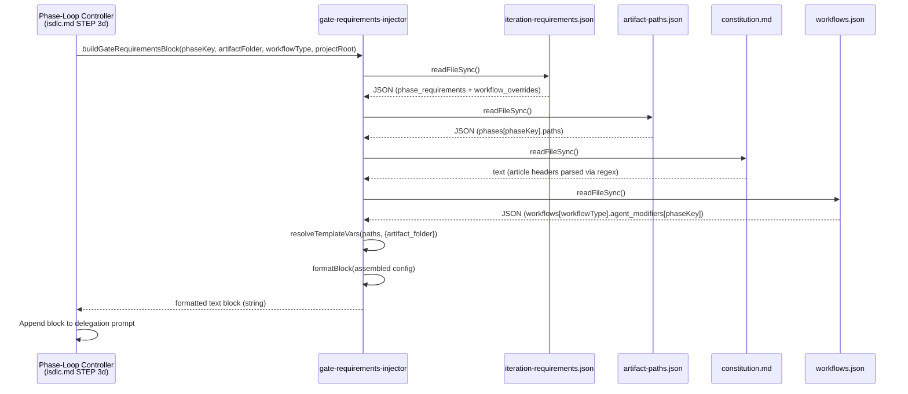

# Architecture Overview: Gate Requirements Pre-Injection

**REQ ID:** REQ-0024
**Phase:** 03-architecture
**Created:** 2026-02-18
**Status:** Accepted

---

## 1. Architecture Pattern

**Pattern:** Single utility module (library function)

This feature follows the established hooks/lib utility pattern already used by `common.cjs`, `three-verb-utils.cjs`, and `provider-utils.cjs`. It is a synchronous, stateless, read-only function that reads configuration files, transforms data, and returns a formatted string. No architectural pattern change is needed -- this extends the existing modular monolith with one new library module.

**Rationale (traces: NFR-05, CON-001):**
- The entire hooks/lib directory uses CommonJS modules with synchronous I/O
- All config loading follows the same pattern: `fs.readFileSync` + `JSON.parse` + try/catch
- Adding a new `.cjs` file to `src/claude/hooks/lib/` is the simplest approach that satisfies all constraints

---

## 2. Module Design

### 2.1 New Module: `src/claude/hooks/lib/gate-requirements-injector.cjs`

Single file, single responsibility: read gate criteria configs and format them as a text block for injection into delegation prompts.

**Exports:**

```javascript
module.exports = { buildGateRequirementsBlock };
```

**Main function signature:**

```javascript
/**
 * Build a formatted GATE REQUIREMENTS text block for a given phase.
 *
 * @param {string} phaseKey       - e.g., "06-implementation", "01-requirements"
 * @param {string} artifactFolder - e.g., "REQ-0024-gate-requirements-pre-injection"
 * @param {string} [workflowType] - e.g., "feature", "fix". For workflow-specific overrides.
 * @param {string} [projectRoot]  - Project root directory. Defaults to CWD.
 * @returns {string} Formatted GATE REQUIREMENTS block, or "" on any error.
 */
function buildGateRequirementsBlock(phaseKey, artifactFolder, workflowType, projectRoot)
```

**Design decision -- parameter order:** `phaseKey` and `artifactFolder` are required (always available at delegation time). `workflowType` and `projectRoot` are optional with sensible defaults. This matches the calling pattern in STEP 3d where phase key and artifact folder are always known, workflow type is available from state, and project root can be derived.

### 2.2 Internal Functions

All internal functions are module-private (not exported). Each returns a default value on error (empty object, empty array, empty string) to support the fail-open contract (NFR-01).

| Function | Input | Output | Error Default | Traces |
|----------|-------|--------|---------------|--------|
| `loadIterationRequirements(projectRoot)` | Project root path | Parsed JSON object from `iteration-requirements.json` | `null` | FR-01, NFR-03 |
| `loadArtifactPaths(projectRoot)` | Project root path | Parsed JSON object from `artifact-paths.json` | `null` | FR-01, FR-02, NFR-03 |
| `parseConstitutionArticles(projectRoot)` | Project root path | Map of article ID to title, e.g., `{ "I": "Specification Primacy", ... }` | `{}` | FR-03 |
| `loadWorkflowOverrides(projectRoot, workflowType)` | Project root + workflow type | Agent modifiers object for the workflow, or `null` | `null` | FR-04 |
| `resolveTemplateVars(pathStr, vars)` | Path string + variables map | Resolved path string | Original path string | FR-02 |
| `formatBlock(config)` | Assembled config object | Formatted text block string | `""` | FR-05 |

### 2.3 Module Dependencies

```
gate-requirements-injector.cjs
  |-- requires --> fs (Node.js built-in)
  |-- requires --> path (Node.js built-in)
  |-- requires --> ./common.cjs::getProjectRoot() (existing, optional fallback)
```

No new npm dependencies. No new file formats. (Traces: CON-003, NFR-05)

---

## 3. Data Flow

### 3.1 Sequence Diagram



### 3.2 Data Assembly Pipeline

The `buildGateRequirementsBlock` function executes this pipeline:

```
1. LOAD phase requirements
   iteration-requirements.json -> phase_requirements[phaseKey]
   If workflowType provided:
     iteration-requirements.json -> workflow_overrides[workflowType][phaseKey]
     Deep-merge overrides into base phase requirements

2. LOAD artifact paths
   artifact-paths.json -> phases[phaseKey].paths[]
   Resolve {artifact_folder} template variable in each path

3. PARSE constitutional articles (only if constitutional_validation.enabled)
   constitution.md -> regex match "### Article {ID}: {Title}"
   Build map: { "I": "Specification Primacy", "VII": "Artifact Traceability", ... }
   Map each required article ID to its title (fallback: "Article {ID} (unknown)")

4. LOAD workflow agent modifiers (only if workflowType provided)
   workflows.json -> workflows[workflowType].agent_modifiers[phaseKey]

5. FORMAT output block
   Assemble all sections into the GATE REQUIREMENTS text block
   Return formatted string
```

### 3.3 Config File Path Resolution

The utility reads config files from both source and runtime locations, matching the pattern established in `gate-blocker.cjs` (lines 35-76 of the current file):

| Config File | Primary Path | Fallback Path |
|-------------|-------------|---------------|
| `iteration-requirements.json` | `{projectRoot}/src/claude/hooks/config/iteration-requirements.json` | `{projectRoot}/.claude/hooks/config/iteration-requirements.json` |
| `artifact-paths.json` | `{projectRoot}/src/claude/hooks/config/artifact-paths.json` | `{projectRoot}/.claude/hooks/config/artifact-paths.json` |
| `constitution.md` | `{projectRoot}/docs/isdlc/constitution.md` | (none -- single location) |
| `workflows.json` | `{projectRoot}/.isdlc/config/workflows.json` | (none -- single location) |

The dual-path lookup for config JSON files accounts for the dogfooding setup where `src/claude/` is the source of truth and `.claude/` is the runtime copy. The utility checks the `src/` path first (matching the NFR-03 single-source-of-truth requirement), then falls back to `.claude/` for non-dogfooding projects.

---

## 4. Output Format

### 4.1 GATE REQUIREMENTS Block Template

```
GATE REQUIREMENTS (Phase: {phase_key}):
  Iteration Requirements:
    - test_iteration: {enabled|disabled}
      {if enabled: max_iterations: N, circuit_breaker: N, min_coverage: N%}
    - constitutional_validation: {enabled|disabled}
      {if enabled: max_iterations: N}
    - artifact_validation: {enabled|disabled}
    - interactive_elicitation: {enabled|disabled}
      {if enabled: min_menu_interactions: N}
    - agent_delegation_validation: {enabled|disabled}
    - atdd_validation: {enabled|disabled}
      {if enabled: requires: [list]}
  Required Artifacts:
    - {resolved path 1}
    - {resolved path 2}
  Constitutional Articles:
    - Article {ID}: {Title}
    - Article {ID}: {Title}
  Workflow Overrides:
    {key: value pairs from agent_modifiers, or "none"}
```

### 4.2 Example: Phase 06-implementation, Feature Workflow

```
GATE REQUIREMENTS (Phase: 06-implementation):
  Iteration Requirements:
    - test_iteration: enabled
      max_iterations: 10, circuit_breaker: 3, min_coverage: 80%
    - constitutional_validation: enabled
      max_iterations: 5
    - artifact_validation: disabled
    - interactive_elicitation: disabled
    - agent_delegation_validation: enabled
    - atdd_validation: enabled (conditional: when atdd_mode)
  Required Artifacts:
    (none for this phase)
  Constitutional Articles:
    - Article I: Specification Primacy
    - Article II: Test-First Development
    - Article III: Security by Design
    - Article V: Simplicity First
    - Article VI: Code Review Required
    - Article VII: Artifact Traceability
    - Article VIII: Documentation Currency
    - Article IX: Quality Gate Integrity
    - Article X: Fail-Safe Defaults
  Workflow Overrides:
    (none for feature/06-implementation)
```

### 4.3 Example: Phase 01-requirements, Feature Workflow

```
GATE REQUIREMENTS (Phase: 01-requirements):
  Iteration Requirements:
    - test_iteration: disabled
    - constitutional_validation: enabled
      max_iterations: 5
    - artifact_validation: enabled
    - interactive_elicitation: enabled
      min_menu_interactions: 3
    - agent_delegation_validation: enabled
    - atdd_validation: disabled
  Required Artifacts:
    - docs/requirements/REQ-0024-gate-requirements-pre-injection/requirements-spec.md
  Constitutional Articles:
    - Article I: Specification Primacy
    - Article IV: Explicit Over Implicit
    - Article VII: Artifact Traceability
    - Article IX: Quality Gate Integrity
    - Article XII: Cross-Platform Compatibility
  Workflow Overrides:
    scope: feature
    artifact_prefix: REQ
    read_quick_scan: true
```

---

## 5. Integration Point: STEP 3d in isdlc.md

### 5.1 Current Delegation Prompt Structure

```
Use Task tool -> {agent_name} with:
  "Execute Phase {NN} - {Phase Name} for {workflow_type} workflow.
   Artifact folder: {artifact_folder}
   Phase key: {phase_key}
   {WORKFLOW MODIFIERS: {json} -- if applicable}
   {DISCOVERY CONTEXT: ... -- if phase 02 or 03}
   {SKILL INDEX BLOCK -- ...}
   {EXTERNAL SKILL INJECTION -- ...}
   Validate GATE-{NN} on completion."
```

### 5.2 Modified Delegation Prompt Structure

```
Use Task tool -> {agent_name} with:
  "Execute Phase {NN} - {Phase Name} for {workflow_type} workflow.
   Artifact folder: {artifact_folder}
   Phase key: {phase_key}
   {WORKFLOW MODIFIERS: {json} -- if applicable}
   {DISCOVERY CONTEXT: ... -- if phase 02 or 03}
   {SKILL INDEX BLOCK -- ...}
   {EXTERNAL SKILL INJECTION -- ...}
   {GATE REQUIREMENTS -- read from iteration-requirements.json + artifact-paths.json
    for current phase/workflow, format as GATE REQUIREMENTS block using
    buildGateRequirementsBlock(phaseKey, artifactFolder, workflowType, projectRoot).
    Fail-open: if anything fails, continue with the unmodified prompt.}
   Validate GATE-{NN} on completion."
```

### 5.3 Integration Semantics

The GATE REQUIREMENTS block is:
- **Additive** -- appended after existing blocks, before the final "Validate GATE-{NN}" line
- **Fail-open** -- if the utility returns empty string, no block is appended (prompt unchanged)
- **Informational** -- provides context for the phase agent; hooks remain the enforcement mechanism
- **Idempotent** -- calling the utility multiple times with the same inputs produces the same output

The integration instruction in isdlc.md follows the same pattern as EXTERNAL SKILL INJECTION: a prose block describing the logic to execute, with explicit fail-open semantics.

---

## 6. Error Handling Architecture

### 6.1 Fail-Open Contract (NFR-01)

Every function in the module wraps its body in a try/catch and returns a safe default on error:

```javascript
function loadIterationRequirements(projectRoot) {
    try {
        // ... read and parse ...
        return parsed;
    } catch (e) {
        return null;  // fail-open
    }
}
```

The top-level `buildGateRequirementsBlock` has its own outer try/catch that returns `""` on any unhandled error, providing a double safety net:

```javascript
function buildGateRequirementsBlock(phaseKey, artifactFolder, workflowType, projectRoot) {
    try {
        // ... call internal functions, assemble, format ...
        return formattedBlock;
    } catch (e) {
        return '';  // fail-open: return empty string, never throw
    }
}
```

### 6.2 Error Scenarios and Responses

| Scenario | Internal Function | Behavior | Result |
|----------|-------------------|----------|--------|
| `iteration-requirements.json` missing | `loadIterationRequirements` | Returns `null` | Block has no iteration requirements section content |
| `iteration-requirements.json` invalid JSON | `loadIterationRequirements` | Caught by `JSON.parse`, returns `null` | Same as above |
| Phase key not found in config | `buildGateRequirementsBlock` | No requirements for this phase | Returns `""` (nothing to report) |
| `artifact-paths.json` missing | `loadArtifactPaths` | Returns `null` | Block omits Required Artifacts section |
| `constitution.md` missing | `parseConstitutionArticles` | Returns `{}` | Article IDs shown as raw fallbacks: "Article VII (unknown)" |
| `constitution.md` has unexpected format | `parseConstitutionArticles` | Regex finds no matches, returns `{}` | Same as above |
| `workflows.json` missing | `loadWorkflowOverrides` | Returns `null` | Block omits Workflow Overrides section |
| `workflowType` not in `workflows.json` | `loadWorkflowOverrides` | Property access returns `undefined` | Same as above |
| `projectRoot` is invalid path | All load functions | `readFileSync` throws, caught | Top-level returns `""` |
| Any unexpected runtime error | `buildGateRequirementsBlock` | Outer catch | Returns `""` |

### 6.3 No Logging

The utility does not log errors to files or stderr. This matches the isdlc.md convention: the phase-loop controller is a markdown instruction file, not a hook process. Errors silently degrade to empty output. If debugging is needed, the developer can call the utility directly from a test and inspect the result.

---

## 7. Security Architecture

### 7.1 Threat Model (STRIDE, scoped to this feature)

| Threat | Category | Mitigation | Risk |
|--------|----------|------------|------|
| Config file tampered with malicious content | Tampering | Config files are under version control (src/claude/hooks/config/). Constitution is in docs/isdlc/. All are local-only, not writable by agents (state-write-validator hook blocks .isdlc/ writes, explore-readonly-enforcer blocks src/ writes). | Very Low |
| Path traversal via `artifactFolder` input | Tampering | The input is used only for string replacement in `{artifact_folder}` within paths read from a trusted JSON file. No file system operations use the resolved path -- it is output as text. | Very Low |
| Denial of service via large config file | Denial of Service | Config files are framework-owned, small (< 50KB each). No user-uploaded content. `readFileSync` reads into memory but the files are bounded. | Negligible |
| Information disclosure via error messages | Information Disclosure | The utility returns `""` on error, never exception details. No error messages are passed to the delegation prompt. | Very Low |

### 7.2 Input Validation

| Parameter | Validation | Behavior on Invalid |
|-----------|-----------|-------------------|
| `phaseKey` | Must be a non-empty string | Returns `""` |
| `artifactFolder` | Must be a non-empty string | Returns `""` |
| `workflowType` | Optional. If provided, must be string | Ignored if not string |
| `projectRoot` | Optional. Defaults to CWD via `getProjectRoot()` | Falls back to `process.cwd()` |

### 7.3 Path Handling

All file paths are constructed using `path.join()` from a trusted project root and hardcoded relative segments. No user input is used to construct file paths directly. The `artifactFolder` parameter is only used in string replacement within artifact path templates (which are themselves read from a trusted JSON file) and appears in the output text block -- it is never passed to `fs` functions.

---

## 8. Performance

### 8.1 Budget: < 100ms (NFR-02)

The utility reads 3-4 small files synchronously:
- `iteration-requirements.json`: ~25KB
- `artifact-paths.json`: ~1KB
- `constitution.md`: ~15KB
- `workflows.json`: ~10KB (optional)

Total I/O: ~50KB of synchronous reads. On local SSD, each `readFileSync` completes in < 1ms. JSON parsing and string formatting are negligible. The 100ms budget is generous.

### 8.2 No Caching

Config files are read fresh on each invocation (see ADR-0001 below). The utility is called once per phase delegation -- there is no hot loop or repeated invocation within a single phase.

---

## 9. Compatibility

### 9.1 Backward Compatibility (NFR-04)

- When the utility is not available (e.g., older framework version), isdlc.md skips the GATE REQUIREMENTS block. The delegation prompt is identical to the current format.
- When the utility returns `""`, no block is appended. The prompt is identical to the current format.
- The utility does not modify any existing prompt content. It is purely additive.

### 9.2 Forward Compatibility

- New iteration requirement types (e.g., future `security_validation`) will appear in `iteration-requirements.json` and will be automatically included in the block by the formatter (which iterates over all keys in the phase config).
- New constitutional articles will be automatically picked up by the parser (regex-based, not hardcoded IDs).
- New template variables can be added by extending the `vars` map passed to `resolveTemplateVars`.

### 9.3 Module System Consistency (NFR-05, CON-001)

- File: `gate-requirements-injector.cjs` (explicit CommonJS extension)
- Exports: `module.exports = { buildGateRequirementsBlock }`
- Imports: `require('fs')`, `require('path')`, `require('./common.cjs')`
- No ESM syntax (`import`/`export`)

---

## 10. Test Strategy (High-Level)

The test file `src/claude/hooks/tests/gate-requirements-injector.test.cjs` will cover:

| Test Category | Count (est.) | Traces |
|---------------|-------------|--------|
| Happy path: known phase with all configs present | 3-4 | FR-01, FR-05 |
| Template variable resolution | 3 | FR-02 (AC-02-01 through AC-02-03) |
| Constitution article mapping | 4 | FR-03 (AC-03-01 through AC-03-04) |
| Workflow override merging | 5 | FR-04 (AC-04-01 through AC-04-05) |
| Output format validation | 6 | FR-05 (AC-05-01 through AC-05-06) |
| Fail-open: missing files | 4 | NFR-01 (AC-01-04 through AC-01-07) |
| Fail-open: invalid JSON | 2 | NFR-01 |
| Fail-open: invalid inputs | 3 | NFR-01 |
| Performance: < 100ms | 1 | NFR-02 |
| **Total** | **~31** | |

Test infrastructure uses the existing CJS test pattern: `node:test` + `node:assert/strict`, temp directories via `hook-test-utils.cjs::setupTestEnv()`, fixture config files created in each test.

---

## 11. Architecture Decision Records

### ADR-0001: Read Config Files Fresh Each Invocation (No Caching)

**Status:** Accepted

**Context:**
The `buildGateRequirementsBlock` function reads 3-4 config files on each call. The existing hooks library (`common.cjs`) implements a per-process config cache with mtime-based invalidation for hooks that run many times per session (skill validation, gate blocking). The question is whether `gate-requirements-injector` should use the same caching pattern.

**Decision:**
Read config files fresh on each invocation. Do not implement caching.

**Rationale:**
1. **Invocation frequency is low**: The utility is called once per phase delegation. A typical workflow has 5-9 phases. Total invocations per workflow: 5-9.
2. **Caching adds complexity for negligible benefit**: The mtime-based cache in `common.cjs` exists because hooks run hundreds of times per session (on every tool call). This utility runs single-digit times.
3. **Fresh reads guarantee consistency**: If a config file is updated between phases (e.g., manual edit to iteration-requirements.json during a supervised workflow), fresh reads pick up the change immediately.
4. **Performance is not a concern**: Four synchronous reads of small files (< 50KB total) complete in < 5ms. Well within the 100ms budget (NFR-02).
5. **Simplicity** (Article V): No cache state to manage, no invalidation logic, no test surface for cache correctness.

**Consequences:**
- Positive: Simpler code, no cache-related bugs, always-fresh data
- Positive: Easier to test (no cache state to set up or tear down)
- Negative: Marginally more I/O per invocation (~4 file reads vs 0 cache hits). Acceptable given the low invocation frequency.

**Alternatives Considered:**
- Use `common.cjs` config cache (`_configCache` Map): Rejected. The cache is process-scoped and designed for long-lived hook processes. The utility is called from isdlc.md context where process lifecycle is different.
- Lazy singleton cache within the module: Rejected. Adds complexity for 5-9 total reads.

**Traces:** NFR-02, Article V (Simplicity First)

---

### ADR-0002: Constitution Parsing via Regex Line Scan

**Status:** Accepted

**Context:**
The utility needs to map article IDs (Roman numerals) to titles from `constitution.md`. The constitution uses Markdown headers: `### Article {ID}: {Title}`. Two approaches were considered: (a) regex matching on each line, or (b) a full Markdown parser.

**Decision:**
Use regex matching: `/^### Article ([IVXLC]+):\s*(.+)$/` applied line-by-line.

**Rationale:**
1. **Single, stable pattern**: All 14 articles follow the same header format. The pattern has been stable since constitution v1.0.0.
2. **No new dependencies**: A Markdown parser would add an npm dependency (violating CON-003 indirectly by increasing the dependency surface).
3. **Performance**: Line-by-line regex on a ~15KB file is negligible. A full parser would be overkill.
4. **Graceful degradation**: If the format changes, the regex simply finds no matches and the fallback (raw article IDs) applies. No crash, no corrupted output.

**Consequences:**
- Positive: Zero dependencies, fast, simple
- Positive: Graceful degradation on format changes
- Negative: Brittle if the header format changes significantly (e.g., different heading level, different separator). Mitigated by: constitution format is governed by the framework itself and changes are rare and deliberate.

**Traces:** FR-03, NFR-01, Article V (Simplicity First)

---

### ADR-0003: Output as Plain Text (Not Structured JSON)

**Status:** Accepted

**Context:**
The GATE REQUIREMENTS block could be formatted as structured JSON (machine-parseable) or plain text (human-readable). Phase agents are LLMs that read delegation prompts as natural language.

**Decision:**
Use plain text with indented sections (see Section 4 of this document).

**Rationale:**
1. **Consumer is an LLM**: Phase agents read the delegation prompt as natural language. A well-formatted text block is more naturally interpreted than a JSON blob.
2. **Consistency with existing blocks**: WORKFLOW MODIFIERS uses JSON, but DISCOVERY CONTEXT and SKILL INDEX use formatted text. The GATE REQUIREMENTS block follows the text convention for maximum readability.
3. **No parsing requirement**: Agents do not need to extract individual values programmatically. They read the block holistically to understand what is expected of them.
4. **Easier to extend**: Adding a new section or field to the text block does not require schema changes.

**Consequences:**
- Positive: Naturally readable by LLM agents
- Positive: Easy to extend without schema versioning
- Negative: Not machine-parseable if a future consumer needs structured data. Mitigated by: the utility can export a `getGateRequirementsConfig(...)` function returning structured data in a future iteration if needed.

**Traces:** FR-05, NFR-04 (backward compatible with existing prompt format)

---

## 12. Traceability Matrix

| Requirement | Architecture Section | ADR |
|-------------|---------------------|-----|
| FR-01 (Config Reading) | Section 2.2, 3.2, 3.3 | -- |
| FR-02 (Template Resolution) | Section 2.2, 3.2 step 2 | -- |
| FR-03 (Constitution Parsing) | Section 2.2, 3.2 step 3 | ADR-0002 |
| FR-04 (Workflow Overrides) | Section 2.2, 3.2 step 4, 3.3 | -- |
| FR-05 (Formatted Output) | Section 4 | ADR-0003 |
| FR-06 (STEP 3d Integration) | Section 5 | -- |
| NFR-01 (Fail-Open) | Section 6 | -- |
| NFR-02 (Performance < 100ms) | Section 8 | ADR-0001 |
| NFR-03 (Single Source of Truth) | Section 3.3 | -- |
| NFR-04 (Backward Compatible) | Section 9.1 | -- |
| NFR-05 (CJS Module) | Section 9.3 | -- |
| CON-001 (CJS in hooks/lib) | Section 9.3 | -- |
| CON-002 (Sync I/O) | Section 2.2, 8.1 | -- |
| CON-003 (No new config formats) | Section 2.3, 3.3 | ADR-0002 |
| CON-004 (Hooks remain enforcement) | Section 5.3 | -- |
| CON-005 (Template vars limited) | Section 3.2 step 2 | -- |
| Article III (Security by Design) | Section 7 | -- |
| Article IV (Explicit Over Implicit) | Sections 6.2, 6.3 (all error scenarios documented) | -- |
| Article V (Simplicity First) | ADR-0001, ADR-0002, ADR-0003 | -- |
| Article VII (Artifact Traceability) | Section 12 | -- |
| Article IX (Quality Gate Integrity) | Section 5.3 (hooks remain enforcement) | -- |
| Article X (Fail-Safe Defaults) | Section 6 (fail-open contract) | -- |

---

## 13. Risks and Mitigations

| Risk | Probability | Impact | Mitigation |
|------|-------------|--------|-----------|
| Config file schema changes break parsing | Low | Low | Fail-open returns empty string; utility reads what it can, skips what it cannot |
| Constitution format changes break regex | Very Low | Low | Fallback to raw article IDs; constitution format is framework-governed |
| Phase agents ignore the GATE REQUIREMENTS block | Medium | Low | No regression -- behavior reverts to status quo (agents discover criteria via hook blocks) |
| isdlc.md integration instruction is misinterpreted by the LLM orchestrator | Low | Medium | Follow the exact same pattern as EXTERNAL SKILL INJECTION (proven to work) |
| workflows.json relocates or changes schema | Low | Low | Fail-open; override section omitted silently |

---

## 14. File Inventory

| File | Action | Purpose |
|------|--------|---------|
| `src/claude/hooks/lib/gate-requirements-injector.cjs` | CREATE | Utility module (FR-01 through FR-05) |
| `src/claude/hooks/tests/gate-requirements-injector.test.cjs` | CREATE | Unit tests (~31 test cases) |
| `src/claude/commands/isdlc.md` | MODIFY | STEP 3d: append GATE REQUIREMENTS injection instruction (FR-06) |

No other files are created or modified.

---

## 15. Handoff to Design Phase

The design phase (Phase 04) should produce:

1. **Detailed function pseudocode** for each internal function in Section 2.2
2. **Test case specifications** with exact expected output strings for the format validation tests
3. **Integration specification** for the exact text to add to isdlc.md STEP 3d
4. **Edge case catalog** expanding on Section 6.2 with exact input/output pairs

The architecture is intentionally simple. The design phase will focus on specifying exact behavior (formatting details, whitespace, section ordering, conditional sections) rather than structural decisions.
