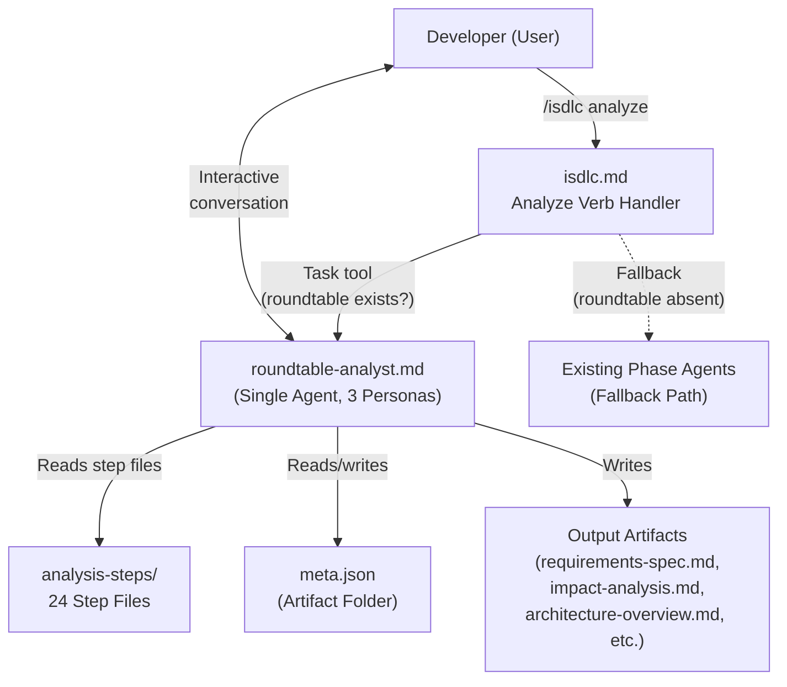
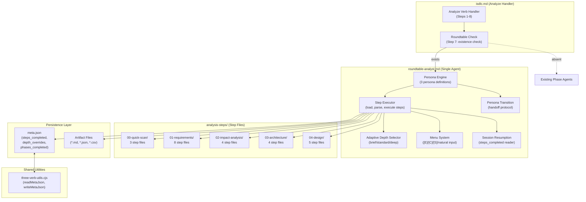
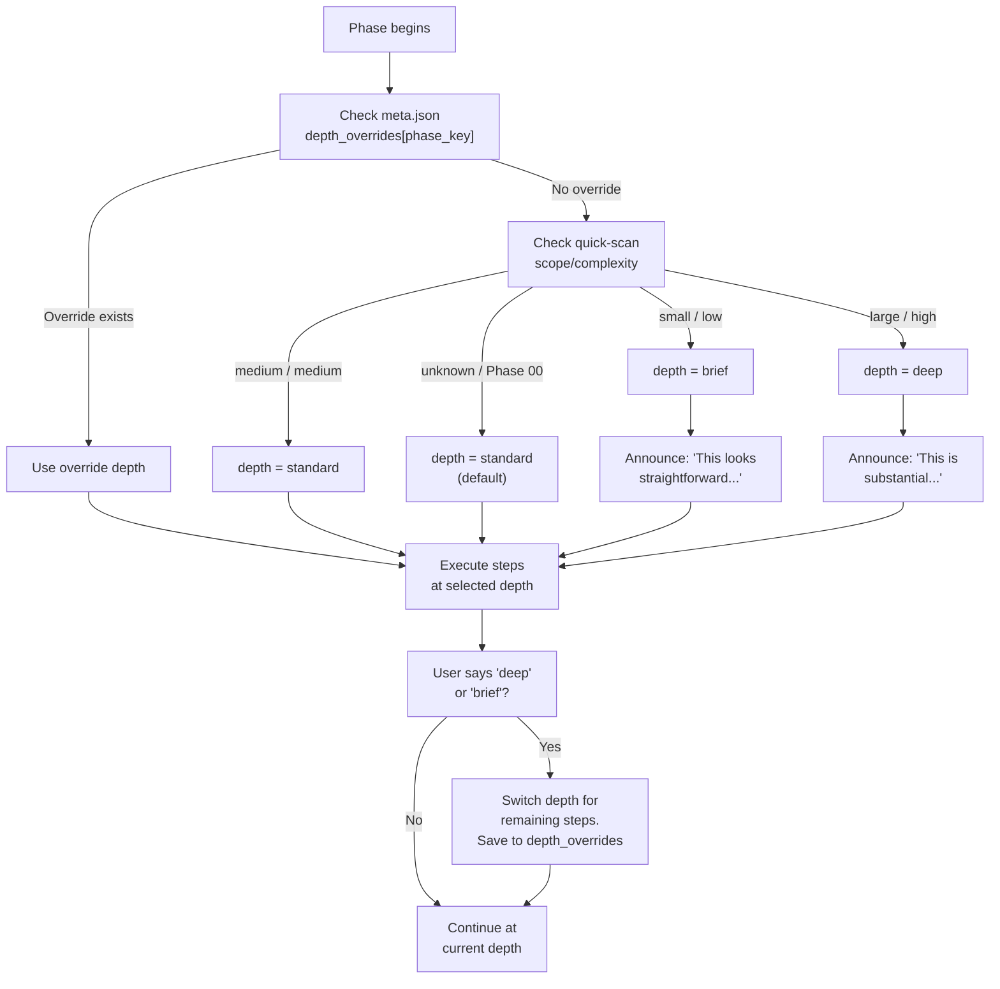
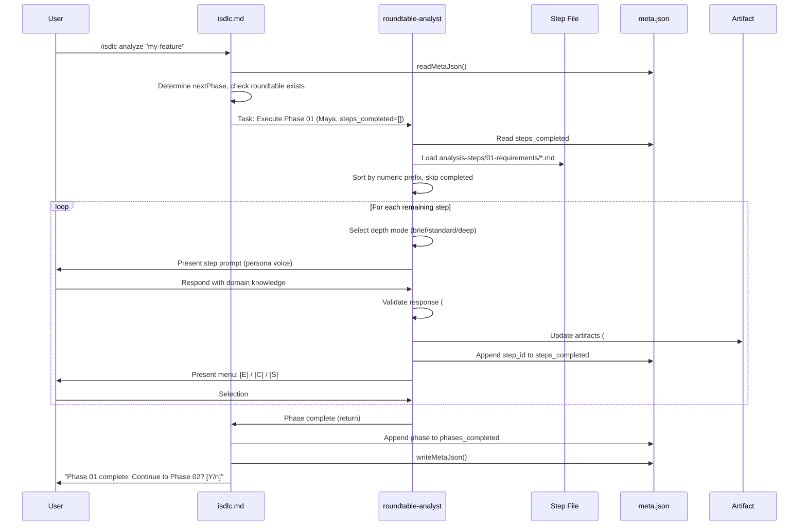
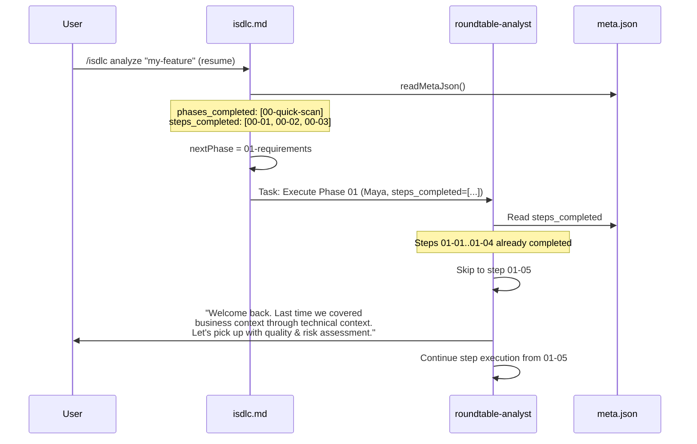
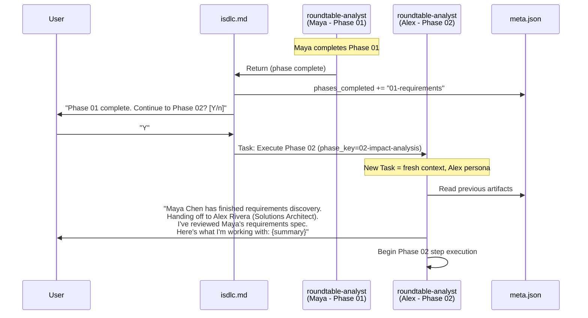

# Architecture Overview: Roundtable Analysis Agent with Named Personas

**Feature ID**: REQ-ROUNDTABLE-ANALYST (GH-20)
**Phase**: 03-architecture
**Date**: 2026-02-19
**Traces**: FR-001 through FR-012, NFR-001 through NFR-006, CON-001 through CON-006

---

## 1. System Context (C4 Level 1)

The roundtable analysis agent sits within the iSDLC framework as a new delegation target for the analyze verb. It replaces the per-phase agent delegation pattern with a single-agent, multi-persona pattern during analysis.



**Trust boundary**: The roundtable agent operates entirely within the local filesystem. No network calls, no external services. All data flows through the Task tool delegation protocol and local file I/O.

---

## 2. Container Diagram (C4 Level 2)



---

## 3. Architecture Pattern: Single-Agent Persona Router

### Pattern Selection

**Chosen Pattern**: Single-agent with inline persona definitions and file-based step routing.

This is the simplest architecture that meets all requirements (Article V: Simplicity First). The roundtable agent is one markdown file containing:
1. Three persona definitions (inline, per CON-001)
2. A phase-to-persona mapping table
3. Step execution logic (load, parse YAML frontmatter, execute body)
4. Menu system logic
5. Adaptive depth logic
6. Session resumption logic

**Why not multi-agent**: Multiple agent files (one per persona) would require cross-agent state sharing, increase the agent count, and add complexity to the delegation chain. CON-001 explicitly prohibits this.

**Why not plugin/extension model**: A dynamic plugin system for personas would violate Article V (Simplicity First). Three fixed personas are sufficient for the initial release, and the step-file system already provides extensibility at the step level (NFR-004).

See ADR-0001 for the full decision record.

---

## 4. Component Architecture

### 4.1 Roundtable Agent Internal Structure

The `roundtable-analyst.md` agent file is organized into these logical sections:

```
roundtable-analyst.md
|
+-- YAML Frontmatter
|   (name, description, model: opus, owned_skills)
|
+-- Section 1: Persona Definitions
|   +-- 1.1 Maya Chen (Business Analyst)
|   +-- 1.2 Alex Rivera (Solutions Architect)
|   +-- 1.3 Jordan Park (System Designer)
|   +-- 1.4 Phase-to-Persona Mapping Table
|
+-- Section 2: Step Execution Engine
|   +-- 2.1 Step File Discovery (glob analysis-steps/{phase-key}/)
|   +-- 2.2 Step File Parsing (YAML frontmatter + body sections)
|   +-- 2.3 Step Execution Loop (sequential, depth-aware)
|   +-- 2.4 Progress Tracking (meta.json steps_completed updates)
|
+-- Section 3: Adaptive Depth Logic
|   +-- 3.1 Depth Determination (quick-scan scope -> depth)
|   +-- 3.2 User Override Detection ("deep"/"brief" keywords)
|   +-- 3.3 Depth Persistence (meta.json depth_overrides)
|
+-- Section 4: Menu System
|   +-- 4.1 Step Boundary Menu ([E]/[C]/[S]/natural)
|   +-- 4.2 Phase Boundary Menu ([C] Continue to {next phase})
|   +-- 4.3 Natural Input Handler
|   +-- 4.4 Elaboration Stub (#21 placeholder)
|
+-- Section 5: Session Management
|   +-- 5.1 Context Recovery (read meta.json, determine resume point)
|   +-- 5.2 Greeting Protocol (new session vs. resumed session)
|   +-- 5.3 Persona Transition Protocol (handoff messages)
|
+-- Section 6: Artifact Production
|   +-- 6.1 Output Compatibility (same files as existing agents)
|   +-- 6.2 Artifact Update Instructions (per step file `outputs` field)
```

### 4.2 Step File Internal Structure

Each step file follows this structure:

```markdown
---
step_id: "01-03"
title: "User Experience & Journeys"
persona: "business-analyst"
depth: "standard"
outputs:
  - requirements-spec.md
depends_on: []
skip_if: ""
---

## Brief Mode

{Condensed prompt: present draft summary for confirmation}

## Standard Mode

{Default prompt: 2-3 focused questions with validation criteria}

## Deep Mode

{Extended prompt: multi-question discovery with follow-up probing}

## Validation

{Criteria for evaluating user responses before proceeding}

## Artifacts

{Instructions for updating output files after this step completes}
```

### 4.3 Phase-to-Persona Mapping

| Phase Key | Persona | Persona Name | Role |
|-----------|---------|--------------|------|
| `00-quick-scan` | `business-analyst` | Maya Chen | Quick scope estimation |
| `01-requirements` | `business-analyst` | Maya Chen | Requirements discovery |
| `02-impact-analysis` | `solutions-architect` | Alex Rivera | Impact and blast radius |
| `03-architecture` | `solutions-architect` | Alex Rivera | Architecture decisions |
| `04-design` | `system-designer` | Jordan Park | Detailed design |
| `{unknown}` | `business-analyst` | Maya Chen | Fallback (FR-003 AC-003-06) |

---

## 5. Data Flow

### 5.1 Primary Analysis Flow

```
1. User invokes: /isdlc analyze "my-feature"
2. isdlc.md resolves item, reads meta.json, determines nextPhase
3. isdlc.md checks: does roundtable-analyst.md exist?
   YES -> delegate to roundtable-analyst via Task tool
   NO  -> delegate to standard phase agent (existing behavior)
4. roundtable-analyst receives: phase_key, meta.json content, artifact_folder, depth_context
5. roundtable-analyst:
   a. Reads meta.json -> steps_completed, depth_overrides
   b. Determines active persona from phase_key
   c. Determines depth from quick-scan scope + depth_overrides
   d. Loads step files from analysis-steps/{phase_key}/
   e. Skips completed steps (from steps_completed)
   f. For each remaining step:
      i.   Select depth mode (brief/standard/deep)
      ii.  Present step prompt from appropriate ## Mode section
      iii. Engage user in conversation
      iv.  Validate user responses per ## Validation section
      v.   Update artifacts per ## Artifacts section
      vi.  Append step_id to steps_completed
      vii. Write meta.json
      viii. Present menu: [E] Elaboration / [C] Continue / [S] Skip / natural input
   g. After all steps: return to isdlc.md
6. isdlc.md updates phases_completed, analysis_status, codebase_hash
7. isdlc.md offers exit point: "Phase {NN} complete. Continue? [Y/n]"
8. If user continues: repeat from step 3 with next phase
```

### 5.2 Meta.json Data Model

The meta.json schema is extended with two new fields. Both are optional and default gracefully when absent, maintaining backward compatibility with existing consumers.

```json
{
  "description": "Roundtable analysis agent with named personas",
  "source": "github",
  "source_id": "GH-20",
  "created_at": "2026-02-19T00:00:00.000Z",
  "analysis_status": "partial",
  "phases_completed": ["00-quick-scan", "01-requirements"],
  "codebase_hash": "abc1234",

  "steps_completed": ["00-01", "00-02", "00-03", "01-01", "01-02", "01-03", "01-04", "01-05", "01-06", "01-07", "01-08"],
  "depth_overrides": {
    "01-requirements": "brief"
  }
}
```

**New fields**:
- `steps_completed` (string[]): Flat array of step_ids that have been completed. Default: `[]`. Maximum size: 24 entries (current step count). Traces: FR-005.
- `depth_overrides` (object): Map of phase_key to depth override string. Default: `{}`. Traces: FR-006.

**Backward compatibility**: `readMetaJson()` defaults these to `[]` and `{}` when absent. `writeMetaJson()` preserves them through the write cycle. Existing consumers that never read these fields are unaffected. Traces: NFR-005.

---

## 6. Integration Points

### 6.1 isdlc.md Analyze Handler (Step 7 Modification)

The change to `isdlc.md` is a conditional branch at step 7. The existing delegation pattern is preserved as the else branch.

**Current behavior** (step 7):
```
For each remaining phase:
  Delegate to standard phase agent via Task tool
```

**New behavior** (step 7):
```
For each remaining phase:
  IF roundtable-analyst.md exists at src/claude/agents/:
    Delegate to roundtable-analyst via Task tool with:
      - phase_key
      - meta.json content (including steps_completed, depth_overrides)
      - artifact_folder path
      - quick-scan scope (if available, for adaptive depth)
    ANALYSIS MODE constraints apply (no state.json, no branches)
  ELSE:
    Delegate to standard phase agent via Task tool (existing behavior)
```

**Estimated change**: 15-20 lines added to step 7 area (lines 587-596 of isdlc.md). The change is a simple if/else wrapper around the existing delegation call.

### 6.2 three-verb-utils.cjs Extensions

Two additive changes to `readMetaJson()` and `writeMetaJson()`:

**readMetaJson() additions** (after existing defensive defaults, ~line 235):
```javascript
// Roundtable step-tracking defaults (REQ-ROUNDTABLE-ANALYST)
if (!Array.isArray(raw.steps_completed)) {
    raw.steps_completed = [];
}
if (typeof raw.depth_overrides !== 'object' || raw.depth_overrides === null || Array.isArray(raw.depth_overrides)) {
    raw.depth_overrides = {};
}
```

**writeMetaJson()**: No changes needed. The function already writes the full meta object, so `steps_completed` and `depth_overrides` are preserved automatically when present. The only concern is that `delete meta.phase_a_completed` does not remove the new fields -- it does not, since it only deletes the legacy field.

### 6.3 Delegation Protocol

The Task tool prompt from isdlc.md to roundtable-analyst includes:

```
Execute Phase {NN} - {Phase Name} for analysis.

ANALYSIS MODE: Do NOT write to state.json. Do NOT create branches.

Artifact folder: {slug}
Artifact path: docs/requirements/{slug}/
Phase key: {phase_key}

META CONTEXT:
  steps_completed: {JSON array}
  depth_overrides: {JSON object}
  phases_completed: {JSON array}

DEPTH CONTEXT:
  quick_scan_scope: {small|medium|large|unknown}
  quick_scan_file_count: {N}
  quick_scan_complexity: {low|medium|high}

Produce artifacts compatible with existing phase agent outputs.
Update meta.json steps_completed after each step.
Present menu at each step boundary.
```

---

## 7. Persona Switching Mechanism

The roundtable agent does not maintain persona state in a variable or external store. Instead, persona switching is achieved through **prompt-level context setting** within the agent's own instruction text.

### How It Works

1. The agent file contains a PHASE-TO-PERSONA lookup table (Section 1.4)
2. When delegated to for a specific phase, the agent reads the phase_key from the Task prompt
3. It looks up the persona for that phase in the mapping table
4. It activates that persona by following the persona's communication style, principles, and identity as defined in the agent file
5. All subsequent output for this phase uses the active persona's voice

### Persona Context Isolation

Each Task tool delegation creates a fresh agent context. When isdlc.md delegates for Phase 01, the roundtable agent activates Maya. When it delegates for Phase 02, a new Task call creates a fresh context where the agent activates Alex. There is no state leakage between persona contexts because each phase delegation is a separate Task invocation.

This means persona isolation is guaranteed by the Task tool's execution model -- each delegation is an independent agent run. The agent does not need to "clear" or "reset" persona state. Traces: NFR-002.

### Handoff Messages

At phase boundaries, the isdlc.md handler (not the roundtable agent) manages the transition. After the roundtable agent returns from Phase 01, isdlc.md presents the phase-complete menu. When the user continues to Phase 02, isdlc.md delegates to the roundtable agent again with the new phase_key. The roundtable agent's Session Management section (Section 5.3) generates the handoff message at the start of the new phase:

```
"Maya Chen has finished requirements discovery. Handing off to Alex Rivera
(Solutions Architect) who will assess the impact and design the architecture."
```

This message is generated by the incoming persona (Alex) based on the outgoing persona's name and the artifacts produced. It reads the artifacts from the previous phase to produce the summary. Traces: FR-008.

---

## 8. Adaptive Depth Strategy

### Depth Determination Flow



### Quick-Scan Scope to Depth Mapping

| Quick-Scan Scope | File Count | Complexity | Depth |
|-----------------|------------|------------|-------|
| small | < 5 | low | brief |
| medium | 5-15 | medium | standard |
| large | > 15 | high | deep |
| (absent) | -- | -- | standard |

This mapping is read from the quick-scan output (if available) at the start of each phase. The roundtable agent parses the quick-scan.md metadata section or reads structured fields if present. Traces: FR-006.

---

## 9. Step Execution Sequence Diagram



---

## 10. Session Resumption Sequence Diagram



---

## 11. Persona Transition Sequence Diagram



---

## 12. File System Layout

### New Files

```
src/claude/
|-- agents/
|   +-- roundtable-analyst.md           # Main agent (1 file, CON-001)
|
|-- skills/
|   +-- analysis-steps/
|       +-- 00-quick-scan/
|       |   +-- 01-scope-estimation.md
|       |   +-- 02-keyword-search.md
|       |   +-- 03-file-count.md
|       +-- 01-requirements/
|       |   +-- 01-business-context.md
|       |   +-- 02-user-needs.md
|       |   +-- 03-ux-journey.md
|       |   +-- 04-technical-context.md
|       |   +-- 05-quality-risk.md
|       |   +-- 06-feature-definition.md
|       |   +-- 07-user-stories.md
|       |   +-- 08-prioritization.md
|       +-- 02-impact-analysis/
|       |   +-- 01-blast-radius.md
|       |   +-- 02-entry-points.md
|       |   +-- 03-risk-zones.md
|       |   +-- 04-impact-summary.md
|       +-- 03-architecture/
|       |   +-- 01-architecture-options.md
|       |   +-- 02-technology-decisions.md
|       |   +-- 03-integration-design.md
|       |   +-- 04-architecture-review.md
|       +-- 04-design/
|           +-- 01-module-design.md
|           +-- 02-interface-contracts.md
|           +-- 03-data-flow.md
|           +-- 04-error-handling.md
|           +-- 05-design-review.md

.claude/
|-- agents/
|   +-- roundtable-analyst.md           # Runtime sync copy
```

### Modified Files

```
src/claude/commands/isdlc.md           # ~15-20 lines in step 7
src/claude/hooks/lib/three-verb-utils.cjs  # ~6 lines in readMetaJson()
```

### New Test File

```
src/claude/hooks/tests/test-three-verb-utils-steps.test.cjs  # Step tracking tests
```

---

## 13. Technology Decisions Summary

No new dependencies are introduced. No new npm packages, no new runtime requirements. The feature uses:

- **Markdown agent files**: Existing pattern (28 agents currently use this)
- **YAML frontmatter**: Parsed by the agent at runtime (standard markdown convention)
- **JSON for meta.json**: Existing schema, extended with optional fields
- **Task tool for delegation**: Existing Claude Code capability
- **File I/O for step discovery**: Existing pattern (glob-style directory listing)

See `tech-stack-decision.md` for details.

---

## 14. Security Considerations

### Trust Boundaries

All data flows are local. No network calls. No external service integration. The roundtable agent operates within the same trust boundary as existing phase agents.

### Data Sensitivity

- Step files contain prompt templates, not user data
- meta.json contains analysis progress metadata, not sensitive business data
- Artifact files may contain domain-specific information from user conversations -- these are already local-only (per existing .gitignore patterns for docs/)

### Access Control

- The roundtable agent inherits the same filesystem permissions as the user's Claude Code process
- No elevation of privilege -- the agent can only read/write files the user can read/write
- CON-003 prohibits state.json writes, limiting the agent's blast radius to the artifact folder and meta.json

### Fail-Safe Defaults (Article X)

- If the roundtable agent file is absent, the system falls back to existing phase agents (FR-009 AC-009-04)
- If a step file has invalid YAML frontmatter, the agent skips that step and logs a warning (defensive)
- If meta.json is corrupt, readMetaJson() returns null and the analyze handler creates a fresh default
- Unknown phase keys fall back to the Business Analyst persona (FR-003 AC-003-06)
- Missing depth context defaults to "standard" (FR-006 AC-006-07)

See `security-considerations.md` for the full analysis.

---

## 15. Scalability and Extensibility

### Adding New Steps (NFR-004)

Drop a new `.md` file into the appropriate `analysis-steps/{phase-key}/` directory with a numeric prefix. The roundtable agent discovers it automatically on next execution. No agent file changes required.

### Adding New Personas (NFR-004)

Add a new persona definition to Section 1 of the roundtable agent file. Update the phase-to-persona mapping table. Step files can reference the new persona in their `persona` frontmatter field. This is the only change that requires modifying the agent file.

### Step File Ordering

Steps are sorted by their numeric prefix (e.g., `01-`, `02-`, `03-`). Inserting a step between `02` and `03` requires using `02a-` or renumbering. Recommendation: leave gaps in numbering (use `10-`, `20-`, `30-` instead of `01-`, `02-`, `03-`) for future insertions. However, the initial release uses dense numbering as specified in the requirements.

### Maximum Step Count

The current design has 24 steps across 5 phases. The `steps_completed` array in meta.json is unbounded but practically limited to the number of step files. At 24 entries, JSON serialization overhead is negligible (< 1KB).

---

## Revision History

| Version | Date | Author | Changes |
|---------|------|--------|---------|
| 1.0.0 | 2026-02-19 | Solution Architect (Phase 03) | Initial architecture |
