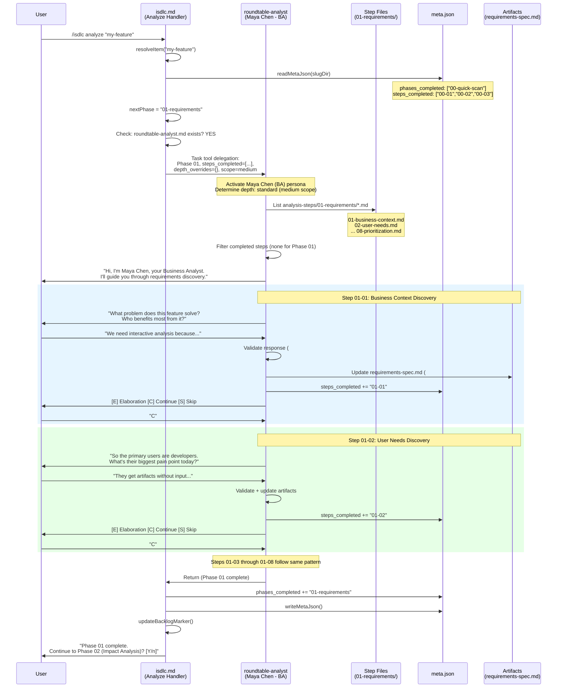
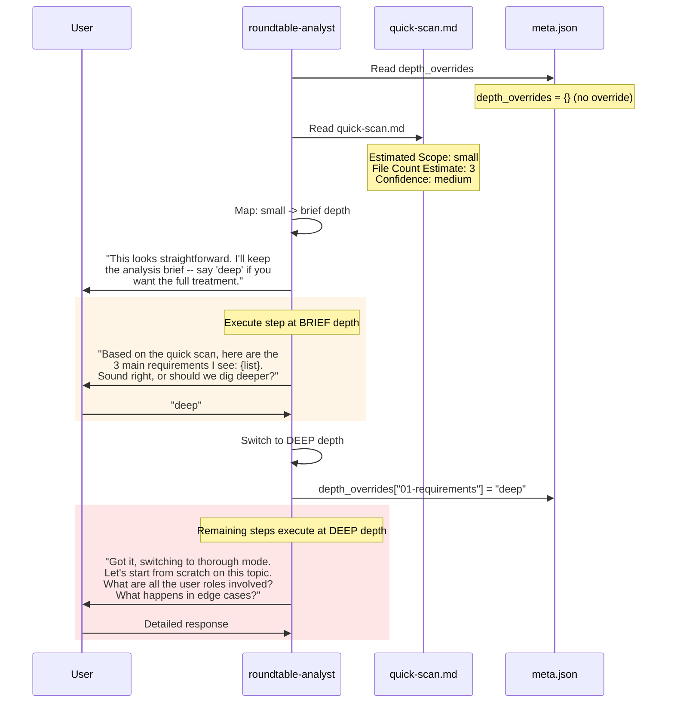
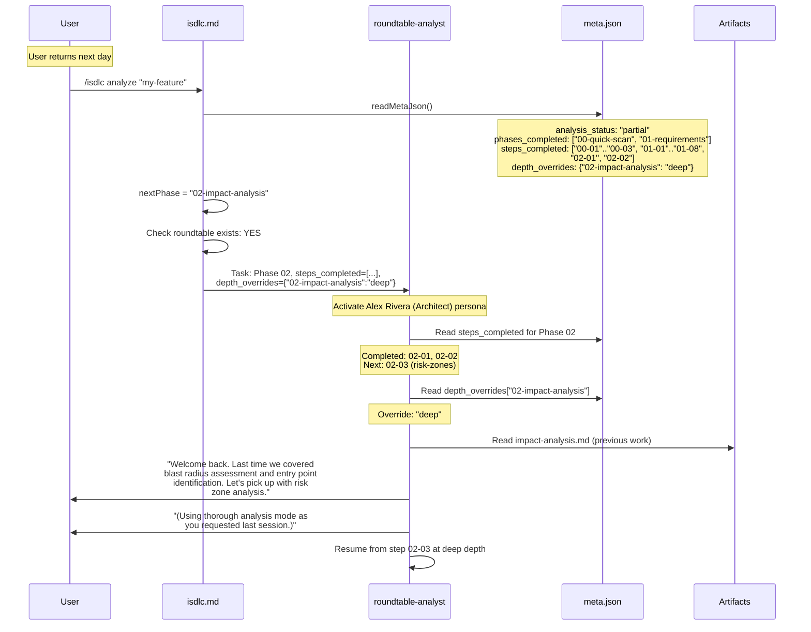
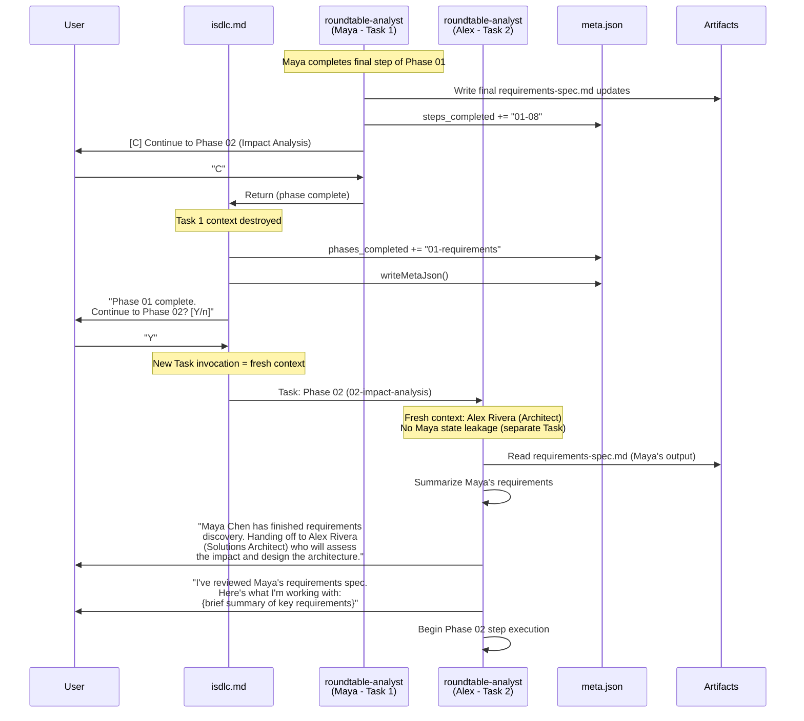

# Component Interactions: Roundtable Analysis Agent

**Feature ID**: REQ-ROUNDTABLE-ANALYST (GH-20)
**Phase**: 03-architecture
**Date**: 2026-02-19

This document contains detailed sequence diagrams and interaction specifications for the key flows in the roundtable analysis agent system.

---

## 1. Full Analysis Session Flow (Happy Path)

This diagram shows a complete analysis session from invocation through Phase 01 completion, including step execution, menu interaction, and meta.json updates.



---

## 2. Adaptive Depth Selection Flow

This diagram shows how depth is determined and how user overrides work.



---

## 3. Session Resumption Flow

This diagram shows how a resumed session recovers context and skips completed steps.



---

## 4. Persona Transition at Phase Boundary

This diagram shows the handoff between Maya (BA, Phase 01) and Alex (Architect, Phase 02).



---

## 5. Step Menu Interaction Patterns

### 5.1 Continue Flow
```
User sees:
  [E] Elaboration Mode -- bring all perspectives to discuss this topic
  [C] Continue -- move to the next step
  [S] Skip remaining steps in this phase
  Or type naturally to provide feedback.

User types: "C"
Agent: Advances to next step. Loads next step file. Presents prompt.
```

### 5.2 Natural Language Flow
```
User sees: (same menu)
User types: "What about edge cases when the network is down?"

Agent: Incorporates feedback into current step analysis.
       Updates artifacts if the feedback changes requirements.
       Re-presents the same step menu after processing.
```

### 5.3 Elaboration Stub Flow
```
User sees: (same menu)
User types: "E"

Agent: "Elaboration mode is coming in a future update (#21).
       For now, I'll go deeper on this topic myself."
       Switches current step to "deep" mode.
       Re-engages with more probing questions.
```

### 5.4 Skip Flow
```
User sees: (same menu)
User types: "S"

Agent: Marks all remaining steps in current phase as skipped.
       Does NOT add them to steps_completed (they were skipped, not completed).
       Returns to isdlc.md handler (phase complete).
```

### 5.5 Final Step of Phase
```
User sees:
  [E] Elaboration Mode -- bring all perspectives to discuss this topic
  [C] Continue to Phase 02 (Impact Analysis)
  Or type naturally to provide feedback.

Note: [S] is not shown on the final step (nothing to skip).
Note: [C] label changes to show next phase name (FR-007 AC-007-05).
```

---

## 6. Step File Execution Detail

### Step File Loading

```
roundtable-analyst receives: phase_key = "01-requirements"

1. Resolve path: src/claude/skills/analysis-steps/01-requirements/
2. List directory contents (Read tool or Glob)
3. Filter: *.md files only
4. Sort: lexicographic by filename (01- < 02- < ... < 08-)
5. Parse each file's YAML frontmatter
6. Build execution queue:
   [
     { step_id: "01-01", title: "Business Context", depth: "standard", ... },
     { step_id: "01-02", title: "User Needs", depth: "standard", ... },
     ...
     { step_id: "01-08", title: "Prioritization", depth: "brief", ... }
   ]
7. Filter out completed steps (step_id in steps_completed)
8. Execute remaining steps in order
```

### Step File Body Section Selection

The roundtable agent selects which body section to execute based on the active depth:

| Active Depth | Section Used | Behavior |
|-------------|-------------|----------|
| brief | `## Brief Mode` | Present draft summary for confirmation |
| standard | `## Standard Mode` | Multi-question discovery |
| deep | `## Deep Mode` | Extended probing with follow-ups |

If the selected section is missing from a step file, fall back to `## Standard Mode`. If that is also missing, use the entire body as the prompt.

### Step Completion Protocol

After each step:
1. Execute `## Validation` section criteria against user responses
2. Execute `## Artifacts` section instructions (update output files)
3. Append `step_id` to `meta.steps_completed` array
4. Write meta.json via `writeMetaJson()`
5. Present step menu

This ensures that if the session is interrupted between steps, all completed work is persisted.

---

## 7. Error Handling Flows

### 7.1 Invalid Step File Frontmatter

```
Agent loads step file -> YAML parse fails

Action:
1. Log warning: "Step file {filename} has invalid frontmatter. Skipping."
2. Do NOT add step_id to steps_completed
3. Continue to next step file
4. The skipped step will be retried on next session (not in steps_completed)
```

### 7.2 Step File Directory Empty

```
Agent lists analysis-steps/{phase_key}/ -> No .md files found

Action:
1. Log info: "No step files found for phase {phase_key}."
2. Return to isdlc.md (phase treated as complete with no steps)
3. Phase is added to phases_completed by isdlc.md
```

### 7.3 meta.json Write Failure

```
writeMetaJson() throws (e.g., disk full, permissions)

Action:
1. Log error: "Failed to write meta.json: {error}"
2. Step work is lost for resumability purposes
3. Artifact file updates may have already been written (partial state)
4. User is informed: "Warning: progress tracking failed. Your artifacts
   were updated but the session may not resume correctly."
5. Continue to next step (do not abort the session)
```

### 7.4 Artifact Folder Missing

```
Agent attempts to write artifact -> folder does not exist

Action:
1. Create the folder (mkdir -p equivalent)
2. Write the artifact
3. This should not normally occur because isdlc.md creates the folder
   during the add verb, but defensive creation prevents failure
```

---

## 8. Data Integrity Guarantees

| Operation | Guarantee | Mechanism |
|-----------|-----------|-----------|
| Step completion | At-most-once recording | step_id appended after artifact write, before menu |
| Artifact updates | Last-writer-wins | Single-threaded execution (one step at a time) |
| meta.json consistency | analysis_status derived from phases_completed | writeMetaJson() enforces derivation |
| Phase completion | Recorded by isdlc.md after roundtable returns | Separate write from step-level tracking |
| Depth override persistence | Written at time of override | Immediate write to meta.json |

---

## Revision History

| Version | Date | Author | Changes |
|---------|------|--------|---------|
| 1.0.0 | 2026-02-19 | Solution Architect (Phase 03) | Initial component interactions |
