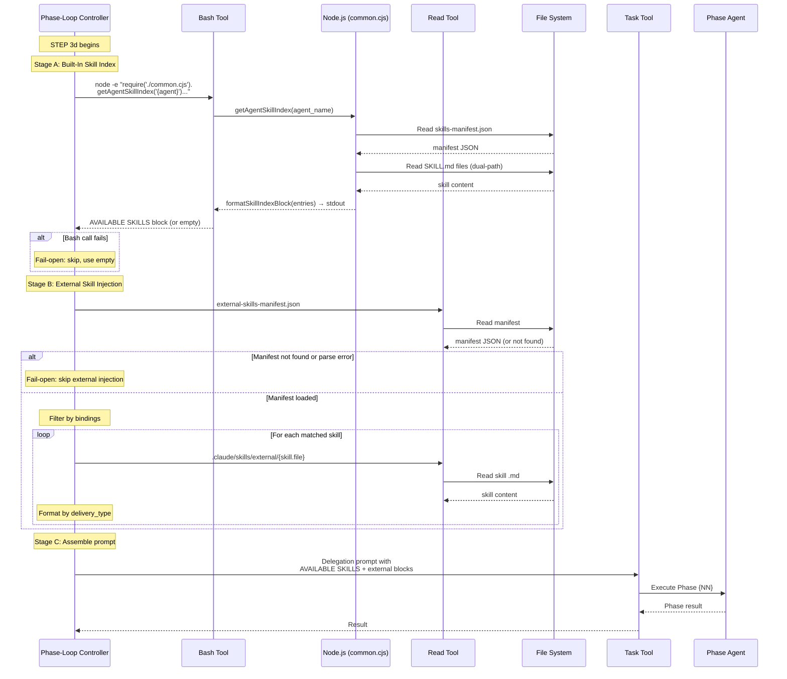

# Architecture Overview: Wire Skill Index Block Injection and Unify Skill Injection

**Requirement ID**: REQ-0033
**Artifact Folder**: REQ-0033-skill-index-injection-unify-blocks
**Version**: 1.0.0
**Created**: 2026-02-23
**Phase**: 03-architecture
**Status**: Accepted
**Traces**: FR-001, FR-002, FR-003, FR-004, FR-005, FR-006, NFR-001 through NFR-006

---

## 1. Executive Summary

This architecture documents the design for wiring two existing but inactive skill injection mechanisms into the isdlc.md STEP 3d phase delegation prompt. The change transforms curly-brace comment specifications into clear, imperative instructions that the Phase-Loop Controller (LLM) can execute sequentially. The underlying JavaScript functions (`getAgentSkillIndex()`, `formatSkillIndexBlock()`, `loadExternalManifest()`, `formatSkillInjectionBlock()`) in `common.cjs` already exist and are well-tested (178 tests, all passing). No new source files are created. The architecture is a **prompt pipeline design** -- it defines how data flows from configuration files through JavaScript helpers into a unified AVAILABLE SKILLS block within the delegation prompt.

**Architecture Pattern**: Sequential Injection Pipeline (within an LLM-as-executor specification file)
**Blast Radius**: LOW (2 files modified)
**Risk Level**: LOW

---

## 2. Architecture Context

### 2.1 System Context (C4 Level 1)

The skill injection pipeline operates within the iSDLC Phase-Loop Controller, which is an LLM instance executing `isdlc.md` as procedural instructions. The pipeline reads from configuration files and produces text blocks that are injected into Task tool delegation prompts.

```
                    +----------------------------------+
                    |    User (Framework Developer)     |
                    +----------------------------------+
                              |
                              | requests phase execution
                              v
                    +----------------------------------+
                    |  Phase-Loop Controller            |
                    |  (LLM executing isdlc.md)        |
                    |                                  |
                    |  STEP 3d: Construct delegation    |
                    |  prompt with injections           |
                    +----------------------------------+
                         |              |          |
          reads manifest |   reads ext  |  reads   | reads budget/gate
                         |   manifest   |  state   | config
                         v              v          v
              +-------------+  +-------------+  +-----------+
              | skills-     |  | external-   |  | iteration-|
              | manifest    |  | skills-     |  | reqs.json |
              | .json       |  | manifest    |  | state.json|
              +-------------+  | .json       |  +-----------+
                               +-------------+
                         |              |
                         | invokes JS   | reads .md files
                         v              v
              +-------------+  +-------------+
              | common.cjs  |  | .claude/    |
              | functions   |  | skills/     |
              |             |  | external/   |
              +-------------+  +-------------+
                         |              |
                         | produces     | produces
                         v              v
              +----------------------------------+
              |  Unified delegation prompt        |
              |  with AVAILABLE SKILLS block      |
              |  + external skill blocks          |
              +----------------------------------+
                              |
                              | passed via Task tool
                              v
              +----------------------------------+
              |  Phase Agent (delegated LLM)      |
              |  e.g., software-developer,        |
              |  qa-engineer, solution-architect   |
              +----------------------------------+
```

**Traces**: FR-001 (built-in injection), FR-002 (external injection), FR-003 (unified prompt), FR-004 (imperative instructions)

### 2.2 Container Diagram (C4 Level 2)

Within the Phase-Loop Controller's STEP 3d execution, the injection pipeline has four sequential stages. Only the first two (Skill Index Injection and External Skill Injection) are being modified. The other two (Gate Requirements Injection and Budget Degradation Injection) remain unchanged (CON-006).

```
STEP 3d Delegation Prompt Construction
========================================

Stage 1: Base Prompt Assembly
  Input: phase_key, agent_name, artifact_folder, workflow_type
  Output: Base prompt text (template with placeholders filled)

Stage 2: SKILL INDEX INJECTION (FR-001, FR-004) [MODIFIED]
  Input: agent_name
  Tool: Bash → node -e "require('./common.cjs').getAgentSkillIndex()"
  Data: skills-manifest.json → ownership[agent_name].skills[]
  Output: AVAILABLE SKILLS block (or empty string)
  Error: Fail-open → skip, no block appended

Stage 3: EXTERNAL SKILL INJECTION (FR-002, FR-004) [MODIFIED]
  Input: phase_key, agent_name, project context
  Tool: Read → external-skills-manifest.json
  Data: manifest.skills[] filtered by bindings.phases/agents
  Tool: Read → matched .md files from external skills dir
  Output: Formatted injection blocks (context/instruction/reference)
  Error: Fail-open → skip, no blocks appended

Stage 4: GATE REQUIREMENTS INJECTION (REQ-0024) [UNCHANGED]
  (per CON-006, not modified)

Stage 5: BUDGET DEGRADATION INJECTION (REQ-0022) [UNCHANGED]
  (per CON-006, not modified)

Stage 6: Final Assembly
  Output: Complete delegation prompt = base + skills + external + gate + budget
  Passed to Task tool for agent delegation
```

**Traces**: FR-003 (ordering: built-in FIRST, external SECOND), FR-006 (fail-open at each stage)

---

## 3. Architecture Pattern

### 3.1 Pattern: Sequential Injection Pipeline

**Selected Pattern**: Sequential Injection Pipeline with fail-open error boundaries

**Rationale**: The delegation prompt is constructed by appending blocks sequentially. Each injection stage is independent -- if one fails, the others still execute. This maps naturally to the LLM-as-executor model where numbered instructions are processed top-to-bottom.

**Alternatives Considered**:

1. **Parallel injection with merge**: All injection stages execute concurrently, then results are merged into the prompt. Rejected because the LLM executor processes instructions sequentially -- parallel execution would require a fundamentally different instruction format.

2. **Pre-computed injection cache**: Compute all injections at workflow start and cache results in state.json. Rejected per CON-003 (SessionStart cache is out of scope, Issue #91) and because skill manifests could change between phases.

3. **Inline all logic in markdown**: Instead of calling JavaScript functions via Bash tool, inline the manifest parsing logic directly in the isdlc.md instructions. Rejected because the JavaScript functions already exist, are tested (178 tests), and handle edge cases (dual-path resolution, schema detection). Duplicating this logic in markdown would violate DRY and create maintenance burden.

**Decision**: Use the Sequential Injection Pipeline pattern. Each stage is a numbered instruction block in isdlc.md that the LLM executes via tool calls (Bash for JavaScript functions, Read for file access). Each stage has an explicit fail-open error boundary.

**Traces**: ADR-0001 (pattern selection), NFR-003 (fail-open reliability), NFR-004 (self-documenting)

### 3.2 Error Handling Strategy: Fail-Open Boundaries

Every injection stage wraps its logic in a fail-open boundary. The pattern is:

```
Stage N: {Injection Name}
  1. Attempt tool call
  2. If error → skip this stage entirely, append nothing
  3. If success → process result
  4. If processing error → skip this stage entirely, append nothing
  5. If result is empty → skip (no-op, no error)
  6. If result is non-empty → append to prompt
```

This ensures that a failure in skill injection never blocks phase delegation. The worst case is that the phase agent operates without skill context -- the same as the current behavior before this feature.

**Traces**: FR-006 (all ACs: AC-006-01 through AC-006-04), NFR-003 (zero delegation failures)

---

## 4. Injection Pipeline Detailed Design

### 4.1 Stage 2: Built-In Skill Index Injection

**Purpose**: Look up the target agent's owned skills from skills-manifest.json and inject an AVAILABLE SKILLS reference list into the delegation prompt.

**Data Flow**:

```
skills-manifest.json
  → ownership[agent_name].skills[] (array of skill IDs)
  → path_lookup[skillPath] (reverse index to agent)
  → SKILL.md files on disk (dual-path: .claude/ then src/claude/)
    → getAgentSkillIndex(agent_name)
      → Array<{id, name, description, path}>
        → formatSkillIndexBlock(entries)
          → "AVAILABLE SKILLS (consult when relevant using Read tool):\n  DEV-001: name -- desc\n    -> path\n  ..."
```

**Invocation Method**: The Phase-Loop Controller invokes JavaScript functions via Bash tool:

```
node -e "const c = require('./src/claude/hooks/lib/common.cjs'); const r = c.getAgentSkillIndex('{agent_name}'); process.stdout.write(c.formatSkillIndexBlock(r));"
```

This produces the AVAILABLE SKILLS block as stdout, which the Phase-Loop Controller captures and appends to the delegation prompt.

**Key Constraints**:
- Single-line Bash command (CON-004 / Single-Line Bash Convention)
- common.cjs functions NOT modified (CON-002)
- Output <= 30 lines for 14 entries (NFR-001)
- Empty result = no-op (AC-001-02)

**Error Boundary**: If the Bash tool call fails for any reason (node not found, require error, function throws), the Phase-Loop Controller skips this stage and continues with the prompt as-is (AC-006-01, AC-006-04).

**Traces**: FR-001 (AC-001-01, AC-001-02, AC-001-03), FR-004 (AC-004-01, AC-004-04), FR-006 (AC-006-01, AC-006-04)

### 4.2 Stage 3: External Skill Injection

**Purpose**: Read the external skills manifest, filter for skills matching the current phase/agent, read matched skill files, format them by delivery type, and append to the delegation prompt.

**Data Flow**:

```
external-skills-manifest.json (monorepo-aware path resolution)
  → manifest.skills[] (array of skill objects)
  → Filter: skill.bindings.injection_mode === "always"
           AND (phase_key in skill.bindings.phases OR agent_name in skill.bindings.agents)
  → matched_skills[]
    → For each: Read .md file from external skills directory
      → If content > 10,000 chars: truncate, switch to reference
      → Format by delivery_type:
          "context"     → EXTERNAL SKILL CONTEXT: {name}\n---\n{content}\n---
          "instruction" → EXTERNAL SKILL INSTRUCTION ({name}): You MUST follow these guidelines:\n{content}
          "reference"   → EXTERNAL SKILL AVAILABLE: {name} -- Read from {path} if relevant
  → Join with double newlines
  → Append to delegation prompt
```

**Invocation Method**: The Phase-Loop Controller uses the Read tool to access the manifest and skill files. No JavaScript invocation is needed for this stage -- the LLM can perform JSON parsing, filtering, and string formatting directly.

**Path Resolution** (FR-005):

| Mode | Manifest Path | Skill Files Path |
|------|--------------|-----------------|
| Single-project | `docs/isdlc/external-skills-manifest.json` | `.claude/skills/external/` |
| Monorepo | `docs/isdlc/projects/{project-id}/external-skills-manifest.json` | `.isdlc/projects/{project-id}/skills/external/` |

The monorepo path is determined by checking for `MONOREPO CONTEXT` in the current execution context. If present, use project-scoped paths. Otherwise, use single-project paths.

**Truncation Rule** (AC-002-04, NFR-006): If a matched skill file exceeds 10,000 characters, the content is truncated and the skill is delivered as a reference instead:
```
EXTERNAL SKILL AVAILABLE: {name} -- Read from {path} if relevant (content truncated: {length} chars)
```

**Error Boundary**: Each step in the pipeline has its own fail-open checkpoint:
- Manifest does not exist → skip entirely (AC-002-02)
- Manifest is malformed JSON → skip entirely (AC-006-02)
- No skills match → skip (AC-002-03)
- Individual skill file missing → skip that skill, continue others (AC-006-03)
- Any other error → skip entirely

**Traces**: FR-002 (AC-002-01 through AC-002-07), FR-005 (AC-005-01, AC-005-02, AC-005-03), FR-006 (AC-006-02, AC-006-03)

### 4.3 Unified Prompt Structure (FR-003)

The delegation prompt assembles injections in a defined order. The unified structure for skill-related content is:

```
[Base delegation prompt]
[WORKFLOW MODIFIERS — if applicable]
[DISCOVERY CONTEXT — if phase 02 or 03]

[AVAILABLE SKILLS block — built-in skills, if non-empty]

[EXTERNAL SKILL blocks — zero or more, if any match]

[GATE REQUIREMENTS block — if applicable]
[BUDGET DEGRADATION block — if applicable]

PHASE_TIMING_REPORT: Include { ... } in your result.
Do NOT emit SUGGESTED NEXT STEPS...
Validate GATE-{NN} on completion.
```

**Ordering Rules** (AC-003-02):
1. Built-in skills appear FIRST as the AVAILABLE SKILLS reference list
2. External skill blocks appear AFTER, separated by double newlines
3. If only built-in skills exist, only AVAILABLE SKILLS appears (AC-003-03)
4. If only external skills match, only external blocks appear (AC-003-04)
5. If neither produces output, no skill-related content is added (AC-003-05)

**Separation**: Each major block is separated by a blank line (double newline) for readability by the phase agent.

**Traces**: FR-003 (AC-003-01 through AC-003-05)

---

## 5. Instruction Rewrite Design (FR-004)

### 5.1 Current State: Curly-Brace Comment Blocks

The current isdlc.md STEP 3d lines 1724-1744 contain two curly-brace blocks:

```
{SKILL INDEX BLOCK — look up target agent's owned skills from skills-manifest, format as AVAILABLE SKILLS block using getAgentSkillIndex() + formatSkillIndexBlock(). Include only if non-empty.}
{EXTERNAL SKILL INJECTION (REQ-0022) — After constructing the delegation prompt above, inject any matched external skill content. This block is fail-open — if anything fails, continue with the unmodified prompt.
 1. Read docs/isdlc/external-skills-manifest.json ...
 ...
 5. Error handling: If any error occurs in steps 1-4, continue with unmodified prompt.}
```

These are ambiguous: the Phase-Loop Controller may interpret them as documentation rather than executable instructions because they are enclosed in curly braces (a pattern commonly used for placeholders that the LLM fills with values, not for multi-step procedures).

### 5.2 Target State: Numbered Imperative Instructions

The rewrite replaces the curly-brace blocks with numbered imperative instructions outside the template literal. The instructions precede the Task tool call and tell the Phase-Loop Controller to build up a `skill_context` text variable before constructing the final prompt.

**Design Decision**: Place the injection instructions BEFORE the Task tool template (between line 1715 and line 1717), not inside the template literal. This resolves the ambiguity -- the instructions are clearly procedural steps to execute, not template placeholders to fill.

**Instruction Structure**:

```
Before constructing the Task tool prompt below, execute these skill injection steps:

SKILL INJECTION STEP A: Built-In Skill Index
1. Run: node -e "const c = require('./src/claude/hooks/lib/common.cjs'); const r = c.getAgentSkillIndex('{agent_name}'); process.stdout.write(c.formatSkillIndexBlock(r));"
2. If the Bash tool call succeeds and produces non-empty output: save the output as {built_in_skills_block}.
3. If the Bash tool call fails or produces empty output: set {built_in_skills_block} to empty.

SKILL INJECTION STEP B: External Skills
1. Determine the external skills manifest path:
   - If MONOREPO CONTEXT is present: docs/isdlc/projects/{project-id}/external-skills-manifest.json
   - Otherwise: docs/isdlc/external-skills-manifest.json
2. Read the manifest file using Read tool.
3. If file does not exist or Read fails: set {external_skills_blocks} to empty. SKIP to Step C.
4. Parse the JSON content. If parse fails: set {external_skills_blocks} to empty. SKIP to Step C.
5. Filter manifest.skills[]: keep skills where bindings.injection_mode === "always" AND (phase_key is in bindings.phases OR agent_name is in bindings.agents).
6. If no skills match: set {external_skills_blocks} to empty. SKIP to Step C.
7. For each matched skill:
   a. Determine the external skills directory path:
      - If MONOREPO CONTEXT: .isdlc/projects/{project-id}/skills/external/
      - Otherwise: .claude/skills/external/
   b. Read {skills_dir}/{skill.file} using Read tool.
   c. If Read fails: skip this skill, continue with next.
   d. If content length > 10000 characters: format as reference type regardless of delivery_type.
   e. Format based on delivery_type:
      - "context": EXTERNAL SKILL CONTEXT: {name}\n---\n{content}\n---
      - "instruction": EXTERNAL SKILL INSTRUCTION ({name}): You MUST follow these guidelines:\n{content}
      - "reference": EXTERNAL SKILL AVAILABLE: {name} -- Read from {path} if relevant
8. Join all formatted blocks with double newlines as {external_skills_blocks}.

SKILL INJECTION STEP C: Assemble
- If {built_in_skills_block} is non-empty: include it in the delegation prompt.
- If {external_skills_blocks} is non-empty: include it after {built_in_skills_block}, separated by a blank line.
- If both are empty: include nothing (no-op).

Then construct the Task tool prompt:
```

This structure follows the same pattern as the GATE REQUIREMENTS INJECTION block (lines 1745-1768) which is already operational, confirming this instruction style works for the Phase-Loop Controller.

**Traces**: FR-004 (AC-004-01, AC-004-02, AC-004-03, AC-004-04), NFR-004 (self-documenting)

### 5.3 Template Literal Cleanup

Inside the Task tool template (the backtick-fenced code block starting at line 1717), the two curly-brace placeholders at lines 1724-1744 are replaced with simple inclusion markers:

```
   {built_in_skills_block — from SKILL INJECTION STEP A above}
   {external_skills_blocks — from SKILL INJECTION STEP B above}
```

These are intentionally short and reference the steps above, eliminating the ambiguity of the current spec.

---

## 6. Technology Stack

No new technologies are introduced. The feature uses the existing stack:

| Layer | Technology | Role | Status |
|-------|-----------|------|--------|
| Specification | Markdown (isdlc.md) | LLM-executable procedural instructions | Modified |
| Runtime functions | CommonJS (common.cjs) | getAgentSkillIndex, formatSkillIndexBlock, formatSkillInjectionBlock | Unchanged (CON-002) |
| Configuration | JSON (skills-manifest.json) | Built-in skill ownership mapping | Unchanged |
| Configuration | JSON (external-skills-manifest.json) | External skill bindings and metadata | Unchanged (read-only) |
| Skill files | Markdown (.md) | Skill content for injection | Unchanged (read-only) |
| Test framework | Node.js built-in test runner | CJS test files (.test.cjs) | Test assertions updated |
| Runtime | Node.js 20+ | JavaScript execution via Bash tool | Unchanged |

**Traces**: CON-002 (no common.cjs modification), CON-003 (no session cache)

---

## 7. Data Flow Diagram

```
                        Phase-Loop Controller (STEP 3d)
                                    |
                    +---------------+----------------+
                    |                                |
            STEP A: Built-In                  STEP B: External
                    |                                |
                    v                                v
        +-------------------+            +------------------------+
        | Bash tool call    |            | Read tool              |
        | node -e "..."     |            | external-skills-       |
        |   getAgentSkill   |            |   manifest.json        |
        |   Index(agent)    |            +------------------------+
        | + formatSkillIndex|                     |
        |   Block(result)   |                     v
        +-------------------+            +------------------------+
                |                        | Filter by bindings:    |
                v                        |  injection_mode        |
        +-------------------+            |  phases[], agents[]    |
        | stdout:           |            +------------------------+
        | "AVAILABLE SKILLS |                     |
        |  (consult ...):   |                     v
        |   DEV-001: ..."   |            +------------------------+
        | OR empty string   |            | Read tool (per skill): |
        +-------------------+            | .claude/skills/ext/    |
                |                        |   {skill.file}         |
                v                        +------------------------+
        {built_in_skills_block}                   |
                                                  v
                                         +------------------------+
                                         | Format by delivery_type|
                                         | - context              |
                                         | - instruction          |
                                         | - reference            |
                                         | Truncate if > 10K     |
                                         +------------------------+
                                                  |
                                                  v
                                         {external_skills_blocks}
                    |                                |
                    +---------------+----------------+
                                    |
                            STEP C: Assemble
                                    |
                                    v
                    +-------------------------------+
                    | Delegation Prompt:            |
                    |   ...base...                  |
                    |   {built_in_skills_block}     |
                    |   {external_skills_blocks}    |
                    |   {gate requirements}         |
                    |   {budget degradation}        |
                    +-------------------------------+
                                    |
                                    v
                            Task tool call
                                    |
                                    v
                            Phase Agent
```

---

## 8. File Impact Map

### 8.1 Files Modified

| File | Lines Affected | Change Description | Requirements |
|------|---------------|-------------------|-------------|
| `src/claude/commands/isdlc.md` | ~1715-1744 (STEP 3d) | Replace curly-brace comment blocks with numbered imperative instructions for Stages A, B, C. Template placeholders simplified. | FR-001, FR-002, FR-003, FR-004, FR-005, FR-006 |
| `src/claude/hooks/tests/skill-injection.test.cjs` | TC-09 assertions | Update string-matching expectations from "SKILL INDEX BLOCK" to new instruction wording | FR-004 |

### 8.2 Files Read (Not Modified)

| File | Role | Constraint |
|------|------|-----------|
| `src/claude/hooks/lib/common.cjs` | Provides getAgentSkillIndex, formatSkillIndexBlock, formatSkillInjectionBlock | CON-002: NOT modified |
| `src/claude/hooks/config/skills-manifest.json` | Built-in skill ownership data | Read-only |
| `docs/isdlc/external-skills-manifest.json` | External skill bindings (may not exist) | Read-only |
| `.claude/skills/external/*.md` | External skill content files | Read-only |
| 51 agent files (`src/claude/agents/*.md`) | Consumers of AVAILABLE SKILLS block | NOT modified |

### 8.3 Files Validated (Re-run Tests)

| File | Tests | Purpose |
|------|-------|---------|
| `src/claude/hooks/tests/test-bug-0035-skill-index.test.cjs` | 27 | Confirm getAgentSkillIndex/formatSkillIndexBlock still work |
| `src/claude/hooks/tests/external-skill-management.test.cjs` | 111 | Confirm external skill functions still work |
| `src/claude/hooks/tests/skill-injection.test.cjs` | 40 (TC-09 updated) | Confirm STEP 3d template matches new wording |

---

## 9. Security Considerations

### 9.1 Threat Model (STRIDE)

This feature has a minimal security surface because it operates entirely within the local LLM execution environment. There is no network communication, no user authentication, and no data persistence beyond what already exists.

| Threat | Applicability | Mitigation |
|--------|--------------|-----------|
| **Spoofing** | N/A | No authentication involved. Local file reads only. |
| **Tampering** | LOW | External skill files are local .md files. If an attacker can modify local files, they already have full system access. The 10K truncation limit (NFR-006) bounds the injected content. |
| **Repudiation** | N/A | Skill injection is logged via skill usage observability protocol. |
| **Information Disclosure** | LOW | Skill content is injected into LLM context. Since the LLM already has access to read the same files, this does not expand the information surface. |
| **Denial of Service** | LOW | A malformed manifest or missing files cause fail-open behavior -- delegation continues without skills. No blocking possible. (NFR-003) |
| **Elevation of Privilege** | N/A | No privilege boundaries involved. The Phase-Loop Controller and phase agents operate at the same privilege level. |

### 9.2 Input Validation

- **skills-manifest.json**: Validated by `getAgentSkillIndex()` which returns `[]` on any parse error or missing data
- **external-skills-manifest.json**: Parsed by the Phase-Loop Controller; malformed JSON causes fail-open skip (AC-006-02)
- **Skill file content**: Bounded by 10K character truncation rule (NFR-006, AC-002-04)
- **Agent name**: Validated by `getAgentSkillIndex()` which returns `[]` for null/undefined/empty input

### 9.3 Constitutional Compliance (Article III, Article X)

- **Article III (Security by Design)**: The injection pipeline reads local configuration files with no secrets. All inputs are validated. Fail-open ensures no security-relevant blocking.
- **Article X (Fail-Safe Defaults)**: Every injection stage defaults to "produce nothing" on error. The system degrades gracefully to the pre-feature behavior (no skill context in delegation prompts).

---

## 10. Scalability and Performance

### 10.1 Performance Budget (NFR-002)

The injection pipeline must add less than 5 seconds to phase delegation.

| Stage | Expected Latency | Justification |
|-------|-----------------|---------------|
| Built-in skill index | < 2s | Single Bash tool call, reads manifest + up to 14 SKILL.md files from disk |
| External skill injection | < 2s | One Read for manifest, 0-5 Reads for skill files (ASM-003: 0-5 skills) |
| Assembly | ~0s | String concatenation in LLM context |
| **Total** | **< 4s** | Within NFR-002 budget of 5 seconds |

### 10.2 Prompt Size (NFR-001)

| Component | Size Limit | Enforcement |
|-----------|-----------|-------------|
| Built-in AVAILABLE SKILLS block | <= 30 lines for 14 entries | formatSkillIndexBlock design (2 lines per skill + 1 header) |
| External skill content | <= 10,000 chars per skill | Truncation rule (AC-002-04) with reference fallback |
| Total external skills | <= 50,000 chars (5 skills x 10K) | ASM-003: 0-5 external skills expected |

### 10.3 Growth Path

- **Near-term** (0-5 external skills): File-read pattern is sufficient. Each delegation reads the manifest once and the matched skill files.
- **Future** (5+ external skills): If external skills become numerous, a SessionStart cache (Issue #91) would pre-load manifests and skill content at session initialization, eliminating per-delegation file reads. This is out of scope per CON-003.

---

## 11. Deployment Architecture

No infrastructure changes required. The feature modifies a specification file (`isdlc.md`) and a test file. Deployment follows the standard iSDLC dogfooding pattern:

1. Modify `src/claude/commands/isdlc.md` (source of truth)
2. Runtime copy at `.claude/commands/isdlc.md` is a symlink to `src/claude/commands/isdlc.md` -- changes are immediately live
3. Modify `src/claude/hooks/tests/skill-injection.test.cjs` (test assertions)
4. Run `npm run test:hooks` to validate
5. No rsync needed (isdlc.md is a symlink, not a copy)

---

## 12. Architecture Decision Records

### ADR-0001: Sequential Injection Pipeline for Skill Wiring

**Status**: Accepted
**Context**: The isdlc.md STEP 3d delegation prompt needs skill context injected. The underlying JavaScript functions exist and are tested. The question is how to wire them into the LLM-executable specification.
**Decision**: Use a sequential injection pipeline where numbered imperative instructions precede the Task tool template. Each stage (built-in skills, external skills) executes independently with fail-open error boundaries.
**Consequences**:
- Positive: Follows the proven GATE REQUIREMENTS INJECTION pattern already in STEP 3d
- Positive: Each stage is independently testable and fail-open
- Positive: No new files or dependencies introduced
- Negative: The Phase-Loop Controller must execute 1-2 additional tool calls per delegation
**Alternatives**: Parallel injection (rejected: LLM processes sequentially), pre-computed cache (rejected: CON-003), inline logic (rejected: DRY violation)
**Traces**: FR-001, FR-002, FR-003, FR-004, NFR-003

### ADR-0002: Bash Tool Invocation for Built-In Skill Index

**Status**: Accepted
**Context**: `getAgentSkillIndex()` and `formatSkillIndexBlock()` are JavaScript functions in common.cjs. The Phase-Loop Controller is an LLM, not a JavaScript runtime. How should it invoke these functions?
**Decision**: Use `node -e` via Bash tool to invoke the functions and capture stdout. The command is a single-line expression per CON-004.
**Consequences**:
- Positive: Reuses existing, tested JavaScript functions (178 tests)
- Positive: Single-line Bash command satisfies permission auto-allow patterns
- Positive: No changes to common.cjs needed (CON-002)
- Negative: Requires Node.js to be available in the execution environment (ASM-001)
- Negative: Bash tool call adds ~1-2s latency
**Alternatives**: Read tool to parse manifest (rejected: would duplicate 160 lines of JS logic including dual-path resolution and schema detection), inline markdown logic (rejected: same DRY violation)
**Traces**: FR-001, FR-004 (AC-004-04), CON-002, CON-004

### ADR-0003: Read Tool for External Skill Injection

**Status**: Accepted
**Context**: External skill injection involves reading a JSON manifest, filtering by bindings, reading matched .md files, and formatting by delivery type. Should this use Bash/JavaScript or native LLM tools?
**Decision**: Use the Read tool for file access and LLM-native JSON parsing/filtering/formatting. No JavaScript helper invocation needed.
**Consequences**:
- Positive: The LLM can parse JSON and format strings natively -- no JavaScript bridge needed
- Positive: Fewer tool calls (Read is faster than Bash+node)
- Positive: The filtering and formatting logic is simple enough to express as instructions
- Negative: If the external manifest schema changes, instructions must be updated manually
**Alternatives**: Bash+node for external injection too (rejected: the logic is simple enough for LLM-native processing; adding a JS wrapper would be over-engineering per Article V)
**Traces**: FR-002, FR-004, NFR-002, Article V (Simplicity First)

### ADR-0004: Instruction Placement Before Template Literal

**Status**: Accepted
**Context**: The curly-brace comment blocks are inside the Task tool template literal (the backtick-fenced code block). Should the replacement instructions also go inside the template, or be placed before it?
**Decision**: Place the numbered imperative instructions BEFORE the template literal. Inside the template, use short reference placeholders that point to the pre-computed results.
**Consequences**:
- Positive: Clear separation between "compute injection data" (procedural) and "include in prompt" (declarative)
- Positive: Eliminates the ambiguity of curly-brace blocks (are they instructions or placeholders?)
- Positive: Follows the same instruction-before-template pattern used for agent_modifiers and discovery context
- Negative: Increases the line count of STEP 3d by moving logic out of the compact template
**Traces**: FR-004 (AC-004-01, AC-004-02), NFR-004 (self-documenting)

---

## 13. Sequence Diagram: Phase Delegation with Skill Injection



---

## 14. Test Strategy Alignment

### 14.1 Existing Test Coverage

| Test File | Test Count | Status | Relevance |
|-----------|-----------|--------|-----------|
| `skill-injection.test.cjs` | 40 | TC-09 needs update | Template structure validation |
| `test-bug-0035-skill-index.test.cjs` | 27 | No changes | Function-level regression |
| `external-skill-management.test.cjs` | 111 | No changes | External skill function regression |

### 14.2 Test Updates Required

**TC-09 (STEP 3d Prompt Template)**: Currently validates that isdlc.md contains "SKILL INDEX BLOCK". After the rewrite, the test must validate that:
1. The text "SKILL INJECTION STEP A" (or equivalent new wording) exists in isdlc.md
2. The text "getAgentSkillIndex" exists in the instructions
3. The text "formatSkillIndexBlock" exists in the instructions
4. The text "external-skills-manifest.json" exists in the instructions
5. Fail-open language is present

### 14.3 Integration Test Gap

The impact analysis noted that no integration test validates the complete delegation prompt. This is a pre-existing gap, not introduced by this feature. A future enhancement could add an end-to-end test that:
1. Creates a mock skills-manifest.json with a test agent
2. Runs the Phase-Loop Controller STEP 3d logic
3. Captures the delegation prompt
4. Validates it contains the AVAILABLE SKILLS block

This integration test is OUT OF SCOPE for REQ-0033 but recommended as a follow-up.

---

## 15. Constitutional Compliance Validation

| Article | Requirement | Status | Evidence |
|---------|------------|--------|----------|
| **III (Security by Design)** | Security architecture defined before implementation | PASS | Section 9: STRIDE threat model, input validation, no secrets involved |
| **IV (Explicit Over Implicit)** | No undocumented assumptions | PASS | ASM-001 through ASM-005 documented in requirements-spec.md; all architectural decisions have ADRs |
| **V (Simplicity First)** | No over-engineering | PASS | ADR-0003 explicitly avoids adding a JavaScript wrapper for external injection when LLM-native processing suffices; no new files created |
| **VII (Artifact Traceability)** | All decisions trace to requirements | PASS | Every section includes Traces references to FR-xxx, AC-xxx, NFR-xxx, CON-xxx |
| **IX (Quality Gate Integrity)** | All required artifacts exist | PASS | This document satisfies the architecture-overview.md requirement for GATE-03 |
| **X (Fail-Safe Defaults)** | Secure defaults, deny by default | PASS | Every injection stage defaults to "produce nothing" on error (Section 3.2, FR-006) |

---

## 16. Implementation Guidance

### 16.1 Recommended Implementation Order

1. **Update TC-09 test expectations** in `skill-injection.test.cjs` to match planned new wording (test-first)
2. **Write SKILL INJECTION STEP A** instructions in isdlc.md (FR-001, FR-004)
3. **Write SKILL INJECTION STEP B** instructions in isdlc.md (FR-002, FR-004)
4. **Write SKILL INJECTION STEP C** assembly instructions in isdlc.md (FR-003)
5. **Simplify template placeholders** for lines 1724-1744 (remove old curly-brace blocks)
6. **Add monorepo path resolution** notes to STEP B instructions (FR-005)
7. **Verify fail-open** language at each step (FR-006)
8. **Run all tests**: `npm run test:hooks` to confirm TC-09 passes and 178 existing tests have no regressions

### 16.2 Design Constraints for Implementation

- **CON-001**: The primary change target is a markdown file executed as procedural instructions
- **CON-002**: Do NOT modify getAgentSkillIndex() or formatSkillIndexBlock() in common.cjs
- **CON-003**: Keep file-read pattern for external skills (no session cache)
- **CON-004**: Single-line Bash commands only
- **CON-005**: No git commits during phase work
- **CON-006**: Do NOT modify GATE REQUIREMENTS INJECTION or BUDGET DEGRADATION INJECTION blocks

### 16.3 Validation Checklist

After implementation, verify:
- [ ] `npm run test:hooks` passes (all tests including updated TC-09)
- [ ] isdlc.md STEP 3d contains numbered imperative instructions (not curly-brace comments)
- [ ] The AVAILABLE SKILLS block format matches formatSkillIndexBlock() output exactly
- [ ] Fail-open behavior documented at every step
- [ ] Monorepo path resolution is addressed in STEP B instructions
- [ ] GATE REQUIREMENTS and BUDGET DEGRADATION blocks are untouched
- [ ] No new files created

---

## GATE-03 Validation

### Architecture Documentation
- [x] System context diagram exists (Section 2.1)
- [x] Container diagram exists (Section 2.2)
- [x] Architecture pattern documented and justified (Section 3.1)
- [x] All major components identified (Sections 4.1, 4.2, 4.3)
- [x] Component responsibilities defined (data flow per stage)

### Technology Stack
- [x] Technology selections documented (Section 6) -- no new technologies, existing stack reused
- [x] Justification provided for reuse (CON-002, Article V)

### Database Design
- [x] N/A -- this feature has no database component (iSDLC uses JSON files, no schema changes)

### Security Architecture
- [x] Threat model completed (Section 9.1 STRIDE)
- [x] Input validation defined (Section 9.2)
- [x] Constitutional compliance verified (Section 15)

### Architecture Decision Records
- [x] ADR-0001: Sequential Injection Pipeline (pattern selection)
- [x] ADR-0002: Bash Tool Invocation for Built-In Skills (invocation method)
- [x] ADR-0003: Read Tool for External Skills (simplicity)
- [x] ADR-0004: Instruction Placement Before Template (clarity)
- [x] All ADRs have status: Accepted

### NFR Coverage
- [x] Performance: NFR-001 (prompt size), NFR-002 (latency budget) addressed in Section 10
- [x] Reliability: NFR-003 (fail-open) addressed throughout (Section 3.2, 4.1, 4.2)
- [x] Maintainability: NFR-004 (self-documenting) addressed in ADR-0004
- [x] Compatibility: NFR-005 (single-project + monorepo) addressed in Section 4.2
- [x] Size limits: NFR-006 (10K truncation) addressed in Section 4.2

### Traceability
- [x] Every architectural decision traces to requirements (FR-xxx, AC-xxx, NFR-xxx references throughout)
- [x] No orphan decisions
- [x] No unaddressed requirements

---

## Metadata

```json
{
  "phase": "03-architecture",
  "requirement_id": "REQ-0033",
  "artifact_folder": "REQ-0033-skill-index-injection-unify-blocks",
  "architecture_pattern": "sequential-injection-pipeline",
  "blast_radius": "low",
  "risk_level": "low",
  "files_modified": 2,
  "files_read_only": 5,
  "adrs": 4,
  "constitutional_compliance": "pass",
  "gate_03_status": "pass",
  "debate_rounds_used": 0,
  "fan_out_chunks": 0
}
```
