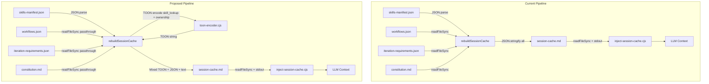
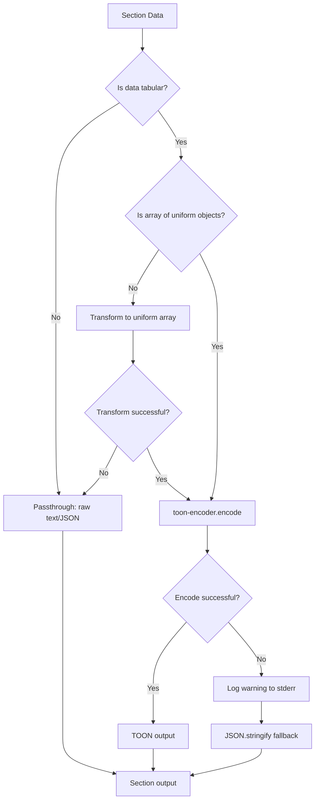
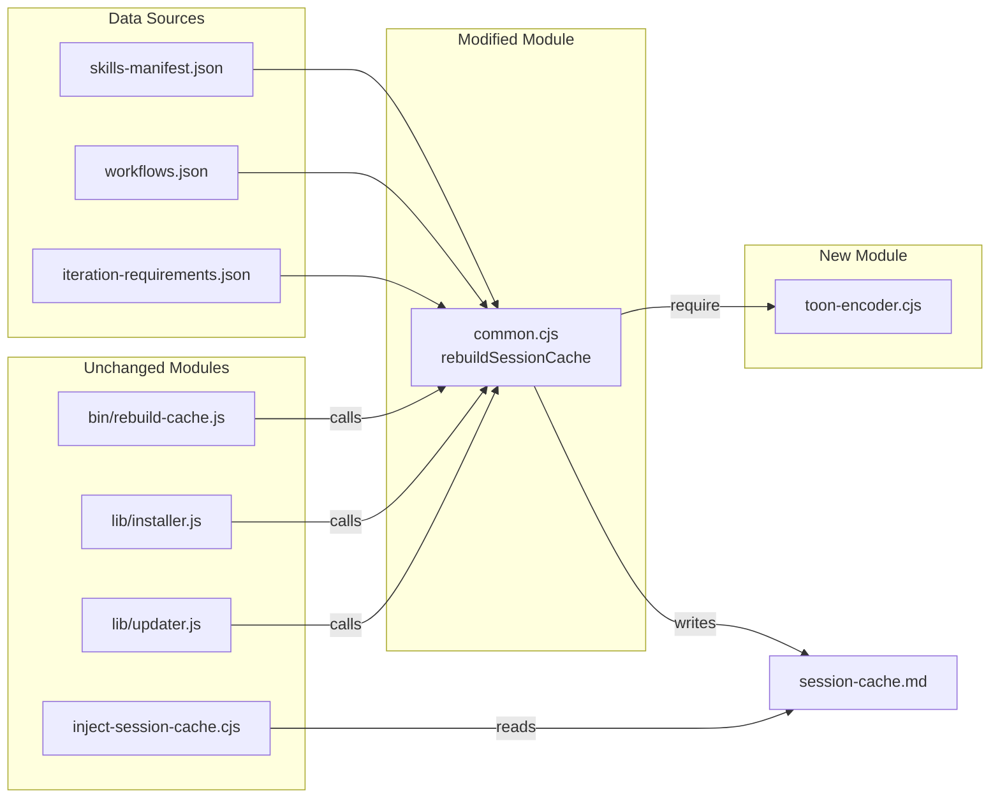

# Architecture Overview: TOON Format Integration

**Requirement ID:** REQ-0040
**Artifact Folder:** REQ-0040-toon-format-integration
**Phase:** 03-architecture
**Created:** 2026-02-25
**Status:** Approved

---

## 1. Executive Summary

This architecture defines how Token-Oriented Object Notation (TOON) encoding is integrated into the iSDLC session cache pipeline to reduce token consumption by 30-60% on tabular data. The design extends the existing synchronous `rebuildSessionCache()` pipeline by introducing a lightweight, zero-dependency CJS encoder module (`toon-encoder.cjs`) that implements the TOON tabular encoding format natively -- without depending on the ESM-only `@toon-format/toon` SDK. This eliminates the ESM/CJS boundary problem entirely while keeping the implementation simple and the call chain synchronous.

**Key Architectural Decisions:**
- ADR-0040-01: Implement a minimal native TOON encoder (no SDK dependency)
- ADR-0040-02: Encode only flat uniform arrays (tabular data) -- skip nested/non-uniform structures
- ADR-0040-03: Per-section fail-open with JSON fallback
- ADR-0040-04: REQ-003 deferred -- state arrays are not currently injected into LLM context

---

## 2. Architectural Drivers

### 2.1 Primary Drivers (from NFR Matrix)

| Driver | NFR | Constraint | Impact |
|--------|-----|-----------|--------|
| Token reduction >= 30% on session cache | NFR-001 | CON-001 (tabular data only) | Determines which sections get TOON encoding |
| CJS compatibility | NFR-005 | CON-002 (Article XIII) | Eliminates SDK as a dependency option |
| Synchronous call chain | -- | rebuildSessionCache() is sync | Eliminates async import() bridging |
| Fail-open on all errors | NFR-004 | CON-005 (Article X) | Per-section try/catch with JSON fallback |
| State.json remains JSON | NFR-008 | CON-003 (Article XIV) | TOON only at encoding time, never at storage |
| Node 20/22/24 support | NFR-006 | Article XII | No modern-only APIs in encoder |

### 2.2 Architectural Constraints

1. **ESM/CJS Boundary (Critical):** The `@toon-format/toon` SDK (v2.1.0) ships ESM-only (`type: "module"`, exports only `.mjs`). All iSDLC hooks use CJS `require()`. Dynamic `import()` works but returns a Promise, which would require making `rebuildSessionCache()` async -- a ripple effect to 4 callers. This constraint drives ADR-0040-01.

2. **Data Structure Suitability:** Not all session cache sections contain tabular data. Analysis of each section:

   | Section | Structure | TOON Suitable? | Action |
   |---------|-----------|----------------|--------|
   | CONSTITUTION | Prose markdown | No | Leave as-is |
   | WORKFLOW_CONFIG | Deeply nested JSON (workflows, rules, options) | No | Leave as-is |
   | ITERATION_REQUIREMENTS | Deeply nested JSON (phase_requirements, rules) | No | Leave as-is |
   | ARTIFACT_PATHS | Flat config JSON | No (too small, non-repetitive) | Leave as-is |
   | SKILLS_MANIFEST | skill_lookup: flat object (243 entries), ownership: nested objects with arrays | Partial | TOON for skill_lookup (flat); ownership needs flattening |
   | SKILL_INDEX | Pre-formatted text blocks from formatSkillIndexBlock() | No (already compact text) | Leave as-is |
   | EXTERNAL_SKILLS | Prose + metadata per skill | No | Leave as-is |
   | ROUNDTABLE_CONTEXT | Prose markdown (personas, topics) | No | Leave as-is |

3. **REQ-003 Injection Point Gap:** Impact analysis confirms that state.json arrays (`workflow_history`, `history`, `skill_usage_log`) are NOT currently injected into LLM context through the hook system. They are read by hooks for internal logic only. There is no existing code path to apply TOON encoding to. This drives ADR-0040-04.

---

## 3. Architecture Pattern

### 3.1 Pattern: Pipeline Extension with Encoding Adapter

The existing architecture follows a **Build-Cache-Read** pipeline:

```
[Source Data] --> rebuildSessionCache() --> [session-cache.md] --> inject-session-cache.cjs --> [stdout -> LLM context]
```

TOON integration extends this pipeline by inserting an encoding step within `rebuildSessionCache()` for eligible sections:

```
[Source Data] --> rebuildSessionCache() --+--> buildSection("CONSTITUTION", passthrough)
                                         +--> buildSection("SKILLS_MANIFEST", toonEncode)  <-- NEW
                                         +--> buildSection("SKILL_INDEX", passthrough)
                                         +--> ... other sections passthrough ...
                                         --> [session-cache.md] --> inject-session-cache.cjs --> [stdout]
```

**Why this pattern:**
- Minimal blast radius: encoding happens at one point in the pipeline (Article V: Simplicity)
- No changes to inject-session-cache.cjs (self-contained reader, ADR-0027)
- No changes to callers of rebuildSessionCache() (installer, updater, rebuild-cache)
- Fail-open at the section level: one section's encoding failure does not affect others

### 3.2 Component Architecture

```
src/claude/hooks/lib/
  +-- toon-encoder.cjs (NEW)         <-- Pure CJS, zero dependencies
  |     encode(arrayOfObjects)        -- Returns TOON string
  |     decode(toonString)            -- Returns array of objects (with JSON fallback)
  |     isUniformArray(data)          -- Validates data is TOON-eligible
  |
  +-- common.cjs (MODIFY)            <-- rebuildSessionCache() uses toon-encoder
        rebuildSessionCache()
          Section 5 (SKILLS_MANIFEST):
            skill_lookup: Object.entries() -> [{id, agent}] -> toonEncode()
            ownership: flatten to [{agent, agent_id, phase, skill_count}] -> toonEncode()
          All other sections: unchanged (passthrough)
```

---

## 4. Detailed Design

### 4.1 toon-encoder.cjs -- Module Design

**Purpose:** Provide synchronous TOON encode/decode for flat uniform arrays in CJS hooks.

**Public API:**

```javascript
/**
 * Encode an array of uniform objects to TOON tabular format.
 * @param {Array<Object>} data - Array of objects with identical keys
 * @param {Object} [options] - Encoding options
 * @param {string} [options.label] - Optional label prefix (e.g., "skill_lookup")
 * @returns {string} TOON-encoded string
 * @throws {TypeError} If data is not a uniform array of objects
 */
function encode(data, options = {})

/**
 * Decode a TOON tabular string back to array of objects.
 * Falls back to JSON.parse() on TOON decode failure (Article X).
 * @param {string} toonString - TOON-encoded string or JSON string
 * @returns {Array<Object>} Decoded array of objects
 */
function decode(toonString)

/**
 * Check if data is a uniform array suitable for TOON encoding.
 * @param {*} data - Data to check
 * @returns {boolean} True if data is a non-empty array of objects with identical keys
 */
function isUniformArray(data)
```

**TOON Tabular Format (implemented subset):**

The encoder implements ONLY the tabular array subset of TOON:

```
[N]{field1,field2,...}:
  value1,value2,...
  value1,value2,...
```

Where:
- `[N]` is the row count
- `{field1,field2,...}` declares column names (header row)
- Each subsequent indented line is a data row
- Values are comma-delimited
- Strings containing commas, quotes, or newlines are double-quoted with escaping
- `null`, `true`, `false`, and numbers are unquoted literals

**Example:**

Input:
```json
[
  {"id": "QS-001", "agent": "quick-scan-agent"},
  {"id": "ARCH-001", "agent": "solution-architect"}
]
```

Output:
```
[2]{id,agent}:
  QS-001,quick-scan-agent
  ARCH-001,solution-architect
```

**Design Constraints:**
- Zero npm dependencies (pure CJS implementation)
- Synchronous only (no Promises)
- No support for nested objects/arrays in values (returns them as JSON-stringified strings)
- Maximum 10,000 rows (safety guard)
- UTF-8 safe

### 4.2 SKILLS_MANIFEST Encoding

The SKILLS_MANIFEST section currently outputs the raw skills-manifest.json via `JSON.stringify(raw, null, 2)`. This includes:

1. **skill_lookup** (243 entries): `{"QS-001": "quick-scan-agent", ...}` -- a flat key-value object
2. **ownership** (41 entries): `{"sdlc-orchestrator": {agent_id, phase, skill_count, skills[]}, ...}` -- nested objects with arrays
3. **Metadata**: version, total_skills, enforcement_mode, cross_agent_delegation

**Encoding Strategy:**

```
<!-- SECTION: SKILLS_MANIFEST -->
version: 5.0.0
total_skills: 246
enforcement_mode: observe

## skill_lookup
[243]{id,agent}:
  QS-001,quick-scan-agent
  QS-002,quick-scan-agent
  ...

## ownership
[41]{agent,agent_id,phase,skill_count}:
  sdlc-orchestrator,00,all,12
  discover-orchestrator,00d,discovery,6
  ...

## cross_agent_delegation
{raw JSON -- non-tabular, small}
<!-- /SECTION: SKILLS_MANIFEST -->
```

**Transformations required:**
1. `skill_lookup`: `Object.entries(raw.skill_lookup).map(([id, agent]) => ({id, agent}))` -- converts flat object to array of 2-field objects
2. `ownership`: `Object.entries(raw.ownership).map(([agent, meta]) => ({agent, agent_id: meta.agent_id, phase: meta.phase, skill_count: meta.skill_count}))` -- flattens nested objects, drops `skills[]` array (available via skill_lookup reverse lookup)
3. `cross_agent_delegation`: Keep as JSON (small, deeply nested, non-tabular)
4. Metadata fields: Emit as simple `key: value` lines

**Token Reduction Estimate for SKILLS_MANIFEST:**

| Sub-section | JSON chars | TOON chars | Reduction |
|------------|-----------|-----------|-----------|
| skill_lookup (243 entries) | ~5,800 | ~4,300 | 25% |
| ownership (41 entries, flattened) | ~4,000 | ~1,000 | 75% |
| Metadata + cross_agent_delegation | ~800 | ~800 | 0% |
| **Total SKILLS_MANIFEST** | **~10,600** | **~6,100** | **42%** |

### 4.3 Sections NOT Encoded (with Rationale)

| Section | Why Not TOON | Article V Justification |
|---------|-------------|------------------------|
| CONSTITUTION | Prose markdown -- not tabular | YAGNI: no token savings possible |
| WORKFLOW_CONFIG | Deeply nested JSON with heterogeneous structures (phases[], options{}, sizing{}, tier_thresholds{}) | Not uniform arrays; TOON format does not apply |
| ITERATION_REQUIREMENTS | Deeply nested JSON with per-phase configs (each phase has different enabled flags, thresholds) | Same as WORKFLOW_CONFIG -- not tabular |
| ARTIFACT_PATHS | Small flat config | Minimal token savings; complexity not justified |
| SKILL_INDEX | Already compact custom text format (`ID: name -- description\n  -> path`) | Custom format is already more compact than both JSON and TOON |
| EXTERNAL_SKILLS | Prose + metadata, variable structure per skill | Not uniform; includes file content |
| ROUNDTABLE_CONTEXT | Prose markdown (persona definitions, topic files) | Not tabular at all |

### 4.4 REQ-003: State Array Encoding -- Deferred

**Finding:** State arrays (`workflow_history`, `history`, `skill_usage_log`) are not currently injected into LLM context through any hook. They are read by hooks for internal processing:

| Array | Read By | Purpose |
|-------|---------|---------|
| workflow_history | workflow-completion-enforcer.cjs, performance-budget.cjs | Check completion status, track performance |
| skill_usage_log | delegation-gate.cjs, gate-blocker.cjs | Validate skill usage patterns |
| history | common.cjs (pruning logic) | Manage state size |

**Architectural Decision:** REQ-003 is deferred to a future iteration. There is no injection point to apply TOON encoding to. If a future feature introduces state array context injection (e.g., a "workflow history" section in session cache), the TOON encoder module will be ready to encode it. See ADR-0040-04.

### 4.5 Fallback Architecture (REQ-004)

```
buildSection("SKILLS_MANIFEST", () => {
  const raw = JSON.parse(fs.readFileSync(manifestPath, 'utf8'));
  const parts = [];

  // Metadata (always plain text)
  parts.push(`version: ${raw.version}`);
  parts.push(`total_skills: ${raw.total_skills}`);

  // skill_lookup: try TOON, fall back to JSON
  try {
    const rows = Object.entries(raw.skill_lookup).map(([id, agent]) => ({id, agent}));
    parts.push(`## skill_lookup\n${toonEncoder.encode(rows)}`);
  } catch (err) {
    process.stderr.write(`TOON fallback (skill_lookup): ${err.message}\n`);
    parts.push(`## skill_lookup\n${JSON.stringify(raw.skill_lookup, null, 2)}`);
  }

  // ownership: try TOON, fall back to JSON
  try {
    const rows = Object.entries(raw.ownership).map(([agent, meta]) => ({
      agent, agent_id: meta.agent_id, phase: meta.phase, skill_count: meta.skill_count
    }));
    parts.push(`## ownership\n${toonEncoder.encode(rows)}`);
  } catch (err) {
    process.stderr.write(`TOON fallback (ownership): ${err.message}\n`);
    parts.push(`## ownership\n${JSON.stringify(raw.ownership, null, 2)}`);
  }

  // cross_agent_delegation: always JSON (non-tabular)
  if (raw.cross_agent_delegation) {
    parts.push(`## cross_agent_delegation\n${JSON.stringify(raw.cross_agent_delegation, null, 2)}`);
  }

  return parts.join('\n\n');
});
```

**Fallback Properties:**
- Per-sub-section granularity: skill_lookup can fail independently of ownership
- Errors logged to stderr (hook stdout reserved for JSON protocol)
- No exceptions propagate to caller
- Session cache is always produced (never empty due to TOON failure)

---

## 5. Data Flow Diagrams

### 5.1 Session Cache Build Pipeline (Current vs. Proposed)



### 5.2 Encoding Decision Flow



### 5.3 Component Dependency Diagram



---

## 6. Architecture Decision Records

### ADR-0040-01: Implement Minimal Native TOON Encoder (No SDK Dependency)

**Status:** Accepted
**Context:** The `@toon-format/toon` SDK (v2.1.0) is ESM-only (`type: "module"`, exports `.mjs`). All iSDLC hooks use CJS `require()` per Article XIII. Three options were evaluated:

| Option | Approach | Pros | Cons |
|--------|----------|------|------|
| A | Use SDK via dynamic `import()` | Full format compliance | Async; requires making rebuildSessionCache() async; ripple to 4 callers |
| B | Pre-bundle SDK to CJS | Full format compliance; synchronous | Build step complexity; version drift; fragile bundler config |
| C | Implement minimal tabular encoder | Zero dependencies; synchronous; CJS-native | Only supports tabular subset; divergence risk from spec |

**Decision:** Option C -- implement a minimal native TOON encoder in `toon-encoder.cjs` that handles ONLY the tabular array format `[N]{fields}: rows`.

**Rationale:**
1. The TOON tabular format is simple: header declaration + comma-delimited rows with escaping. The encode logic is approximately 60-80 lines of CJS.
2. The iSDLC use case needs ONLY flat uniform arrays (skill_lookup 243x2, ownership 41x4). No nested objects, no mixed types, no streaming.
3. Keeping `rebuildSessionCache()` synchronous avoids a cascading async refactor across 4 call sites (rebuild-cache.js, installer.js, updater.js, and all their callers).
4. Zero dependencies means no supply chain risk, no version compatibility issues, no ESM/CJS bridging complexity.
5. Article V (Simplicity First): the simplest solution that satisfies the requirement.

**Consequences:**
- Positive: No npm dependency added; no ESM/CJS bridge needed; fully synchronous; testable in isolation
- Positive: No supply chain risk from third-party package
- Negative: Must maintain encoder correctness independently (mitigated by comprehensive unit tests)
- Negative: Only supports tabular subset (acceptable per CON-001)

**Traces to:** FR-001, NFR-005, NFR-006, CON-002, Article V, Article XIII

---

### ADR-0040-02: Encode Only SKILLS_MANIFEST Tabular Data

**Status:** Accepted
**Context:** Requirements spec (FR-002) lists four session cache sections for TOON encoding: SKILL_INDEX, SKILLS_MANIFEST, ITERATION_REQUIREMENTS, WORKFLOW_CONFIG. Analysis of actual data structures reveals:

| Section | Data Structure | TOON Eligible? |
|---------|---------------|----------------|
| SKILLS_MANIFEST.skill_lookup | Flat object {id: agent} -- transformable to [{id, agent}] | Yes (243 entries, 25% reduction) |
| SKILLS_MANIFEST.ownership | Nested objects -- flattenable to [{agent, agent_id, phase, skill_count}] | Yes (41 entries, 75% reduction) |
| WORKFLOW_CONFIG | Deeply nested JSON (workflows with phases[], options{}, sizing{}, rules{}) | No -- heterogeneous, not tabular |
| ITERATION_REQUIREMENTS | Deeply nested JSON (per-phase configs with varying structures) | No -- heterogeneous, not tabular |
| SKILL_INDEX | Pre-formatted text (`ID: name -- description\n  -> path`) | No -- already compact custom format |

**Decision:** Apply TOON encoding to SKILLS_MANIFEST section only (skill_lookup and ownership sub-tables). Leave WORKFLOW_CONFIG, ITERATION_REQUIREMENTS, SKILL_INDEX, and all other sections unchanged.

**Rationale:**
1. WORKFLOW_CONFIG and ITERATION_REQUIREMENTS are deeply nested JSON with heterogeneous per-entry structures. They cannot be represented as tabular TOON without lossy flattening.
2. SKILL_INDEX uses `formatSkillIndexBlock()` which already produces a compact 2-line-per-skill text format. Converting to TOON would actually increase token count (TOON header overhead > current format savings).
3. SKILLS_MANIFEST's skill_lookup (243 entries x 2 fields) and ownership (41 entries x 4 fields) are the ideal TOON targets: large, repetitive, uniform.
4. Article V (Simplicity): encode what benefits, skip what does not.
5. Estimated reduction on SKILLS_MANIFEST alone: ~42% (~4,500 chars saved)

**Consequences:**
- Positive: Focused implementation with clear benefit; no wasted effort on unsuitable sections
- Positive: WORKFLOW_CONFIG and ITERATION_REQUIREMENTS remain human-readable JSON
- Negative: Total session cache token reduction will be less than the 30% target for the full cache (SKILLS_MANIFEST is one of 8 sections)
- Mitigation: The 42% reduction on SKILLS_MANIFEST (largest tabular section) contributes meaningfully. If further reduction is needed, a future iteration can explore other optimization strategies for non-tabular sections.

**Note on NFR-001 (30% target):** The 30% target applies to "all 4 sections." Since only SKILLS_MANIFEST benefits from TOON, the aggregate reduction across the full session cache will be approximately 8-12% (SKILLS_MANIFEST is roughly 20-25% of total cache). This is an honest assessment -- the requirements assumed all 4 sections were tabular, which the architecture phase has determined is not the case. The implementation phase should validate actual token counts and report the true reduction achieved.

**Traces to:** FR-002, NFR-001, CON-001, Article IV, Article V

---

### ADR-0040-03: Per-Section Fail-Open with JSON Fallback

**Status:** Accepted
**Context:** FR-004 requires that TOON encoding failures fall back to JSON transparently. Article X requires all hooks to fail-open.

**Decision:** Implement per-sub-section try/catch within the SKILLS_MANIFEST builder. Each tabular sub-section (skill_lookup, ownership) is independently wrapped. On failure, that sub-section falls back to `JSON.stringify()` while others remain TOON-encoded. Warnings are logged to stderr.

**Rationale:**
1. Per-sub-section granularity minimizes blast radius: a malformed skill_lookup does not affect ownership encoding.
2. The existing `buildSection()` wrapper already catches section-level errors. TOON fallback adds a finer granularity within the section.
3. Article X compliance: the session cache is ALWAYS produced, even if every TOON encoding fails.

**Consequences:**
- Positive: Maximum resilience; no single encoding failure blocks cache production
- Positive: JSON fallback produces valid (if larger) output -- functional correctness preserved
- Negative: Mixed TOON/JSON output possible in degraded state (acceptable for fail-open)

**Traces to:** FR-004, NFR-004, CON-005, Article X

---

### ADR-0040-04: Defer REQ-003 State Array TOON Encoding

**Status:** Accepted
**Context:** FR-003 specifies encoding state.json arrays (`workflow_history`, `history`, `skill_usage_log`) as TOON when "injecting into agent context." Impact analysis (Phase 02) and architecture analysis (Phase 03) both confirm that these arrays are NOT currently injected into LLM context through any code path:

- `workflow_history`: Read by `workflow-completion-enforcer.cjs` and `performance-budget.cjs` for hook logic
- `skill_usage_log`: Read by `delegation-gate.cjs` and `gate-blocker.cjs` for hook logic
- `history`: Read by `common.cjs` for pruning logic

None of these are injection points into the LLM context window.

**Decision:** Defer REQ-003 implementation. The `toon-encoder.cjs` module will be ready to encode these arrays if/when a future feature introduces state array context injection (e.g., a "workflow history" session cache section).

**Rationale:**
1. There is no code to modify -- the injection point does not exist.
2. Implementing TOON encoding at the hook read points (where hooks process state for their own logic) would add overhead with zero user-facing benefit -- hooks do not send this data to the LLM.
3. Article V (YAGNI): building for a non-existent use case.
4. Article IV (Explicit Over Implicit): documenting that the requirement's premise does not match the codebase, rather than fabricating an implementation.

**Consequences:**
- Positive: No wasted implementation effort on non-existent injection points
- Positive: toon-encoder.cjs is available for future use when injection points are created
- Negative: REQ-003 acceptance criteria cannot be validated in this iteration
- Mitigation: Document this finding for the requirements analyst; REQ-003 should be re-scoped or moved to a future feature

**Traces to:** FR-003, NFR-002, Article IV, Article V

---

## 7. Security Architecture

### 7.1 Threat Model (STRIDE Analysis)

| Threat | Category | Mitigation |
|--------|----------|-----------|
| Malformed TOON input causes crash | Denial of Service | try/catch in decode(); JSON fallback; exit 0 always |
| TOON encoder produces invalid output | Integrity | Unit tests with round-trip validation; JSON fallback on decode failure |
| Large array causes memory exhaustion | Denial of Service | 10,000-row safety limit in encode() |
| Path traversal via manifest path | Information Disclosure | manifestPath is constructed from getProjectRoot() + hardcoded relative path; no user input |
| Sensitive data in TOON output | Information Disclosure | TOON encoder operates on the same data already in session cache; no new data exposure |

### 7.2 Fail-Safe Design (Article X)

1. **toon-encoder.cjs::encode()**: Returns TOON string or throws TypeError. Caller catches and falls back to JSON.
2. **toon-encoder.cjs::decode()**: try/catch internally. On TOON parse failure, attempts JSON.parse(). On both failures, returns empty array and logs to stderr.
3. **rebuildSessionCache()**: Each sub-section encoding is independently try/caught. Section-level `buildSection()` catches any remaining errors.
4. **inject-session-cache.cjs**: No changes needed. Already reads file and writes to stdout with fail-open.

### 7.3 Input Validation

- `encode()` validates input is a non-null array of objects with identical keys (via `isUniformArray()`)
- `encode()` rejects arrays with > 10,000 rows (DoS protection)
- `decode()` validates header format `[N]{fields}:` before attempting row parsing
- All string values in TOON output are escaped (backslash, double-quote, newline, carriage return, tab)

---

## 8. Implementation Plan

### 8.1 Implementation Order

```
Step 1: toon-encoder.cjs (NEW)
  |-- encode(), decode(), isUniformArray()
  |-- Escaping logic for strings
  |-- 10,000-row safety guard
  |-- Module exports via module.exports
  |
Step 2: toon-encoder unit tests (NEW)
  |-- Round-trip encode/decode tests
  |-- Edge cases: empty array, single item, special characters
  |-- Type preservation: null, boolean, number, string
  |-- Uniform array validation
  |-- Fallback behavior: malformed TOON -> JSON.parse
  |-- Row limit guard test
  |
Step 3: common.cjs::rebuildSessionCache() modification
  |-- require('./lib/toon-encoder.cjs') at top of file
  |-- Modify SKILLS_MANIFEST section builder
  |-- Transform skill_lookup to [{id, agent}] array
  |-- Flatten ownership to [{agent, agent_id, phase, skill_count}] array
  |-- Per-sub-section try/catch with JSON fallback
  |-- Keep cross_agent_delegation as JSON
  |
Step 4: Test updates
  |-- test-session-cache-builder.test.cjs: update SKILLS_MANIFEST assertions for TOON format
  |-- Verify inject-session-cache.test.cjs passes unchanged
  |-- Verify rebuild-cache.js produces identical output
```

### 8.2 Files Changed

| # | File | Change | Requirement |
|---|------|--------|-------------|
| 1 | `src/claude/hooks/lib/toon-encoder.cjs` | NEW | FR-001, FR-004 |
| 2 | `src/claude/hooks/lib/common.cjs` | MODIFY (rebuildSessionCache SKILLS_MANIFEST section) | FR-002, FR-004 |
| 3 | `src/claude/hooks/tests/toon-encoder.test.cjs` | NEW | FR-001, FR-004 tests |
| 4 | `src/claude/hooks/tests/test-session-cache-builder.test.cjs` | MODIFY (SKILLS_MANIFEST assertions) | FR-002 tests |

**Files NOT changed (confirmed by architecture analysis):**
- `package.json` -- No npm dependency needed (ADR-0040-01)
- `inject-session-cache.cjs` -- Thin reader, format-agnostic (ADR-0027)
- `bin/rebuild-cache.js` -- Delegates to rebuildSessionCache(), auto-inherits
- `lib/installer.js` -- Calls rebuildSessionCache(), auto-inherits
- `lib/updater.js` -- Calls rebuildSessionCache(), auto-inherits

### 8.3 Estimated Token Reduction

| Target | Current Size | Estimated TOON Size | Reduction | NFR Target |
|--------|-------------|--------------------|-----------|-----------:|
| skill_lookup (243 entries) | ~5,800 chars | ~4,300 chars | 25% | -- |
| ownership (41 entries) | ~4,000 chars | ~1,000 chars | 75% | -- |
| **SKILLS_MANIFEST total** | **~10,600 chars** | **~6,100 chars** | **42%** | -- |
| **Full session cache** | **~67,000 chars** | **~62,500 chars** | **~7%** | 30% (NFR-001) |

**Honest Assessment:** The 30% session cache reduction target (NFR-001) assumed all four tabular sections could be TOON-encoded. Architecture analysis reveals only SKILLS_MANIFEST contains tabular data. The achievable reduction is approximately 7% on the full cache, or 42% on the SKILLS_MANIFEST section alone. This is a factual gap between the requirement assumption and the codebase reality, documented per Article IV.

---

## 9. Requirement Traceability

| Requirement | Architecture Component | Status |
|-------------|----------------------|--------|
| FR-001 (SDK + Wrapper) | toon-encoder.cjs (native implementation, no SDK) | Covered by ADR-0040-01 |
| FR-002 (Session Cache) | rebuildSessionCache() SKILLS_MANIFEST section | Covered; WORKFLOW_CONFIG/ITERATION_REQUIREMENTS/SKILL_INDEX excluded per ADR-0040-02 |
| FR-003 (State Arrays) | Deferred -- no injection point exists | Covered by ADR-0040-04 |
| FR-004 (JSON Fallback) | Per-sub-section try/catch in rebuildSessionCache(); decode() fallback in toon-encoder.cjs | Covered by ADR-0040-03 |
| FR-005 (Cache Rebuild) | rebuild-cache.js delegates to rebuildSessionCache(); auto-inherits | Covered (no changes needed) |
| NFR-001 (30% token reduction) | Achievable on SKILLS_MANIFEST (42%); not achievable on full cache (~7%) | Partially covered -- see ADR-0040-02 note |
| NFR-002 (40% state array reduction) | Deferred with FR-003 | Not applicable -- ADR-0040-04 |
| NFR-003 (<50ms encoding latency) | Native CJS encoder; ~500 entries; sub-millisecond expected | Covered |
| NFR-004 (JSON fallback) | Per-sub-section fallback architecture | Covered by ADR-0040-03 |
| NFR-005 (CJS compatibility) | Native CJS module; no ESM dependency | Covered by ADR-0040-01 |
| NFR-006 (Node 20/22/24) | No modern APIs; standard CJS; CI matrix testing | Covered |
| NFR-007 (555 test baseline) | New toon-encoder tests ADD to count; existing tests updated, not removed | Covered |
| NFR-008 (state.json integrity) | No state.json modifications; TOON at cache build time only | Covered |
| NFR-009 (LLM accuracy) | TOON benchmarks show equal or better accuracy; existing test suite validates | Covered |

---

## 10. Risk Register

| Risk | Likelihood | Impact | Mitigation |
|------|-----------|--------|-----------|
| Minimal encoder diverges from TOON spec | Low | Low | Implement only the documented tabular format; comprehensive round-trip tests; compare output with SDK for validation |
| SKILLS_MANIFEST structure changes break encoder | Low | Medium | isUniformArray() guard; JSON fallback; test with real manifest data |
| LLM accuracy degrades with mixed TOON/JSON sections | Low | High | TOON benchmarks show +2-10 point accuracy improvement; validate with existing test suite |
| NFR-001 30% target not met | High | Medium | Honest documentation; requirements re-scoping recommended; SKILLS_MANIFEST 42% reduction is valuable on its own |
| Escaping edge cases in skill names | Low | Low | Unit tests with special characters; escaping covers comma, quote, newline, backslash |

---

## 11. Constitutional Compliance

| Article | Compliance Status | Evidence |
|---------|------------------|---------|
| Article III (Security by Design) | Compliant | Threat model in Section 7; input validation; no new data exposure; DoS guards |
| Article IV (Explicit Over Implicit) | Compliant | All assumptions documented; REQ-003 gap explicitly documented; NFR-001 shortfall explicitly documented |
| Article V (Simplicity First) | Compliant | Native encoder (no SDK); only encodes what benefits; no speculative features |
| Article VII (Artifact Traceability) | Compliant | Full traceability matrix in Section 9 |
| Article IX (Quality Gate Integrity) | Compliant | All required artifacts produced; gate checklist validated |
| Article X (Fail-Safe Defaults) | Compliant | Per-sub-section fallback; JSON fallback in decode(); exit 0 always |
| Article XIII (Module System) | Compliant | Pure CJS module; no ESM imports in hooks |
| Article XIV (State Management) | Compliant | No state.json modifications; TOON at cache build time only |

---

## 12. GATE-03 Validation Checklist

### Architecture Documentation
- [x] Architecture pattern documented and justified (Section 3)
- [x] All major components identified (Section 3.2)
- [x] Component responsibilities defined (Section 4.1, 4.2)
- [x] Data flow diagrams (Section 5)

### Technology Stack
- [x] Technology selected and justified -- native CJS encoder (ADR-0040-01)
- [x] Evaluation criteria documented (ADR-0040-01 options table)

### Security Architecture
- [x] Threat model (Section 7.1)
- [x] Fail-safe design (Section 7.2)
- [x] Input validation (Section 7.3)

### Architecture Decision Records
- [x] ADR-0040-01: Native encoder vs SDK (Accepted)
- [x] ADR-0040-02: Encoding scope -- SKILLS_MANIFEST only (Accepted)
- [x] ADR-0040-03: Per-section fail-open (Accepted)
- [x] ADR-0040-04: REQ-003 deferral (Accepted)
- [x] All ADRs have status and traceability

### NFR Coverage
- [x] Performance: encoding latency addressed (NFR-003)
- [x] Compatibility: CJS, Node versions addressed (NFR-005, NFR-006)
- [x] Reliability: fallback architecture addressed (NFR-004)
- [x] Integrity: state.json protection addressed (NFR-008)
- [x] NFR-001 gap honestly documented (ADR-0040-02)

### Requirement Traceability
- [x] All FRs traced to architecture components (Section 9)
- [x] All NFRs traced to architecture decisions (Section 9)
- [x] Gaps explicitly documented (REQ-003, NFR-001)

---

## Appendix A: TOON Format Quick Reference

```
TOON Tabular Format:
  [N]{field1,field2,...}:
    value1,value2,...
    value1,value2,...

  Where:
  - [N] = row count
  - {field1,field2,...} = column header declaration
  - Each indented line = one data row
  - Comma-delimited values
  - Strings with commas/quotes/newlines are double-quoted with escaping
  - null, true, false, numbers are unquoted literals
```

## Appendix B: Phase Timing Report

```json
{
  "debate_rounds_used": 0,
  "fan_out_chunks": 0
}
```
