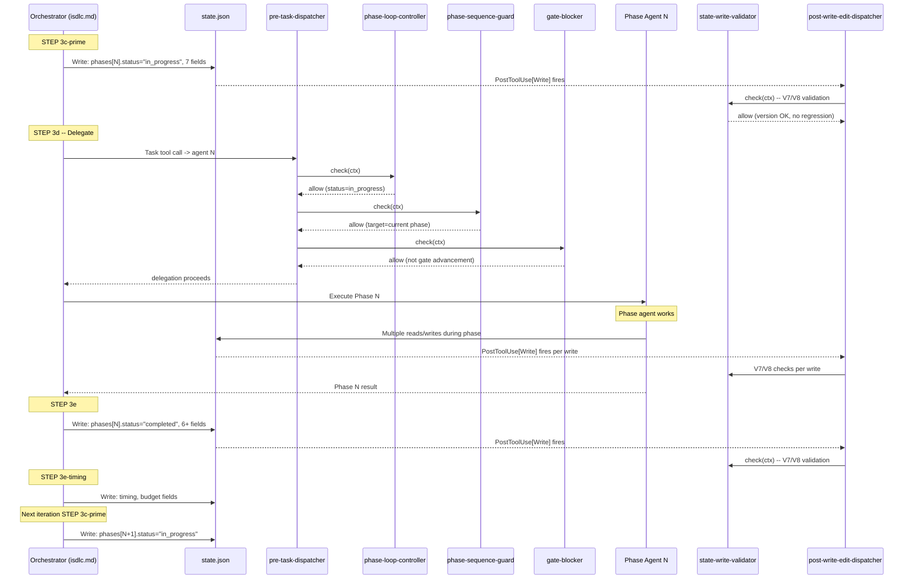
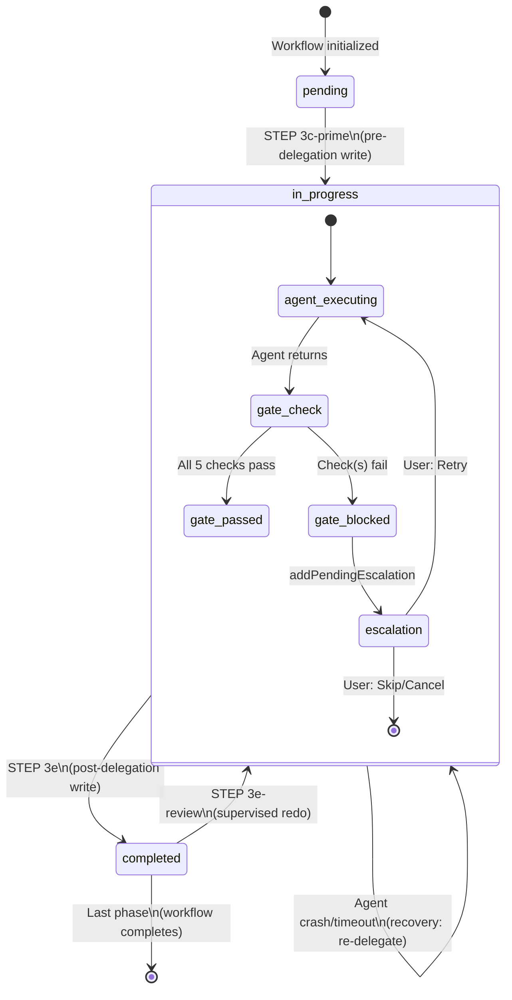
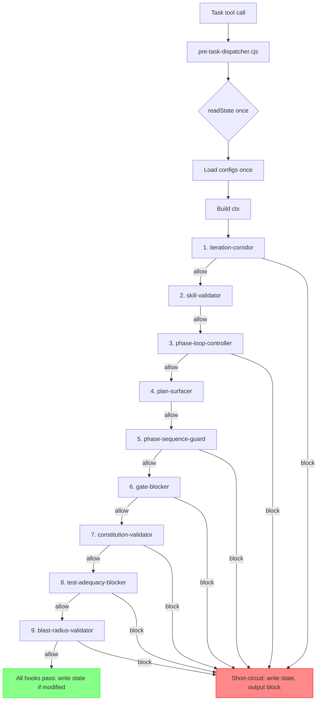

# Architecture Analysis: Phase Handshake System

**Investigation ID**: INV-0055
**Source**: GitHub Issue #55
**Phase**: 03-architecture (ANALYSIS MODE -- no state.json writes, no branches)
**Generated**: 2026-02-19
**Based On**: Phase 01 Requirements Specification, Phase 02 Impact Analysis

---

## Table of Contents

1. [Executive Summary](#1-executive-summary)
2. [Current Architecture](#2-current-architecture)
   - 2.1 [System Overview](#21-system-overview)
   - 2.2 [State Management Pattern](#22-state-management-pattern)
   - 2.3 [Hook Chain Architecture](#23-hook-chain-architecture)
   - 2.4 [Phase-Loop Controller as Prompt-Based Orchestrator](#24-phase-loop-controller-as-prompt-based-orchestrator)
   - 2.5 [Artifact Passing via Template Substitution](#25-artifact-passing-via-template-substitution)
3. [State Machine Analysis](#3-state-machine-analysis)
   - 3.1 [Phase State Machine](#31-phase-state-machine)
   - 3.2 [Workflow State Machine](#32-workflow-state-machine)
   - 3.3 [Supervised Review Sub-State Machine](#33-supervised-review-sub-state-machine)
   - 3.4 [Gate Validation State Machine](#34-gate-validation-state-machine)
   - 3.5 [Budget State Machine](#35-budget-state-machine)
4. [Architectural Risks](#4-architectural-risks)
   - 4.1 [RISK-01: Non-Atomic State Writes from Prompt-Based Orchestrator](#41-risk-01-non-atomic-state-writes-from-prompt-based-orchestrator)
   - 4.2 [RISK-02: Dual-Write Consistency](#42-risk-02-dual-write-consistency)
   - 4.3 [RISK-03: Prompt-Based Orchestration Reliability](#43-risk-03-prompt-based-orchestration-reliability)
   - 4.4 [RISK-04: Single Point of Failure in common.cjs](#44-risk-04-single-point-of-failure-in-commoncjs)
   - 4.5 [RISK-05: Hook Execution Order Dependencies](#45-risk-05-hook-execution-order-dependencies)
   - 4.6 [RISK-06: Version Lock Race Window](#46-risk-06-version-lock-race-window)
   - 4.7 [RISK-07: Supervised Review Redo Timing Correctness](#47-risk-07-supervised-review-redo-timing-correctness)
   - 4.8 [RISK-08: Missing Cross-Location Consistency Checks](#48-risk-08-missing-cross-location-consistency-checks)
   - 4.9 [RISK-09: Configuration Loader Duplication](#49-risk-09-configuration-loader-duplication)
5. [Field-Consumer Matrix](#5-field-consumer-matrix)
6. [Architectural Recommendations](#6-architectural-recommendations)
   - 6.1 [REC-01: Consolidate the Dual-Write Pattern](#61-rec-01-consolidate-the-dual-write-pattern)
   - 6.2 [REC-02: Add a State Consistency Validator Hook](#62-rec-02-add-a-state-consistency-validator-hook)
   - 6.3 [REC-03: Extract Critical Orchestration Logic into Code](#63-rec-03-extract-critical-orchestration-logic-into-code)
   - 6.4 [REC-04: Consolidate Configuration Loaders](#64-rec-04-consolidate-configuration-loaders)
   - 6.5 [REC-05: Add Missing Integration Tests](#65-rec-05-add-missing-integration-tests)
   - 6.6 [REC-06: Add Recovery Mechanism for Stuck Phases](#66-rec-06-add-recovery-mechanism-for-stuck-phases)
7. [Architecture Diagrams](#7-architecture-diagrams)
8. [Phase Gate Validation](#8-phase-gate-validation)

---

## 1. Executive Summary

The phase handshake system is the backbone of iSDLC workflow execution. It manages the lifecycle of phases from `pending` through `in_progress` to `completed`, enforces gate requirements at phase boundaries, passes artifacts between phases, and tracks timing and budget data.

The system follows a **hybrid architecture**: a prompt-based orchestrator (isdlc.md STEP 3) drives the high-level flow while a deterministic code-based hook chain (pre-task-dispatcher with 9 sub-hooks) enforces invariants. This creates a layered enforcement model where the prompt specification defines intent and the hooks enforce correctness.

**Key architectural characteristics**:
- **State management**: Single JSON file (`.isdlc/state.json`) with synchronous I/O
- **Orchestration**: Prompt-based (isdlc.md) with code-based enforcement (hooks)
- **Hook chain**: 9 PreToolUse[Task] hooks chained through a single dispatcher process
- **Dual-write pattern**: Phase status tracked in two locations (`phases[N].status` and `active_workflow.phase_status[N]`)
- **Fail-open semantics**: All hooks default to allowing operations on error
- **Version locking**: Optimistic concurrency via `state_version` auto-increment

**Key findings**:
- The hook-based enforcement layer is well-designed and thoroughly tested for individual hooks
- The prompt-based orchestrator is comprehensive but cannot be validated by code -- hooks are the safety net
- The dual-write pattern (BUG-0005 legacy) is an architectural liability with no cross-check validation
- 4 of 10 test scenarios lack test coverage, all involving cross-boundary state transitions
- The `writeState()` function provides per-call atomicity (single `fs.writeFileSync`) but the orchestrator performs multiple sequential writes per phase transition, creating windows of inconsistent state

---

## 2. Current Architecture

### 2.1 System Overview

The phase handshake system operates at the boundary between phases in the iSDLC workflow. At its core, it is a **state machine executor** where:

- The **state** is a JSON file on disk (`.isdlc/state.json`)
- The **executor** is the Phase-Loop Controller (isdlc.md STEP 3), a prompt specification interpreted by an LLM
- The **enforcers** are Node.js hooks that validate state transitions before and after tool calls
- The **configuration** is in two JSON files (`iteration-requirements.json` and `artifact-paths.json`)

```
Architecture Overview (C4 Level 2 - Containers)

+------------------------------------------------------------------+
|                         Claude Code Runtime                       |
|                                                                   |
|  +------------------------------+   +-------------------------+  |
|  |   isdlc.md STEP 3            |   |  Phase Agent (N)        |  |
|  |   (Prompt-Based Orchestrator) |-->|  (e.g., solution-       |  |
|  |                               |   |   architect.md)         |  |
|  |  3a: TaskUpdate (spinner)     |   |                         |  |
|  |  3b: Read state               |   |  Produces artifacts     |  |
|  |  3c: Handle escalations       |   |  Updates state fields   |  |
|  |  3c': Pre-delegation write    |   |  Returns result         |  |
|  |  3d: Delegate to agent  ------+-->|                         |  |
|  |  3e: Post-delegation write    |<--+                         |  |
|  |  3e-timing: Budget/timing     |   +-------------------------+  |
|  |  3e-review: Supervised gate   |                                |
|  +------------------------------+                                |
|         |  writes      ^  reads                                   |
|         v              |                                          |
|  +------------------------------+                                |
|  |    .isdlc/state.json         |                                |
|  |    (Single JSON file)         |                                |
|  +------------------------------+                                |
|         |  read by     ^  validated by                            |
|         v              |                                          |
|  +------------------------------+                                |
|  |   Hook Chain                  |                                |
|  |   (pre-task-dispatcher.cjs)   |                                |
|  |                               |                                |
|  |  1. iteration-corridor        |                                |
|  |  2. skill-validator           |                                |
|  |  3. phase-loop-controller     |                                |
|  |  4. plan-surfacer             |                                |
|  |  5. phase-sequence-guard      |                                |
|  |  6. gate-blocker              |                                |
|  |  7. constitution-validator    |                                |
|  |  8. test-adequacy-blocker     |                                |
|  |  9. blast-radius-validator    |                                |
|  +------------------------------+                                |
|                                                                   |
|  +------------------------------+  +---------------------------+  |
|  |  post-write-edit-dispatcher  |  |  delegation-gate (Stop)   |  |
|  |  (PostToolUse[Write,Edit])   |  |  (PostResponse)           |  |
|  |                              |  |                           |  |
|  |  1. state-write-validator    |  |  Verifies Task delegation |  |
|  |  2. output-format-validator  |  |  occurred after /isdlc    |  |
|  |  3. workflow-completion-     |  |  command was loaded        |  |
|  |     enforcer                 |  +---------------------------+  |
|  +------------------------------+                                |
|                                                                   |
|  +------------------------------+                                |
|  |  state-file-guard            |                                |
|  |  (PreToolUse[Bash])          |                                |
|  |                              |                                |
|  |  Blocks Bash writes to       |                                |
|  |  state.json                   |                                |
|  +------------------------------+                                |
+------------------------------------------------------------------+
```

### 2.2 State Management Pattern

**Pattern**: Single-file JSON state with optimistic concurrency control.

The entire handshake state lives in `.isdlc/state.json`, a flat JSON file on disk. There is no database, no in-memory store, and no event log. All state reads and writes go through two functions in `common.cjs`:

**`readState(projectId)`** (line 1063-1075):
```javascript
function readState(projectId) {
    const stateFile = resolveStatePath(projectId);
    if (!fs.existsSync(stateFile)) return null;
    try {
        return JSON.parse(fs.readFileSync(stateFile, 'utf8'));
    } catch (e) {
        return null;
    }
}
```
- Synchronous read via `fs.readFileSync`
- Returns null on any error (fail-open)
- No caching -- reads disk on every call

**`writeState(state, projectId)`** (line 1089-1123):
```javascript
function writeState(state, projectId) {
    const stateFile = resolveStatePath(projectId);
    // ... ensure directory exists ...
    try {
        let currentVersion = 0;
        try {
            if (fs.existsSync(stateFile)) {
                const diskContent = fs.readFileSync(stateFile, 'utf8');
                const diskState = JSON.parse(diskContent);
                if (typeof diskState.state_version === 'number' && diskState.state_version > 0) {
                    currentVersion = diskState.state_version;
                }
            }
        } catch (e) { currentVersion = 0; }

        const stateCopy = Object.assign({}, state);
        stateCopy.state_version = currentVersion + 1;
        fs.writeFileSync(stateFile, JSON.stringify(stateCopy, null, 2));
        return true;
    } catch (e) { return false; }
}
```
- Reads current version from disk, increments, writes back
- Uses `Object.assign` (shallow copy) to avoid mutating caller's object
- Single `fs.writeFileSync` call provides OS-level atomicity for the buffer
- No file locking beyond Node.js single-threaded execution

**State Path Resolution** (`resolveStatePath`, line 327-339):
- Single-project: `.isdlc/state.json`
- Monorepo: `.isdlc/projects/{projectId}/state.json`
- Falls back to single-project path if no active monorepo project

**Dual-Write Pattern**:

Phase status is tracked in **two** locations within the same state.json file:

| Location | Purpose | Example |
|----------|---------|---------|
| `phases["03-architecture"].status` | Detailed phase object; read by all hooks | `"in_progress"` |
| `active_workflow.phase_status["03-architecture"]` | Summary map; used by orchestrator for quick lookups | `"in_progress"` |

Both are written by STEP 3c-prime (pre-delegation) and STEP 3e (post-delegation). The dual-write was introduced as a BUG-0005 workaround and has become permanent. The isdlc.md spec at line 1140 explicitly warns: "Both MUST be updated -- hooks read from the detailed `phases` object."

### 2.3 Hook Chain Architecture

**Pattern**: Dispatcher-consolidated chain with short-circuit-on-block semantics.

The `pre-task-dispatcher.cjs` is the single entry point for all `PreToolUse[Task]` hooks. It:

1. Reads stdin once (the tool call event from Claude Code runtime)
2. Reads state.json once via `readState()`
3. Loads three config files once (manifest, iteration-requirements, workflows)
4. Builds a shared context object: `ctx = { input, state, manifest, requirements, workflows }`
5. Calls each hook's `check(ctx)` function in order
6. Short-circuits on the first `{ decision: 'block' }` result
7. Writes state once if any hook set `stateModified: true`
8. Emits stderr and block responses

**Hook execution order** (from `pre-task-dispatcher.cjs` lines 69-90):

| Order | Hook | Guard | Purpose |
|-------|------|-------|---------|
| 1 | iteration-corridor | `hasActiveWorkflow` | Blocks delegation during active test/constitutional corridor |
| 2 | skill-validator | (none) | Observational only -- logs skill usage, never blocks |
| 3 | phase-loop-controller | `hasActiveWorkflow` | Blocks if phase not marked `in_progress` |
| 4 | plan-surfacer | `hasActiveWorkflow` | Checks task plan existence |
| 5 | phase-sequence-guard | `hasActiveWorkflow` | Blocks out-of-order phase delegation |
| 6 | gate-blocker | `hasActiveWorkflow` | Validates 5 requirement types at gate boundaries |
| 7 | constitution-validator | `hasActiveWorkflow` | Constitutional compliance check |
| 8 | test-adequacy-blocker | Phase starts with `15-upgrade` | Test coverage for upgrade phases |
| 9 | blast-radius-validator | Feature workflow + Phase `06-implementation` | Impact analysis coverage |

**Key design decisions**:
- **Shared state read**: All hooks receive the same `ctx.state` snapshot, ensuring consistency within a single dispatcher invocation
- **Short-circuit**: First blocking hook terminates the chain, preventing cascade effects
- **Fail-open**: Every hook wraps its logic in try/catch and returns `{ decision: 'allow' }` on error
- **State mutation**: Hooks mutate `ctx.state` in memory; the dispatcher writes once at the end

**Separate dispatchers for other hook types**:

| Dispatcher | Hook Type | Hooks |
|------------|-----------|-------|
| `post-write-edit-dispatcher.cjs` | `PostToolUse[Write,Edit]` | state-write-validator, output-format-validator, workflow-completion-enforcer |
| (standalone) | `PreToolUse[Bash]` | state-file-guard |
| (standalone) | `Stop` (post-response) | delegation-gate |

### 2.4 Phase-Loop Controller as Prompt-Based Orchestrator

**Pattern**: LLM-interpreted prompt specification with deterministic hook enforcement.

The core orchestration logic lives in `src/claude/commands/isdlc.md` STEP 3 (lines 1102-1460), a ~360-line prompt specification that instructs the LLM to:

1. Iterate through phases in a `for` loop
2. Read and write state.json at defined points
3. Delegate to phase agents via the `Task` tool
4. Handle escalations, supervised reviews, timing, and budget

This is **not executable code**. It is a natural-language specification that the LLM follows (or attempts to follow) during workflow execution. The hooks serve as the deterministic enforcement layer that catches deviations.

**Architectural implications**:

| Aspect | Prompt-Based | Code-Based |
|--------|-------------|------------|
| Determinism | Non-deterministic (LLM may deviate) | Deterministic (same input = same output) |
| Testability | Cannot unit-test | Fully unit-testable |
| Enforcement | Advisory (LLM *should* follow) | Mandatory (hooks block invalid operations) |
| Flexibility | High (easy to modify prompt) | Lower (requires code changes) |
| Debugging | Difficult (inspect LLM behavior) | Standard debugging tools |

**What the prompt controls vs. what hooks enforce**:

| Responsibility | Controlled By | Enforced By |
|----------------|--------------|-------------|
| Phase status set to `in_progress` before delegation | isdlc.md 3c-prime | phase-loop-controller hook |
| Phase delegation targets correct agent | isdlc.md 3d (PHASE-AGENT table) | phase-sequence-guard hook |
| Gate requirements satisfied before advancement | isdlc.md 3e | gate-blocker hook |
| Version lock on state writes | isdlc.md (implicit -- LLM writes state) | state-write-validator V7 |
| Phase index does not regress | isdlc.md 3e | state-write-validator V8 |
| Artifacts exist at expected paths | isdlc.md 3d (GATE REQUIREMENTS injection) | gate-blocker artifact check |
| Timing data preserved on retry | isdlc.md 3c-prime-timing | **NOT ENFORCED** (no hook) |
| Budget degradation injected | isdlc.md 3d (BUDGET_DEGRADATION) | **NOT ENFORCED** (no hook) |
| Escalations cleared after handling | isdlc.md 3c | **NOT ENFORCED** (no hook) |
| Dual-write synchronization | isdlc.md 3c-prime, 3e | **NOT ENFORCED** (no hook) |

The "NOT ENFORCED" entries are the primary gap. The prompt specifies the behavior, but no hook validates that the LLM actually followed through.

### 2.5 Artifact Passing via Template Substitution

**Pattern**: Configuration-driven path resolution with template placeholders.

Artifact paths are defined in `artifact-paths.json` using `{artifact_folder}` placeholders:

```json
{
  "phases": {
    "03-architecture": {
      "paths": ["docs/requirements/{artifact_folder}/architecture-overview.md"]
    }
  }
}
```

The template substitution chain:

1. **Source of truth**: `active_workflow.artifact_folder` in state.json (e.g., `"REQ-0001-user-auth"`)
2. **Injection point (STEP 3d)**: The orchestrator reads artifact-paths.json, replaces `{artifact_folder}`, and injects the resolved paths into the delegation prompt as a `Required Artifacts:` block
3. **Validation point (gate-blocker)**: `checkArtifactPresenceRequirement()` (line 520-576) loads artifact-paths.json, resolves templates using the same `active_workflow.artifact_folder` value, and calls `fs.existsSync()` for each path

**Architectural property**: Both the injection and validation paths read `artifact_folder` from the same state.json field and apply the same template substitution. This ensures path consistency as long as `artifact_folder` does not change between delegation and gate validation. Since `artifact_folder` is set at workflow initialization and never modified during execution, this property holds.

**Variant handling**: The gate-blocker groups paths by directory (`pathsByDir`) and treats multiple files in the same directory as alternatives. If any variant exists, the check passes. This handles cases like `.yaml` OR `.md` for the same artifact.

**Coverage**: Only 5 of 16+ phases have entries in artifact-paths.json:
- 01-requirements
- 03-architecture
- 04-design
- 05-test-strategy
- 08-code-review

Other phases either do not produce required artifacts or have `artifact_validation.enabled: false` in iteration-requirements.json.

---

## 3. State Machine Analysis

### 3.1 Phase State Machine

Each phase follows this state machine. The states are tracked in `phases[phase_key].status`:

```
                              STEP 3c-prime
    +----------+  (orchestrator)  +---------------+
    |          | ----------------> |               |
    | pending  |                   | in_progress   |
    |          | <---------------- |               |
    +----------+    STEP 3e-review +-------+-------+
                    (redo resets)           |
                                           | STEP 3e
                                           | (orchestrator)
                                           v
                                   +---------------+
                                   |               |
                                   |  completed    |
                                   |               |
                                   +---------------+
```

**State transitions**:

| From | To | Trigger | Location |
|------|----|---------|----------|
| `pending` | `in_progress` | STEP 3c-prime pre-delegation write | isdlc.md L1132 |
| `in_progress` | `completed` | STEP 3e post-delegation write | isdlc.md L1273 |
| `completed` | `in_progress` | STEP 3e-review redo (supervised mode) | isdlc.md L1441 |

**Missing states**: There is no explicit `failed` or `error` state. When a phase agent fails or times out:
- `phases[N].status` remains `in_progress` (set in 3c-prime, never updated)
- On workflow restart, the phase-loop-controller allows delegation to a phase that is already `in_progress` (line 87: `phaseStatus === 'in_progress'` passes the check), enabling recovery

**Guard conditions**:
- `pending -> in_progress`: No guard in code; the orchestrator just writes it
- `in_progress -> completed`: No guard in code; the orchestrator just writes it
- `completed -> in_progress`: Only happens during supervised redo (3e-review Case D)
- State-write-validator V8 blocks `completed -> pending` regression (status ordinal check)
- State-write-validator V8 blocks `completed -> in_progress` regression **in `active_workflow.phase_status`** -- but see RISK-07 below for the supervised redo case

### 3.2 Workflow State Machine

The workflow-level state is tracked across multiple fields in `active_workflow`:

```
                    STEP 1-2
  (no workflow) ----------------> active_workflow created
                                  {
                                    type: "feature",
                                    phases: [...],
                                    current_phase_index: 0,
                                    current_phase: "01-requirements",
                                    phase_status: {},
                                    budget_status: "on_track"
                                  }
                                        |
                                        | STEP 3 loop iterates
                                        | (per-phase: 3c-prime -> 3d -> 3e)
                                        v
                                  current_phase_index increments
                                  current_phase advances
                                  phase_status[N] transitions
                                        |
                                        | Last phase completes
                                        v
                                  workflow-completion-enforcer
                                  detects all phases completed
                                  {
                                    status: "completed",
                                    completed_at: ISO-8601
                                  }
```

**Fields that change at phase boundaries**:

| Field | Set in 3c-prime | Set in 3e | Set in 3e-timing |
|-------|----------------|-----------|------------------|
| `current_phase` | phase_key | (unchanged) | (unchanged) |
| `current_phase_index` | (unchanged) | += 1 | (unchanged) |
| `phase_status[N]` | `"in_progress"` | `"completed"` | (unchanged) |
| `budget_status` | (unchanged) | (unchanged) | computed |

### 3.3 Supervised Review Sub-State Machine

When supervised mode is enabled, a sub-state machine operates within STEP 3e-review:

```
                        Phase agent returns
                              |
                              v
                       +------------------+
                       | gate_presented   |
                       +--------+---------+
                                |
                   +------------+------------+
                   |            |            |
                   v            v            v
            [C] Continue  [R] Review   [D] Redo
                   |            |            |
                   v            v            v
             (clear review)  reviewing    redo_pending
                   |            |            |
                   |            v            v
                   |       (user done)  Reset phase status
                   |            |       to in_progress,
                   |            v       re-delegate
                   |       completed        |
                   |            |            v
                   |            v       Phase completes
                   +-------> PROCEED     again
                   |                        |
                   |                        v
                   |                   REVIEW_LOOP
                   |                   (goto step 6)
                   |                        |
                   +------------------------+
```

**State**: `active_workflow.supervised_review`

```json
{
  "phase": "03-architecture",
  "status": "gate_presented | reviewing | completed | redo_pending",
  "paused_at": null,
  "resumed_at": null,
  "redo_count": 0,
  "redo_guidance_history": []
}
```

**Critical invariant**: On redo, `phases[N].timing.started_at` must be preserved (AC-001c). The redo path resets `phases[N].status` to `in_progress` (line 1441) but the timing preservation is specified at STEP 3c-prime-timing (lines 1147-1149), which only runs on the initial entry to a phase, not during the redo loop. The redo loop at STEP 3e-review Case D (line 1440-1458) bypasses 3c-prime entirely -- it directly resets status and re-delegates. This means timing preservation during redo depends entirely on the redo logic NOT touching the timing object, which it does not (the redo path only writes `status`, `phase_status`, `redo_count`, `redo_guidance_history`). However, this is a spec-level guarantee with no hook enforcement.

### 3.4 Gate Validation State Machine

Gate validation is a per-phase check that runs when the gate-blocker detects a gate advancement attempt:

```
  (no gate data)
       |
       v
  gate-blocker.check() fires
       |
       +-------> All 5 checks pass -----> { decision: "allow" }
       |
       +-------> Some checks fail
                     |
                     v
               diagnoseBlockCause()
                     |
                +----+----+
                |         |
                v         v
          infrastructure  genuine
          (self-heal,     (block)
           allow)              |
                               v
                        phases[N].gate_validation = {
                          status: "blocked",
                          blocked_at: timestamp,
                          blocking_requirements: [...]
                        }
                               |
                               v
                        addPendingEscalation(state, { type: "gate_blocked" })
                               |
                               v
                        { decision: "block", stateModified: true }
```

**5 check functions and their field paths**:

| Check | Reads From | Blocks When |
|-------|-----------|-------------|
| `checkTestIterationRequirement` | `phases[N].iteration_requirements.test_iteration.{completed, current_iteration}` | `completed !== true` or `current_iteration < 1` |
| `checkConstitutionalRequirement` | `phases[N].constitutional_validation.{completed, iterations_used, status}` | `completed !== true` or `iterations_used < 1` |
| `checkElicitationRequirement` | `phases[N].iteration_requirements.interactive_elicitation.{completed, menu_interactions, final_selection}` | `completed !== true` or `menu_interactions < min` or `final_selection` not in allowed set |
| `checkAgentDelegationRequirement` | `state.skill_usage_log` (temporal check: delegation after phase started) | No delegation entry for current phase found in usage log |
| `checkArtifactPresenceRequirement` | `artifact-paths.json` + `state.active_workflow.artifact_folder` | `fs.existsSync()` returns false for any required artifact path |

### 3.5 Budget State Machine

Budget tracking is a monotonic state machine within `active_workflow`:

```
  on_track -----> approaching -----> exceeded
                                       |
                                       v
                              budget_exceeded_at_phase = phase_key
                              (set once, never overwritten)
```

**Transitions** (computed in STEP 3e-timing, line 1319-1320):
- `elapsed <= 80%` of budget: `"on_track"`
- `80% < elapsed <= 100%`: `"approaching"`
- `elapsed > 100%`: `"exceeded"`

Note: The budget_status is computed from absolute elapsed time since workflow start, not from the previous budget_status value. This means it is technically non-monotonic -- if the budget time were somehow retroactively extended, the status could go backward. In practice, the budget comes from `workflows.json` performance budgets and does not change during execution, so monotonicity holds by convention rather than by code enforcement.

---

## 4. Architectural Risks

### 4.1 RISK-01: Non-Atomic State Writes from Prompt-Based Orchestrator

**Severity**: MEDIUM
**Category**: POTENTIAL RISK
**Investigation Areas**: INV-001, INV-005

**Description**: The `writeState()` function provides per-call atomicity via `fs.writeFileSync()`. However, the orchestrator (isdlc.md) performs **multiple sequential state writes** during a single phase transition:

1. STEP 3c-prime: Write 7 fields (pre-delegation)
2. STEP 3d: Delegate to agent (agent may also write state)
3. STEP 3e: Write 6+ fields (post-delegation)
4. STEP 3e-timing: Write timing and budget fields
5. STEP 3e-review: Write supervised review fields (conditional)

Each of these is a separate state write. Between writes, the state is in an intermediate/inconsistent state. For example, between 3c-prime and 3e:
- `phases[N].status = "in_progress"` (correct)
- `phases[N].timing.completed_at` is NOT set (correct -- phase still running)
- `active_workflow.current_phase_index` still points to phase N-1's value until 3e increments it

**However**: Because the orchestrator is a single LLM session executing sequentially, and hooks run within the same session, there is no concurrent access to the state file. The intermediate states are visible only if:
- The LLM crashes between writes (e.g., context window exhaustion, rate limiting)
- A human reads the file during execution
- A monorepo project tries to access the same state (impossible -- project isolation via different paths)

**Conclusion**: The per-call atomicity of `writeFileSync` is sufficient for the single-threaded, single-session execution model. The risk is limited to crash recovery scenarios, which are addressed by the recovery property noted in 3.1 (phase-loop-controller allows re-delegation to `in_progress` phases).

### 4.2 RISK-02: Dual-Write Consistency

**Severity**: HIGH
**Category**: POTENTIAL RISK (elevated to HIGH due to lack of detection)
**Investigation Areas**: INV-001, INV-005

**Description**: Phase status is tracked in two locations:
1. `phases[phase_key].status` -- the detailed phase object
2. `active_workflow.phase_status[phase_key]` -- the summary map

The STEP 3c-prime and STEP 3e specifications both mandate writing to both locations. However:

1. **No cross-check exists**: No hook validates that these two locations are in sync. If the LLM writes one but not the other, the divergence persists silently.

2. **Hook consumers read different locations**:
   - `phase-loop-controller.cjs` reads `phases[currentPhase].status` (line 85)
   - `gate-blocker.cjs` reads `phases[currentPhase]` (line 755) and also `active_workflow.current_phase` (line 642)
   - `state-write-validator.cjs` V8 reads `active_workflow.phase_status` (line 300-301) for regression detection
   - `delegation-gate.cjs` reads `phases[currentPhase].status` (line 156)

3. **Divergence scenario**: If `phases[N].status = "completed"` but `active_workflow.phase_status[N]` is still `"in_progress"` (or vice versa), different hooks will see different realities.

4. **V8 only checks `active_workflow.phase_status` regression**: The state-write-validator V8 rule checks `phase_status` regression in `active_workflow.phase_status` but does NOT check regression in `phases[N].status`. An agent could regress `phases[N].status` from `completed` to `pending` without V8 catching it, because V8 only looks at the summary map.

**Evidence of intentional design**: The dual-write is explicitly documented in isdlc.md (line 1140, line 1276 referencing BUG-0005). But the original BUG-0005 was a workaround, not a deliberate architectural decision.

### 4.3 RISK-03: Prompt-Based Orchestration Reliability

**Severity**: MEDIUM
**Category**: COVERAGE GAP
**Investigation Area**: INV-004

**Description**: The Phase-Loop Controller logic in isdlc.md STEP 3 is a ~360-line prompt specification. The LLM executing this prompt may:

1. **Skip steps**: The LLM might skip STEP 3e-timing or STEP 3e-review under context pressure
2. **Mis-order steps**: The LLM might execute 3e before 3c-prime
3. **Write incorrect values**: The LLM might write the wrong phase key or miscalculate timing

**What hooks catch**:
- Missing pre-delegation write: phase-loop-controller blocks (phase not `in_progress`)
- Wrong phase target: phase-sequence-guard blocks (target != current)
- Stale version: state-write-validator V7 blocks
- Regressed index/status: state-write-validator V8 blocks
- Missing gate requirements: gate-blocker blocks

**What hooks do NOT catch**:
- Missing post-delegation write (STEP 3e): No hook. If the LLM skips 3e, `phases[N].status` stays `in_progress` forever. Recovery depends on the next iteration of the loop seeing the still-in_progress phase.
- Missing timing data (STEP 3e-timing): No hook validates timing fields exist
- Incorrect budget computation: No hook validates budget_status correctness
- Missing dual-write synchronization: No hook (see RISK-02)
- Incorrect escalation handling: No hook validates escalation clearing

### 4.4 RISK-04: Single Point of Failure in common.cjs

**Severity**: LOW
**Category**: POTENTIAL RISK
**Investigation Area**: INV-005

**Description**: `common.cjs` is a ~3450-line utility module used by all 11+ hook files. It provides:
- `readState()` / `writeState()` -- all state I/O
- `detectPhaseDelegation()` -- phase detection for 3 hooks
- `normalizePhaseKey()` -- phase key canonicalization
- `loadManifest()`, `loadIterationRequirements()`, `loadWorkflowDefinitions()` -- config loading
- `addPendingEscalation()`, `addSkillLogEntry()` -- state mutation helpers
- `diagnoseBlockCause()` -- self-healing diagnosis
- `logHookEvent()` -- observability

A bug in any of these functions affects all hooks. However:
- The module is well-tested (individual functions have unit tests)
- Each function is defensive (null checks, try/catch, fail-open)
- The module is versioned (currently v3.0.0)

**Mitigation**: The fail-open design means a bug in common.cjs degrades enforcement (hooks allow instead of block) rather than breaking workflows (hooks block everything). This is appropriate for an LLM orchestration system where false blocks are more harmful than missed enforcement.

### 4.5 RISK-05: Hook Execution Order Dependencies

**Severity**: LOW
**Category**: POTENTIAL RISK
**Investigation Area**: INV-002

**Description**: The pre-task-dispatcher executes hooks in a fixed order (1-9). Some hooks have implicit dependencies:

1. **iteration-corridor (1) before gate-blocker (6)**: If the iteration corridor is active (test or constitutional corridor), it blocks BEFORE the gate-blocker can run. This prevents gate checks from firing during active iterations, which is correct -- the phase is still iterating, not ready for gate.

2. **phase-loop-controller (3) before phase-sequence-guard (5)**: Both check the same delegation. If phase-loop-controller blocks (phase not in_progress), the phase-sequence-guard never runs. This is fine -- if the phase is not in_progress, there is no point checking sequence order.

3. **phase-sequence-guard (5) before gate-blocker (6)**: Gate-blocker has a special guard (`isGateAdvancementAttempt`) that uses `detectPhaseDelegation()` to skip gate checks for delegation prompts. If this guard were to malfunction, the gate-blocker might incorrectly block a legitimate delegation. The phase-sequence-guard running first provides a partial safety net.

**Current order is correct**: The ordering is intentional and well-documented. The risk is that a future change to hook ordering could break implicit dependencies. The dispatcher does not explicitly document these dependencies.

### 4.6 RISK-06: Version Lock Race Window

**Severity**: LOW
**Category**: POTENTIAL RISK
**Investigation Area**: INV-005

**Description**: The `writeState()` function has a TOCTOU (time-of-check-time-of-use) gap:

```javascript
// Read current version from disk
const diskContent = fs.readFileSync(stateFile, 'utf8');
const diskState = JSON.parse(diskContent);
currentVersion = diskState.state_version;

// GAP: Another process could write between read and write

// Write with incremented version
stateCopy.state_version = currentVersion + 1;
fs.writeFileSync(stateFile, JSON.stringify(stateCopy, null, 2));
```

**However**: In the Claude Code runtime model, hooks run in a single Node.js process (the dispatcher), and the orchestrator is a single LLM session. There is no concurrent access to the state file within a single project. The TOCTOU gap is theoretical -- it cannot be exploited in practice unless:
- Two separate Claude Code sessions operate on the same project simultaneously
- A separate process (e.g., a CI job) writes to state.json during a workflow

**Conclusion**: The version lock provides sufficient protection for the intended execution model. For stronger guarantees, `flock()` or `lockfile` could be added, but the complexity is not justified by the risk.

### 4.7 RISK-07: Supervised Review Redo Timing Correctness

**Severity**: MEDIUM
**Category**: COVERAGE GAP
**Investigation Area**: INV-004

**Description**: The supervised redo path (STEP 3e-review Case D, lines 1440-1458) has a subtle interaction with state-write-validator V8:

1. When redo occurs, STEP 3e-review writes `phases[N].status = "in_progress"` (line 1441)
2. V8 checks `active_workflow.phase_status` for regression, not `phases[N].status`
3. The redo also writes `active_workflow.phase_status[N] = "in_progress"` (line 1442)
4. V8 would see this as a regression: `"completed" -> "in_progress"` (ordinal 2 -> 1)

**Question**: Does V8 block the supervised redo write?

**Analysis**: The redo state write goes through the `Write` tool (LLM writes state.json), which triggers the `post-write-edit-dispatcher`. The state-write-validator V8 check at line 323 would detect `phase_status[N]: "completed" -> "in_progress"` and block.

**However**: Looking at the V8 code more carefully (lines 307-312), it iterates over `incomingPS` entries and compares against `diskPS`:
```javascript
if (incomingOrd < diskOrd) {
    // Block if regression
    return { decision: 'block', stopReason: ... };
}
```

The redo write includes `phase_status[N] = "in_progress"` while disk has `"completed"`. Ordinal 1 < 2 = regression detected = **BLOCK**.

**This is a potential conflict**: The supervised redo is a legitimate operation that requires status regression. V8 would block it. This needs investigation to determine:
1. Does the redo write actually go through the `Write` tool (triggering V8)?
2. Or does the orchestrator use a different mechanism?

Since the orchestrator is prompt-based, the redo write at line 1441-1443 says "Write state.json", which means the LLM would use the `Write` tool, which WOULD trigger V8.

**Possible explanation**: The orchestrator writes the entire state.json with all fields, and the `writeState()` function auto-increments `state_version`. The V8 check reads both incoming and disk. If the orchestrator includes the new `state_version` (auto-incremented), and the status regression is from `completed -> in_progress`, V8 WOULD block.

**Note**: This may be mitigated in practice because:
1. The LLM writes the complete state.json (not a partial update)
2. The `writeState()` auto-increment happens AFTER V8 checks (since V8 runs in PostToolUse, AFTER the write is already committed to disk)
3. Actually, re-reading the dispatcher: `post-write-edit-dispatcher` runs state-write-validator AFTER the Write tool succeeds. So the write already happened. V8 cannot block a completed write -- it can only warn or report.

**Re-analysis of V8**: Looking at the `check()` function return values (line 449): V1-V3 return `{ decision: 'allow', stderr: ... }` (warnings only). But V7 and V8 return `{ decision: 'block', ... }`. However, PostToolUse hooks cannot actually block a completed tool call -- the `Write` already happened. The "block" would prevent... nothing, since the write is already on disk. This is an architectural oddity.

**Revised conclusion**: V8's block decision in PostToolUse context is **observational only** -- it logs warnings but cannot undo the write. The regression IS detected and logged, but the redo proceeds. This is correct behavior but the architecture is confusing: V7/V8 use "block" semantics in a context where blocking is impossible.

### 4.8 RISK-08: Missing Cross-Location Consistency Checks

**Severity**: MEDIUM
**Category**: COVERAGE GAP
**Investigation Areas**: INV-001, INV-005

**Description**: Three pairs of fields should always be consistent but have no validation:

| Field A | Field B | Expected Relationship |
|---------|---------|-----------------------|
| `phases[N].status` | `active_workflow.phase_status[N]` | Must always match |
| `current_phase` (top-level) | `active_workflow.current_phase` | Must always match |
| `active_workflow.current_phase_index` | index of `current_phase` in `phases[]` | Must correspond to the correct phase |

No hook validates these cross-location invariants. If any pair diverges:
- `phases[N].status` vs `phase_status[N]`: Different hooks see different phase states
- `current_phase` vs `active_workflow.current_phase`: isdlc.md says both must be set in 3c-prime, but if one is missed, hooks that read from different locations will disagree
- `current_phase_index` vs actual phase: gate-blocker checks this (line 668) and blocks on mismatch, but only during gate advancement attempts, not during normal operation

### 4.9 RISK-09: Configuration Loader Duplication

**Severity**: LOW
**Category**: DEAD CONFIGURATION / TECHNICAL DEBT
**Investigation Area**: INV-002

**Description**: Three separate implementations of configuration loading exist:

1. `common.cjs` `loadIterationRequirements()` (line 2554) -- the canonical implementation
2. `gate-blocker.cjs` `loadIterationRequirements()` (line 35) -- local fallback
3. `iteration-corridor.cjs` has a similar local fallback

The pre-task-dispatcher passes `ctx.requirements` (loaded from common.cjs), but hooks also have their own loaders as fallbacks (e.g., gate-blocker line 629: `ctx.requirements || loadIterationRequirementsFromCommon() || loadIterationRequirements()`). This triple-fallback chain adds maintenance burden and could lead to configuration inconsistencies if the search paths differ between implementations.

---

## 5. Field-Consumer Matrix

This matrix maps every handshake-relevant state field to its writers and readers.

### Primary Phase Fields

| Field Path | Written By | Read By | Sync Constraint |
|------------|-----------|---------|-----------------|
| `phases[N].status` | 3c-prime ("in_progress"), 3e ("completed"), 3e-review/redo ("in_progress") | phase-loop-controller (L85), gate-blocker (L755), delegation-gate (L156), state-write-validator V1-V3 (indirect) | Must match `active_workflow.phase_status[N]` |
| `phases[N].started` | 3c-prime (ISO-8601, only if not set) | (informational) | Preserved on retry |
| `phases[N].summary` | 3e (extracted from agent result) | (informational) | -- |
| `phases[N].timing.started_at` | 3c-prime-timing (only if not set) | 3e-timing (wall clock computation) | MUST be preserved on redo (AC-001c) |
| `phases[N].timing.completed_at` | 3e-timing | 3e-timing (wall clock computation) | -- |
| `phases[N].timing.wall_clock_minutes` | 3e-timing | (informational) | -- |
| `phases[N].timing.retries` | 3c-prime-timing (incremented on retry) | (informational) | -- |
| `phases[N].timing.debate_rounds_used` | 3e-timing (from PHASE_TIMING_REPORT) | (informational) | -- |
| `phases[N].timing.fan_out_chunks` | 3e-timing (from PHASE_TIMING_REPORT) | (informational) | -- |
| `phases[N].timing.debate_rounds_degraded_to` | 3e-timing | (informational) | -- |
| `phases[N].timing.fan_out_degraded_to` | 3e-timing | (informational) | -- |
| `phases[N].gate_validation` | gate-blocker (L863-868) | (informational/diagnostic) | -- |
| `phases[N].constitutional_validation.completed` | Phase agent (constitutional iteration) | gate-blocker `checkConstitutionalRequirement`, state-write-validator V1 | V1: if completed=true, iterations_used >= 1 |
| `phases[N].constitutional_validation.iterations_used` | Phase agent | gate-blocker, state-write-validator V1 | V1: must be >= 1 if completed |
| `phases[N].constitutional_validation.status` | Phase agent | gate-blocker | Must be "compliant" |
| `phases[N].iteration_requirements.test_iteration.completed` | Phase agent | gate-blocker `checkTestIterationRequirement` | V3: if completed=true, current_iteration >= 1 |
| `phases[N].iteration_requirements.test_iteration.current_iteration` | Phase agent | gate-blocker, state-write-validator V3 | V3: must be >= 1 if completed |
| `phases[N].iteration_requirements.interactive_elicitation.completed` | Phase agent | gate-blocker `checkElicitationRequirement` | V2: if completed=true, menu_interactions >= 1 |
| `phases[N].iteration_requirements.interactive_elicitation.menu_interactions` | Phase agent | gate-blocker, state-write-validator V2 | V2: must be >= min if completed |
| `phases[N].iteration_requirements.interactive_elicitation.final_selection` | Phase agent | gate-blocker | Must be in required_final_selection set |

### Workflow-Level Fields

| Field Path | Written By | Read By | Sync Constraint |
|------------|-----------|---------|-----------------|
| `active_workflow.current_phase` | 3c-prime | phase-loop-controller (L62), phase-sequence-guard (L58), gate-blocker (L642), iteration-corridor, delegation-gate (L153) | Must match `current_phase` (top-level) |
| `active_workflow.current_phase_index` | 3e (incremented) | gate-blocker (L658), state-write-validator V8 (L276), delegation-gate (L145) | Must not regress (V8) |
| `active_workflow.phase_status[N]` | 3c-prime, 3e, 3e-review/redo | state-write-validator V8 (L300-301) | Must match `phases[N].status`; V8: must not regress |
| `active_workflow.artifact_folder` | Workflow initialization (STEP 1-2) | gate-blocker `resolveArtifactPaths` (L493), isdlc.md STEP 3d template substitution | Immutable during workflow |
| `active_workflow.budget_status` | 3e-timing | isdlc.md STEP 3d (budget degradation injection) | Monotonic: on_track -> approaching -> exceeded |
| `active_workflow.budget_exceeded_at_phase` | 3e-timing (set once) | (informational) | Set once, never overwritten |
| `active_workflow.supervised_review` | 3e-review | gate-blocker (L733-752) | Blocks gate if status = "reviewing" or "rejected" |
| `active_workflow.type` | Workflow initialization | gate-blocker (L643, L719), blast-radius-validator | Immutable |
| `active_workflow.phases` | Workflow initialization | gate-blocker (L657) | Immutable |

### Top-Level Fields

| Field Path | Written By | Read By | Sync Constraint |
|------------|-----------|---------|-----------------|
| `current_phase` | 3c-prime | delegation-gate (L153 fallback), gate-blocker (L688 fallback) | Must match `active_workflow.current_phase` |
| `active_agent` | 3c-prime | (informational) | -- |
| `state_version` | writeState() auto-increment | state-write-validator V7 (incoming vs. disk comparison) | Monotonically increasing |
| `pending_escalations[]` | gate-blocker `addPendingEscalation`, iteration-corridor | isdlc.md STEP 3b (escalation check) | Cleared by 3c after handling |
| `iteration_enforcement.enabled` | Configuration / hooks | gate-blocker (L622-626) | If false, all gate checks skipped |
| `skill_usage_log[]` | skill-validator, delegation-gate | gate-blocker `checkAgentDelegationRequirement`, delegation-gate (L131) | Append-only |

---

## 6. Architectural Recommendations

### 6.1 REC-01: Consolidate the Dual-Write Pattern

**Priority**: HIGH
**Addresses**: RISK-02, RISK-08
**Effort**: MEDIUM

**Current state**: Phase status is written to both `phases[N].status` and `active_workflow.phase_status[N]`. All enforcement hooks read from `phases[N].status`. The only consumer of `active_workflow.phase_status[N]` is:
- `state-write-validator V8` (regression check on the summary map)
- The orchestrator's quick-lookup pattern

**Options**:

**Option A: Eliminate `active_workflow.phase_status`** (Recommended)
- Remove `phase_status` writes from 3c-prime and 3e
- Update V8 to check `phases[N].status` instead of `active_workflow.phase_status[N]`
- Remove the field from state.json schema
- Simplify the orchestrator: it already reads `phases[N].status` for everything else
- **Risk**: Requires verifying no other consumer depends on the summary map
- **ADR required**: ADR for removing BUG-0005 workaround

**Option B: Add a cross-check hook**
- Add a PostToolUse[Write] check that validates `phases[N].status == active_workflow.phase_status[N]` after every state write
- Warn (not block) on divergence
- **Pro**: Non-breaking change
- **Con**: Adds complexity rather than removing it

**Recommendation**: Option A. The dual-write is technical debt from BUG-0005. Eliminating it reduces the surface for divergence bugs. A migration path: first add the cross-check (Option B), then after confirming no consumers need the summary map, remove it (Option A).

### 6.2 REC-02: Add a State Consistency Validator Hook

**Priority**: MEDIUM
**Addresses**: RISK-02, RISK-08
**Effort**: LOW

Add a new validation rule (V9) to `state-write-validator.cjs` that checks cross-location consistency on every state write:

```
V9 Checks:
1. If phases[N].status exists and active_workflow.phase_status[N] exists:
   WARN if they differ
2. If current_phase (top-level) exists and active_workflow.current_phase exists:
   WARN if they differ
3. If active_workflow.current_phase_index exists and active_workflow.phases exists:
   WARN if phases[index] !== active_workflow.current_phase
```

This is a low-effort, high-value addition that catches divergence early. It runs in PostToolUse (observational) so it cannot break anything -- it only warns.

### 6.3 REC-03: Extract Critical Orchestration Logic into Code

**Priority**: LOW (long-term)
**Addresses**: RISK-03
**Effort**: HIGH

The highest-risk gap is that several prompt-specified behaviors have no hook enforcement:
1. Timing preservation on redo
2. Budget degradation injection
3. Dual-write synchronization
4. Escalation clearing

**Short-term mitigation** (LOW effort):
- Add V9 (REC-02) for dual-write synchronization checking
- Add a new observational hook that checks timing consistency (warn if `phases[N].timing.started_at` changed between phase start and end)

**Long-term approach** (HIGH effort):
- Extract the STEP 3 loop into a JavaScript module (`phase-loop-controller-code.cjs`)
- The module would perform state reads, writes, and validations deterministically
- The LLM would call this module's functions rather than executing prompt-based state management
- This is a significant architectural change and should only be pursued if prompt-based deviations are observed in practice

**Recommendation**: Do not pursue full extraction now. The hook enforcement layer catches the critical issues (wrong phase, wrong status, version regression). The unchecked areas (timing, budget, dual-write) are either low-severity or can be addressed by adding observational hooks (REC-02).

### 6.4 REC-04: Consolidate Configuration Loaders

**Priority**: LOW
**Addresses**: RISK-09
**Effort**: LOW

Remove local fallback configuration loaders from `gate-blocker.cjs` (lines 35-76) and `iteration-corridor.cjs`. All hooks should use `ctx.requirements` (loaded by the dispatcher) as the primary source, with `common.cjs` `loadIterationRequirements()` as the single fallback.

The triple-fallback chain (`ctx.requirements || loadFromCommon() || loadLocal()`) should be reduced to (`ctx.requirements || loadFromCommon()`).

### 6.5 REC-05: Add Missing Integration Tests

**Priority**: HIGH
**Addresses**: Multiple coverage gaps from impact analysis
**Effort**: MEDIUM

The impact analysis identified 4 test scenario gaps. Recommended new tests:

| Test | Scenario | What to Verify |
|------|----------|---------------|
| `supervised-review-redo-timing.test.cjs` | TS-003 | Redo resets status but preserves `started_at`, increments `retries` |
| `multi-phase-boundary.test.cjs` | TS-005 | State between 3e(N) and 3c-prime(N+1) is consistent; `current_phase_index` matches |
| `dual-write-error-recovery.test.cjs` | TS-008 | Phase stuck as `in_progress` after crash; recovery path works |
| `escalation-retry-flow.test.cjs` | TS-004 | Escalation detected -> banner shown -> retry -> escalation cleared |

Since these are cross-boundary scenarios that involve the prompt-based orchestrator, the tests should validate the **state expectations** (what state.json should look like at each step) rather than testing the orchestrator itself. This enables testing the specification even though the orchestrator is non-deterministic.

### 6.6 REC-06: Add Recovery Mechanism for Stuck Phases

**Priority**: MEDIUM
**Addresses**: RISK-01 (crash recovery)
**Effort**: LOW

Currently, if the orchestrator crashes mid-phase, the phase remains `in_progress` with no `completed_at`. The phase-loop-controller allows re-delegation to `in_progress` phases, which provides implicit recovery. However:

1. There is no mechanism to detect that a phase has been `in_progress` for an unreasonably long time
2. The `checkPhaseTimeout` function in common.cjs provides advisory warnings but does not trigger automatic recovery

**Recommendation**: Add a `stale_phase_detection` check in STEP 3b (escalation check):
- If `phases[N].status === "in_progress"` AND `phases[N].timing.started_at` is more than 2x the phase timeout, add a warning escalation
- This lets the user decide whether to retry or skip

---

## 7. Architecture Diagrams

### 7.1 Phase Boundary Data Flow (Mermaid Sequence Diagram)



### 7.2 State Machine Diagram (Mermaid)



### 7.3 Hook Chain Architecture (Mermaid)



---

## 8. Phase Gate Validation

### GATE-03 Checklist (Architecture Analysis for Investigation)

Since this is an investigation (not a feature), the gate criteria are adapted:

- [x] Current architecture documented (Section 2: state management, hook chain, orchestrator, artifact passing)
- [x] State machine analysis completed (Section 3: 5 state machines documented)
- [x] Architectural risks identified and categorized (Section 4: 9 risks with severity)
- [x] Field-consumer matrix produced (Section 5: 40+ fields mapped)
- [x] Architectural recommendations formulated (Section 6: 6 recommendations with priority)
- [x] Architecture diagrams created (Section 7: 3 Mermaid diagrams)
- [x] All 8 open questions from quick scan addressed (see answers below)
- [x] All 5 investigation requirements (INV-001 through INV-005) have architectural coverage
- [x] No source code modified (read-only audit)

### Open Question Answers

| # | Question | Answer | Evidence |
|---|----------|--------|----------|
| Q1 | Are STEP 3c-prime's 7 field writes atomic? | Yes, per call. The LLM accumulates changes and calls Write once. `writeState()` uses a single `fs.writeFileSync`. However, multiple sequential Write calls (3c-prime, 3e, 3e-timing) are NOT atomic as a group. | `writeState()` at common.cjs L1118 |
| Q2 | Why the dual-write pattern? Intentional or legacy? | Legacy workaround (BUG-0005) that became permanent. `phases[N].status` is for hooks; `active_workflow.phase_status[N]` is for orchestrator quick-lookup and V8 regression check. Recommend elimination (REC-01). | isdlc.md L1276 comment, BUG-0005 reference |
| Q3 | On supervised redo: is `started_at` preserved? | Yes by specification (isdlc.md L1147-1149). The redo path (3e-review Case D) does not touch timing fields. However, no hook enforces this -- it relies on the redo path only writing `status`, `phase_status`, `redo_count`, `redo_guidance_history`. | isdlc.md L1440-1458 vs L1147-1149 |
| Q4 | Is `budget_status` computed per-phase or workflow-wide? | Workflow-wide. STEP 3e-timing (L1318) computes `elapsed = Date.now() - active_workflow.started_at`. Budget thresholds are from workflows.json performance budgets. | isdlc.md L1317-1320 |
| Q5 | How does gate-blocker verify artifact existence? | Via code: `checkArtifactPresenceRequirement()` loads artifact-paths.json, resolves `{artifact_folder}` templates from `state.active_workflow.artifact_folder`, calls `fs.existsSync()` per path. Variant handling via `pathsByDir` grouping. | gate-blocker.cjs L520-576 |
| Q6 | Are there cross-checks between `phases[N]` and `active_workflow.phase_status[N]`? | No. No hook validates consistency between these two locations. This is a coverage gap (RISK-02, RISK-08). Recommend adding V9 (REC-02). | Exhaustive search of all hooks -- none compare the two |
| Q7 | In monorepo mode, do hooks resolve project-scoped state paths? | Yes. `resolveStatePath(projectId)` in common.cjs L327-339 returns `.isdlc/projects/{id}/state.json` in monorepo mode. All hooks use `readState(projectId)` which calls `resolveStatePath()`. | common.cjs L327-339, L1063-1075 |
| Q8 | Are gate-blocker field paths in sync with STEP 3c-prime write paths? | Mostly yes. Gate-blocker reads `phases[N].constitutional_validation.*`, `phases[N].iteration_requirements.*`, `state.skill_usage_log`, and artifact paths. STEP 3c-prime writes `phases[N].status`, `active_workflow.current_phase`, `active_workflow.phase_status[N]`, `current_phase`, `active_agent`. The fields written by 3c-prime are consumed by phase-loop-controller and phase-sequence-guard, not gate-blocker. Gate-blocker reads fields written by the **phase agent** (constitutional_validation, test_iteration, etc.), not by the orchestrator. This separation is correct: orchestrator sets up the phase, agent fills in the iteration data, gate-blocker validates the data. | gate-blocker.cjs L755 reads `phases[currentPhase]`; 3c-prime writes `phases[N].status` |

---

## Appendix A: Terminology

| Term | Definition |
|------|-----------|
| **Handshake** | The state transition at a phase boundary: pre-delegation write, delegation, post-delegation write |
| **Phase-Loop Controller** | Dual meaning: (1) the prompt-based loop in isdlc.md STEP 3; (2) the hook `phase-loop-controller.cjs` |
| **Gate** | The quality checkpoint between phases; validated by gate-blocker hook |
| **Dispatcher** | A consolidated hook process that chains multiple individual hooks |
| **Dual-write** | Writing phase status to both `phases[N].status` and `active_workflow.phase_status[N]` |
| **Fail-open** | On error, allow the operation rather than blocking it |
| **V7** | Version lock rule in state-write-validator (BUG-0009) |
| **V8** | Phase field regression protection in state-write-validator (BUG-0011) |

---

*Architecture analysis completed in ANALYSIS MODE -- no state.json writes, no branches created.*

PHASE_TIMING_REPORT: { "debate_rounds_used": 0, "fan_out_chunks": 0 }
