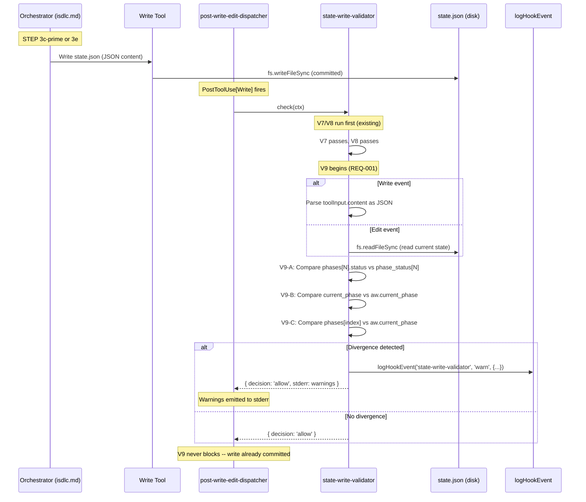
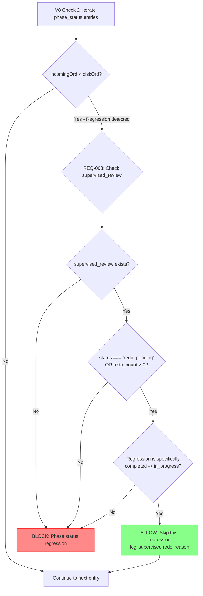
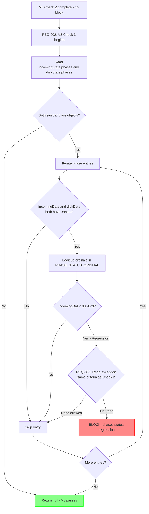
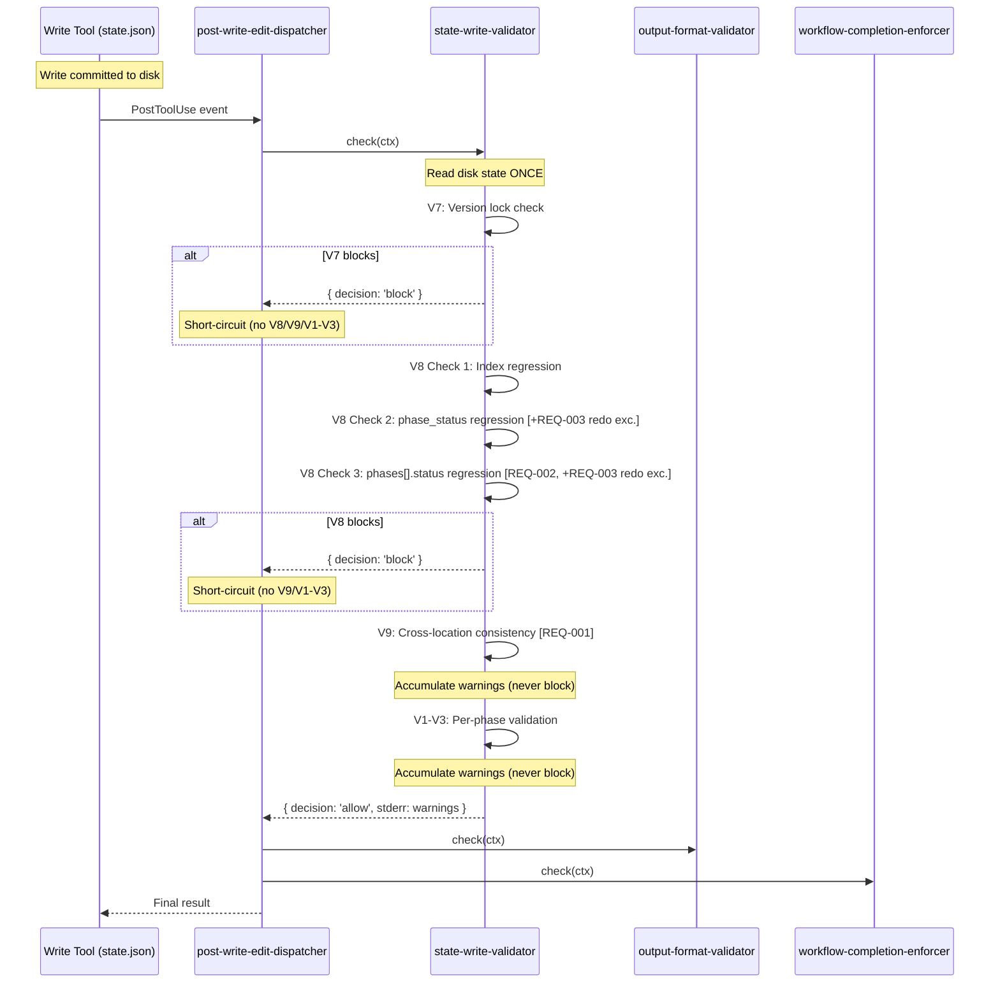

# Architecture Overview: Phase Handshake Audit Fixes

**Requirement ID**: REQ-0020
**Source**: GitHub Issue #55
**Phase**: 03-architecture (implementation mode)
**Generated**: 2026-02-20
**Based On**: requirements-spec.md (6 REQs, 24 ACs), impact-analysis.md, architecture-analysis.md, design-spec.md (6 FIXes)

---

## Table of Contents

1. [Executive Summary](#1-executive-summary)
2. [Integration Architecture](#2-integration-architecture)
   - 2.1 [Hook Pipeline Integration Map](#21-hook-pipeline-integration-map)
   - 2.2 [Per-Fix Integration Points](#22-per-fix-integration-points)
   - 2.3 [Execution Order Within state-write-validator](#23-execution-order-within-state-write-validator)
3. [Data Flow Diagrams](#3-data-flow-diagrams)
   - 3.1 [V9 Cross-Location Check Data Flow](#31-v9-cross-location-check-data-flow)
   - 3.2 [V8 Supervised Redo Exception Data Flow](#32-v8-supervised-redo-exception-data-flow)
   - 3.3 [V8 Check 3 (phases[].status) Data Flow](#33-v8-check-3-phasesstatus-data-flow)
   - 3.4 [Complete PostToolUse[Write] Data Flow (After All Fixes)](#34-complete-posttooluse-write-data-flow-after-all-fixes)
4. [Architecture Decision Records](#4-architecture-decision-records)
   - 4.1 [ADR-001: Dual-Write Deprecation Strategy (Phase A / Phase B)](#41-adr-001-dual-write-deprecation-strategy)
   - 4.2 [ADR-002: V9 as Warn-Only (Observational, Never Blocking)](#42-adr-002-v9-as-warn-only)
   - 4.3 [ADR-003: Redo Exception Scope (Narrow, Marker-Based)](#43-adr-003-redo-exception-scope)
   - 4.4 [ADR-004: Config Loader Reduction (Triple to Double Fallback)](#44-adr-004-config-loader-reduction)
5. [Integration Points and Interfaces Between Fixes](#5-integration-points-and-interfaces-between-fixes)
   - 5.1 [Fix Dependency Graph](#51-fix-dependency-graph)
   - 5.2 [Shared State Interfaces](#52-shared-state-interfaces)
   - 5.3 [Cross-Fix Interaction Matrix](#53-cross-fix-interaction-matrix)
6. [Backward Compatibility Strategy](#6-backward-compatibility-strategy)
   - 6.1 [Compatibility Guarantee Per Fix](#61-compatibility-guarantee-per-fix)
   - 6.2 [State Schema Compatibility](#62-state-schema-compatibility)
   - 6.3 [Hook Protocol Compatibility](#63-hook-protocol-compatibility)
   - 6.4 [Rollback Strategy](#64-rollback-strategy)
7. [Component Responsibility Map (After Fixes)](#7-component-responsibility-map-after-fixes)
8. [Risk Mitigation Architecture](#8-risk-mitigation-architecture)
9. [Validation Checklist](#9-validation-checklist)

---

## 1. Executive Summary

This architecture overview describes how 6 fixes (REQ-001 through REQ-006) integrate into the existing iSDLC hook architecture without disrupting current behavior. The changes are concentrated in two subsystems:

**Subsystem 1: State Write Validator** (`state-write-validator.cjs`)
- REQ-001: New V9 cross-location consistency check (warn-only)
- REQ-002: V8 Check 3 for `phases[].status` regression detection (blocking)
- REQ-003: V8 redo exception for supervised review (relaxation)

**Subsystem 2: Configuration Loading** (`gate-blocker.cjs`, `iteration-corridor.cjs`)
- REQ-005: Remove redundant local config loaders

**Subsystem 3: Prompt Specification** (`isdlc.md`)
- REQ-002: Deprecation comments on dual-write lines
- REQ-006: Stale phase detection in STEP 3b

**Subsystem 4: Test Coverage** (5 new test files)
- REQ-004: 26 new integration tests covering cross-boundary scenarios

**Key architectural principle**: All production changes are **additive** or **relaxing**. V9 adds warnings without blocking. V8 Check 3 adds parallel protection to an already-working pattern. The redo exception relaxes a constraint. Config loader removal simplifies without changing canonical paths. No existing behavior is altered for previously valid state writes.

**Estimated change footprint**: +120 production lines, -65 lines (config removal), +680 test lines across 9 files.

---

## 2. Integration Architecture

### 2.1 Hook Pipeline Integration Map

The following diagram shows where each fix integrates into the existing hook pipeline:

```
                          EXISTING HOOK PIPELINE
                          ======================

PreToolUse[Task]                          PostToolUse[Write,Edit]
+-----------------------------+           +-----------------------------+
| pre-task-dispatcher.cjs     |           | post-write-edit-dispatcher  |
|                             |           |                             |
| 1. iteration-corridor ---+  |           | 1. state-write-validator    |
|    [REQ-005: remove local |  |           |    +-- V7: version lock    |
|     config fallback]      |  |           |    +-- V8: field protect   |
|                             |           |    |   Check 1: index       |
| 2. skill-validator          |           |    |   Check 2: phase_status|
| 3. phase-loop-controller    |           |    |   [REQ-003: redo exc.] | <-- NEW
| 4. plan-surfacer            |           |    |   [REQ-002: Check 3]   | <-- NEW
| 5. phase-sequence-guard     |           |    +-- [REQ-001: V9 check]  | <-- NEW
| 6. gate-blocker ----------+ |           |                             |
|    [REQ-005: remove local | |           | 2. output-format-validator  |
|     config fallback]      | |           | 3. workflow-completion-     |
|                             |           |    enforcer                 |
| 7. constitution-validator   |           +-----------------------------+
| 8. test-adequacy-blocker    |
| 9. blast-radius-validator   |           Prompt Specification
+-----------------------------+           +-----------------------------+
                                          | isdlc.md                    |
                                          |  STEP 3b: [REQ-006: stale  | <-- NEW
                                          |           phase detection]  |
                                          |  STEP 3c': [REQ-002:       | <-- NEW
                                          |           deprecation note] |
                                          |  STEP 3e:  [REQ-002:       | <-- NEW
                                          |           deprecation note] |
                                          +-----------------------------+
```

### 2.2 Per-Fix Integration Points

| Fix (REQ) | File | Integration Point | Type | Existing Code Touched |
|-----------|------|-------------------|------|----------------------|
| REQ-001 (V9) | `state-write-validator.cjs` | New function before `check()`, invoked inside `check()` after V8 | Addition | `check()` function (L354-455): add V9 invocation at L401 |
| REQ-002 (V8 Check 3) | `state-write-validator.cjs` | New check block inside `checkPhaseFieldProtection()` after Check 2 | Addition | `checkPhaseFieldProtection()` (L235-344): add Check 3 at L335 |
| REQ-002 (deprecation) | `isdlc.md` | Comments on 4 `phase_status` write lines | Annotation | Lines ~1136, ~1277, ~1443, ~1452 |
| REQ-003 (redo exc.) | `state-write-validator.cjs` | Exception before block in V8 Check 2 | Modification | L322-333: insert before existing block statement |
| REQ-004 (tests) | `tests/` | 5 new test files | Addition | None (new files only) |
| REQ-005 (config) | `gate-blocker.cjs` | Remove L35-76, update L629/L649 | Removal | Local function definitions and fallback chain |
| REQ-005 (config) | `iteration-corridor.cjs` | Remove L83-101, update L276 | Removal | Local function definition and fallback chain |
| REQ-006 (stale) | `isdlc.md` | New detection block in STEP 3b | Addition | STEP 3b escalation check (L~1109) |

### 2.3 Execution Order Within state-write-validator

After all fixes, the `check()` function in `state-write-validator.cjs` executes rules in this order:

```
check(ctx) entry
    |
    +-- Guard: tool_name must be Write or Edit
    +-- Guard: filePath must match STATE_JSON_PATTERN
    |
    +-- Read disk state once (shared by V7, V8, V9)
    |
    +-- V7: checkVersionLock(filePath, toolInput, toolName, diskState)
    |   |-- BLOCK if incoming version < disk version
    |   +-- null (continue) otherwise
    |
    +-- V8: checkPhaseFieldProtection(filePath, toolInput, toolName, diskState)
    |   |-- Check 1: current_phase_index regression -> BLOCK
    |   |-- Check 2: active_workflow.phase_status regression
    |   |   |-- [REQ-003] Redo exception: if supervised_review marker present
    |   |   |   AND regression is completed -> in_progress, SKIP (continue)
    |   |   +-- BLOCK on other regressions
    |   |-- [REQ-002] Check 3: phases[].status regression
    |   |   |-- Same redo exception logic as Check 2
    |   |   +-- BLOCK on regressions without redo marker
    |   +-- null (continue) if no regressions
    |
    +-- [REQ-001] V9: checkCrossLocationConsistency(filePath, toolInput, toolName)
    |   |-- V9-A: phases[N].status vs active_workflow.phase_status[N]
    |   |-- V9-B: current_phase vs active_workflow.current_phase
    |   |-- V9-C: phases[index] vs current_phase (with intermediate state suppression)
    |   +-- Returns warnings (never blocks)
    |
    +-- V1-V3: validatePhase() for each phase (existing, unchanged)
    |
    +-- Return { decision: 'allow', stderr: accumulated_warnings }
```

**Rationale for V9 placement after V8**: V8 may block the write. If V8 blocks, V9 warnings are irrelevant (the write was invalid). V9 only provides useful diagnostic information for writes that V7 and V8 allowed. Placing V9 after V8 avoids wasted computation and cleaner log output.

**Rationale for V9 placement before V1-V3**: V9 checks cross-location consistency (a structural concern). V1-V3 check per-phase data integrity (a content concern). Structural checks logically precede content checks.

---

## 3. Data Flow Diagrams

### 3.1 V9 Cross-Location Check Data Flow



**Key design properties of V9 data flow**:

1. **No additional disk reads for Write events**: V9 parses `toolInput.content` (already available in memory from the hook event). Only Edit events require a disk read (because Edit modifies in-place without providing full content).

2. **Fail-open on all error paths**: JSON parse failure, missing fields, null values, type mismatches -- all return silently with no warnings. The function never throws.

3. **Intermediate state suppression (V9-C)**: Between STEP 3e and STEP 3c-prime, `current_phase_index` is one ahead of `current_phase`. V9-C suppresses the warning when `phases[index - 1]` matches `current_phase` (the "just incremented" pattern).

### 3.2 V8 Supervised Redo Exception Data Flow



**Redo exception criteria (all must be true)**:

| Criterion | Field Path | Required Value |
|-----------|-----------|----------------|
| Redo marker present | `incomingState.active_workflow.supervised_review` | Must exist and be non-null |
| Redo status or count | `.status` or `.redo_count` | `status === 'redo_pending'` OR `redo_count > 0` |
| Regression direction | `diskStatus` -> `incomingStatus` | Must be specifically `'completed'` -> `'in_progress'` |

**Why narrow scoping matters**: The exception ONLY allows `completed -> in_progress`. It does NOT allow `completed -> pending`, `in_progress -> pending`, or any other regression. If the redo marker is present but the regression pattern does not match, V8 still blocks. This prevents a malformed supervised_review object from bypassing V8 protection entirely.

### 3.3 V8 Check 3 (phases[].status) Data Flow



**Check 3 mirrors Check 2** but reads from `phases[N].status` instead of `active_workflow.phase_status[N]`. This closes the gap where V8 only protected the summary map but not the detailed phase objects. The same redo exception applies to both checks.

### 3.4 Complete PostToolUse[Write] Data Flow (After All Fixes)



---

## 4. Architecture Decision Records

### 4.1 ADR-001: Dual-Write Deprecation Strategy

**ID**: ADR-001
**Status**: Accepted
**Context**: Phase status is written to both `phases[N].status` and `active_workflow.phase_status[N]` (a BUG-0005 legacy workaround). This dual-write has no cross-check and creates a silent divergence risk (RISK-02, RISK-08). The architecture analysis recommended elimination (REC-01, Option A).

**Decision**: Implement a two-phase migration:

- **Phase A** (this work item): Add V9 cross-check for divergence detection, extend V8 to protect `phases[N].status` from regression, and add deprecation comments to `isdlc.md` on the `active_workflow.phase_status` write lines. Both locations continue to be written.

- **Phase B** (separate work item, after Phase A bakes): Remove `active_workflow.phase_status` writes entirely. Update V8 to remove Check 2 (replaced by Check 3). Remove V9-A check (no longer needed). `phases[N].status` becomes the sole source of truth.

**Rationale**:
- Phase A is zero-risk: it adds detection (V9) and protection (V8 Check 3) without removing anything.
- Phase B is deferred because removing a field from state.json could break any consumer we have not identified. Letting Phase A run for multiple workflow cycles provides confidence that no unknown consumers depend on `active_workflow.phase_status`.
- The deprecation comments in isdlc.md signal intent and prevent new consumers from depending on the deprecated field.

**Consequences**:
- Positive: Immediate detection of the most dangerous silent failure (status divergence). Parallel V8 protection for the authoritative field.
- Negative: Temporary complexity increase (two checks instead of one in V8). Both Phase A and Phase B must be tracked as separate work items.

**Traces to**: REQ-001, REQ-002, GAP-01, GAP-10, RISK-02, RISK-08, REC-01, REC-02

### 4.2 ADR-002: V9 as Warn-Only (Observational, Never Blocking)

**ID**: ADR-002
**Status**: Accepted
**Context**: V9 detects cross-location divergence in state.json. It runs in `PostToolUse[Write]` context, meaning the write has already been committed to disk before V9 executes.

**Decision**: V9 will always return `{ decision: 'allow' }` with warnings on stderr. It will never return `{ decision: 'block' }`.

**Rationale**:
- PostToolUse hooks cannot undo a committed write. A "block" decision in this context is meaningless and confusing (the write already happened).
- V9's purpose is diagnostic: it alerts developers to divergence so they can investigate. Blocking would not fix the divergence.
- Warn-only semantics ensure V9 can never cause a false-positive workflow blockage. This aligns with Article X (Fail-Safe Defaults) and NFR-001 (Fail-Open Behavior).
- V9 warnings are logged via `logHookEvent()` for post-hoc analysis (NFR-006).

**Consequences**:
- Positive: Zero risk of V9 breaking any workflow. Provides visibility into divergence.
- Negative: Divergence is detected but not corrected. Correction depends on the developer or a future automated repair mechanism.

**Traces to**: REQ-001, NFR-001, NFR-006, Article X (Fail-Safe Defaults)

### 4.3 ADR-003: Redo Exception Scope (Narrow, Marker-Based)

**ID**: ADR-003
**Status**: Accepted
**Context**: The supervised redo path legitimately resets `phases[N].status` from `completed` to `in_progress`. V8's regression detection would block this transition. An exception is needed, but it must not open a hole that allows arbitrary regressions.

**Decision**: The redo exception is scoped to three mandatory criteria:

1. `active_workflow.supervised_review` must exist (marker present)
2. Either `supervised_review.status === 'redo_pending'` OR `supervised_review.redo_count > 0` (active redo)
3. The regression must be specifically `completed -> in_progress` (not any other regression direction)

The same exception applies to V8 Check 2 (`active_workflow.phase_status`) and V8 Check 3 (`phases[].status`).

**Alternatives Considered**:
- **Broad exception**: Allow any regression when `supervised_review` exists. Rejected because it would allow `completed -> pending` or `in_progress -> pending`, which are never valid.
- **Time-based exception**: Allow regressions within N minutes of redo initiation. Rejected because it adds time-dependent logic and the marker-based approach is simpler and sufficient.
- **No exception, rely on PostToolUse semantics**: Rely on the fact that V8 runs in PostToolUse (write already committed). Rejected because (a) the warning message confuses developers, and (b) REQ-002 adds V8 Check 3 which needs the same exception.

**Consequences**:
- Positive: V8 no longer produces confusing regression warnings during supervised redo. REQ-002's Check 3 works correctly with redo paths.
- Negative: Adds conditional logic to V8. Must be maintained if redo semantics change.

**Traces to**: REQ-003, GAP-06, RISK-07, ASM-002

### 4.4 ADR-004: Config Loader Reduction (Triple to Double Fallback)

**ID**: ADR-004
**Status**: Accepted
**Context**: `gate-blocker.cjs` and `iteration-corridor.cjs` have local `loadIterationRequirements()` functions that duplicate the canonical implementation in `common.cjs`. The loading chain is: `ctx.requirements` (dispatcher) -> `loadFromCommon()` -> `loadLocal()` (3 fallbacks).

**Decision**: Remove the local fallback functions, reducing the chain to: `ctx.requirements` (dispatcher) -> `loadFromCommon()` (2 fallbacks).

**Rationale**:
- The dispatcher always provides `ctx.requirements` in normal operation. The local fallback is unreachable in practice.
- Standalone execution (`require.main === module`) uses `common.cjs` directly, not the local fallback.
- The local functions use identical search paths to `common.cjs`. There is no scenario where `common.cjs` fails but the local function succeeds.
- Three copies of the same logic create maintenance burden and divergence risk (RISK-09).

**Consequences**:
- Positive: 65 fewer lines of duplicate code. Single source of truth for config loading. Reduced maintenance burden.
- Negative: If `common.cjs` `loadIterationRequirements()` is ever broken, there is no local safety net. However, `common.cjs` is the canonical implementation used by all hooks, so a bug there would already affect the entire system.

**Traces to**: REQ-005, GAP-08, RISK-09, REC-04

---

## 5. Integration Points and Interfaces Between Fixes

### 5.1 Fix Dependency Graph

```
                    IMPLEMENTATION ORDER
                    ====================

    REQ-003 (V8 redo exception)          REQ-001 (V9 consistency)
       |                                    |
       | MUST precede                       | independent
       v                                   v
    REQ-002 (V8 Check 3 +              (no dependencies)
             deprecation)
       |
       | validates behavior of
       v
    REQ-004 (integration tests)
       |
       | independent of
       v
    REQ-005 (config cleanup)            REQ-006 (stale detection)
       (independent)                       (independent)
```

**Critical ordering constraint**: REQ-003 (redo exception) MUST be implemented before REQ-002 (V8 Check 3). Without the redo exception, V8 Check 3 would block legitimate supervised redo writes, breaking an existing feature. This is the only hard dependency in the implementation.

### 5.2 Shared State Interfaces

The fixes interact through shared state.json fields. This matrix shows which fields each fix reads or writes:

| state.json Field | REQ-001 (V9) | REQ-002 (V8.3) | REQ-003 (Redo) | REQ-004 (Tests) | REQ-005 | REQ-006 |
|------------------|:---:|:---:|:---:|:---:|:---:|:---:|
| `phases[N].status` | READ | READ | -- | READ | -- | READ |
| `active_workflow.phase_status[N]` | READ | -- | -- | READ | -- | -- |
| `active_workflow.current_phase` | READ | -- | -- | -- | -- | -- |
| `active_workflow.current_phase_index` | READ | -- | -- | -- | -- | -- |
| `active_workflow.phases[]` | READ | -- | -- | -- | -- | -- |
| `current_phase` (top-level) | READ | -- | -- | -- | -- | -- |
| `active_workflow.supervised_review` | -- | READ | READ | READ | -- | -- |
| `phases[N].timing.started_at` | -- | -- | -- | READ | -- | READ |
| `pending_escalations[]` | -- | -- | -- | READ | -- | -- |
| Config: `iteration-requirements.json` | -- | -- | -- | -- | READ | READ |

**Key observation**: V9 (REQ-001) reads the most fields but writes none. V8 Check 3 (REQ-002) and the redo exception (REQ-003) share the `supervised_review` field as the redo detection mechanism. No fix writes to fields read by another fix -- they are all additive readers of existing state.

### 5.3 Cross-Fix Interaction Matrix

| Fix A | Fix B | Interaction | Risk |
|-------|-------|-------------|------|
| REQ-001 (V9) | REQ-002 (V8.3) | V9-A detects `phases[N].status` vs `phase_status[N]` divergence; V8 Check 3 blocks `phases[N].status` regression. If V8.3 blocks a write, V9 never runs (short-circuit). | NONE -- complementary |
| REQ-001 (V9) | REQ-003 (Redo) | During redo, V9-A may see temporary divergence if redo writes `phases[N].status` and `phase_status[N]` in a single state object (both set to `in_progress`). V9-A compares them and finds no divergence. | NONE -- both fields set in same write |
| REQ-002 (V8.3) | REQ-003 (Redo) | V8 Check 3 DEPENDS on REQ-003. Without the redo exception, Check 3 blocks supervised redo writes. With the exception, Check 3 allows `completed -> in_progress` during redo. | CRITICAL -- REQ-003 must precede REQ-002 |
| REQ-004 (Tests) | All | Tests validate behavior of REQ-001, REQ-002, REQ-003. No production code interaction. | NONE -- validation only |
| REQ-005 (Config) | REQ-006 (Stale) | REQ-006 reads `iteration-requirements.json` for timeout values. REQ-005 changes how config is loaded in gate-blocker/iteration-corridor. Different hooks, different loading paths. | NONE -- no shared mechanism |

---

## 6. Backward Compatibility Strategy

### 6.1 Compatibility Guarantee Per Fix

| Fix | Compatibility Type | Guarantee |
|-----|-------------------|-----------|
| REQ-001 (V9) | **Fully additive** | Existing writes that were previously allowed remain allowed. V9 only adds new stderr warnings. No new blocking paths. |
| REQ-002 (V8.3) | **Additive blocking** | Adds new blocking for `phases[N].status` regression -- a field previously unchecked. All forward transitions (`pending -> in_progress -> completed`) remain allowed. Only `completed -> pending` and `completed -> in_progress` (without redo marker) are newly blocked. These transitions were never legitimate without supervised redo. |
| REQ-003 (Redo) | **Relaxation** | V8 Check 2 previously blocked ALL `completed -> in_progress` regressions in `phase_status`. Now it allows this specific transition when a redo marker is present. This is strictly more permissive. |
| REQ-004 (Tests) | **No production impact** | New test files only. Zero production code changes. |
| REQ-005 (Config) | **Internal simplification** | External behavior unchanged. Config loading chain shortened but canonical paths identical. Dispatcher always provides config in normal operation. |
| REQ-006 (Stale) | **Additive advisory** | Adds a warning banner to isdlc.md STEP 3b. Prompt-level only; no hook changes. The warning presents the same Retry/Skip/Cancel options as existing escalation handling. |

### 6.2 State Schema Compatibility

**No fields added**: These fixes do not introduce any new fields to state.json.

**No fields removed**: Phase A explicitly preserves `active_workflow.phase_status`. Removal is deferred to Phase B (separate work item, per ADR-001).

**No field semantics changed**: `phases[N].status`, `active_workflow.phase_status[N]`, `supervised_review`, and all other fields retain their existing semantics.

**New field consumed (not new to schema)**: V8 Check 3 and the redo exception read `active_workflow.supervised_review`, which already exists in the schema and is written by STEP 3e-review. No schema extension needed.

### 6.3 Hook Protocol Compatibility

**stdin/stdout JSON protocol**: Unchanged. V9 communicates via stderr only, consistent with V1-V3 behavior. V8 Check 3 uses the same `{ decision: 'block', stopReason: ... }` pattern as existing V8 checks.

**Dispatcher interface**: The `check(ctx)` function signature is unchanged. The `ctx` object shape is unchanged. No new context fields required.

**PostToolUse semantics**: V9 operates within the existing PostToolUse[Write,Edit] dispatcher. It follows the same observational pattern as V1-V3.

### 6.4 Rollback Strategy

If any fix causes issues in production:

| Fix | Rollback Approach |
|-----|-------------------|
| REQ-001 (V9) | Remove V9 invocation from `check()` and the `checkCrossLocationConsistency()` function. No state changes to revert. |
| REQ-002 (V8.3) | Remove Check 3 block from `checkPhaseFieldProtection()`. Deprecation comments in isdlc.md are harmless and can remain. |
| REQ-003 (Redo) | Remove the redo exception from Check 2 (and Check 3). This restores the original blocking behavior for redo regressions. Note: this may cause supervised redo to produce confusing V8 warnings (the pre-existing behavior). |
| REQ-005 (Config) | Restore the local fallback functions. This is a simple revert of removed code. |
| REQ-006 (Stale) | Remove the stale detection block from isdlc.md STEP 3b. Prompt-level change only. |

**All rollbacks are independent**: Rolling back one fix does not affect the others, except that rolling back REQ-003 while keeping REQ-002 would block supervised redo writes (the documented dependency).

---

## 7. Component Responsibility Map (After Fixes)

This table shows the validation responsibility of each rule in `state-write-validator.cjs` after all fixes are applied:

| Rule | Responsibility | Behavior | Fields Checked | Traces To |
|------|---------------|----------|----------------|-----------|
| V1 | Constitutional validation integrity | WARN on `completed=true` with `iterations_used < 1` | `phases[N].constitutional_validation.*` | FR-05 |
| V2 | Elicitation integrity | WARN on `completed=true` with `menu_interactions < 1` | `phases[N].iteration_requirements.interactive_elicitation.*` | FR-05 |
| V3 | Test iteration integrity | WARN on `completed=true` with `current_iteration < 1` | `phases[N].iteration_requirements.test_iteration.*` | FR-05 |
| V7 | Optimistic concurrency control | BLOCK if `incoming.state_version < disk.state_version` | `state_version` | BUG-0009 |
| V8.1 | Phase index protection | BLOCK if `incoming.current_phase_index < disk.current_phase_index` | `active_workflow.current_phase_index` | BUG-0011 |
| V8.2 | Phase status summary protection | BLOCK if `active_workflow.phase_status[N]` regresses (with redo exception) | `active_workflow.phase_status[N]`, `supervised_review` | BUG-0011, REQ-003 |
| V8.3 | Phase status detail protection | BLOCK if `phases[N].status` regresses (with redo exception) | `phases[N].status`, `supervised_review` | REQ-002, REQ-003 |
| V9-A | Phase status cross-location check | WARN if `phases[N].status` != `phase_status[N]` | Both locations | REQ-001 |
| V9-B | Current phase cross-location check | WARN if `current_phase` != `active_workflow.current_phase` | Both locations | REQ-001 |
| V9-C | Phase index consistency check | WARN if `phases[index]` != `current_phase` (with intermediate suppression) | `current_phase_index`, `phases[]`, `current_phase` | REQ-001 |

**Total rules**: 10 (3 warn-only, 4 blocking, 3 warn-only)
**Behavioral split**: V1-V3, V9-A/B/C are observational (never block). V7, V8.1, V8.2, V8.3 are protective (block on violation).

---

## 8. Risk Mitigation Architecture

| Risk ID | Risk Description | Mitigation Fix | Architectural Defense |
|---------|-----------------|---------------|----------------------|
| RISK-01 | Non-atomic state writes (crash between sequential writes) | REQ-006 (stale detection) | Prompt-level advisory; phase-loop-controller allows re-delegation to `in_progress` phases for recovery |
| RISK-02 | Dual-write consistency (status divergence) | REQ-001 (V9 detection) + REQ-002 (V8 protection) | V9 warns on divergence; V8 Check 3 prevents regression of authoritative field; ADR-001 plans eventual elimination |
| RISK-07 | V8 blocks supervised redo | REQ-003 (redo exception) | Narrow exception scoped to `completed -> in_progress` with marker check |
| RISK-08 | Missing cross-location checks | REQ-001 (V9) | Three sub-checks cover all mirrored field pairs |
| RISK-09 | Config loader duplication | REQ-005 (consolidation) | Single canonical implementation in common.cjs |

**Defense in depth for the dual-write problem**: Three overlapping defenses address the highest-severity risk (RISK-02):
1. **Detection (V9)**: Catches divergence after it happens
2. **Prevention (V8 Check 3)**: Blocks regression of the authoritative field (`phases[N].status`)
3. **Elimination (Phase B, future)**: Removes the second location entirely

This layered approach ensures that even if one defense fails, the others provide coverage.

---

## 9. Validation Checklist

### GATE-03 Architecture Checklist

#### Architecture Documentation
- [x] Integration map showing how 6 fixes connect to existing hook pipeline (Section 2)
- [x] Execution order within state-write-validator documented (Section 2.3)
- [x] All 4 production files covered (state-write-validator, isdlc.md, gate-blocker, iteration-corridor)
- [x] All 5 test files planned with test counts (Section 2.2, traces to design-spec Section 2.3)

#### Data Flow Diagrams
- [x] V9 cross-location check data flow (Section 3.1)
- [x] V8 supervised redo exception flow (Section 3.2)
- [x] V8 Check 3 flow (Section 3.3)
- [x] Complete PostToolUse[Write] pipeline (Section 3.4)

#### Architecture Decision Records
- [x] ADR-001: Dual-write deprecation strategy (Phase A / Phase B)
- [x] ADR-002: V9 warn-only decision
- [x] ADR-003: Redo exception narrow scoping
- [x] ADR-004: Config loader reduction

#### Integration Points and Interfaces
- [x] Fix dependency graph with critical ordering (Section 5.1)
- [x] Shared state interface matrix (Section 5.2)
- [x] Cross-fix interaction matrix (Section 5.3)

#### Backward Compatibility
- [x] Per-fix compatibility guarantee (Section 6.1)
- [x] State schema compatibility verified (Section 6.2)
- [x] Hook protocol compatibility verified (Section 6.3)
- [x] Rollback strategy defined for each fix (Section 6.4)

#### Traceability
- [x] All 6 REQs have architectural coverage
- [x] All 4 ADRs trace to specific requirements and risks
- [x] All 9 identified risks have mitigation architecture
- [x] Component responsibility map covers all 10 validation rules (Section 7)

#### Constitutional Compliance
- [x] Article III (Security by Design): V8 Check 3 prevents unauthorized state regression; V9 detects divergence
- [x] Article IV (Explicit Over Implicit): All assumptions documented; no `[NEEDS CLARIFICATION]` markers
- [x] Article V (Simplicity First): No over-engineering; V9 is a single function; redo exception is 6 lines
- [x] Article VII (Artifact Traceability): Every decision traces to REQ-NNN, GAP-NN, RISK-NN
- [x] Article IX (Quality Gate Integrity): All required artifacts exist and are validated
- [x] Article X (Fail-Safe Defaults): V9 fail-open on all errors; redo exception is narrowly scoped; config removal retains canonical fallback

---

PHASE_TIMING_REPORT: { "debate_rounds_used": 0, "fan_out_chunks": 0 }
