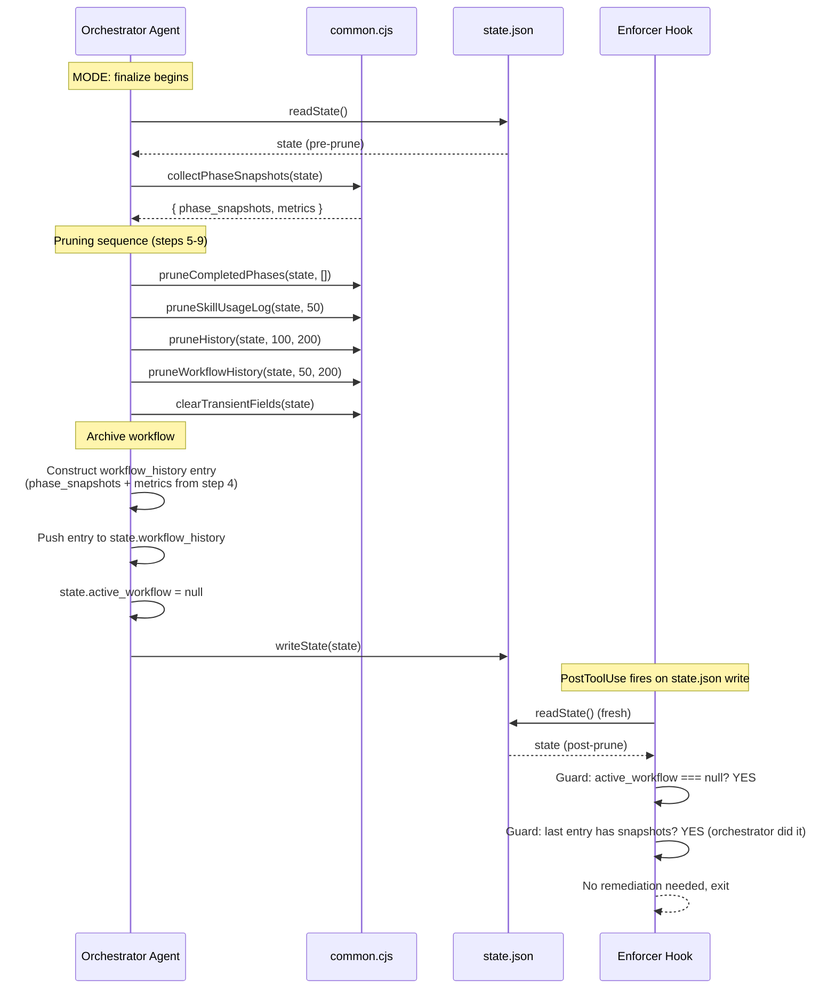

# Architecture Overview: State.json Pruning at Workflow Completion

**Feature**: GH-39 -- State.json pruning at workflow completion
**Phase**: 03-architecture (ANALYSIS MODE)
**Date**: 2026-02-21 (revised)
**Traces to**: FR-001 through FR-015, NFR-001 through NFR-010

---

## 1. Architecture Summary

This feature implements a hot/cold data architecture for the iSDLC framework's state management. State.json (hot) contains only active workflow data and durable configuration. State-archive.json (cold) stores compact records of all completed, cancelled, and abandoned workflows. At workflow completion, the enforcer hook archives a compact record to the cold store, then prunes and clears transient fields from the hot store. The architecture is deliberately conservative: no new modules, no new dependencies, no changes to the hook dispatch protocol. All changes extend existing patterns and call sites.

### Key Architectural Decisions

1. **Archive replaces in-place pruning** -- Completed workflow data moves to a separate archive file rather than being trimmed in place. State.json resets to a clean state between workflows.
2. **Indexed-array archive format** -- The archive uses `{ version, records[], index{} }` with a multi-key index for O(1) lookup by source_id or slug.
3. **Enforcer owns the archive write path** -- The workflow-completion-enforcer.cjs writes archive records for completed and cancelled workflows. The orchestrator writes records for abandoned workflows at init.
4. **Extend, do not redesign** -- The 4 prune functions and the dual-path (orchestrator + enforcer) architecture already exist. This feature wires them together, fills gaps, and adds archive operations.
5. **Pure function pattern** -- New functions (`clearTransientFields`, `appendToArchive`, `resolveArchivePath`, `seedArchiveFromHistory`) follow established patterns: take parameters, return results, caller manages I/O context.
6. **Fail-open everywhere** -- Every pruning and archive call site wraps operations in try/catch with continue-on-error semantics. Pruning and archive failures never block workflow completion.
7. **Idempotent by construction** -- All prune operations are FIFO slices, field deletions, or field resets to fixed defaults. Archive writes include dedup (skip if last record matches slug + completed_at). Running everything twice produces the same result.
8. **Dedup inside appendToArchive()** -- The dedup check is O(1) on the last record, implemented once in the append function rather than in each caller.
9. **Index maintained on write** -- The archive index is updated during each append (zero additional I/O). Deferred lookupArchive() can add rebuild-on-read as a fallback for corrupted indexes.

---

## 2. System Context

The pruning and archive subsystem operates within the existing iSDLC hook and agent architecture. One new runtime file is introduced (state-archive.json). No new modules or external dependencies.

```
                         +---------------------+
                         |   Claude Code CLI    |
                         |   (isdlc.md)         |
                         +----------+----------+
                                    |
                                    | Task delegation
                                    v
                         +---------------------+
                         |   SDLC Orchestrator  |
                         |   (00-sdlc-          |
                         |    orchestrator.md)  |
                         +---+------+------+---+
                             |      |      |
                  MODE: init |      |      | MODE: finalize
                   [FR-013]  |      |      |
                   [FR-009]  v      |      v
              +--------------+-+    |  +---+------------+
              | Abandoned      |    |  | Finalize       |
              | Detection +    |    |  | Sequence       |
              | Migration      |    |  | [MODIFIED]     |
              +--------+-------+    |  +--------+-------+
                       |            |           |
                       |            |           | readState / writeState
                       v            |           v
    +------------------+------------+-----------+------------------+
    |                        common.cjs                            |
    |  +----------------------------------------------------------+|
    |  | collectPhaseSnapshots()        [existing]                 ||
    |  | pruneSkillUsageLog()           [existing, new defaults]   ||
    |  | pruneCompletedPhases()         [existing]                 ||
    |  | pruneHistory()                 [existing, new defaults]   ||
    |  | pruneWorkflowHistory()         [existing]                 ||
    |  | clearTransientFields()         [NEW - FR-003]             ||
    |  | resolveArchivePath()           [NEW - FR-015]             ||
    |  | appendToArchive()              [NEW - FR-011]             ||
    |  | seedArchiveFromHistory()       [NEW - FR-014]             ||
    |  +----------------------------------------------------------+|
    +---+--------------------------+-------------------------------+
        |                          |
        | readState/writeState     | appendToArchive
        v                          v
   +---------+            +------------------+
   | state   |            | state-archive    |
   | .json   |            | .json  [NEW]     |
   | (HOT)   |            | (COLD)           |
   +---------+            +------------------+
        |
        | PostToolUse hook (fallback)
        v
   +----+-------------------------------------------+
   |   workflow-completion-enforcer.cjs              |
   |   [MODIFIED: + clearTransientFields,            |
   |              + appendToArchive,                  |
   |              + updated retention limits]         |
   +------------------------------------------------+
```

---

## 3. Dual-Path Pruning Architecture

### 3.1 Why Dual-Path

The orchestrator is a prompt-driven LLM agent. It follows markdown instructions but may occasionally skip steps, especially under long context or complex finalize sequences. The workflow-completion-enforcer is a deterministic JavaScript hook that runs on every state.json write. The dual-path architecture provides defense-in-depth:

| Path | Type | Reliability | Latency |
|------|------|-------------|---------|
| Primary (orchestrator finalize) | Prompt-driven agent | ~95% (LLM may skip) | Inline with finalize |
| Fallback (workflow-completion-enforcer) | Deterministic JS hook | ~99.9% (code execution) | PostToolUse after state write |

### 3.2 Primary Path: Orchestrator Finalize

The orchestrator's MODE: finalize and Workflow Completion sections receive new prose instructions telling the agent to apply pruning. The agent reads state, applies transformations in memory, and writes back.

**Traces to**: FR-001, FR-006

```
Orchestrator MODE: finalize
  |
  1. Human Review (if supervised)
  2. Merge git branch
  3. readState()
  4. collectPhaseSnapshots(state)          -- BEFORE any pruning
  5. pruneCompletedPhases(state, [])       -- Strip verbose phase sub-objects
  6. pruneSkillUsageLog(state, 50)         -- FIFO cap skill log
  7. pruneHistory(state, 100, 200)         -- FIFO cap + truncation history
  8. pruneWorkflowHistory(state, 50, 200)  -- FIFO cap + compaction wf history
  9. clearTransientFields(state)           -- Reset 6 transient fields
  10. Move to workflow_history (with snapshots/metrics from step 4)
  11. active_workflow = null
  12. writeState(state)
```

**Critical ordering constraint**: Step 4 MUST precede steps 5-9. `collectPhaseSnapshots()` reads `state.phases` sub-objects (iteration_requirements, timing, etc.) that `pruneCompletedPhases()` strips. If pruning runs first, snapshots will be empty.

**Critical ordering constraint**: Step 9 (clearTransientFields) MUST precede step 10 (move to workflow_history). The transient fields being cleared (`phases`, `blockers`, etc.) are workflow-scoped. The workflow_history entry is constructed from the snapshots/metrics collected in step 4, not from the live `phases` object. Clearing transient fields before archiving ensures no stale data remains in the top-level state after the archive step.

### 3.3 Fallback Path: Workflow-Completion-Enforcer

The enforcer hook already calls the 4 prune functions at lines 219-222. This feature adds `clearTransientFields(state)` as line 223, and updates retention limit arguments.

**Traces to**: FR-005

```
PostToolUse[Write,Edit] → state.json detected
  |
  Guard: active_workflow === null?
  Guard: last workflow_history entry < 2 min old?
  Guard: missing phase_snapshots or metrics?
  |
  YES → Reconstruct temp active_workflow
       → collectPhaseSnapshots(state)
       → pruneSkillUsageLog(state, 50)         -- FR-004: was 20
       → pruneCompletedPhases(state, [])
       → pruneHistory(state, 100, 200)         -- FR-004: was 50
       → pruneWorkflowHistory(state, 50, 200)
       → clearTransientFields(state)           -- FR-005: NEW
       → writeState(state)
```

### 3.4 Path Interaction and Idempotency

Both paths may execute for the same workflow completion. This is safe because all operations are idempotent:

- FIFO slice on an already-capped array is a no-op
- String truncation on already-truncated strings is a no-op
- Resetting `null` to `null` or `[]` to `[]` is a no-op
- `pruneCompletedPhases` on already-pruned phases has no fields to strip (they were already deleted)

The enforcer's guard (`missing phase_snapshots or metrics?`) means it will skip the prune sequence entirely if the orchestrator already did it correctly. The prune calls in the enforcer only execute when the enforcer is self-healing missing snapshots -- not on every state.json write.

**Traces to**: NFR-006 (idempotent pruning)

---

## 4. Function Design: clearTransientFields()

### 4.1 Specification

```javascript
/**
 * Reset all transient runtime fields to their null/empty defaults.
 * Called at workflow finalize to prevent stale data bleeding into
 * subsequent workflows.
 *
 * Pure function: takes state, mutates it, returns it.
 * Does NOT perform any disk I/O. Caller manages readState/writeState.
 *
 * @param {Object} state - The state object to mutate
 * @returns {Object} The mutated state object
 */
function clearTransientFields(state) {
    if (!state) return state;

    state.current_phase = null;
    state.active_agent = null;
    state.phases = {};
    state.blockers = [];
    state.pending_escalations = [];
    state.pending_delegation = null;

    return state;
}
```

**Traces to**: FR-002, FR-003

### 4.2 Design Rationale

**Why a new function instead of reusing `clearPendingEscalations()` and `clearPendingDelegation()`?**

The existing `clearPending*` functions (lines 1552, 1587) are standalone I/O functions -- they call `readState()` and `writeState()` internally. They are designed for individual hooks to call during active workflows (e.g., after processing an escalation).

The new `clearTransientFields(state)` follows the prune function pattern: it takes a state object as a parameter and mutates it in place. The caller manages I/O. This is the correct pattern for the finalize sequence, where multiple mutations are applied to a single state object before a single `writeState()` call.

```
clearPendingEscalations()       -- Standalone I/O (reads + writes state)
clearPendingDelegation()        -- Standalone I/O (reads + writes state)
clearTransientFields(state)     -- Pure mutation (caller manages I/O)
```

Both patterns coexist. The old functions remain for backward compatibility -- they are called by individual hooks during active workflows. The new function is for the finalize sequence only.

**Why an explicit allowlist of 6 fields?**

The function resets exactly 6 named fields. It does NOT delete unknown fields, does NOT iterate over keys, and does NOT use a denylist. This is a deliberate choice:

1. **Safety**: An allowlist cannot accidentally delete a durable field. A denylist or wildcard could.
2. **Predictability**: The function's behavior is fully specified by reading its source. No runtime surprises.
3. **Forward compatibility**: When new transient fields are added in the future, they must be explicitly added to this function. This forces a conscious decision about whether a new field is transient.

**Traces to**: NFR-003 (no data loss for durable fields), CON-004 (fail-open principle)

### 4.3 What About `supervised_review` and `chat_explore_active`?

The quick-scan (Phase 00) identified `supervised_review` and `chat_explore_active` as transient fields. The requirements spec (Phase 01) did not include them in the clearTransientFields scope. This is correct:

- `supervised_review` is a sub-field of `active_workflow`, which is already set to `null` at finalize (step 11). It does not exist as a top-level field.
- `chat_explore_active` is not consistently present in state.json. It is set during interactive exploration and typically cleared by the agent that sets it. Adding it to clearTransientFields is a "Could Have" enhancement, not MVP.

If these fields are needed in future, they can be added to the allowlist with a single line each.

---

## 5. Finalize Sequence: Detailed Design

### 5.1 Sequence Diagram



### 5.2 Error Handling (Fail-Open)

**Traces to**: NFR-001 (non-blocking pruning), CON-004 (fail-open principle)

The orchestrator is a prompt-driven agent. It cannot execute JavaScript try/catch. Instead, the architecture relies on two mechanisms:

1. **Prompt instructions**: The orchestrator instructions will state: "If any pruning step fails or produces an error, skip it and continue with the next step. Pruning is best-effort -- workflow completion must never be blocked by a pruning failure."

2. **Enforcer fallback**: If the orchestrator fails to prune (or prunes incorrectly), the enforcer hook will detect missing snapshots and re-apply the full prune sequence. The enforcer is deterministic JavaScript with a top-level try/catch that returns `{ decision: 'allow' }` on any error.

For the enforcer path specifically, the entire `check()` function is already wrapped in a top-level try/catch (lines 242-245). Adding `clearTransientFields(state)` at line 223 is inside this existing catch boundary. No additional error handling is needed.

### 5.3 Performance Budget

**Traces to**: NFR-002 (< 50ms for full prune sequence)

The prune functions are all O(n) where n is array length:
- `pruneSkillUsageLog`: 1 slice on array of ~50 entries
- `pruneCompletedPhases`: 1 object iteration over ~13 phases
- `pruneHistory`: 1 slice + 1 iteration on array of ~100 entries
- `pruneWorkflowHistory`: 1 slice + 1 iteration on array of ~50 entries
- `clearTransientFields`: 6 property assignments

Total operations: ~220 iterations + 6 assignments. Even at 100 KB state.json, this completes well under 1ms. The 50ms budget is conservative and easily met.

No performance-specific code changes are needed. The existing implementations are already efficient.

---

## 6. Retention Limit Changes

### 6.1 Updated Defaults

**Traces to**: FR-004

| Function | Current Default | New Default | Rationale |
|----------|----------------|-------------|-----------|
| `pruneSkillUsageLog(state, maxEntries)` | 20 | 50 | 22 entries after 18 workflows (~1.2/wf). 50 gives ~40 workflows of history. |
| `pruneHistory(state, maxEntries, maxCharLen)` | 50, 200 | 100, 200 | 46 entries after 18 workflows (~2.6/wf). 100 gives ~38 workflows. |
| `pruneWorkflowHistory(state, maxEntries, maxCharLen)` | 50, 200 | 50, 200 | Unchanged. 1 entry per workflow; 50 is adequate. |
| `pruneCompletedPhases(state, protectedPhases)` | [] | [] | Unchanged. No protected phases at finalize. |

### 6.2 Where Defaults Are Changed

The defaults are changed in **two locations**, which must stay synchronized:

1. **Function signatures** in `common.cjs` (lines 2364, 2418) -- these are the source-of-truth defaults.
2. **Call sites** in `workflow-completion-enforcer.cjs` (lines 219, 221) -- these pass explicit arguments that must match.

The orchestrator prompt will specify explicit values (e.g., "call pruneSkillUsageLog(state, 50)") so it is not affected by function signature defaults. But keeping the function defaults updated ensures any future caller without explicit arguments gets the correct behavior.

### 6.3 Backward Compatibility

Current arrays are well under the new caps:
- `skill_usage_log`: 22 entries (cap: 50) -- no data removed
- `history`: 46 entries (cap: 100) -- no data removed
- `workflow_history`: 18 entries (cap: 50) -- no data removed

On deployment, the increased caps mean LESS pruning, not more. There is zero risk of unexpected data loss from this change.

**Traces to**: NFR-004 (backward compatibility)

---

## 7. Compaction Strategy (Could Have)

### 7.1 Phase Snapshots Compaction (FR-007)

For workflow_history entries beyond the most recent 10, `phase_snapshots` arrays are compacted to `[{ phase, summary }]` only, dropping `timing`, `started`, `completed`, `status`, `artifacts`, `test_iterations`.

**Design**:
- Add a `compactThreshold` parameter to `pruneWorkflowHistory()` (default: 10)
- After FIFO slice, iterate entries. For index < (length - compactThreshold), compact phase_snapshots.
- Add `_compacted: true` flag to compacted entries for diagnosis.

**Implementation sketch** (in `pruneWorkflowHistory`):

```javascript
const recentCount = compactThreshold || 10;
const compactBoundary = state.workflow_history.length - recentCount;

for (let i = 0; i < compactBoundary; i++) {
    const entry = state.workflow_history[i];
    if (entry._compacted) continue; // already compacted
    if (Array.isArray(entry.phase_snapshots)) {
        entry.phase_snapshots = entry.phase_snapshots.map(snap => ({
            phase: snap.key || snap.phase,
            summary: snap.summary || null
        }));
        entry._compacted = true;
    }
}
```

### 7.2 Git Branch Compaction (FR-008)

Currently `pruneWorkflowHistory` compacts ALL git_branch entries to `{ name }`. FR-008 changes this to tiered compaction:
- Most recent 5 entries: preserve full git_branch object
- Older entries: compact to `{ name, status }`

**Design**: Replace the existing compaction loop (lines 2456-2459) with a tiered approach:

```javascript
const gitBranchFullThreshold = 5;
const gitBranchBoundary = state.workflow_history.length - gitBranchFullThreshold;

for (let i = 0; i < state.workflow_history.length; i++) {
    const entry = state.workflow_history[i];
    if (entry.git_branch && typeof entry.git_branch === 'object') {
        if (i < gitBranchBoundary) {
            // Older entries: compact to { name, status }
            entry.git_branch = {
                name: entry.git_branch.name,
                status: entry.git_branch.status
            };
        }
        // Recent entries: preserve full object (no compaction)
    }
}
```

**Note**: This is a behavioral change from the current implementation, which compacts ALL entries to `{ name }`. The new behavior preserves MORE data for recent entries (keeping `status`), so it is a safe expansion.

### 7.3 Compaction Interaction with Idempotency

Compaction is idempotent:
- Compacting an already-compacted entry (with `_compacted: true`) is skipped.
- Compacting a `phase_snapshots` array that only has `{ phase, summary }` fields produces the same output.
- Compacting a `git_branch` that only has `{ name, status }` produces the same output.

**Traces to**: NFR-006

---

## 8. One-Time Migration (FR-009)

### 8.1 Approach

The migration runs as a conditional step in the orchestrator's MODE: init. It applies the full prune sequence to the existing state.json and sets a `pruning_migration_completed` flag.

```
Orchestrator MODE: init
  |
  1. Normal init sequence (create workflow, set phases, etc.)
  2. Check: state.pruning_migration_completed?
  3. IF NOT:
     a. Check: state.active_workflow === null?
        (Only migrate when no active workflow -- safety)
     b. Apply full prune sequence:
        - pruneSkillUsageLog(state, 50)
        - pruneCompletedPhases(state, [])
        - pruneHistory(state, 100, 200)
        - pruneWorkflowHistory(state, 50, 200)
        - clearTransientFields(state)   (only if active_workflow is null)
     c. Set state.pruning_migration_completed = true
     d. writeState(state)
  4. Continue with normal init
```

### 8.2 Safety Constraints

- **Only runs when `active_workflow === null`**: If there is an active workflow, transient fields are in use. Clearing them would corrupt the active workflow. The migration must wait until between workflows.
- **Idempotent**: The `pruning_migration_completed` flag prevents re-execution. Even without the flag, the prune functions are idempotent, so accidental re-execution is harmless.
- **`pruning_migration_completed` is a durable field**: Once set, it is never cleared. It is a simple boolean flag that takes negligible space.

### 8.3 Migration Timing

The migration runs at the START of the next workflow (during init), not at the END of the current one. This means:
- The user sees the benefit immediately when the new version is deployed.
- No special deployment step is required.
- The migration is transparent -- it happens as a side effect of normal workflow init.

### 8.4 Edge Case: Init with Stale Transient Fields

If the migration runs during init and `active_workflow` is null but transient fields have stale data (e.g., `pending_escalations: [{...}]` from a prior crashed workflow), the migration will clear them. This is the correct behavior -- stale transient fields from a prior workflow should be cleaned up before starting a new one.

If `active_workflow` is NOT null (meaning a workflow is being resumed), the migration skips `clearTransientFields()` but still applies FIFO pruning on bounded fields. This is safe because FIFO pruning only removes old entries, never current ones.

---

## 9. Orchestrator Prompt Changes

### 9.1 What Changes in the Prompt

**Traces to**: FR-006, CON-001

The orchestrator is a prompt-driven agent (constraint CON-001). Pruning instructions must be expressed as clear prose, not JavaScript code. The agent reads state.json via `readState()`, applies transformations by writing JSON, and persists via `writeState()`.

Two sections of `00-sdlc-orchestrator.md` need updates:

**Section 1: MODE: finalize (line 655)**

Current text (abbreviated):
```
3. finalize: Human Review -> merge branch -> collectPhaseSnapshots(state) ->
   prune (pruneSkillUsageLog(20), ...) -> move to workflow_history -> clear active_workflow.
```

Updated text:
```
3. finalize: Human Review (if enabled) -> merge branch -> collectPhaseSnapshots(state)
   -> prune (pruneSkillUsageLog(state, 50), pruneCompletedPhases(state, []),
   pruneHistory(state, 100, 200), pruneWorkflowHistory(state, 50, 200),
   clearTransientFields(state)) -> move to workflow_history (include phase_snapshots,
   metrics, phases array, and review_history if present) -> clear active_workflow.
```

**Section 2: Workflow Completion (lines 688-695)**

Current text:
```
3. Prune: pruneSkillUsageLog(20), pruneCompletedPhases([]),
   pruneHistory(50,200), pruneWorkflowHistory(50,200)
```

Updated text -- replace step 3 with expanded instructions:
```
3. Apply state pruning (all operations are fail-open -- if any fails, skip it
   and continue):
   a. pruneCompletedPhases(state, []) -- strip verbose sub-objects from completed phases
   b. pruneSkillUsageLog(state, 50) -- keep most recent 50 skill log entries
   c. pruneHistory(state, 100, 200) -- keep most recent 100 history entries,
      truncate action strings > 200 chars
   d. pruneWorkflowHistory(state, 50, 200) -- keep most recent 50 workflow history
      entries, truncate descriptions > 200 chars
   e. clearTransientFields(state) -- reset current_phase to null, active_agent to null,
      phases to {}, blockers to [], pending_escalations to [], pending_delegation to null
```

### 9.2 Why Explicit Values in the Prompt

The prompt specifies `pruneSkillUsageLog(state, 50)` rather than just `pruneSkillUsageLog(state)` because:

1. The orchestrator is an LLM agent that reads state.json and writes JSON. It does not call JavaScript functions -- it reads the numbers from the prompt and uses them as caps when trimming arrays.
2. Explicit values eliminate ambiguity. The LLM does not need to know function signature defaults.
3. If the function defaults are ever changed (in common.cjs) but the prompt is not updated, the orchestrator still uses the correct values from its prompt.

---

## 10. ADR Summary

### ADR-001: Pure Function Pattern for clearTransientFields

**Status**: Accepted

**Context**: Need a function to clear 6 transient fields at workflow finalize. Two existing functions (`clearPendingEscalations`, `clearPendingDelegation`) handle 2 of the 6 fields but use a standalone I/O pattern (they call readState/writeState internally).

**Decision**: Create `clearTransientFields(state)` as a pure mutation function, consistent with the 4 existing prune functions. Caller manages I/O.

**Rationale**:
- Consistent with existing prune function pattern (all take state as param, return mutated state)
- Avoids double-read/write in finalize sequence (where we read once, apply multiple mutations, write once)
- Enables use in both orchestrator path (where the agent manages state) and enforcer path (where the hook manages state)

**Alternatives Considered**:
- Reuse `clearPendingEscalations()` + `clearPendingDelegation()` + manual field resets: Rejected. These functions do their own I/O, causing redundant reads/writes. Also only cover 2 of 6 fields.
- Add I/O to the new function: Rejected. Violates the prune function pattern established by BUG-0004.

### ADR-002: Explicit Allowlist for Transient Fields

**Status**: Accepted

**Context**: Need to decide which fields clearTransientFields resets and how to specify them.

**Decision**: Use an explicit allowlist of 6 named fields. No wildcards, no denylist, no key iteration.

**Rationale**:
- Safety: Cannot accidentally clear a durable field (NFR-003)
- Forward compatibility: New transient fields require explicit addition
- Readability: The function's behavior is self-documenting

**Consequences**:
- New transient fields added in the future must be manually added to clearTransientFields
- This is the desired behavior -- it forces a conscious decision

### ADR-003: Dual-Path Pruning (Primary + Fallback)

**Status**: Accepted (existing architecture, reinforced)

**Context**: The orchestrator is prompt-driven and may occasionally skip pruning instructions. The workflow-completion-enforcer is deterministic code.

**Decision**: Orchestrator finalize is the primary pruning path. The workflow-completion-enforcer is the fallback. Both call the same functions with the same parameters.

**Rationale**:
- Defense-in-depth: If one path fails, the other catches it
- Idempotent operations: Running both is harmless
- Existing architecture: The enforcer already calls the 4 prune functions; this feature adds clearTransientFields

**Consequences**:
- Both call sites must stay synchronized on retention limit values
- Behavioral changes to prune functions must be tested via both paths

### ADR-004: Retention Limit Increase

**Status**: Accepted

**Context**: Current defaults (skill_usage_log: 20, history: 50) are based on initial estimates. After 18 real workflows, usage data shows these should be higher.

**Decision**: Increase `pruneSkillUsageLog` default from 20 to 50. Increase `pruneHistory` default from 50 to 100. Keep `pruneWorkflowHistory` at 50.

**Rationale**:
- Based on observed growth rates: ~1.2 skill entries/workflow, ~2.6 history entries/workflow
- New caps give ~40 workflows of skill history and ~38 workflows of command history
- No data loss on deployment (current arrays are under new caps)

**Alternatives Considered**:
- Configurable limits via state.json: Rejected. Over-engineering for a framework with a single user profile. Hardcoded defaults are sufficient (Article V: Simplicity First).

### ADR-005: Migration via Init-Time Check

**Status**: Accepted

**Context**: Existing state.json files have 18+ workflows of accumulated data. Need to prune them once when the feature deploys.

**Decision**: Run a one-time migration during orchestrator MODE: init, gated by a `pruning_migration_completed` flag.

**Rationale**:
- No special deployment step required
- Transparent to the user -- happens as part of normal workflow start
- Idempotent and safe to re-run
- Only runs when active_workflow is null (safety guard)

**Alternatives Considered**:
- CLI migration command: Rejected. Adds a new command for a one-time operation. Not worth the complexity.
- Automatic migration on first readState: Rejected. Would add logic to the hot path (readState is called 40+ times per workflow). Migration should be a one-time event.

### ADR-006: Archive-and-Prune over In-Place-Only Pruning

**Status**: Accepted

**Context**: state.json grows unboundedly because completed workflow data accumulates. Need to reduce its size while preserving historical data.

**Decision**: Implement a hot/cold data architecture. state.json (hot) holds only active workflow data and durable config. state-archive.json (cold) stores compact records of all completed workflows. At workflow completion, data moves from hot to cold.

**Rationale**:
- State.json is minimal between workflows (~20-30 lines vs ~2,243 lines today)
- Historical data is preserved indefinitely (never lost)
- The "was issue X fixed?" question can be answered from the archive (when lookupArchive is built)
- Clean separation of concerns: hot path optimized for speed, cold store optimized for history

**Alternatives Considered**:
- In-place FIFO-only pruning (Option B): Rejected. Loses historical data permanently when FIFO cap is reached. state.json still stabilizes at ~50 KB with bounded arrays.
- JSONL append-only log (Option C): Rejected. No index (O(n) lookup), no version field for format migration, harder for the orchestrator to read via Read tool. The corruption risk from read-modify-write in the indexed-array format is mitigated by try/catch + fresh archive fallback.

### ADR-007: Indexed-Array Archive Format

**Status**: Accepted

**Context**: Need a format for state-archive.json that supports efficient lookup, append-only writes, and future format migration.

**Decision**: Use `{ version: 1, records: [...], index: { "key": [positions] } }`. Records array is append-only. Index maps source_id and slug to record array positions for O(1) lookup.

**Rationale**:
- version field enables future format migration
- records array is append-only and ordered chronologically
- Multi-key index handles re-work scenario (same issue, multiple workflows) naturally: `"GH-39": [0, 5]`
- Index is a rebuildable cache -- can be reconstructed from records if corrupted
- Natural JSON format: orchestrator can read the file via Read tool and parse it directly

**Alternatives Considered**:
- Keyed-object format (`{ "GH-39": {...} }`): Rejected. Cannot handle re-work (same key, multiple records) without wrapper arrays. Harder to iterate chronologically.
- Flat array without index: Rejected. Requires O(n) linear scan for every lookup.

### ADR-008: Enforcer Owns Archive Write Path

**Status**: Accepted

**Context**: Need to decide which component writes archive records for completed and cancelled workflows.

**Decision**: The workflow-completion-enforcer.cjs writes archive records for completed and cancelled workflows. The orchestrator writes records only for abandoned workflows detected at init (FR-013).

**Rationale**:
- The enforcer already detects workflow completion (active_workflow = null) deterministically
- The enforcer already has the last workflow_history entry in memory (all data needed for the archive record)
- Single write path for the common case (completed + cancelled) reduces complexity
- The orchestrator handles abandoned workflows because only it runs at init time
- Both paths call the same `appendToArchive()` function -- consistent behavior

**Alternatives Considered**:
- Orchestrator owns all archive writes: Rejected. Orchestrator is prompt-driven (~95% reliability). Enforcer is deterministic code (~99.9% reliability). The safety-critical write path should be in deterministic code.
- Both write independently: Rejected. Would require dedup in the archive or coordination between components.

### ADR-009: Dedup Inside appendToArchive()

**Status**: Accepted

**Context**: The enforcer may re-trigger (its writeState triggers PostToolUse hooks, which re-invoke the enforcer). Need to prevent duplicate archive records.

**Decision**: `appendToArchive()` checks the last record in the archive. If it has the same `slug` AND `completed_at`, skip the append. O(1) cost.

**Rationale**:
- Single implementation point: all callers (enforcer, orchestrator init, seedArchiveFromHistory) get dedup for free
- O(1) cost: only compares against the last record, no full-array scan
- Correct composite key: `slug` + `completed_at` uniquely identifies a workflow completion event
- False positive risk (two genuinely different records with identical keys) is negligible
- False negative risk (same workflow archived at different timestamps) is not possible -- `completed_at` comes from the workflow_history entry, which is written once

**Alternatives Considered**:
- Dedup in each caller: Rejected. Three callers, three implementations, three chances for bugs.
- Full-array dedup scan: Rejected. O(n) cost, unnecessary when only the last record can be a duplicate (records are append-only and chronologically ordered).
- No dedup: Rejected. The enforcer re-triggering scenario (Risk R3) would produce duplicates.

### ADR-010: Index Maintained on Write (Optimistic)

**Status**: Accepted

**Context**: The archive has a multi-key index mapping identifiers to record positions. Need to decide when the index is maintained.

**Decision**: Update the index during each `appendToArchive()` call. The index is written to disk alongside the records in the same `writeFileSync` call -- zero additional I/O.

**Rationale**:
- Zero additional I/O: record and index are in the same JSON structure, written together
- O(1) per append: adding 2 index entries (source_id, slug) is trivial
- Data accumulates from day one: when lookupArchive() is built later, the index is already populated
- If the index is corrupted, lookupArchive() can fall back to linear scan and rebuild (deferred)

**Alternatives Considered**:
- Rebuild index on read (pessimistic): Rejected. Every lookupArchive() call would scan all records to rebuild. With 500 records, that is 500 iterations per lookup. The write-time cost is negligible (O(1)), so paying it upfront is better.
- Separate index file: Rejected. Adds a third file to manage, increases failure surface for no benefit.

---

## 11. File Changes Summary

### Production Files Modified

| File | Change | Lines | FR | Risk |
|------|--------|-------|-----|------|
| `src/claude/hooks/lib/common.cjs` | Add `clearTransientFields()` function (~15 lines) | After line 2462 | FR-003 | LOW |
| `src/claude/hooks/lib/common.cjs` | Update `pruneSkillUsageLog` default: 20 -> 50 | Line 2364 | FR-004 | LOW |
| `src/claude/hooks/lib/common.cjs` | Update `pruneHistory` default: 50 -> 100 | Line 2418 | FR-004 | LOW |
| `src/claude/hooks/lib/common.cjs` | Export `clearTransientFields` | Exports block (~line 3542) | FR-003 | LOW |
| `src/claude/agents/00-sdlc-orchestrator.md` | Update MODE: finalize spec | Line 655 | FR-006 | LOW |
| `src/claude/agents/00-sdlc-orchestrator.md` | Update Workflow Completion steps | Lines 688-695 | FR-006 | LOW |
| `src/claude/agents/00-sdlc-orchestrator.md` | Add migration step to MODE: init | Near init section | FR-009 | LOW |
| `src/claude/hooks/workflow-completion-enforcer.cjs` | Import `clearTransientFields` | Line 29-40 | FR-005 | LOW |
| `src/claude/hooks/workflow-completion-enforcer.cjs` | Call `clearTransientFields(state)` after prune calls | After line 222 | FR-005 | LOW |
| `src/claude/hooks/workflow-completion-enforcer.cjs` | Update retention limits in call args | Lines 219, 221 | FR-004 | LOW |

### Optional Documentation Update

| File | Change | FR | Risk |
|------|--------|-----|------|
| `src/claude/commands/isdlc.md` | Optionally mention clearTransientFields in STEP 4 description | FR-006 | VERY LOW |

### New Test Files

| File | Coverage | FR |
|------|----------|-----|
| `src/claude/hooks/tests/prune-functions.test.cjs` | All 5 functions: pruneSkillUsageLog, pruneCompletedPhases, pruneHistory, pruneWorkflowHistory, clearTransientFields. Idempotency. Durable field protection. | FR-001-005, NFR-003, NFR-006 |
| `src/claude/hooks/tests/workflow-completion-enforcer.test.cjs` | Enforcer calls clearTransientFields. Updated retention limits. Fail-open behavior. | FR-005 |

### Files Verified (No Changes Needed)

| File | Transient Fields Used | Safe? |
|------|----------------------|-------|
| `gate-blocker.cjs` | `pending_delegation` | YES (null guard) |
| `delegation-gate.cjs` | `readPendingDelegation()` | YES (returns null) |
| `state-write-validator.cjs` | `active_workflow` | YES (optional chaining) |
| `phase-loop-controller.cjs` | `active_workflow`, `phases` | YES (explicit guards) |
| `iteration-corridor.cjs` | `phases[currentPhase]` | YES (optional chaining) |
| `constitutional-iteration-validator.cjs` | `active_workflow`, `phases` | YES (explicit guards) |
| `menu-tracker.cjs` | `active_workflow`, `phases` | YES (explicit guards) |

---

## 12. Implementation Order

Based on the dependency chain (FR-003 -> FR-005 -> FR-006 -> FR-001) and TDD requirements:

```
Step 1: Add clearTransientFields() to common.cjs                     [FR-003]
        - Function body (~15 lines)
        - Export in module.exports
        - Update pruneSkillUsageLog default: 20 -> 50                [FR-004]
        - Update pruneHistory default: 50 -> 100                     [FR-004]

Step 2: Write prune-functions.test.cjs                               [ALL]
        - Test all 4 existing prune functions (currently 0% coverage)
        - Test clearTransientFields
        - Idempotency tests: f(f(state)) === f(state)
        - Durable field protection tests
        - Edge cases: missing fields, empty arrays, null state

Step 3: Update workflow-completion-enforcer.cjs                      [FR-005]
        - Import clearTransientFields
        - Add call after line 222
        - Update retention limit arguments (20->50, 50->100)

Step 4: Write workflow-completion-enforcer.test.cjs                  [FR-005]
        - Test enforcer calls clearTransientFields
        - Test updated retention limits
        - Test fail-open behavior

Step 5: Update 00-sdlc-orchestrator.md                              [FR-006]
        - Update MODE: finalize description (line 655)
        - Update Workflow Completion steps (lines 688-695)
        - Add expanded pruning instructions with explicit values
        - Add migration instructions to MODE: init                   [FR-009]

Step 6 (Could Have): Add compaction to pruneWorkflowHistory         [FR-007, FR-008]
        - Phase snapshots compaction (entries beyond recent 10)
        - Git branch tiered compaction (entries beyond recent 5)
        - Update tests for compaction behavior

Step 7: Update isdlc.md (optional)                                   [FR-006]
        - Minor text addition to STEP 4 description
```

---

## 13. Test Strategy

### 13.1 Unit Tests (prune-functions.test.cjs)

Test each function in isolation with synthetic state objects.

**pruneSkillUsageLog**:
- Empty/missing skill_usage_log -> no-op
- Array below cap -> no entries removed
- Array at cap -> no entries removed
- Array above cap -> oldest entries removed, newest preserved
- Non-array skill_usage_log -> no-op

**pruneCompletedPhases**:
- Empty/missing phases -> no-op
- Completed phases have verbose fields stripped
- Protected phases are not modified
- Non-completed phases are not modified
- `_pruned_at` timestamp is added

**pruneHistory**:
- Empty/missing history -> no-op
- FIFO cap removes oldest entries
- Long action strings are truncated
- Short action strings are not truncated

**pruneWorkflowHistory**:
- Empty/missing workflow_history -> no-op
- FIFO cap removes oldest entries
- Long descriptions are truncated
- git_branch is compacted

**clearTransientFields**:
- All 6 fields are reset to defaults
- Durable fields (project, constitution, counters, etc.) are NOT modified
- Missing transient fields do not cause errors
- Null state returns null

**Cross-cutting**:
- Idempotency: `f(f(state))` produces identical JSON to `f(state)` for all functions
- Durable field protection: Run all functions, verify `project`, `constitution`, `counters`, `framework_version`, `discovery_context`, `workflow`, `complexity_assessment`, `autonomous_iteration`, `skill_enforcement`, `cloud_configuration`, `iteration_enforcement`, `state_version` are unchanged
- Combined sequence: Run all 5 functions in order, verify final state is correct

### 13.2 Integration Tests (workflow-completion-enforcer.test.cjs)

Test the enforcer hook with mocked state.json I/O.

- Enforcer calls clearTransientFields after pruning
- Enforcer uses updated retention limits (50/100/50)
- Enforcer handles state where clearTransientFields throws (fail-open)
- Full prune sequence produces expected state shape

### 13.3 Performance Benchmark (optional)

- Generate a 100 KB synthetic state.json
- Run full prune sequence
- Assert completion < 50ms (p95)

---

## 14. Risk Mitigations

| Risk | Mitigation | Status | ADR |
|------|-----------|--------|-----|
| R1: Syntax error in common.cjs breaks all 27 hooks | `node -c` syntax check in CI/pre-commit; unit tests verify all exports callable | Planned | -- |
| R2: Zero test coverage: existing prune functions untested | TDD: write tests before modifying any function | Planned | -- |
| R3: Enforcer re-triggers, creates duplicate archive entries | O(1) dedup in appendToArchive(): skip if last record matches slug + completed_at | Designed | ADR-009 |
| R4: Archive file corruption from partial writeFileSync | try/catch on read; corrupt file triggers fresh archive with warning log | Designed | ADR-007 |
| R5: Durable fields accidentally cleared by pruning | Explicit 6-field allowlist in clearTransientFields. Unit test verifies all durables unchanged. | Designed | ADR-002 |
| R6: State-write-validator blocks pruned state write | Verified safe: Object.entries({}) returns []. Integration test confirms. | Verified | -- |
| R7: Migration seeds then FIFO prune drops entries before write | Seed BEFORE prune (documented sequence). Test with >50 entries. | Designed | ADR-005 |
| R8: Orchestrator LLM ignores pruning instructions | Enforcer fallback runs identical operations. Defense-in-depth. | Existing | ADR-003 |
| R9: Archive file grows unboundedly | ~2 KB/record. 1 MB after 500 workflows (~1.4 years). Rotation deferred. | Accepted | -- |
| R10: Monorepo archive path diverges from state path | resolveArchivePath() clones resolveStatePath() logic. NFR-009 isolation test. | Designed | -- |
| R11: appendToArchive() on non-existent file throws ENOENT | existsSync check; create fresh archive if absent. | Designed | ADR-007 |
| R12: Partial deployment: enforcer imports missing functions | All changes ship in single commit; npm package is atomic. | Accepted | -- |
| R13: Archive index stale after crash mid-write | Index rebuilt on each append. Deferred lookupArchive() falls back to linear scan. | Designed | ADR-010 |

---

## 15. NFR Compliance Matrix

| NFR | How Architecture Addresses It |
|-----|-------------------------------|
| NFR-001: Non-blocking pruning | Fail-open design in both paths. Prompt instructs "skip on failure". Enforcer has top-level try/catch. |
| NFR-002: < 50ms performance | All operations are O(n) on small arrays (~50-100 entries). Estimated < 1ms. |
| NFR-003: No durable field loss | clearTransientFields uses explicit allowlist of 6 fields. Test suite verifies durable fields. (ADR-002) |
| NFR-004: Backward compatibility | Missing fields handled gracefully (null guards in all functions). Unknown fields preserved. New pruning_migration_completed flag defaults to falsy. |
| NFR-005: < 30 KB after 50 workflows | FIFO caps + compaction keep arrays bounded. Transient fields cleared. Archive moves bulk data out. |
| NFR-006: Idempotent pruning | All operations are FIFO slices, field deletions, or resets to fixed values. Archive dedup prevents duplicates. f(f(x)) === f(x). |
| NFR-007: Archive write non-blocking | appendToArchive() wrapped in try/catch, logs warning on failure, never throws. (ADR-006) |
| NFR-008: Archive parseable after every append | Read-modify-write with single writeFileSync. Corrupt file triggers fresh archive. (ADR-007) |
| NFR-009: Monorepo archive isolation | resolveArchivePath() mirrors resolveStatePath(). Per-project archive paths. |
| NFR-010: Archive append < 100ms | Single readFileSync + JSON.parse + push + JSON.stringify + writeFileSync. Under 100ms for files up to 200 KB. |

---

## 16. Architecture Executive Summary

### 16.1 Overview

GH-39 implements a hot/cold data architecture for state management. State.json (hot) is reset to minimal durable config between workflows. State-archive.json (cold) accumulates compact records of all completed, cancelled, and abandoned workflows. The enforcer hook owns the deterministic archive write path. The orchestrator provides defense-in-depth for pruning and handles abandoned workflows at init. Zero new dependencies. All code follows established patterns in common.cjs.

### 16.2 Decision Registry

| ADR | Decision | Status |
|-----|----------|--------|
| ADR-001 | Pure function pattern for clearTransientFields | Accepted |
| ADR-002 | Explicit allowlist of 6 transient fields (hardcoded) | Accepted |
| ADR-003 | Dual-path pruning: orchestrator primary, enforcer fallback | Accepted |
| ADR-004 | Retention limit increase (skill_usage_log: 50, history: 100) | Accepted |
| ADR-005 | One-time migration via init-time flag check | Accepted |
| ADR-006 | Archive-and-prune over in-place-only pruning | Accepted |
| ADR-007 | Indexed-array archive format with version field | Accepted |
| ADR-008 | Enforcer owns archive write path for completed/cancelled | Accepted |
| ADR-009 | Dedup inside appendToArchive (slug + completed_at, O(1)) | Accepted |
| ADR-010 | Index maintained on write (optimistic) | Accepted |

### 16.3 Key Trade-offs Accepted

| Trade-off | Choice | Risk | Mitigation |
|-----------|--------|------|-----------|
| Two files vs. one | Two files (state.json + state-archive.json) | Slightly more complex | Archive is self-contained; fail-open on all ops |
| Read-modify-write vs. append-only | Read-modify-write (indexed-array) | Corruption on partial write | try/catch + fresh archive recovery |
| 5 new functions in common.cjs | Accept growth | Module size | Functions are cohesive (all archive/prune related) |
| Dedup on last record only | Accept false negatives on non-adjacent dupes | Negligible | Records are append-only and chronological |
| Index on write vs. read | Write-time (optimistic) | Stale index if crash mid-write | Deferred lookupArchive can rebuild |

### 16.4 Go-Forward Plan

Phase 04 (Design) will produce detailed function specifications, test plans, and the exact code structure for each implementation layer. The 9-step implementation order from impact-analysis.md Section 7 provides the build sequence: common.cjs foundation first (Layers 0-3), then enforcer integration (Layer 4), then orchestrator prompt changes (Layers 5-6).

---

## 17. Handoff Notes for Implementation (Phase 05/06)

1. **Start with Step 1 (common.cjs)** -- the foundation function. This is a 15-line addition with no dependencies.

2. **Write tests BEFORE changing behavior (Step 2)** -- the 4 existing prune functions have 0% coverage. Tests must pass on the CURRENT code before any defaults are changed.

3. **The orchestrator prompt changes (Step 5) are the most impactful** -- they tell the LLM agent what to do. Get the wording precise. Use the expanded step format shown in Section 9.2.

4. **Compaction (Step 6) is deferrable** -- FR-007 and FR-008 are "Could Have". The MVP works without them. Implement if time allows.

5. **The migration (FR-009) piggybacks on Step 5** -- it is a few lines added to the orchestrator's MODE: init section. No separate deployment step needed.

6. **Synchronization points**: Lines 219-222 in `workflow-completion-enforcer.cjs` and lines 655/693 in `00-sdlc-orchestrator.md` must use the same retention limit values (50/100/50). If one is updated, the other must be updated in the same commit.

---

## 18. Technology Decisions

### 18.1 Technology Stack

All technologies used by GH-39 are existing framework standards. No new dependencies are introduced (CON-002).

| Technology | Version | Used For | New? | Rationale |
|-----------|---------|----------|------|-----------|
| Node.js (CommonJS) | >= 20.0.0 | All hook and library code | No | Framework standard. All 27 hooks are `.cjs` files. |
| `fs.readFileSync` | Node builtin | Reading state-archive.json | No | Matches `readState()` pattern (common.cjs line 1071). Synchronous by design. |
| `fs.writeFileSync` | Node builtin | Writing state-archive.json | No | Matches `writeState()` pattern (common.cjs line 1118). Single write of complete buffer. |
| `fs.existsSync` | Node builtin | Checking archive file existence | No | Matches `readState()` pattern (common.cjs line 1066). |
| `fs.mkdirSync` | Node builtin | Creating monorepo project dirs | No | Matches `writeState()` pattern (common.cjs line 1095). First-use only. |
| `path.join` | Node builtin | Constructing archive file paths | No | Matches `resolveStatePath()` pattern (common.cjs line 333). |
| `JSON.parse` / `JSON.stringify` | JS builtin | Archive serialization | No | Same as every state operation in the framework. |

### 18.2 Explicitly Not Used

| Technology | Why Not |
|-----------|---------|
| npm packages (lodash, jsonfile, fs-extra) | CON-002: No new dependencies. Builtins are sufficient. |
| Async I/O (fs.promises, callbacks) | Hook pipeline is synchronous. Async would require dispatcher protocol change. |
| Streaming (fs.createWriteStream) | Archive files are small (< 1 MB). Read-modify-write is simpler and sufficient. |
| File locking (proper-lockfile, etc.) | Single-threaded execution model provides sufficient safety. No concurrent writers. |
| Temp files / atomic-write libraries | `writeFileSync` with a complete buffer is effectively atomic for sub-100 KB files. |
| ES Modules | Framework-wide constraint: all hooks are CommonJS `.cjs`. |

### 18.3 Version Constraints

- **Node.js >= 20.0.0**: From `package.json` `engines` field. Already the framework minimum. No change needed.
- **Optional chaining (`?.`)**: Used in archive record construction (`lastEntry.git_branch?.name`). Requires Node >= 14. Already covered by the >= 20 requirement.
- **`fs.mkdirSync` with `{ recursive: true }`**: Requires Node >= 10.12.0. Already covered.

### 18.4 Synchronous I/O Rationale

The entire hook system uses synchronous I/O. This is a deliberate architectural choice, not an oversight. Hooks execute in the Claude Code PostToolUse pipeline, which processes hooks sequentially. Async operations would require the dispatcher to `await` hook results, changing the hook protocol (a breaking change affecting all 27 hooks). GH-39 follows this pattern exactly: `appendToArchive()` uses `readFileSync` -> modify in memory -> `writeFileSync`, consistent with `writeState()`.

---

## 19. Integration Architecture

### 19.1 Integration Point Summary

| # | Source | Target | Interface | Direction | Trigger | Error Handling |
|---|--------|--------|-----------|-----------|---------|----------------|
| I1 | `workflow-completion-enforcer.cjs` | `common.cjs` | `clearTransientFields(state)` | Call | After prune sequence (line 222) | Caller's top-level try/catch (line 242). Fail-open. |
| I2 | `workflow-completion-enforcer.cjs` | `common.cjs` | `appendToArchive(record)` | Call | After clearTransientFields, before writeState (line 225) | Dedicated try/catch around archive block + appendToArchive internal try/catch. |
| I3 | `common.cjs` (`appendToArchive`) | `state-archive.json` | `fs.readFileSync` / `fs.writeFileSync` | File I/O | Every appendToArchive call | try/catch: corrupt -> fresh archive; ENOENT -> create; write fail -> log, return. |
| I4 | `00-sdlc-orchestrator.md` (init) | `common.cjs` | `appendToArchive(record)` + `clearTransientFields(state)` | Prose | Abandoned workflow detected (FR-013) | Orchestrator prompt: "If archive write fails, skip and continue." |
| I5 | `00-sdlc-orchestrator.md` (init) | `common.cjs` | `seedArchiveFromHistory(history)` | Prose | First init, migration flag absent (FR-009) | Per-entry skip-on-error. Set flag regardless. |
| I6 | `00-sdlc-orchestrator.md` (finalize) | `common.cjs` | Prune functions + `clearTransientFields(state)` | Prose | MODE: finalize, after collectPhaseSnapshots | Prompt: "If any pruning step fails, skip it and continue." |
| I7 | `common.cjs` (`resolveArchivePath`) | `common.cjs` internals | `getProjectRoot()`, `isMonorepoMode()`, `getActiveProject()` | Internal | Every appendToArchive call | Inherits existing error handling from resolveStatePath. |

### 19.2 Data Flow

```
WORKFLOW COMPLETION (completed or cancelled):
  Orchestrator (finalize)                   Enforcer (PostToolUse)
  +---------------------+                   +---------------------------+
  | 1. collectSnapshots  |                   | 1. readState() [fresh]    |
  | 2. prune functions   |                   | 2. Guard checks           |
  | 3. clearTransient    |                   | 3. Self-heal snapshots    |
  | 4. move to wf_hist   |                   | 4. prune functions        |
  | 5. active_wf = null  |                   | 5. clearTransientFields() |
  | 6. writeState()  ----+---triggers------> | 6. Build archive record   |
  +---------------------+                   | 7. appendToArchive() -----+--> state-archive.json
                                            | 8. writeState()           |
                                            +---------------------------+

ABANDONED WORKFLOW (detected at init):
  Orchestrator (init)
  +-------------------------------+
  | 1. Detect active_workflow     |
  | 2. Build archive record       |
  |    (outcome: "abandoned")     |
  | 3. appendToArchive() ---------+--> state-archive.json
  | 4. clearTransientFields()     |
  | 5. Continue normal init       |
  +-------------------------------+

ONE-TIME MIGRATION (first init after deployment):
  Orchestrator (init)
  +----------------------------------+
  | 1. Check migration flag          |
  | 2. seedArchiveFromHistory() -----+--> state-archive.json (N records)
  | 3. prune functions               |       +- appendToArchive(record[0])
  | 4. clearTransientFields()        |       +- appendToArchive(record[1])
  | 5. Set migration flag            |       +- appendToArchive(record[N])
  | 6. writeState()                  |
  +----------------------------------+
```

### 19.3 Function Signature Contracts

Each new function follows an established pattern. The "Pattern Source" column identifies the existing function used as a template.

| Function | Signature | Pattern Source | I/O | Error Behavior |
|----------|-----------|---------------|-----|----------------|
| `clearTransientFields` | `(state: Object) -> Object` | `pruneSkillUsageLog(state, max)` | None | Returns state unchanged on null input |
| `resolveArchivePath` | `(projectId?: string) -> string` | `resolveStatePath(projectId)` | None | Falls back to cwd (via getProjectRoot) |
| `appendToArchive` | `(record: Object, projectId?: string) -> void` | `writeState(state, projectId)` | Read + Write | Never throws; logs warning on any error |
| `seedArchiveFromHistory` | `(history: Array, projectId?: string) -> void` | Novel (iterates, calls appendToArchive) | Via appendToArchive | Skip-on-error per entry; never throws |

### 19.4 Archive Record Schema (Data Contract)

```javascript
// Every writer (enforcer, orchestrator, migration) produces this shape.
// Every future reader (lookupArchive) consumes this shape.
{
    source_id: string | null,       // "GH-39" -- null for legacy entries
    slug: string | null,            // "state-json-pruning-GH-39" -- null for legacy
    workflow_type: string | null,   // "feature", "fix", "refactor"
    completed_at: string,           // ISO-8601 (REQUIRED -- used for dedup + ordering)
    branch: string | null,          // Git branch name, null for branchless workflows
    outcome: string,                // REQUIRED: "merged" | "completed" | "cancelled" | "abandoned"
    reason: string | null,          // Cancellation reason, null for non-cancelled
    phase_summary: Array<{          // Compact phase data
        phase: string,              //   "01-requirements"
        status: string,             //   "completed"
        summary: string | null      //   One-line summary
    }>,
    metrics: object                 // { total_duration_minutes, phases_completed, ... }
}
```

**Invariants**: `completed_at` and `outcome` are always present. All other fields may be null.

### 19.5 Module Exports Insertion Points

New entries in `common.cjs` `module.exports` block (line 3455):

| New Export | Insert After | Section Comment |
|-----------|-------------|-----------------|
| `resolveArchivePath` | `resolveStatePath` (line 3469) | `// Monorepo support` |
| `clearTransientFields` | `pruneWorkflowHistory` (line 3542) | `// State pruning (BUG-0004)` |
| `appendToArchive` | `clearTransientFields` | `// Archive operations (NEW)` |
| `seedArchiveFromHistory` | `appendToArchive` | `// Archive operations (NEW)` |

### 19.6 Enforcer Import Block (Post-GH-39)

```javascript
const {
    readState, writeState, debugLog, logHookEvent,
    outputSelfHealNotification, collectPhaseSnapshots,
    pruneSkillUsageLog, pruneCompletedPhases, pruneHistory, pruneWorkflowHistory,
    clearTransientFields,     // NEW (FR-005)
    appendToArchive           // NEW (FR-010)
} = require('./lib/common.cjs');
```

### 19.7 Enforcer Execution Sequence (Post-GH-39)

Lines 218-225 become:

```javascript
// Apply pruning (BUG-0004, FR-004: updated retention limits)
pruneSkillUsageLog(state, 50);                  // was 20
pruneCompletedPhases(state, []);
pruneHistory(state, 100, 200);                  // was 50
pruneWorkflowHistory(state, 50, 200);
clearTransientFields(state);                     // NEW (FR-005)

// Archive workflow record (FR-010, FR-011)
try {
    const lastEntry = state.workflow_history[state.workflow_history.length - 1];
    if (lastEntry) {
        const archiveRecord = { /* ... see impact-analysis.md Section 7 Layer 4b */ };
        appendToArchive(archiveRecord);
    }
} catch (archiveErr) {
    debugLog('workflow-completion-enforcer: archive error:', archiveErr.message);
}

// Write back to disk
writeState(state);
```

**Ordering constraint**: `appendToArchive()` BEFORE `writeState()`. This ensures dedup works on re-trigger: the second invocation finds the record already in the archive and skips.

### 19.8 Error Boundary Diagram

```
+-- Enforcer top-level try/catch (line 64-245) -------------------+
|                                                                   |
|  +-- Prune sequence (no individual catch needed) --------+       |
|  |  pruneSkillUsageLog  -- returns state on missing field |       |
|  |  pruneCompletedPhases -- returns state on missing field|       |
|  |  pruneHistory        -- returns state on missing field |       |
|  |  pruneWorkflowHistory -- returns state on missing field|       |
|  |  clearTransientFields -- returns state on null input   |       |
|  +--------------------------------------------------------+       |
|                                                                   |
|  +-- Archive try/catch (NEW, dedicated) ------------------+       |
|  |  Build archiveRecord from lastEntry                    |       |
|  |  appendToArchive(record)                               |       |
|  |    +-- appendToArchive internal try/catch --------+    |       |
|  |    |  resolveArchivePath()                        |    |       |
|  |    |  readFileSync / JSON.parse (or create fresh) |    |       |
|  |    |  Dedup check                                 |    |       |
|  |    |  Push record, update index                   |    |       |
|  |    |  writeFileSync                               |    |       |
|  |    |  On ANY error: log warning, return           |    |       |
|  |    +----------------------------------------------+    |       |
|  |  On ANY error: log warning                             |       |
|  +--------------------------------------------------------+       |
|                                                                   |
|  writeState(state)                                                |
|                                                                   |
|  On ANY error at top level: return { decision: 'allow' }          |
+-------------------------------------------------------------------+
```

Three layers of defense. An error at any level is swallowed and logged. The workflow always completes.

---

## Metadata

```json
{
  "phase": "03-architecture",
  "mode": "ANALYSIS",
  "feature": "GH-39",
  "date": "2026-02-21",
  "artifacts_produced": ["architecture-overview.md"],
  "adrs": [
    "ADR-001 (pure function pattern for clearTransientFields)",
    "ADR-002 (explicit allowlist for transient fields)",
    "ADR-003 (dual-path pruning: primary + fallback)",
    "ADR-004 (retention limit increase)",
    "ADR-005 (migration via init-time check)",
    "ADR-006 (archive-and-prune over in-place-only)",
    "ADR-007 (indexed-array archive format)",
    "ADR-008 (enforcer owns archive write path)",
    "ADR-009 (dedup inside appendToArchive)",
    "ADR-010 (index maintained on write)"
  ],
  "traces_to": ["FR-001", "FR-002", "FR-003", "FR-004", "FR-005", "FR-006", "FR-007", "FR-008", "FR-009", "FR-010", "FR-011", "FR-012", "FR-013", "FR-014", "FR-015", "NFR-001", "NFR-002", "NFR-003", "NFR-004", "NFR-005", "NFR-006", "NFR-007", "NFR-008", "NFR-009", "NFR-010"],
  "risk_level": "medium-high",
  "implementation_steps": 9,
  "estimated_loc_changed": 150,
  "estimated_loc_new_tests": 500
}
```
