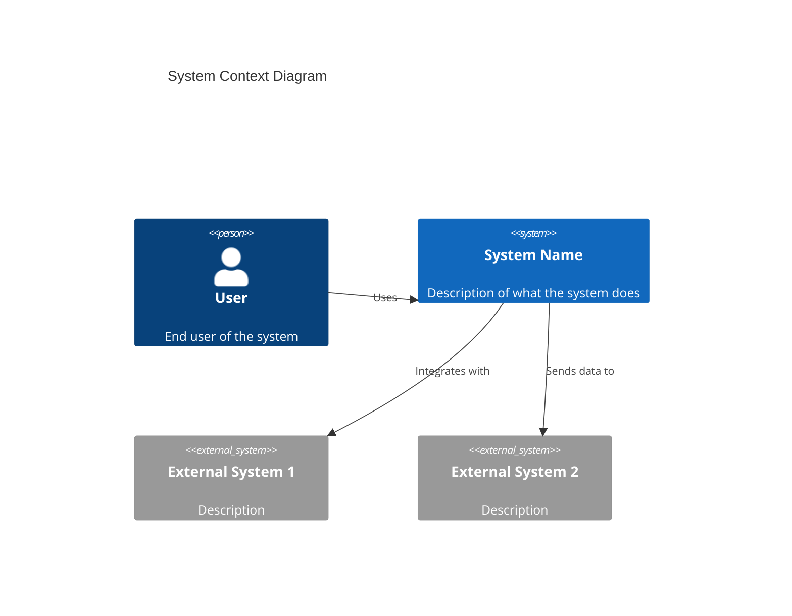
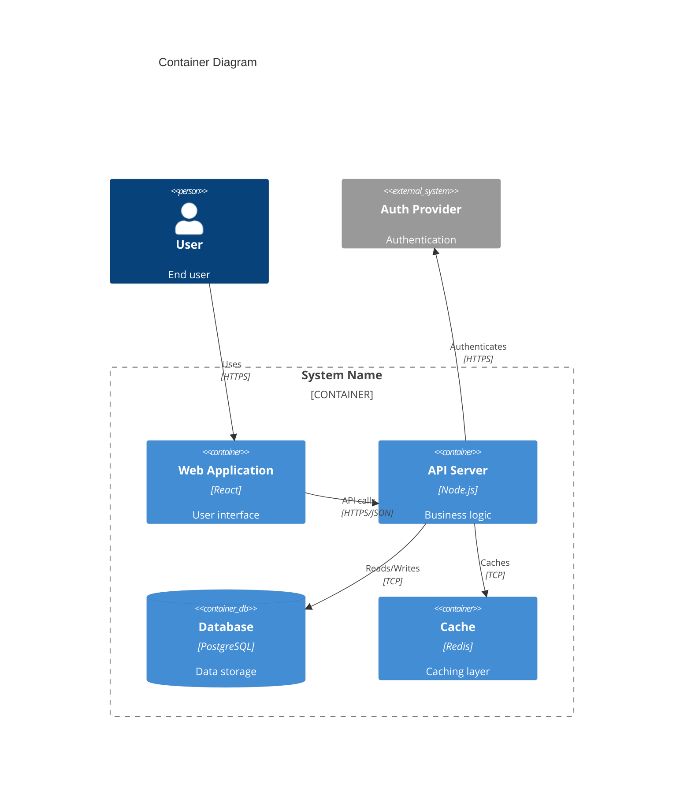
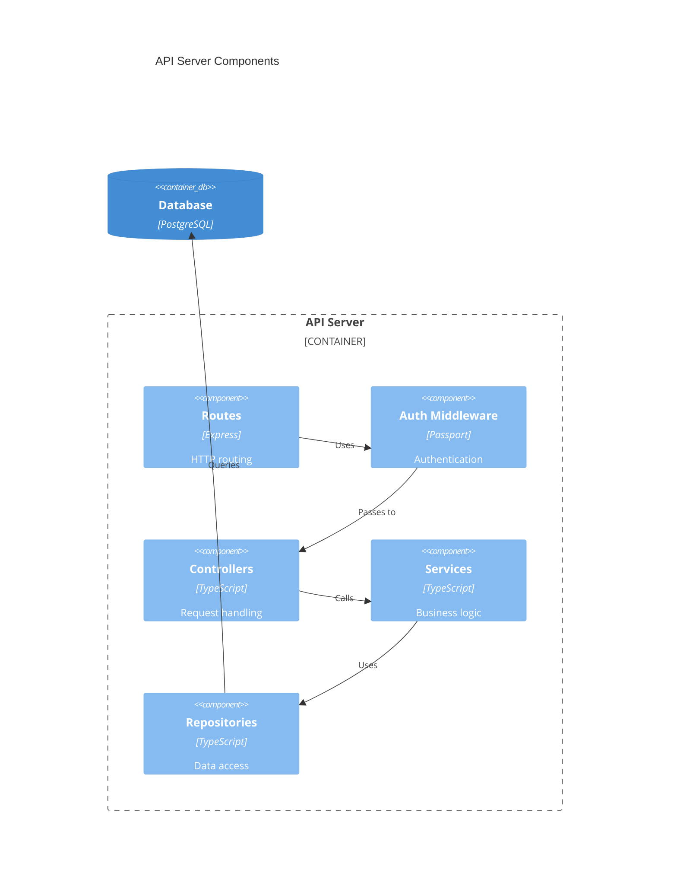
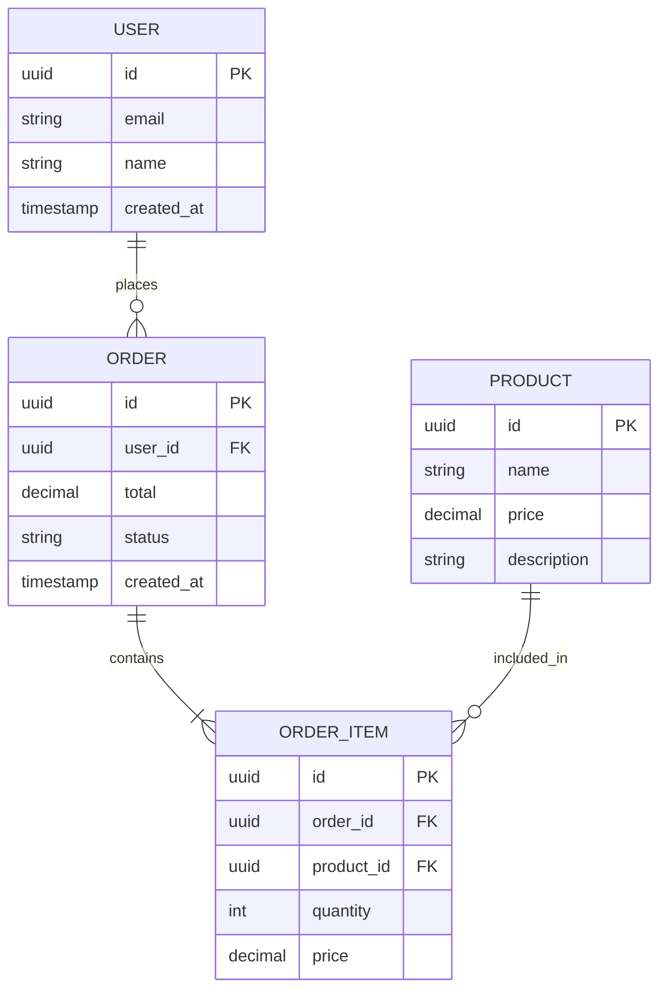
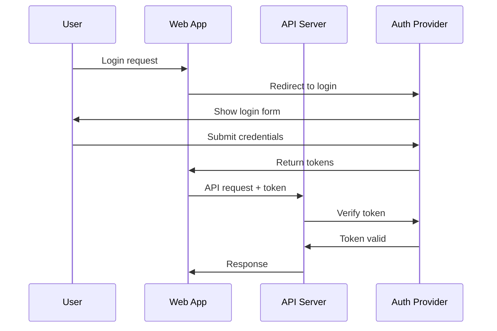
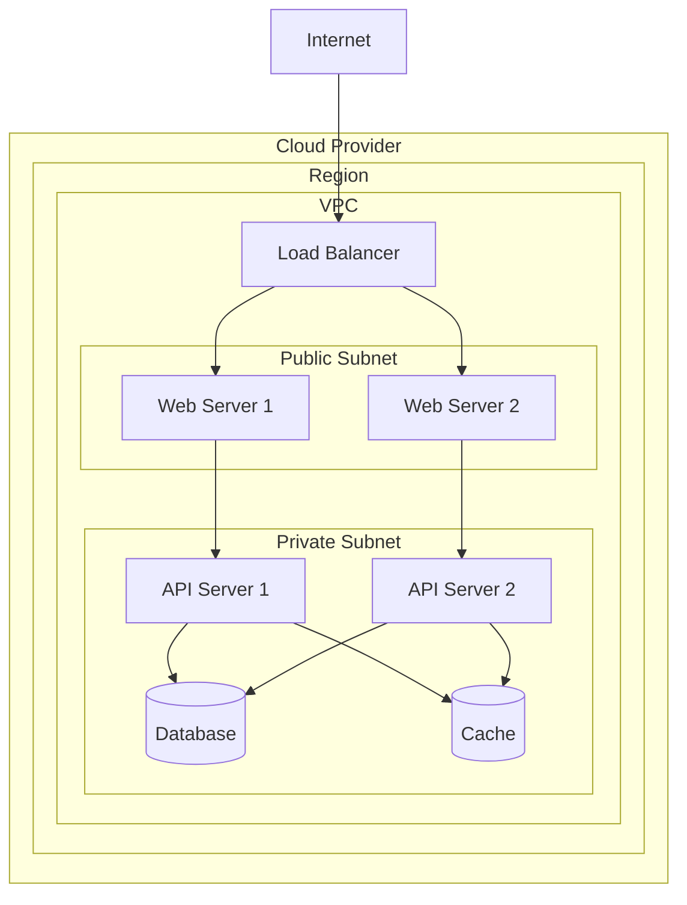

# Architecture Overview

**Project**: {Project Name}
**Version**: {Version}
**Date**: {Date}
**Author**: {Author}

---

## 1. Executive Summary

{High-level description of the system architecture in 2-3 paragraphs}

---

## 2. Architecture Goals and Constraints

### 2.1 Goals
- {Goal 1: e.g., "Support 10,000 concurrent users"}
- {Goal 2: e.g., "99.9% availability"}
- {Goal 3: e.g., "Sub-200ms response time"}

### 2.2 Constraints
- {Constraint 1: e.g., "Must use existing authentication system"}
- {Constraint 2: e.g., "Budget limited to $X/month"}
- {Constraint 3: e.g., "Team has limited Kubernetes experience"}

### 2.3 Principles
- {Principle 1: e.g., "Prefer managed services over self-hosted"}
- {Principle 2: e.g., "Design for failure"}
- {Principle 3: e.g., "Keep it simple"}

---

## 3. System Context

### 3.1 Context Diagram (C4 Level 1)

### 3.2 External Systems

| System | Purpose | Integration Type |
|--------|---------|------------------|
| {System 1} | {Purpose} | {REST API / Webhook / etc.} |
| {System 2} | {Purpose} | {REST API / Webhook / etc.} |

---

## 4. Container Architecture

### 4.1 Container Diagram (C4 Level 2)

### 4.2 Container Descriptions

| Container | Technology | Purpose | Scaling Strategy |
|-----------|------------|---------|------------------|
| Web App | React | User interface | Horizontal (CDN) |
| API Server | Node.js | Business logic | Horizontal (Load balanced) |
| Database | PostgreSQL | Data persistence | Vertical + Read replicas |
| Cache | Redis | Session/data caching | Cluster mode |

---

## 5. Component Architecture

### 5.1 API Server Components (C4 Level 3)

---

## 6. Data Architecture

### 6.1 Data Model Overview

### 6.2 Data Storage Strategy

| Data Type | Storage | Rationale |
|-----------|---------|-----------|
| Transactional | PostgreSQL | ACID compliance, complex queries |
| Sessions | Redis | Fast access, expiration |
| Files/Media | S3 | Scalable, cost-effective |
| Search Index | Elasticsearch | Full-text search (if needed) |

---

## 7. Security Architecture

### 7.1 Authentication Flow

### 7.2 Authorization Model

| Role | Permissions |
|------|-------------|
| Admin | Full access |
| User | Own data only |
| Guest | Public data only |

### 7.3 Security Controls

| Control | Implementation |
|---------|----------------|
| Authentication | {OAuth2/JWT/Session} |
| Authorization | {RBAC/ABAC} |
| Encryption in Transit | TLS 1.3 |
| Encryption at Rest | AES-256 |
| Secret Management | {Vault/AWS Secrets Manager} |

---

## 8. Infrastructure Architecture

### 8.1 Deployment Diagram

### 8.2 Environment Configuration

| Environment | Purpose | Infrastructure |
|-------------|---------|----------------|
| Development | Local development | Docker Compose |
| Staging | Pre-production testing | {Cloud - small} |
| Production | Live system | {Cloud - production} |

---

## 9. Integration Architecture

### 9.1 External Integrations

| System | Protocol | Authentication | Data Flow |
|--------|----------|----------------|-----------|
| {System 1} | REST | API Key | Inbound |
| {System 2} | Webhook | HMAC | Outbound |
| {System 3} | GraphQL | OAuth2 | Bidirectional |

### 9.2 Integration Patterns

- **Synchronous**: Direct API calls for real-time operations
- **Asynchronous**: Message queue for non-critical operations
- **Webhook**: Event-driven notifications

---

## 10. Observability

### 10.1 Monitoring Strategy

| Aspect | Tool | Metrics |
|--------|------|---------|
| Infrastructure | {Datadog/CloudWatch} | CPU, Memory, Network |
| Application | {APM tool} | Response time, Error rate |
| Business | {Analytics tool} | Conversions, Active users |

### 10.2 Logging Strategy

| Log Type | Destination | Retention |
|----------|-------------|-----------|
| Application | {Cloudwatch/ELK} | 30 days |
| Access | {Cloudwatch/ELK} | 90 days |
| Audit | {S3/Archive} | 7 years |

---

## 11. Scalability Strategy

### 11.1 Scaling Approach

| Component | Strategy | Trigger |
|-----------|----------|---------|
| Web/API | Horizontal auto-scaling | CPU > 70% |
| Database | Read replicas, then vertical | Connection saturation |
| Cache | Cluster scaling | Memory > 80% |

### 11.2 Performance Targets

| Metric | Target | Current |
|--------|--------|---------|
| Response Time (p95) | < 200ms | TBD |
| Throughput | 1000 req/s | TBD |
| Concurrent Users | 10,000 | TBD |

---

## 12. Disaster Recovery

### 12.1 Backup Strategy

| Component | Frequency | Retention | RTO | RPO |
|-----------|-----------|-----------|-----|-----|
| Database | Daily | 30 days | 4h | 24h |
| Files | Daily | 30 days | 4h | 24h |
| Config | On change | Forever | 1h | 0 |

### 12.2 Recovery Procedures

- See: Runbook - Disaster Recovery

---

## 13. Architecture Decision Records

| ADR | Title | Status |
|-----|-------|--------|
| ADR-001 | {Title} | Accepted |
| ADR-002 | {Title} | Accepted |

---

## 14. Glossary

| Term | Definition |
|------|------------|
| {Term 1} | {Definition} |
| {Term 2} | {Definition} |

---

## Revision History

| Version | Date | Author | Changes |
|---------|------|--------|---------|
| 1.0 | {date} | {author} | Initial version |
