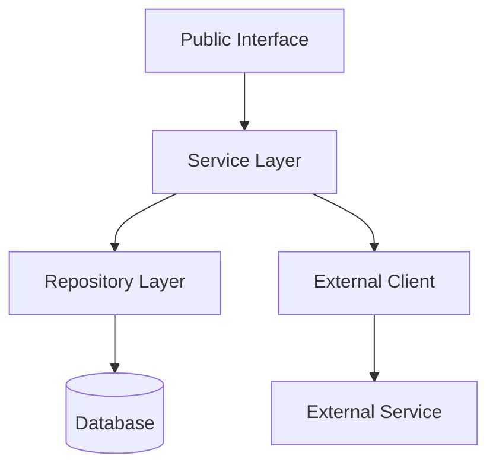
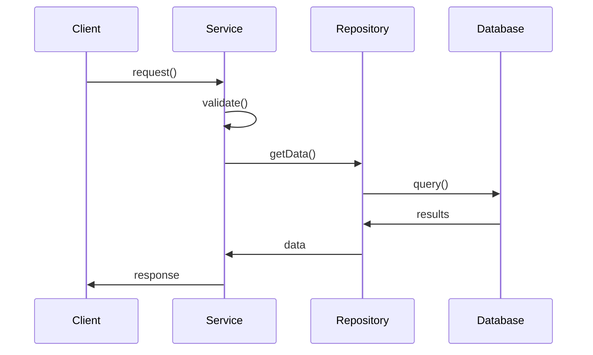

# Module Design: {Module Name}

**Version**: {Version}
**Date**: {Date}
**Author**: {Author}

---

## 1. Overview

### 1.1 Purpose
{Brief description of what this module does and why it exists}

### 1.2 Scope
{What this module is responsible for and what it is NOT responsible for}

### 1.3 Related Requirements
- REQ-{id}: {title}
- REQ-{id}: {title}
- US-{id}: {title}

---

## 2. Responsibilities

This module is responsible for:
1. {Responsibility 1}
2. {Responsibility 2}
3. {Responsibility 3}

This module is NOT responsible for:
1. {Non-responsibility 1}
2. {Non-responsibility 2}

---

## 3. Dependencies

### 3.1 Internal Dependencies

| Module | Purpose | Type |
|--------|---------|------|
| {Module 1} | {Why needed} | {Import/Inject} |
| {Module 2} | {Why needed} | {Import/Inject} |

### 3.2 External Dependencies

| Package | Version | Purpose |
|---------|---------|---------|
| {package 1} | {version} | {purpose} |
| {package 2} | {version} | {purpose} |

---

## 4. Public Interface

### 4.1 Classes/Functions

#### `{ClassName}` or `{functionName}`

```typescript
/**
 * {Description of what this does}
 * @param {paramName} - {description}
 * @returns {description of return value}
 * @throws {ErrorType} - {when this error is thrown}
 */
function functionName(param1: Type1, param2: Type2): ReturnType {
  // Implementation
}
```

**Parameters:**

| Name | Type | Required | Default | Description |
|------|------|----------|---------|-------------|
| param1 | Type1 | Yes | - | {description} |
| param2 | Type2 | No | {default} | {description} |

**Returns:** `ReturnType` - {description}

**Throws:**
- `ErrorType1` - {when thrown}
- `ErrorType2` - {when thrown}

**Example:**
```typescript
const result = functionName(value1, value2);
```

---

### 4.2 Events (if applicable)

| Event | Payload | Description |
|-------|---------|-------------|
| `eventName` | `{type}` | {when emitted} |

---

## 5. Data Models

### 5.1 Input Models

```typescript
interface InputModel {
  field1: string;
  field2: number;
  field3?: boolean;
}
```

### 5.2 Output Models

```typescript
interface OutputModel {
  id: string;
  result: string;
  metadata: {
    createdAt: Date;
    updatedAt: Date;
  };
}
```

### 5.3 Internal Models

```typescript
interface InternalState {
  // Internal state structure
}
```

---

## 6. Error Handling

### 6.1 Error Types

| Error | Code | HTTP Status | Description |
|-------|------|-------------|-------------|
| ValidationError | {code} | 400 | {when thrown} |
| NotFoundError | {code} | 404 | {when thrown} |
| AuthorizationError | {code} | 403 | {when thrown} |

### 6.2 Error Handling Strategy

{Describe how errors are handled, propagated, and logged}

```typescript
// Example error handling pattern
try {
  await operation();
} catch (error) {
  if (error instanceof ValidationError) {
    // Handle validation error
  } else {
    // Rethrow unexpected errors
    throw error;
  }
}
```

---

## 7. Configuration

| Config | Type | Required | Default | Description |
|--------|------|----------|---------|-------------|
| CONFIG_VAR_1 | string | Yes | - | {description} |
| CONFIG_VAR_2 | number | No | 10 | {description} |
| CONFIG_VAR_3 | boolean | No | false | {description} |

---

## 8. Internal Design

### 8.1 Component Diagram



### 8.2 Sequence Diagram (Key Flow)



---

## 9. Testing Strategy

### 9.1 Unit Tests

| Test Category | Coverage Target | Notes |
|---------------|-----------------|-------|
| Public methods | 100% | All public APIs |
| Error paths | 100% | All error conditions |
| Edge cases | 100% | Boundary conditions |

### 9.2 Test Cases

| ID | Description | Type |
|----|-------------|------|
| TC-{id} | {description} | Unit |
| TC-{id} | {description} | Unit |
| TC-{id} | {description} | Integration |

---

## 10. Security Considerations

- {Security consideration 1}
- {Security consideration 2}
- {Security consideration 3}

---

## 11. Performance Considerations

- {Performance consideration 1}
- {Performance consideration 2}
- {Performance consideration 3}

---

## 12. Future Considerations

{Things that might need to change or be added in the future}

- {Consideration 1}
- {Consideration 2}

---

## Revision History

| Version | Date | Author | Changes |
|---------|------|--------|---------|
| 1.0 | {date} | {author} | Initial version |
