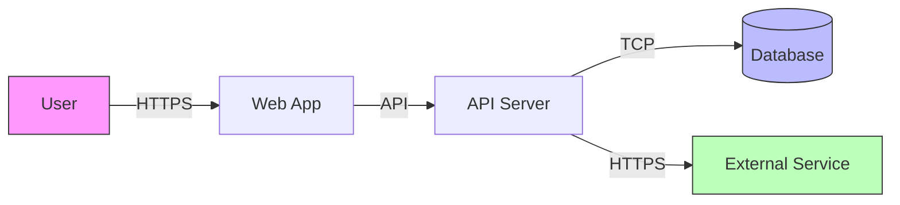

# Threat Model

**Project**: {Project Name}
**Version**: {Version}
**Date**: {Date}
**Author**: {Author}
**Methodology**: STRIDE

---

## 1. Overview

### 1.1 Purpose
{Purpose of this threat model}

### 1.2 Scope
{What is included in this threat model - systems, data, actors}

### 1.3 Security Objectives
1. {Objective 1: e.g., "Protect user personal data"}
2. {Objective 2: e.g., "Ensure system availability"}
3. {Objective 3: e.g., "Maintain data integrity"}

---

## 2. System Description

### 2.1 Architecture Overview
{Brief description of system architecture - reference architecture document}

### 2.2 Data Flow Diagram



### 2.3 Trust Boundaries

| Boundary | Description | Controls |
|----------|-------------|----------|
| Internet ↔ Web App | Public to trusted | WAF, TLS, Rate limiting |
| Web App ↔ API | Frontend to backend | Authentication, Authorization |
| API ↔ Database | Application to data | Network isolation, Encryption |
| API ↔ External | Internal to external | API keys, TLS, Validation |

---

## 3. Assets

### 3.1 Data Assets

| Asset | Classification | Storage | Impact if Compromised |
|-------|----------------|---------|----------------------|
| User credentials | Confidential | Database | Account takeover |
| Personal data (PII) | Confidential | Database | Privacy breach, Regulatory |
| Session tokens | Confidential | Redis | Session hijacking |
| Application code | Internal | Repository | IP theft, Backdoors |
| Configuration | Internal | Environment | System compromise |

### 3.2 System Assets

| Asset | Criticality | Impact if Unavailable |
|-------|-------------|----------------------|
| Web Application | High | User-facing service down |
| API Server | High | All operations fail |
| Database | Critical | Complete data loss |
| Authentication | Critical | No access control |

---

## 4. Threat Actors

| Actor | Motivation | Capability | Likelihood |
|-------|------------|------------|------------|
| Script Kiddie | Curiosity, Fame | Low | High |
| Cybercriminal | Financial gain | Medium | Medium |
| Competitor | Business advantage | Medium | Low |
| Insider | Revenge, Financial | High | Low |
| Nation State | Espionage | Very High | Very Low |

---

## 5. STRIDE Analysis

### 5.1 Spoofing Identity

| ID | Threat | Component | Risk | Mitigation |
|----|--------|-----------|------|------------|
| S1 | Credential theft via phishing | Authentication | High | MFA, Security awareness |
| S2 | Session hijacking | Session management | Medium | Secure cookies, Short expiry |
| S3 | Token replay | API | Medium | Token expiration, Refresh tokens |

### 5.2 Tampering with Data

| ID | Threat | Component | Risk | Mitigation |
|----|--------|-----------|------|------------|
| T1 | SQL injection | Database queries | High | Parameterized queries, ORM |
| T2 | Man-in-the-middle | Network | Medium | TLS everywhere |
| T3 | Parameter manipulation | API requests | Medium | Server-side validation |

### 5.3 Repudiation

| ID | Threat | Component | Risk | Mitigation |
|----|--------|-----------|------|------------|
| R1 | Denial of actions | All operations | Medium | Comprehensive audit logging |
| R2 | Log tampering | Logging system | Medium | Immutable logs, Separate storage |

### 5.4 Information Disclosure

| ID | Threat | Component | Risk | Mitigation |
|----|--------|-----------|------|------------|
| I1 | Data breach | Database | Critical | Encryption at rest, Access control |
| I2 | Error message leakage | API responses | Low | Generic error messages |
| I3 | Sensitive data in logs | Logging | Medium | Log sanitization |
| I4 | Source code exposure | Repository | High | Access control, Secret scanning |

### 5.5 Denial of Service

| ID | Threat | Component | Risk | Mitigation |
|----|--------|-----------|------|------------|
| D1 | Volumetric DDoS | Infrastructure | High | CDN, DDoS protection |
| D2 | Application-level DoS | API | Medium | Rate limiting, Request validation |
| D3 | Resource exhaustion | Server | Medium | Resource limits, Monitoring |

### 5.6 Elevation of Privilege

| ID | Threat | Component | Risk | Mitigation |
|----|--------|-----------|------|------------|
| E1 | IDOR (Insecure Direct Object Reference) | API | High | Authorization checks |
| E2 | Privilege escalation | User management | High | Role-based access control |
| E3 | JWT manipulation | Authentication | Medium | Signature verification, Short expiry |

---

## 6. Attack Trees

### 6.1 Account Takeover

```
Account Takeover
├── Credential Theft
│   ├── Phishing
│   ├── Credential stuffing
│   └── Social engineering
├── Session Hijacking
│   ├── XSS to steal cookie
│   ├── Network sniffing (if no TLS)
│   └── Session fixation
└── Authentication Bypass
    ├── SQL injection
    ├── Broken authentication logic
    └── Default credentials
```

### 6.2 Data Breach

```
Data Breach
├── Direct Database Access
│   ├── SQL injection
│   ├── Compromised credentials
│   └── Misconfigured access
├── Application Exploitation
│   ├── IDOR
│   ├── Broken access control
│   └── API abuse
└── Infrastructure Compromise
    ├── Server exploitation
    ├── Container escape
    └── Cloud misconfiguration
```

---

## 7. Risk Assessment

### 7.1 Risk Matrix

| Likelihood ↓ / Impact → | Low | Medium | High | Critical |
|-------------------------|-----|--------|------|----------|
| **High** | Medium | High | Critical | Critical |
| **Medium** | Low | Medium | High | Critical |
| **Low** | Low | Low | Medium | High |

### 7.2 Risk Register

| ID | Threat | Likelihood | Impact | Risk Level | Status |
|----|--------|------------|--------|------------|--------|
| S1 | Credential theft | Medium | High | High | Mitigated |
| T1 | SQL injection | Low | Critical | High | Mitigated |
| I1 | Data breach | Low | Critical | High | Mitigated |
| D1 | DDoS | Medium | High | High | Mitigated |
| E1 | IDOR | Medium | High | High | Mitigated |

---

## 8. Security Controls

### 8.1 Preventive Controls

| Control | Threats Addressed | Implementation |
|---------|-------------------|----------------|
| Input validation | T1, T3 | Server-side validation |
| Authentication | S1, S2, S3 | OAuth2 + MFA |
| Authorization | E1, E2 | RBAC with checks |
| Encryption | I1, T2 | TLS 1.3, AES-256 |
| Rate limiting | D2 | Per-user/IP limits |

### 8.2 Detective Controls

| Control | Threats Addressed | Implementation |
|---------|-------------------|----------------|
| Audit logging | R1, R2 | Centralized logging |
| Monitoring | D1, D2, D3 | APM, Infrastructure monitoring |
| Alerting | All | Threshold-based alerts |
| Intrusion detection | All | WAF, Anomaly detection |

### 8.3 Corrective Controls

| Control | Threats Addressed | Implementation |
|---------|-------------------|----------------|
| Incident response | All | Runbooks, On-call |
| Backup/Recovery | I1, T1 | Daily backups, Point-in-time |
| Rollback | All | Blue-green deployment |

---

## 9. Residual Risks

| Risk | Current Level | Accepted By | Review Date |
|------|---------------|-------------|-------------|
| {Residual risk 1} | Low | {Name} | {Date} |
| {Residual risk 2} | Medium | {Name} | {Date} |

---

## 10. Recommendations

### 10.1 High Priority
1. {Recommendation 1}
2. {Recommendation 2}

### 10.2 Medium Priority
1. {Recommendation 1}
2. {Recommendation 2}

### 10.3 Future Considerations
1. {Recommendation 1}
2. {Recommendation 2}

---

## 11. Appendices

### Appendix A: STRIDE Reference

| Category | Property Violated | Examples |
|----------|-------------------|----------|
| Spoofing | Authentication | Credential theft, Impersonation |
| Tampering | Integrity | Data modification, Injection |
| Repudiation | Non-repudiation | Denying actions |
| Information Disclosure | Confidentiality | Data leaks, Error messages |
| Denial of Service | Availability | DDoS, Resource exhaustion |
| Elevation of Privilege | Authorization | Unauthorized access |

### Appendix B: Related Documents
- Architecture Document: {link}
- Security Architecture: {link}
- Compliance Requirements: {link}

---

## Revision History

| Version | Date | Author | Changes |
|---------|------|--------|---------|
| 1.0 | {date} | {author} | Initial version |
